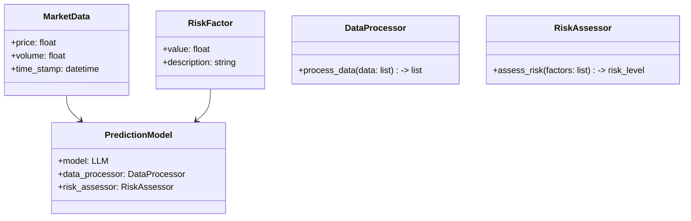
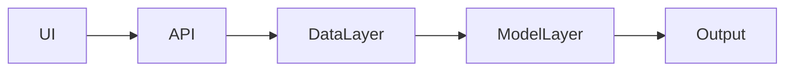
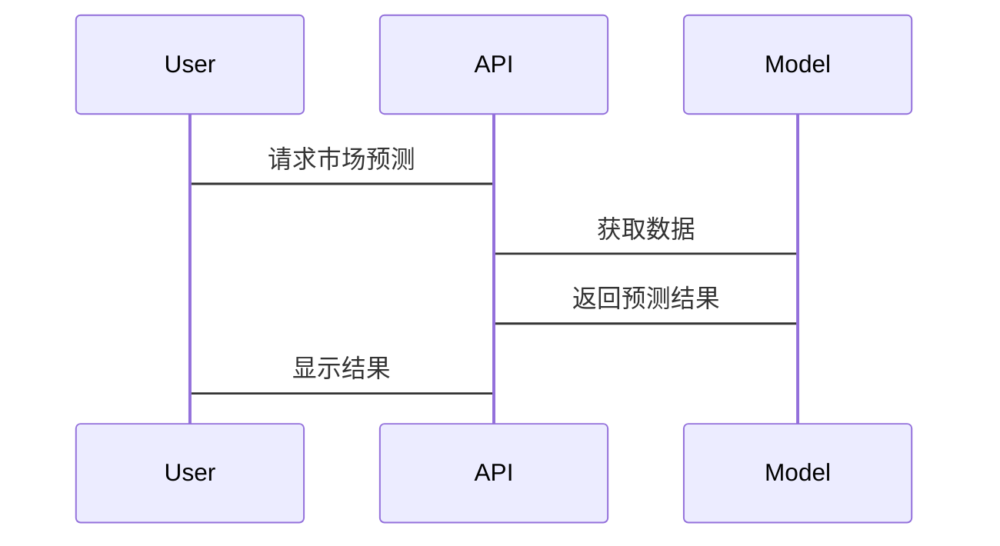

                 


---

# 第三部分: 金融分析 AI Agent 的系统分析与架构设计

## 第5章: 系统分析

### 5.1 问题场景

#### 5.1.1 金融市场数据的特点
- 高频性：市场数据每分钟甚至每秒都在变化。
- 复杂性：受多种因素影响，如经济指标、政策变化、投资者情绪等。
- 不确定性：市场预测本质上是一个概率问题。

#### 5.1.2 投资者的决策需求
- 快速获取市场趋势分析。
- 准确识别潜在风险点。
- 实时监控市场动态。

### 5.2 项目介绍

#### 5.2.1 项目目标
- 构建一个基于LLM的金融分析AI代理。
- 实现市场预测和风险评估的自动化。
- 提供可解释性强的分析结果。

#### 5.2.2 项目范围
- 数据范围：涵盖股票、债券、期货等多种金融产品。
- 时间范围：支持短期、中期和长期预测。
- 用户范围：适用于机构投资者和个人投资者。

### 5.3 系统功能设计

#### 5.3.1 领域模型类图


---

## 第6章: 系统架构设计

### 6.1 架构设计

#### 6.1.1 分层架构
- 数据层：负责数据的采集、存储和预处理。
- 模型层：实现LLM模型的训练和预测。
- 应用层：提供用户交互界面和API接口。

#### 6.1.2 组件交互


### 6.2 接口设计

#### 6.2.1 API接口
- 输入：市场数据、时间范围、模型参数。
- 输出：预测结果、风险评估报告。

#### 6.2.2 数据格式
- JSON格式：支持跨平台的数据传输。

### 6.3 交互流程图


---

## 第7章: 系统实现

### 7.1 环境安装

#### 7.1.1 安装Python
```bash
python --version
```

#### 7.1.2 安装依赖
```bash
pip install transformers torch
```

### 7.2 核心代码实现

#### 7.2.1 数据处理
```python
class DataProcessor:
    def __init__(self):
        self.window_size = 30  # 时间窗口大小
    
    def process_data(self, data):
        processed = []
        for i in range(len(data) - self.window_size):
            window = data[i:i + self.window_size]
            processed.append(window)
        return processed
```

#### 7.2.2 模型训练
```python
def train_model(train_data):
    model = LLMModel()
    optimizer = torch.optim.Adam(model.parameters(), lr=0.001)
    criterion = nn.CrossEntropyLoss()
    
    for epoch in range(100):
        for batch in train_data:
            outputs = model(batch)
            loss = criterion(outputs, labels)
            optimizer.zero_grad()
            loss.backward()
            optimizer.step()
    return model
```

---

## 第8章: 项目实战

### 8.1 环境搭建

#### 8.1.1 安装Python和依赖
```bash
pip install transformers torch pandas numpy
```

### 8.2 核心代码实现

#### 8.2.1 数据加载
```python
import pandas as pd
data = pd.read_csv('market_data.csv')
```

#### 8.2.2 模型预测
```python
def predict_market(trend_data):
    import torch
    model = LLMModel()  # 初始化LLM模型
    with torch.no_grad():
        output = model(trend_data)
    return output
```

### 8.3 案例分析

#### 8.3.1 实际案例
- 数据来源：某股票的历史价格数据。
- 模型预测：预测未来一周的价格走势。
- 结果分析：对比实际价格与预测价格，评估模型的准确性。

### 8.4 项目小结

#### 8.4.1 经验总结
- 数据质量对模型性能的影响。
- 模型调参的重要性。
- 结果解释性的重要性。

---

## 第9章: 最佳实践

### 9.1 小结

#### 9.1.1 核心要点回顾
- LLM在金融分析中的应用价值。
- 系统设计的关键环节。
- 项目实施的注意事项。

### 9.2 注意事项

#### 9.2.1 模型选择
- 根据具体需求选择合适的LLM模型。
- 注意模型的训练时间和计算资源消耗。

#### 9.2.2 数据隐私
- 确保数据的隐私和安全。
- 遵守相关法律法规。

### 9.3 拓展阅读

#### 9.3.1 推荐书籍
- 《深度学习》—— Ian Goodfellow
- 《机器学习实战》—— 周志华

#### 9.3.2 推荐博客
-Towards Data Science
- Analytics Vidhya

---

# 结语

金融分析 AI Agent 的开发和应用，标志着人工智能技术在金融领域的又一重要突破。通过本文的详细讲解，读者可以系统地了解如何利用大语言模型进行市场预测与风险评估。希望本文能为金融从业者和AI技术爱好者提供有价值的参考和启发。

---

# 作者

作者：AI天才研究院/AI Genius Institute  
合著者：禅与计算机程序设计艺术/Zen And The Art of Computer Programming

