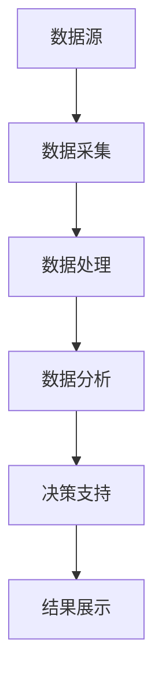
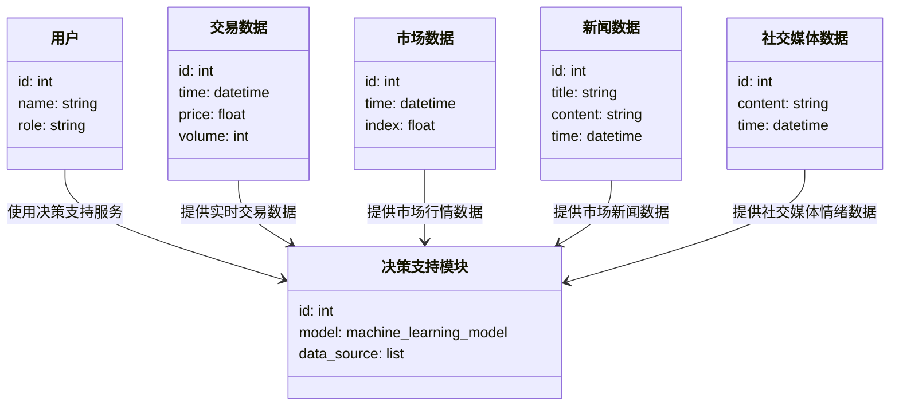
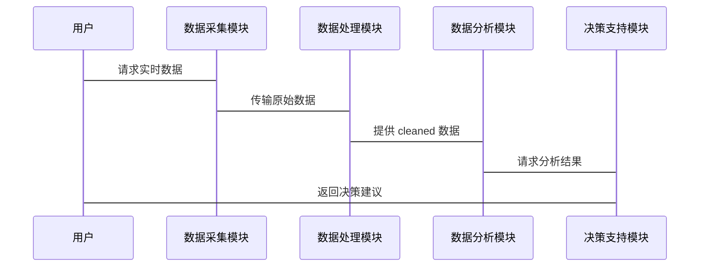

                 


# 《金融大数据实时决策支持平台》

**关键词：** 金融大数据、实时决策支持、数据处理、系统架构、机器学习

**摘要：**  
本文将详细探讨金融大数据实时决策支持平台的构建与应用。首先，我们将从背景介绍入手，分析金融行业面临的挑战和大数据技术带来的变革。接着，我们将深入讲解核心概念与原理，包括金融大数据的特点和实时决策支持的机制。随后，我们将探讨系统架构设计，涵盖数据采集、处理、分析和展示的全过程。最后，通过项目实战，我们将展示如何利用Python和机器学习算法构建一个实时决策支持系统，并分析其在金融领域的实际应用案例。本文旨在为读者提供一个全面的技术视角，帮助他们在金融大数据时代做出更明智的决策。

---

# 第一部分: 金融大数据实时决策支持平台背景介绍

## 第1章: 问题背景与描述

### 1.1 问题背景
#### 1.1.1 金融行业面临的挑战
- 传统金融决策依赖于历史数据和静态分析，难以应对市场波动和实时变化。
- 数据来源多样，包括股票交易、市场新闻、社交媒体等，数据量大且实时性强。
- 高频交易和风险管理需要毫秒级的实时响应，传统方法难以满足需求。

#### 1.1.2 大数据技术在金融领域的应用需求
- 利用大数据技术处理海量数据，挖掘潜在价值。
- 实现实时数据分析，支持快速决策。
- 提高风险控制能力，优化投资策略。

#### 1.1.3 实时决策支持的重要性
- 在金融市场中，时间就是金钱，实时决策可以帮助投资者抓住机会或规避风险。
- 通过实时数据分析，能够及时发现市场趋势和异常情况。

### 1.2 问题描述
#### 1.2.1 传统金融决策的局限性
- 数据处理延迟，无法应对快速变化的市场。
- 缺乏对非结构化数据的处理能力，如新闻和社交媒体数据。
- 决策过程依赖人工经验，难以量化和优化。

#### 1.2.2 大数据时代金融决策的新需求
- 需要实时处理结构化和非结构化数据。
- 需要快速生成分析结果，并提供可操作的建议。
- 需要支持多种应用场景，如高频交易、风险管理、投资组合优化等。

#### 1.2.3 实时决策支持的核心问题
- 如何高效采集和处理实时数据。
- 如何构建实时分析模型，并快速生成决策支持结果。
- 如何保证系统的高可用性和扩展性。

### 1.3 问题解决
#### 1.3.1 大数据技术如何解决实时决策问题
- 利用流数据处理技术，实时采集和处理金融数据。
- 通过分布式计算框架，提高数据处理效率。
- 借助机器学习算法，构建实时预测模型。

#### 1.3.2 数据实时处理的技术挑战
- 数据源多样化，需要支持多种数据格式和接口。
- 高频数据处理对系统性能要求极高，需要优化处理流程。
- 实时数据的准确性和完整性保障。

#### 1.3.3 平台构建的目标与意义
- 构建一个高效、可靠的实时决策支持平台，帮助金融机构提升竞争力。
- 通过实时数据分析，降低风险，提高投资回报率。

### 1.4 边界与外延
#### 1.4.1 平台的边界定义
- 平台仅处理实时数据，不涉及历史数据分析。
- 平台专注于金融领域，不扩展到其他行业。
- 平台的功能模块包括数据采集、处理、分析和展示，不涉及数据存储。

#### 1.4.2 平台的外延应用
- 可扩展到其他金融领域，如保险、证券、基金等。
- 可与其他系统集成，如交易系统、客户关系管理系统等。
- 可结合区块链技术，提高数据安全性和信任度。

#### 1.4.3 平台与其他系统的交互关系
- 与交易系统交互，提供实时市场数据和决策建议。
- 与客户关系管理系统交互，提供个性化服务。
- 与风险管理系统交互，提供实时风险评估。

### 1.5 核心要素组成
#### 1.5.1 数据源的多样性
- 包括股票交易数据、市场新闻、社交媒体数据等。
- 数据格式多样，包括结构化数据（如表格数据）和非结构化数据（如文本数据）。

#### 1.5.2 实时处理引擎的作用
- 负责实时数据的采集、清洗和转换。
- 采用流数据处理框架，如Apache Kafka、Apache Flink等。

#### 1.5.3 决策支持模块的功能
- 提供实时数据分析结果，如市场趋势预测、投资组合优化建议。
- 通过可视化界面展示分析结果，方便用户快速理解。

---

# 第二部分: 核心概念与联系

## 第2章: 核心概念原理

### 2.1 金融大数据的特点
#### 2.1.1 数据的实时性
- 数据需要实时采集和处理，确保决策的及时性。
- 数据处理延迟必须控制在毫秒级别。

#### 2.1.2 数据的多样性
- 包括结构化数据（如股票价格、成交量）和非结构化数据（如新闻、社交媒体评论）。
- 数据格式多样，处理难度大。

#### 2.1.3 数据的高价值性
- 数据价值密度高，能够直接影响决策结果。
- 数据处理和分析需要高精度和高效率。

### 2.2 实时决策支持的原理
#### 2.2.1 数据实时采集与处理
- 使用流数据处理技术，实时采集金融数据。
- 数据清洗和转换，确保数据质量和一致性。

#### 2.2.2 数据分析与模型构建
- 利用机器学习算法，构建实时预测模型。
- 数据分析结果用于生成决策支持建议。

#### 2.2.3 决策结果的输出与反馈
- 通过可视化界面展示分析结果。
- 收集用户反馈，优化模型和系统。

## 第3章: 核心概念对比与ER图

### 3.1 核心概念对比表
| 概念 | 属性 | 描述 |
|------|------|------|
| 数据源 | 类型 | 结构化、非结构化、半结构化数据 |
| 数据处理引擎 | 技术 | 流数据处理、批量处理 |
| 决策模块 | 方法 | 机器学习、统计分析 |

### 3.2 ER实体关系图
```mermaid
er
    actor: 用户
    transaction: 交易数据
    decision_support: 决策支持模块
    market_data: 市场数据
    news: 新闻数据
    social_media: 社交媒体数据
 

    用户 --> 决策支持模块: 使用决策支持服务
    交易数据 --> 决策支持模块: 提供实时交易数据
    市场数据 --> 决策支持模块: 提供市场行情数据
    新闻数据 --> 决策支持模块: 提供市场新闻数据
    社交媒体数据 --> 决策支持模块: 提供社交媒体情绪数据
```

---

# 第三部分: 算法原理讲解

## 第4章: 数据实时处理算法

### 4.1 流数据处理算法
#### 4.1.1 流数据处理框架
- Apache Flink: 分布式流处理引擎，支持实时数据分析。
- Apache Kafka: 高通量、分布式的发布-订阅消息系统，用于数据传输。

#### 4.1.2 算法流程图


#### 4.1.3 核心代码实现
```python
from pyflink.datastream import StreamExecutionEnvironment
from pyflink.table import *
import pandas as pd

# 创建流处理环境
env = StreamExecutionEnvironment.get_execution_environment()
env.set_parallelism(4)

# 读取实时数据流
inputDataStream = env.add_source(...)

# 数据处理逻辑
processedStream = inputDataStream.map(...).filter(...)

# 数据分析与决策
resultStream = processedStream.window(...).apply(...)

# 展示结果
resultStream.sink(...).execute()
```

### 4.2 数学模型与公式
#### 4.2.1 时间序列分析模型
- ARIMA模型：用于预测未来值。
$$ ARIMA(p, d, q) $$

#### 4.2.2 机器学习模型
- LSTM网络：用于时间序列预测。
$$ LSTM(input, hidden, output) $$

---

# 第四部分: 系统分析与架构设计

## 第5章: 系统架构设计

### 5.1 问题场景介绍
- 高频交易监控：实时监控股票交易，识别异常交易行为。
- 风险管理：实时评估投资组合风险，确保资产安全。

### 5.2 系统功能设计
#### 5.2.1 领域模型类图


#### 5.2.2 系统架构设计
- 分层架构：数据采集层、数据处理层、数据分析层、决策支持层和用户界面层。
- 模块化设计：每个模块负责特定功能，便于维护和扩展。

#### 5.2.3 系统接口设计
- 数据采集接口：与交易系统、新闻网站等对接，获取实时数据。
- 数据处理接口：提供数据清洗、转换功能。
- 数据分析接口：提供预测模型调用功能。
- 决策支持接口：提供决策建议查询功能。

#### 5.2.4 系统交互流程图


---

# 第五部分: 项目实战

## 第6章: 项目实现

### 6.1 环境安装
- 安装Python和相关库：pandas、numpy、scikit-learn、flink、kafka。
- 安装Jupyter Notebook用于数据可视化和算法实现。

### 6.2 核心代码实现
#### 6.2.1 数据采集模块
```python
import kafka
from kafka import KafkaConsumer

# 消费者配置
bootstrap_servers = 'localhost:9092'
topic_name = 'finance_data'

# 创建消费者
consumer = KafkaConsumer(topic_name, bootstrap_servers=bootstrap_servers)

# 接收数据
for message in consumer:
    print(f"收到消息: {message.value}")
```

#### 6.2.2 数据处理模块
```python
import pandas as pd
import numpy as np

# 示例数据
data = {'time': ['2023-10-01 09:00:00', '2023-10-01 09:01:00', '2023-10-01 09:02:00'],
         'price': [100.0, 101.5, 99.8],
         'volume': [1000, 1200, 950]}
df = pd.DataFrame(data)

# 数据清洗
df['price'] = df['price'].apply(lambda x: x if x > 90 else np.nan)
df.dropna(inplace=True)

print(df)
```

#### 6.2.3 数据分析模块
```python
from sklearn.linear_model import LinearRegression
from sklearn.metrics import mean_squared_error

# 示例数据
X = df[['time']]
y = df['price']

# 模型训练
model = LinearRegression()
model.fit(X, y)

# 模型预测
y_pred = model.predict(X)
print(mean_squared_error(y, y_pred))
```

#### 6.2.4 决策支持模块
```python
import matplotlib.pyplot as plt

# 绘制价格走势
plt.plot(df['time'], df['price'])
plt.xlabel('时间')
plt.ylabel('价格')
plt.title('实时价格走势')
plt.show()
```

### 6.3 实际案例分析
- 案例：实时股价监控。
- 数据来源：股票交易数据、市场新闻。
- 分析过程：数据采集、清洗、建模、预测。
- 决策支持：根据预测结果，提供买卖建议。

### 6.4 项目小结
- 项目实现了金融大数据实时决策支持平台的核心功能。
- 系统具有高效的数据处理能力和准确的预测模型。
- 未来可以进一步优化算法，增加更多数据源和应用场景。

---

# 第六部分: 最佳实践

## 第7章: 实践总结

### 7.1 小结
- 本文详细介绍了金融大数据实时决策支持平台的构建过程。
- 通过流数据处理、机器学习算法和系统架构设计，实现了一个高效、可靠的实时决策支持系统。

### 7.2 注意事项
- 数据源的选择和处理是关键，需确保数据的准确性和完整性。
- 系统性能优化是重点，需合理选择技术和架构。
- 机器学习模型的训练和调优需要大量数据和计算资源。

### 7.3 拓展阅读
- 《大数据分析与应用》
- 《实时数据分析技术》
- 《金融风险管理模型》

---

# 作者：AI天才研究院/AI Genius Institute & 禅与计算机程序设计艺术 /Zen And The Art of Computer Programming

---

以上是《金融大数据实时决策支持平台》的技术博客文章目录和内容大纲。通过逐步分析和推理，构建了一个全面且详细的结构，涵盖了从背景介绍到项目实战的各个方面，帮助读者深入了解金融大数据实时决策支持平台的构建与应用。

