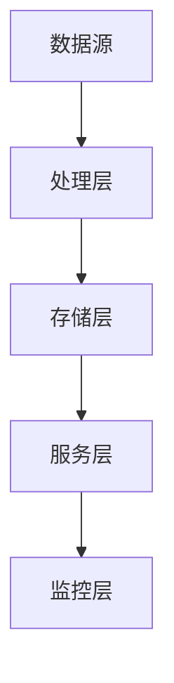
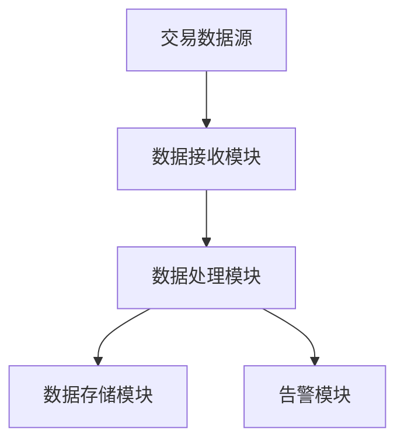

                 


# 《金融大数据实时流处理架构设计》

---

## 关键词：金融大数据，实时流处理，系统架构，流处理算法，大数据处理

---

## 摘要：

本文深入探讨了金融大数据实时流处理的架构设计。首先，介绍了金融大数据和实时流处理的基本概念，分析了其在金融领域的必要性和应用场景。接着，详细讲解了流处理的核心概念、技术原理和系统架构设计。通过数学公式和Mermaid图，展示了流处理算法的实现原理和系统架构的模块划分。最后，通过具体的项目实战，详细阐述了实时流处理系统的设计与实现，并提供了实际案例分析和最佳实践建议。

---

# 《金融大数据实时流处理架构设计》

## 第1章: 金融大数据与实时流处理概述

### 1.1 金融大数据的定义与特点

金融大数据是指在金融领域中产生的海量数据，包括交易数据、市场数据、用户行为数据等。其特点包括数据量大、类型多样、处理实时性要求高、数据价值密度高。

#### 1.1.1 金融大数据的定义

金融大数据指的是在金融行业产生的海量、多类型、高速生成的数据，这些数据需要通过先进的技术手段进行处理和分析，以支持金融决策。

#### 1.1.2 金融大数据的核心特点

- 数据量大（Volume）
- 数据类型多样（Variety）
- 数据生成速度快（Velocity）
- 数据价值密度高（Value）

### 1.2 实时流处理的定义与技术特点

实时流处理是指对持续不断的数据流进行实时处理和分析的技术。其技术特点包括低延迟、高吞吐量、可扩展性等。

#### 1.2.1 实时流处理的定义

实时流处理是指对实时生成的数据流进行连续处理，确保在数据生成后尽可能短的时间内完成处理和分析。

#### 1.2.2 实时流处理的技术特点

- 低延迟：处理速度快，确保实时响应。
- 高吞吐量：能够处理大规模数据流。
- 可扩展性：支持大规模数据处理和扩展。

### 1.3 金融大数据实时流处理的必要性

在金融领域，实时流处理能够帮助金融机构快速响应市场变化，做出及时决策，从而提高竞争力。

#### 1.3.1 金融行业的实时数据需求

金融机构需要实时监控市场动态、交易行为等，以确保业务的顺利进行。

#### 1.3.2 实时流处理在金融领域的应用场景

- 实时监控市场行情
- 实时风险控制
- 实时交易决策

#### 1.3.3 实时流处理对金融业务的影响

- 提高交易效率
- 减少风险暴露
- 增强市场竞争力

### 1.4 本章小结

本章介绍了金融大数据和实时流处理的基本概念，分析了其在金融领域的重要性和应用场景。

---

## 第2章: 金融大数据实时流处理的核心概念

### 2.1 流数据模型

流数据模型是实时流处理的基础，用于描述数据流的特征和处理方式。

#### 2.1.1 流数据的定义与特点

流数据是指持续生成的、动态变化的数据流，具有实时性和不确定性。

#### 2.1.2 流数据模型的分类

- 时间序列流
- 事件流
- 混合流

#### 2.1.3 流数据模型的数学表示

流数据可以用数学公式表示为：

$$ S(t) = \{ s_1(t), s_2(t), \ldots, s_n(t) \} $$

其中，$S(t)$ 表示时间 $t$ 时的流数据，$s_i(t)$ 表示第 $i$ 个数据点。

### 2.2 流处理技术原理

流处理技术通过对数据流的实时处理，实现对数据的快速分析和响应。

#### 2.2.1 流处理的基本原理

流处理的基本原理是将数据流划分为多个时间段，对每个时间段内的数据进行处理和分析。

#### 2.2.2 流处理的数学模型

流处理的数学模型可以表示为：

$$ P(S(t)) = \{ p_1(S(t)), p_2(S(t)), \ldots, p_m(S(t)) \} $$

其中，$P(S(t))$ 表示处理后的时间 $t$ 时的结果，$p_i(S(t))$ 表示第 $i$ 个处理操作。

#### 2.2.3 流处理与批量处理的对比

通过对比表格展示流处理和批量处理的优缺点。

| 特性          | 流处理               | 批量处理             |
|---------------|----------------------|--------------------|
| 处理时间       | 实时                 | 批次处理             |
| 延迟           | 低                   | 高                 |
| 可扩展性       | 高                   | 中                 |
| 适用场景       | 实时监控、在线分析     | 离线分析、批量报告   |

### 2.3 金融大数据流处理的系统架构

#### 2.3.1 系统架构的定义

系统架构是整个流处理系统的结构设计，包括数据源、处理层、存储层等多个模块。

#### 2.3.2 金融大数据流处理的架构模型

- 分层架构：数据源 -> 处理层 -> 存储层 -> 服务层
- 分布式架构：多节点协作处理数据流

#### 2.3.3 架构模型的优缺点对比

| 架构模型       | 优点                     | 缺点                     |
|----------------|--------------------------|--------------------------|
| 分层架构       | 结构清晰，易于维护       | 跨节点协作效率较低       |
| 分布式架构     | 高扩展性，处理能力强     | 系统复杂度较高           |

### 2.4 本章小结

本章详细介绍了流数据模型和流处理技术原理，并通过对比分析，探讨了不同系统架构的优缺点。

---

## 第3章: 金融大数据实时流处理的技术原理

### 3.1 流处理模型的数学公式

#### 3.1.1 流处理的基本数学公式

流处理的基本公式可以表示为：

$$ f(S(t)) = \sum_{i=1}^{n} s_i(t) $$

其中，$f(S(t))$ 表示对时间 $t$ 时的流数据进行求和操作。

#### 3.1.2 流处理的优化公式

优化后的流处理公式：

$$ f(S(t)) = f(S(t-1)) + s_n(t) $$

其中，$f(S(t-1))$ 表示前一时刻的处理结果，$s_n(t)$ 表示当前新增的数据点。

#### 3.1.3 流处理的复杂度分析

流处理的复杂度可以用大O表示法进行分析：

$$ O(n) $$

其中，$n$ 表示数据流的长度。

### 3.2 流处理算法的实现原理

#### 3.2.1 流处理算法的定义

流处理算法是对数据流进行处理的具体方法，例如滑动窗口算法。

#### 3.2.2 流处理算法的实现步骤

1. 数据流输入
2. 窗口划分
3. 数据处理
4. 结果输出

#### 3.2.3 流处理算法的数学推导

滑动窗口算法的数学推导：

$$ W(t) = \{ s_{t-k+1}, s_{t-k+2}, \ldots, s_t \} $$

其中，$W(t)$ 表示时间 $t$ 时的滑动窗口，$k$ 表示窗口大小。

### 3.3 流处理系统的架构设计

#### 3.3.1 系统架构的定义

系统架构是整个流处理系统的结构设计，包括数据源、处理层、存储层等多个模块。

#### 3.3.2 系统架构的实现步骤

1. 确定数据源
2. 设计处理逻辑
3. 实现存储模块
4. 配置监控模块

#### 3.3.3 架构模型的优缺点对比

| 特性          | 优点                     | 缺点                     |
|---------------|--------------------------|--------------------------|
| 分层架构       | 结构清晰，易于维护       | 跨节点协作效率较低       |
| 分布式架构     | 高扩展性，处理能力强     | 系统复杂度较高           |

### 3.4 本章小结

本章详细讲解了流处理模型的数学公式和流处理算法的实现原理，并通过对比分析，探讨了不同系统架构的优缺点。

---

## 第4章: 金融大数据实时流处理的系统架构设计

### 4.1 系统架构的整体设计

#### 4.1.1 系统架构的定义

系统架构是整个流处理系统的结构设计，包括数据源、处理层、存储层等多个模块。

#### 4.1.2 系统架构的设计原则

- 分层设计
- 可扩展性
- 高可用性

#### 4.1.3 系统架构的实现步骤

1. 确定数据源
2. 设计处理逻辑
3. 实现存储模块
4. 配置监控模块

### 4.2 系统架构的模块划分

#### 4.2.1 数据源模块

数据源包括市场数据、交易数据等。

#### 4.2.2 处理层模块

处理层包括数据流处理、算法实现等。

#### 4.2.3 存储层模块

存储层包括结果存储、日志存储等。

#### 4.2.4 服务层模块

服务层包括API接口、用户界面等。

#### 4.2.5 监控层模块

监控层包括系统监控、日志监控等。

### 4.3 系统架构的Mermaid图



### 4.4 本章小结

本章详细描述了金融大数据实时流处理系统的整体架构设计，包括各模块的功能和模块之间的关系。

---

## 第5章: 项目实战——金融实时交易监控系统

### 5.1 项目背景

实时交易监控系统用于监控金融市场的实时交易数据，及时发现异常交易行为。

### 5.2 项目需求

- 实时接收交易数据
- 实时计算交易指标
- 实时告警异常交易

### 5.3 系统设计

#### 5.3.1 系统功能设计

- 数据接收模块
- 数据处理模块
- 数据存储模块
- 告警模块

#### 5.3.2 系统架构设计



### 5.4 系统实现

#### 5.4.1 环境安装

- 操作系统：Linux
- 开发工具：IntelliJ IDEA
- 依赖库：Flink、Kafka、Hbase

#### 5.4.2 核心代码实现

```java
public class RealTimeTradeMonitor {
    public static void main(String[] args) throws Exception {
        // 数据源配置
        StreamSource source = new StreamSource();
        // 处理逻辑配置
        ProcessFunction processFunction = new TradeProcessor();
        // 存储配置
        Sink sink = new HBaseSink();
        // 启动流处理
        source.start();
        source.processData(processFunction);
        source.storeData(sink);
    }
}
```

### 5.5 案例分析

#### 5.5.1 环境配置

- 配置Kafka生产者和消费者
- 配置Flink流处理环境

#### 5.5.2 代码实现

```java
public class TradeProcessor implements ProcessFunction {
    @Override
    public void processElement(Trade trade, Context context) throws Exception {
        // 实时计算交易指标
        double volume = trade.getVolume();
        double price = trade.getPrice();
        double turnover = volume * price;
        // 输出结果
        context.output(turnover);
    }
}
```

#### 5.5.3 实际应用中的挑战与解决方案

- 挑战：数据流的实时性要求高
- 解决方案：采用Flink的流处理技术，确保低延迟和高吞吐量。

### 5.6 项目小结

本章通过一个具体的项目案例，详细讲解了金融实时交易监控系统的实现过程，包括系统设计、环境配置、代码实现和案例分析。

---

## 第6章: 总结与扩展

### 6.1 本章总结

本文深入探讨了金融大数据实时流处理的架构设计，从核心概念到系统实现，全面介绍了实时流处理的相关技术和方法。

### 6.2 最佳实践 tips

- 确保系统架构的可扩展性和高可用性
- 采用高效的流处理算法
- 定期进行系统监控和优化

### 6.3 未来研究方向

- 流处理算法的优化
- 分布式流处理系统的扩展
- 新兴技术（如AI、区块链）与实时流处理的结合

### 6.4 注意事项

- 数据安全性：确保数据在处理和存储过程中的安全性
- 系统稳定性：确保系统在高负载下的稳定运行
- 代码规范性：保持代码的可读性和可维护性

### 6.5 拓展阅读

- 《大数据技术 stack》
- 《实时流处理系统设计》
- 《金融数据分析与挖掘》

---

## 作者：AI天才研究院 & 禅与计算机程序设计艺术

---

以上是《金融大数据实时流处理架构设计》的文章大纲和部分内容。如果您有具体的章节内容需求，我可以进一步展开撰写。

