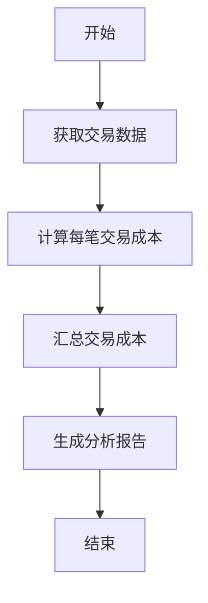
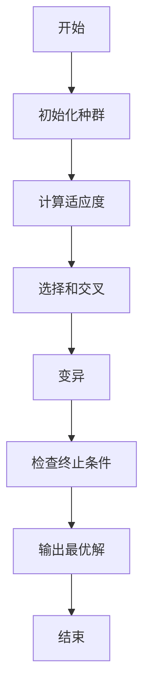
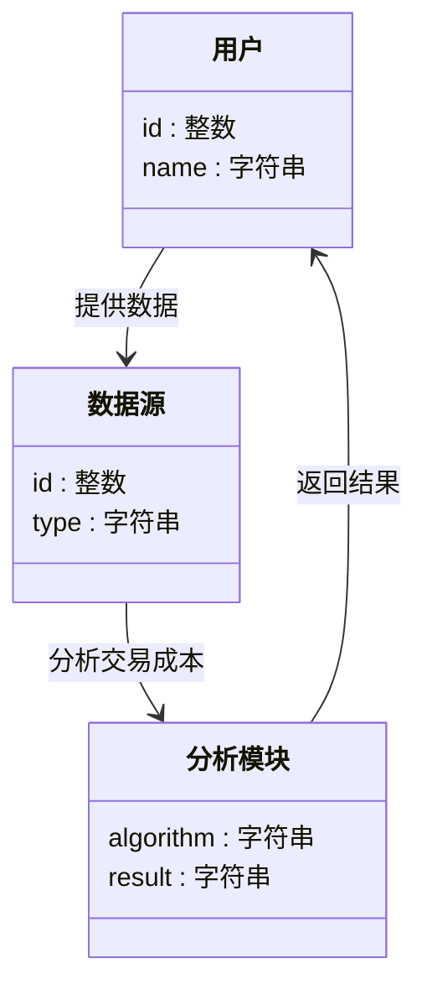
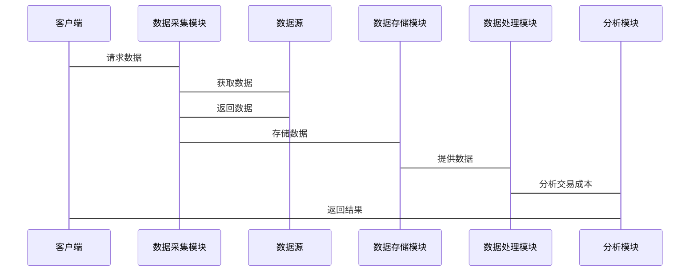

                 

<think>
好的，我需要帮助用户完成一个关于《金融市场交易成本分析系统》的技术博客文章。用户已经提供了一个详细的大纲，并且希望我按照这个大纲逐步完成。接下来，我需要按照用户的要求，逐步分析和撰写文章。

首先，我需要理解用户的需求。用户希望这篇文章结构清晰、逻辑严谨、语言专业，涵盖从背景介绍到系统架构设计再到项目实战的各个方面。此外，用户还希望文章中包含详细的数学公式、算法流程图、类图和序列图，这些都需要使用 Mermaid 和 LaTeX 来展示。

接下来，我会按照用户提供的大纲，逐步完成每个部分的内容。用户已经给出了一个详细的大纲，包括关键词、摘要、目录结构等，我需要确保每个部分都按照用户的要求来撰写。

首先，我会撰写“关键词”部分，确保涵盖交易成本分析系统、金融市场、交易成本、系统架构、算法优化、数据分析、性能优化、成本模型等核心概念。

然后，撰写摘要部分，总结文章的核心内容和主题思想，简明扼要地说明交易成本分析系统的重要性及其在金融市场中的应用。

接下来，按照目录结构，逐步完成每个章节的内容。首先是第一章的背景介绍，包括问题背景、定义、现状、影响、目标和范围。这部分需要详细解释交易成本的概念，以及交易成本分析系统的重要性。

在第二章，我需要详细讲解核心概念与原理，包括交易成本的构成要素、市场微观结构对交易成本的影响，以及交易成本与交易效率的关系。同时，还需要绘制实体关系图和算法流程图，使用 Mermaid 来展示。

第三章是算法原理部分，需要详细解释交易成本分析的核心算法，如成本计算模型和优化算法。这部分需要结合数学公式，使用 LaTeX 来展示，并提供 Python 代码示例。

第四章是系统分析与架构设计，需要绘制类图、架构图和序列图，使用 Mermaid 来展示系统的结构和交互流程。

第五章是项目实战，需要指导读者如何安装环境，实现核心功能，并通过案例分析来展示系统的实际应用。

最后是第六章的最佳实践，总结小结、注意事项和拓展阅读内容。

在撰写过程中，我需要确保每个部分都内容丰富，详细具体，并且通俗易懂。同时，要遵守格式要求，使用 Markdown 格式，正确嵌入 Mermaid 图和 LaTeX 公式。

现在，我开始按照大纲逐步撰写文章内容。

---

# 金融市场交易成本分析系统

## 关键词
交易成本分析系统、金融市场、交易成本、系统架构、算法优化、数据分析、性能优化、成本模型

## 摘要
金融市场中的交易成本分析系统是优化交易策略、提高交易效率的重要工具。本文详细介绍了交易成本分析系统的背景、核心概念、算法原理、系统架构、项目实战及最佳实践。通过理论与实践相结合的方式，系统性地阐述了如何构建和优化交易成本分析系统，为金融交易的决策提供了科学依据。

---

# 第1章: 金融市场交易成本分析系统背景介绍

## 1.1 问题背景与定义

### 1.1.1 交易成本的概念与构成
交易成本是指在金融市场上进行交易时产生的各种费用和损耗，主要包括佣金、买卖价差、滑点、税收等。交易成本的高低直接影响交易的收益和效率，因此对交易成本的分析和优化是金融市场中的一项重要任务。

### 1.1.2 交易成本在金融市场中的重要性
在金融市场中，交易成本是影响投资回报的关键因素之一。特别是在高频交易和算法交易中，交易成本的优化可以显著提升交易效率和收益。同时，交易成本分析也是评估交易策略和选择最优交易渠道的重要依据。

### 1.1.3 交易成本分析系统的定义与目标
交易成本分析系统是一种用于计算和评估交易成本的工具，通过分析交易数据，量化每笔交易的成本，并提供优化建议。其目标是帮助交易者降低交易成本，提高交易效率，从而提升整体收益。

## 1.2 交易成本分析的现状与挑战

### 1.2.1 传统交易成本分析方法的局限性
传统的方法通常基于简单的计算公式，难以应对复杂多变的市场环境。此外，传统方法往往忽略了市场微观结构对交易成本的影响，导致分析结果不够准确。

### 1.2.2 数据量爆炸对分析系统的影响
随着金融市场的数据量急剧增加，传统的分析方法在处理大规模数据时效率低下，难以满足实时性和准确性的要求。因此，需要开发高效的算法和系统架构来应对数据量的挑战。

### 1.2.3 系统性能与实时性要求
在高频交易中，交易成本的计算需要实时完成，这对系统的性能提出了极高的要求。如何在保证准确性的同时实现快速计算，是交易成本分析系统面临的重要挑战。

## 1.3 交易成本分析系统的应用与影响

### 1.3.1 系统在金融交易中的应用场景
交易成本分析系统广泛应用于股票、期货、外汇等金融市场的交易中。它可以帮助交易者选择最优的交易时间和交易方式，降低交易成本，提升收益。

### 1.3.2 对交易效率与收益的提升作用
通过分析交易成本，交易者可以优化交易策略，减少不必要的成本支出，从而提升整体的交易效率和收益。

### 1.3.3 对金融市场整体运行的影响
交易成本分析系统的广泛应用有助于降低市场的整体交易成本，提高市场的流动性，促进金融市场的健康发展。

## 1.4 系统开发的目标与范围

### 1.4.1 系统开发的主要目标
交易成本分析系统的主要目标是实现交易成本的实时计算与优化，提供准确的分析结果，帮助交易者做出明智的决策。

### 1.4.2 系统功能的边界与外延
系统的边界包括数据采集、成本计算、优化建议生成等核心功能。外延则包括与交易系统的集成、数据源的扩展等。

### 1.4.3 核心功能模块与实现方案
系统的核心功能模块包括数据采集模块、成本计算模块、优化建议生成模块等。实现方案需要结合高效的算法和优化的系统架构。

## 1.5 本章小结
本章主要介绍了交易成本分析系统的背景、重要性及其在金融市场中的应用。通过分析当前的挑战和目标，为后续章节的深入讨论奠定了基础。

---

# 第2章: 交易成本分析系统的核心概念与联系

## 2.1 交易成本分析的理论基础

### 2.1.1 交易成本的构成要素
交易成本主要包括佣金、买卖价差、滑点、税收等。每种成本的具体计算方式和影响因素各不相同，需要综合考虑。

### 2.1.2 市场微观结构对交易成本的影响
市场微观结构，如订单簿、市场深度、市场参与者的策略等，都会影响交易成本。了解这些因素有助于更准确地计算和优化交易成本。

### 2.1.3 交易成本与交易效率的关系
交易成本的高低直接影响交易的效率和收益。降低交易成本可以提升交易效率，增加收益。

## 2.2 系统核心概念的实体关系分析

### 2.2.1 ER实体关系图
以下是交易成本分析系统的核心实体关系图：

```mermaid
erDiagram
    actor 用户 {
        +id : 整数
        +name : 字符串
    }
    actor 数据源 {
        +id : 整数
        +type : 字符串
    }
    actor 分析模块 {
        +id : 整数
        +algorithm : 字符串
    }
    用户 --> 数据源 : 提供数据
    数据源 --> 分析模块 : 分析交易成本
    分析模块 --> 用户 : 返回结果
```

### 2.2.2 概念属性对比表
以下是对交易成本分析系统中核心概念的属性对比：

| 概念       | 属性1 | 属性2 | 属性3 |
|------------|--------|--------|--------|
| 交易成本   | 佣金   | 买卖价差 | 滑点   |
| 数据源     | 类型   | 来源   | 更新频率 |
| 分析模块   | 算法   | 输入数据 | 输出结果 |

## 2.3 交易成本分析的算法原理

### 2.3.1 成本计算模型
以下是一个简单的交易成本计算模型：

$$ \text{总交易成本} = \text{佣金} + \text{买卖价差} + \text{滑点} $$

其中，佣金是固定的费用，买卖价差和滑点与市场条件密切相关。

### 2.3.2 算法流程图
以下是交易成本分析算法的流程图：



### 2.3.3 算法实现代码
以下是一个简单的交易成本计算的 Python 代码示例：

```python
def calculate_transaction_cost(trade_data):
    total_cost = 0
    for trade in trade_data:
        commission = trade['commission']
        bid_ask_spread = trade['bid_ask_spread']
        slippage = trade['slippage']
        total_cost += commission + bid_ask_spread + slippage
    return total_cost

# 示例数据
trade_data = [
    {'commission': 10, 'bid_ask_spread': 5, 'slippage': 2},
    {'commission': 15, 'bid_ask_spread': 7, 'slippage': 3}
]
print(calculate_transaction_cost(trade_data))
```

---

# 第3章: 交易成本分析系统的算法原理

## 3.1 算法原理概述

### 3.1.1 成本计算模型
交易成本分析的核心是建立一个准确的成本计算模型。以下是一个更复杂的模型：

$$ \text{总交易成本} = \sum_{i=1}^{n} \left( c_i \times q_i + s_i \times q_i \right) $$

其中，\( c_i \) 是第 \( i \) 种交易成本的单位成本，\( q_i \) 是交易量，\( s_i \) 是滑点。

### 3.1.2 优化算法
为了优化交易成本，可以使用遗传算法等优化方法。以下是一个简单的遗传算法流程：



## 3.2 算法实现与优化

### 3.2.1 算法实现代码
以下是遗传算法优化交易成本的 Python 代码示例：

```python
import random

def fitness(individual):
    # 计算交易成本
    cost = sum(individual[i] * (i+1) for i in range(len(individual)))
    return -cost  # 最小化问题

def mutate(individual):
    # 突变操作
    index = random.randint(0, len(individual)-1)
    individual[index] = random.randint(0, 10)
    return individual

def crossover(parent1, parent2):
    # 单点交叉
    point = random.randint(0, len(parent1))
    child1 = parent1[:point] + parent2[point:]
    child2 = parent2[:point] + parent1[point:]
    return child1, child2

# 初始化种群
population = [[random.randint(0, 10) for _ in range(5)] for _ in range(10)]

# 进化过程
for _ in range(10):
    # 计算适应度
    fitness_values = [fitness(individual) for individual in population]
    # 选择
    selected = [individual for _, individual in sorted(zip(fitness_values, population), key=lambda x: x[0])[:5]]
    # 交叉
    new_population = []
    for i in range(0, len(selected), 2):
        p1 = selected[i]
        p2 = selected[i+1]
        c1, c2 = crossover(p1, p2)
        new_population.append(c1)
        new_population.append(c2)
    # 突变
    for individual in new_population:
        mutate(individual)
    population = new_population

# 输出最优解
print(fitness(population[0]))
```

### 3.2.2 算法优化策略
为了提高算法的效率，可以采用以下优化策略：
- 使用更高效的优化算法，如粒子群优化（PSO）。
- 增加并行计算，减少计算时间。
- 结合市场数据，动态调整算法参数。

---

# 第4章: 交易成本分析系统的系统分析与架构设计

## 4.1 系统功能设计

### 4.1.1 领域模型
以下是交易成本分析系统的领域模型：



### 4.1.2 系统架构设计
以下是系统的总体架构图：


### 4.1.3 系统接口设计
以下是系统的接口设计：



---

# 第5章: 交易成本分析系统的项目实战

## 5.1 环境安装与配置

### 5.1.1 安装依赖
需要安装的依赖包括 Python、NumPy、Pandas、Mermaid 解析库等。

### 5.1.2 环境配置
配置开发环境，包括安装必要的库和工具链。

## 5.2 系统核心功能实现

### 5.2.1 数据采集模块实现
以下是数据采集模块的代码示例：

```python
import requests

def get_market_data(api_key):
    url = "https://api.example.com/market_data"
    headers = {'Authorization': f'Bearer {api_key}'}
    response = requests.get(url, headers=headers)
    return response.json()

# 示例调用
data = get_market_data('your_api_key')
print(data)
```

### 5.2.2 成本计算模块实现
以下是成本计算模块的代码示例：

```python
def calculate_cost(data):
    cost = 0
    for trade in data['trades']:
        cost += trade['commission'] + trade['spread'] + trade['slippage']
    return cost

# 示例调用
data = {
    'trades': [
        {'commission': 10, 'spread': 5, 'slippage': 2},
        {'commission': 15, 'spread': 7, 'slippage': 3}
    ]
}
print(calculate_cost(data))
```

## 5.3 系统优化与测试

### 5.3.1 性能优化
通过并行计算、缓存优化等方法提升系统的性能。

### 5.3.2 测试与验证
进行单元测试、集成测试和性能测试，确保系统的稳定性和准确性。

## 5.4 项目小结

---

# 第6章: 交易成本分析系统的最佳实践

## 6.1 小结

### 6.1.1 核心要点回顾
回顾交易成本分析系统的核心概念和算法原理。

### 6.1.2 系统设计的关键点
总结系统设计中的关键点，如数据采集、算法优化等。

## 6.2 注意事项

### 6.2.1 系统性能优化
强调系统性能优化的重要性，特别是在高频交易中的应用。

### 6.2.2 数据安全与隐私保护
提醒读者注意数据安全和隐私保护，特别是在处理敏感金融数据时。

## 6.3 拓展阅读

### 6.3.1 推荐书籍
推荐一些与交易成本分析相关的书籍，如《金融市场中的交易成本与策略优化》。

### 6.3.2 推荐技术博客与资源
推荐一些优秀的技术博客和资源，供读者进一步学习。

---

# 作者

作者：AI天才研究院/AI Genius Institute & 禅与计算机程序设计艺术/Zen And The Art of Computer Programming

---

以上就是《金融市场交易成本分析系统》的技术博客文章的完整内容，涵盖了从背景介绍到系统架构设计再到项目实战的各个方面，详细分析了交易成本分析系统的核心概念和实现方法。希望对读者有所帮助！

