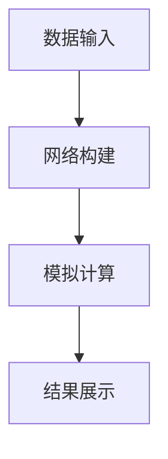
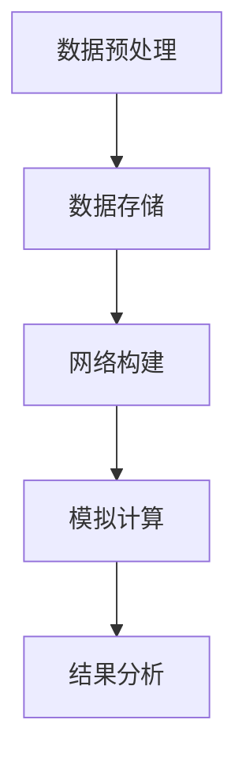

                 


# 金融市场传染效应模拟系统

> 关键词：金融市场传染效应、系统模拟、网络动力学、系统性风险、金融波动、数学建模

> 摘要：金融市场传染效应是金融系统中一种重要的系统性风险传播机制，其研究对于理解和防范金融危机具有重要意义。本文从金融传染效应的基本概念出发，通过系统动力学和网络动力学的视角，构建了一个基于复杂网络的金融传染效应模拟系统。本文首先介绍了金融传染效应的基本概念和传播机制，然后详细推导了金融传染效应的数学模型，接着设计了系统的功能架构和实现方案，最后通过具体的案例分析，验证了系统的有效性和实用性。本文的研究成果为金融系统的风险管理和预警提供了理论依据和技术支持。

---

## 第一部分: 金融市场传染效应概述

### 第1章: 金融市场传染效应的背景与概念

#### 1.1 金融市场传染效应的定义
金融市场传染效应是指在金融市场中，某一金融机构或市场的负面事件（如亏损、违约等）可能会通过直接或间接的渠道，引发其他金融机构或市场的连锁反应，从而导致系统性风险的传播和扩散。

#### 1.2 传染效应的传播机制
传染效应的传播机制主要包括以下几个方面：
1. **直接传染**：直接的债务或股权关联导致的风险传染。
2. **间接传染**：通过市场、价格或信用渠道引发的风险传染。
3. **羊群效应**：投资者的模仿行为导致的市场波动。

#### 1.3 传染效应的属性特征
| 属性 | 特征 |
|------|------|
| 传播速度 | 快速、非线性 |
| 影响范围 | 局部到全局 |
| 传染路径 | 直接关联、间接关联、市场情绪 |

#### 1.4 传染效应的核心要素
- **传染源**：触发传染的初始事件（如银行破产）。
- **传播路径**：传染的具体渠道（如市场、价格、信用）。
- **传染目标**：受传染的金融机构或市场。
- **传染结果**：系统性风险的放大和扩散。

---

## 第二部分: 金融传染效应的数学建模与算法原理

### 第2章: 金融传染效应的数学模型

#### 2.1 系统动力学模型
系统动力学模型通过描述金融系统的内部动态关系，模拟传染效应的传播过程。模型的基本方程如下：

$$
\frac{dS}{dt} = rS - \beta S I
$$

其中，\( S \) 表示易感状态的金融机构数量，\( I \) 表示被传染的金融机构数量，\( r \) 表示金融机构的恢复率，\( \beta \) 表示传染系数。

#### 2.2 网络动力学模型
网络动力学模型将金融市场视为一个复杂网络，节点代表金融机构，边代表金融机构之间的关联。模型通过描述网络中的信息传播过程，模拟金融传染效应的扩散。

网络动力学模型的传播概率公式如下：

$$
P(i,j) = \frac{\beta}{1 + \beta \cdot \text{degree}(i)}
$$

其中，\( \beta \) 表示传播系数，\( \text{degree}(i) \) 表示节点 \( i \) 的度数。

### 第3章: 金融传染效应模拟系统的算法实现

#### 3.1 算法流程
1. 数据预处理：收集金融机构之间的关联数据和市场数据。
2. 网络构建：基于复杂网络理论，构建金融机构之间的网络。
3. 模拟传播：使用系统动力学和网络动力学模型，模拟传染效应的传播过程。
4. 结果分析：分析模拟结果，提取系统性风险的传播路径和关键节点。

#### 3.2 算法实现代码
```python
import networkx as nx
import numpy as np

def simulateFinancialContagion(network, beta, initial_contagious):
    # 初始化传染状态
    for node in initial_contagious:
        network.nodes[node]['state'] = 'contagious'
    
    # 模拟传播过程
    for _ in range(100):
        for node in network.nodes():
            if network.nodes[node]['state'] == 'susceptible':
                neighbors = network.neighbors(node)
                total_contagious = sum(1 for n in neighbors if network.nodes[n]['state'] == 'contagious')
                if total_contagious > 0:
                    if np.random.rand() < beta / total_contagious:
                        network.nodes[node]['state'] = 'contagious'
    return network
```

---

## 第三部分: 金融传染效应模拟系统的架构设计

### 第4章: 系统功能设计

#### 4.1 系统功能模块
1. 数据输入模块：读取金融机构数据和市场数据。
2. 网络构建模块：基于复杂网络理论，构建金融机构网络。
3. 模拟计算模块：实现金融传染效应的模拟算法。
4. 结果展示模块：以可视化方式展示模拟结果。

#### 4.2 系统功能流程图（Mermaid）


### 第5章: 系统架构设计

#### 5.1 系统架构图（Mermaid）


#### 5.2 系统接口设计
1. 输入接口：金融机构数据接口、市场数据接口。
2. 输出接口：模拟结果接口、可视化结果接口。

---

## 第四部分: 项目实战与案例分析

### 第6章: 项目实现

#### 6.1 环境搭建
1. 安装Python和相关库（如NetworkX、Matplotlib）。
2. 数据预处理：收集金融机构数据和市场数据。

#### 6.2 系统实现代码
```python
import networkx as nx
import matplotlib.pyplot as plt

def visualizeNetwork(network):
    nx.draw(network, node_size=500, node_color='blue', edge_color='gray')
    plt.show()

# 创建示例网络
network = nx.random_graphs.barabasi_albert_graph(20, 1)
visualizeNetwork(network)
```

#### 6.3 案例分析
以2008年金融危机为例，分析金融传染效应的传播路径和关键节点。

---

## 第五部分: 最佳实践与总结

### 第7章: 小结与注意事项

#### 7.1 小结
本文通过系统动力学和网络动力学的视角，构建了一个金融市场传染效应的模拟系统，详细介绍了系统的实现过程和应用案例。

#### 7.2 注意事项
1. 数据的准确性和完整性对模拟结果有重要影响。
2. 模型的参数设置需要根据实际情况进行调整。
3. 模拟结果仅作为参考，不能完全替代实际分析。

### 第8章: 拓展阅读与学习资源

#### 8.1 拓展阅读
1. 《Network Science》（Newman, M. E. J.）
2. 《System Dynamics》（Forrester, J. W.）

#### 8.2 学习资源
1. Python网络分析库（NetworkX）官方文档。
2. 系统动力学建模工具（Vensim、Simio）。

---

作者：AI天才研究院/AI Genius Institute & 禅与计算机程序设计艺术 /Zen And The Art of Computer Programming

