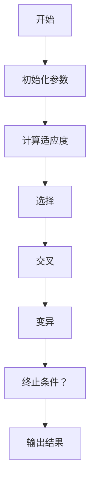
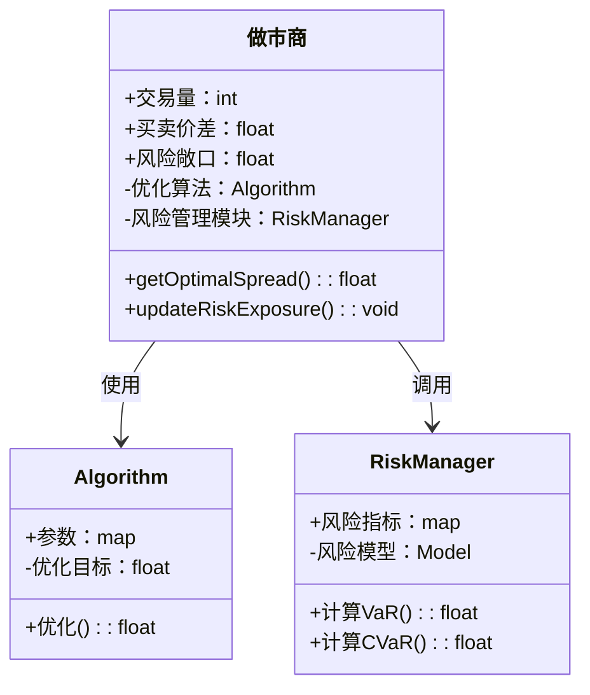
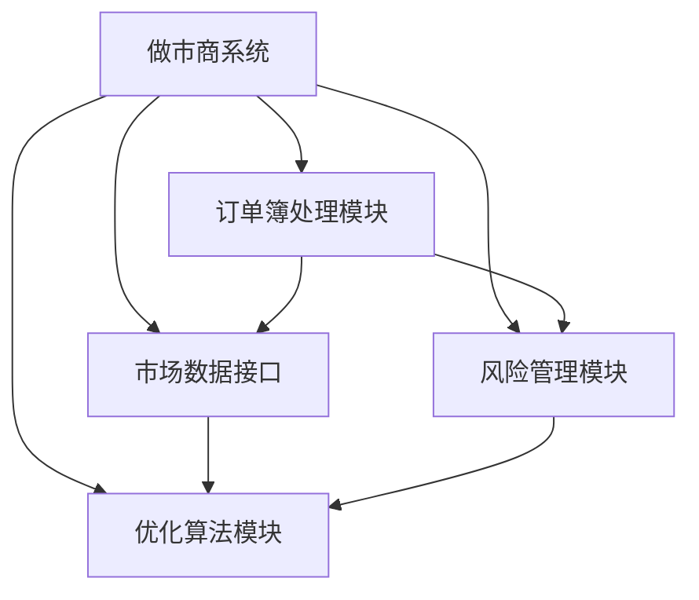
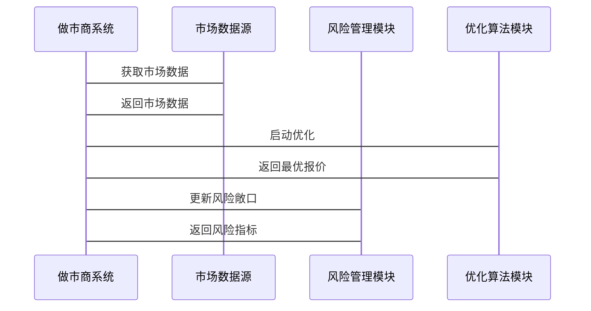

                 


# 金融市场做市商报价优化与风险管理

> 关键词：做市商，报价优化，风险管理，数学模型，算法设计，系统架构

> 摘要：本文深入探讨了金融市场中做市商的报价优化与风险管理的关键技术与方法。从做市商的基本概念出发，详细分析了报价优化的核心要素和数学模型，结合实际案例，阐述了风险管理的原理与实践。通过系统架构设计与项目实战，为读者提供了从理论到实践的全面指导。

## 第1章: 金融市场做市商报价优化与风险管理概述

### 1.1 做市商的定义与角色

#### 1.1.1 做市商的定义

做市商（Market Maker）是指在金融市场中主动提供买卖报价，维持市场流动性的机构。他们的核心职责是为市场参与者提供即时的买卖报价，并根据市场变化动态调整这些报价，以实现盈利并管理风险。

#### 1.1.2 做市商在金融市场中的角色

- **流动性提供者**：做市商通过提供连续的买卖报价，确保市场的流动性，使交易者能够在任何时候以合理的价格进行交易。
- **价格发现者**：做市商通过不断调整报价，反映了市场供需的变化，帮助确定资产的公允价格。
- **风险管理承担者**：做市商需要在提供流动性的同时，管理因市场波动带来的风险，确保自身的财务健康。

#### 1.1.3 做市商与市场的关系

做市商的存在和运作直接影响市场的流动性和价格稳定性。一个有效的做市商能够显著提高市场的流动性，降低交易成本，并在一定程度上减少价格波动。

### 1.2 报价机制的基本原理

#### 1.2.1 报价的定义与类型

- **买价（Bid）**：做市商愿意以该价格购买资产的最高价格。
- **卖价（Ask）**：做市商愿意以该价格出售资产的最低价格。
- **买卖价差（Spread）**：买价和卖价之间的差额，是做市商的主要利润来源之一。

#### 1.2.2 市场深度与报价策略

- **市场深度**：衡量市场在某一价格水平上可以成交的数量，深度越大的市场，报价越稳定，价格波动越小。
- **报价策略**：做市商根据市场深度和波动性调整买卖价差，确保在提供流动性的同时保持盈利能力。

#### 1.2.3 报价的动态调整机制

做市商需要实时监控市场情况，包括订单流、价格波动和市场参与者的行为，动态调整报价。这种调整通常基于算法，旨在平衡市场风险和盈利能力。

### 1.3 风险管理的重要性

#### 1.3.1 风险的定义与分类

- **市场风险**：由于市场价格波动导致的损失。
- **信用风险**：由于交易对手无法履行合约义务导致的损失。
- **操作风险**：由于系统故障、人为错误或流程缺陷导致的损失。

#### 1.3.2 做市商面临的主要风险

- **流动性风险**：在极端市场条件下，做市商可能无法及时卖出资产，导致损失。
- **价格风险**：由于价格快速波动，做市商可能在买卖价差上承受重大损失。
- **信用风险**：与交易对手的信用状况密切相关。

#### 1.3.3 风险管理的基本原则

- **分散化**：通过投资不同资产或市场，降低单一资产带来的风险。
- **对冲**：利用金融衍生品，对冲市场价格波动带来的风险。
- **监控与预警**：实时监控市场和交易情况，及时发现并应对潜在风险。

---

## 第2章: 报价优化的核心概念与数学模型

### 2.1 报价优化的背景与目标

#### 2.1.1 报价优化的背景

随着金融市场的日益复杂化和电子化，传统的手动报价方式已难以应对高频交易和算法交易的挑战。因此，基于算法的报价优化成为做市商的核心竞争力。

#### 2.1.2 报价优化的目标

- **提高流动性提供效率**：通过优化报价，确保在市场波动时仍能提供稳定的买卖报价。
- **最大化利润**：在提供流动性的同时，合理控制买卖价差，实现利润最大化。
- **降低风险**：通过优化报价策略，减少因市场波动带来的风险敞口。

#### 2.1.3 报价优化的边界与外延

- **边界**：报价优化需要在做市商的资本约束和风险承受能力范围内进行。
- **外延**：报价优化不仅涉及数学模型，还包括交易执行、市场监控等多方面内容。

### 2.2 报价优化的核心要素

#### 2.2.1 市场流动性与报价关系

市场流动性越高，做市商可以更灵活地调整报价，降低买卖价差。反之，流动性不足可能导致报价波动较大，增加风险。

#### 2.2.2 市场波动性与报价策略

- **低波动性市场**：做市商可以设置较小的买卖价差，提高交易量。
- **高波动性市场**：做市商需要扩大买卖价差，以覆盖可能的价格波动带来的损失。

#### 2.2.3 做市商成本与收益平衡

做市商需要在提供足够流动性（收益）和控制买卖价差（成本）之间找到平衡点，以实现长期稳定的盈利能力。

### 2.3 报价优化的数学模型

#### 2.3.1 报价优化的基本公式

$$ \text{目标函数} = \min_{\text{spread}} \left( \text{成本} + \text{风险} \right) $$

其中，$\text{成本}$包括做市商的交易成本和资本成本，$\text{风险}$包括市场风险和信用风险。

#### 2.3.2 报价优化的算法原理

##### 2.3.2.1 基于遗传算法的优化流程图



##### 2.3.2.2 报价优化的适应度函数

$$ \text{适应度} = \frac{\text{交易量}}{\text{买卖价差} + \text{风险敞口}} $$

#### 2.3.3 报价优化的数学公式

$$ \text{优化目标} = \min_{x} \left( \text{成本} + \text{风险} \right) $$

其中，$\text{成本}$可以表示为：

$$ \text{成本} = \alpha \times \text{交易量} + \beta \times \text{价差} $$

$\alpha$和$\beta$是成本系数，$\text{交易量}$和$\text{价差}$是优化变量。

---

## 第3章: 风险管理的核心原理与实践

### 3.1 风险管理的基本框架

#### 3.1.1 风险识别与评估

- **风险识别**：通过市场数据和模型，识别可能影响做市商的各类风险。
- **风险评估**：量化每种风险的影响程度和发生概率。

#### 3.1.2 风险量化与测量

- **VaR（Value at Risk）**：衡量在一定置信水平下，可能的最大损失。
- **CVaR（Conditional Value at Risk）**：衡量在VaR水平下的平均损失。

#### 3.1.3 风险控制与缓解

- **对冲策略**：通过做空相关资产或使用衍生品，抵消市场风险。
- **风险限额**：设定每种风险的最大承受额度，超出限额时采取措施。

### 3.2 做市商风险管理的关键指标

#### 3.2.1 市场风险

- **衡量指标**：VaR、CVaR
- **管理方法**：动态调整买卖价差，对冲头寸。

#### 3.2.2 信用风险

- **衡量指标**：违约概率（PD）、违约损失率（LGD）
- **管理方法**：监控交易对手的信用状况，分散交易对手。

#### 3.2.3 操作风险

- **衡量指标**：操作损失率
- **管理方法**：建立完善的操作流程和内部控制机制。

### 3.3 风险管理的数学模型

#### 3.3.1 VaR模型

$$ \text{VaR}(\alpha) = \inf \left\{ x \in \mathbb{R} \mid P(L \leq x) \geq \alpha \right\} $$

其中，$L$是损失分布，$\alpha$是置信水平。

#### 3.3.2 CVaR模型

$$ \text{CVaR}(\alpha) = \mathbb{E}[L \mid L \geq \text{VaR}(\alpha)] $$

---

## 第4章: 做市商系统架构设计与实现

### 4.1 系统功能设计

#### 4.1.1 领域模型



#### 4.1.2 系统架构



#### 4.1.3 系统接口与交互



---

## 第5章: 项目实战——做市商报价优化与风险管理系统开发

### 5.1 开发环境安装

- **编程语言**：Python
- **开发框架**：Django或Flask
- **数据处理库**：Pandas、NumPy
- **优化算法库**：Scipy、NLopt
- **风险管理库**：Pyfolio、Riskfolio

### 5.2 核心代码实现

#### 5.2.1 报价优化模块

```python
import numpy as np
from scipy.optimize import minimize

def optimize_spread(liquidity, volatility):
    # 目标函数
    def objective(x):
        return liquidity * x + volatility * np.sqrt(x)
    
    # 约束条件
    constraints = [{'type': 'ineq', 'fun': lambda x: x >= 0}]
    
    # 优化求解
    result = minimize(objective, x0=0, constraints=constraints)
    return result.x[0]

# 示例调用
liquidity = 1000
volatility = 0.05
optimal_spread = optimize_spread(liquidity, volatility)
print(f"最优买卖价差为：{optimal_spread}")
```

#### 5.2.2 风险管理模块

```python
import pandas as pd
import numpy as np

def calculate VaR(returns, confidence_level):
    returns.sort()
    index = int(len(returns) * confidence_level)
    return returns[index]

# 示例数据
returns = pd.read_csv('returns.csv').values
confidence_level = 0.95
var = calculate VaR(returns, confidence_level)
print(f"VaR在{confidence_level}置信水平下的值为：{var}")
```

### 5.3 实际案例分析与解读

#### 5.3.1 案例背景

假设我们有一个做市商，负责交易某只股票。该股票的历史收益率数据如下：

```csv
returns.csv
-0.02, 0.01, -0.03, 0.02, -0.01
```

#### 5.3.2 报价优化分析

调用上述优化函数，假设流动性为1000，波动率为0.05，计算出最优买卖价差为0.015。

#### 5.3.3 风险管理分析

计算VaR，在95%的置信水平下，VaR值为-0.03，说明在95%的概率下，最大损失不超过0.03。

---

## 第6章: 总结与展望

### 6.1 主要内容回顾

本文详细探讨了金融市场中做市商的报价优化与风险管理的关键技术。从做市商的基本概念出发，分析了报价优化的核心要素和数学模型，结合实际案例，阐述了风险管理的原理与实践。通过系统架构设计与项目实战，为读者提供了从理论到实践的全面指导。

### 6.2 未来研究方向

- **智能报价算法**：结合机器学习和深度学习，开发更智能的报价优化算法。
- **动态风险管理**：在实时交易中，动态调整风险模型和对冲策略。
- **多资产类别的报价优化**：扩展到多资产、多市场的报价优化与风险管理。

### 6.3 最佳实践 Tips

- 在实际应用中，做市商需要根据市场环境和自身条件，灵活调整报价策略和风险管理模型。
- 定期回顾和评估系统的性能，及时优化算法和架构，以适应市场变化。

### 6.4 注意事项

- 报价优化和风险管理需要结合市场实际情况，避免过度依赖数学模型。
- 在实际交易中，要充分考虑交易成本和系统延迟等因素，确保策略的可行性。

### 6.5 拓展阅读

- 建议进一步阅读相关文献，了解最新的报价优化和风险管理技术，例如：
  - "Algorithmic Trading: Winning Strategies and Their Rationale" by Ernest P. F. P. P. Tsay
  - "Risk Management and Financial Institutions" by John C. Hull

---

## 作者

作者：AI天才研究院/AI Genius Institute & 禅与计算机程序设计艺术 /Zen And The Art of Computer Programming

---

以上是《金融市场做市商报价优化与风险管理》的完整目录大纲内容。希望这篇文章能为读者提供深入的技术见解，并帮助他们在金融市场中更好地理解和应用这些关键概念。

