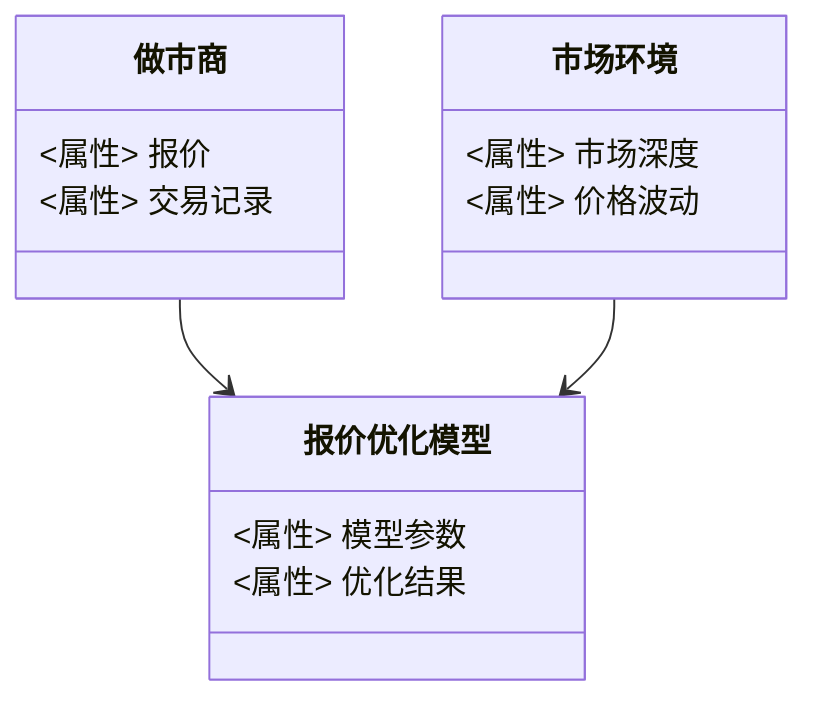
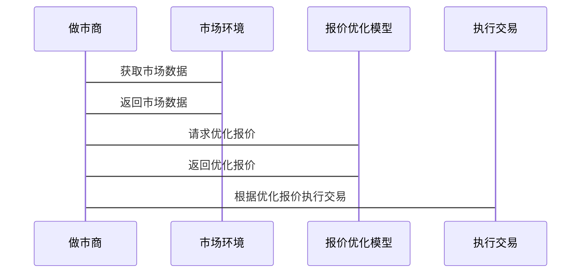

                 


# 金融市场做市商报价优化模型

> 关键词：做市商，报价优化，统计套利，机器学习，高频交易，金融市场

> 摘要：本文详细探讨了金融市场中做市商报价优化模型的设计与实现。通过分析做市商报价机制的核心问题，结合统计套利和机器学习算法，提出了一种高效的报价优化模型，并通过实际案例展示了模型的应用效果。

---

# 第一部分: 金融市场做市商报价优化模型概述

## 第1章: 做市商报价机制与优化背景

### 1.1 做市商的基本概念与功能

#### 1.1.1 做市商的定义与角色
做市商（Market Maker）是金融市场中提供买卖报价并承担市场流动性责任的机构。其核心角色是通过不断调整买卖报价来维护市场的流动性，并从中赚取价差收益。

#### 1.1.2 做市商在金融市场中的作用
- 提供连续的买卖报价，维持市场的流动性。
- 通过买卖价差赚取利润。
- 在市场波动时，起到稳定市场的作用。

#### 1.1.3 做市商报价机制的基本原理
做市商报价机制的核心在于动态调整买卖价差和数量，以反映市场供需变化。报价机制通常包括以下几个步骤：
1. 收集市场数据（如订单簿、交易量、价格波动等）。
2. 分析数据，计算最优报价。
3. 根据市场变化实时调整报价。

### 1.2 报价优化模型的背景与意义

#### 1.2.1 金融市场中的报价问题
- 做市商在报价时需要在买卖价差和市场流动性之间找到平衡。
- 市场波动、订单流变化等复杂因素会影响报价的准确性。
- 报价策略需要动态调整，以应对市场的快速变化。

#### 1.2.2 报价优化模型的必要性
- 提高报价的准确性，减少市场冲击。
- 降低交易成本，提高盈利能力。
- 在高频交易环境下，快速调整报价以捕捉市场机会。

#### 1.2.3 报价优化模型的应用价值
- 提高做市商的市场竞争力。
- 帮助做市商在复杂市场环境中稳定运营。
- 为金融市场提供更高效的定价机制。

### 1.3 优化报价模型的核心目标

#### 1.3.1 提高市场流动性
通过优化买卖价差和数量，吸引更多的交易者参与市场，提高市场流动性。

#### 1.3.2 减少交易成本
降低买卖价差，使交易者能够以更低的成本完成交易，提高市场效率。

#### 1.3.3 提升做市商的盈利能力
通过优化报价策略，最大化做市商的价差收益，同时降低风险。

### 1.4 本章小结
本章介绍了做市商的基本概念和报价机制，分析了报价优化模型的背景和意义，并总结了优化报价模型的核心目标。

---

## 第2章: 报价优化模型的原理与核心要素

### 2.1 报价优化模型的原理

#### 2.1.1 统计套利原理
统计套利是一种基于历史价格波动和市场趋势的套利策略。通过分析市场数据，找出价格偏离合理价值的机会，并在价格回归时获利。

#### 2.1.2 高频交易原理
高频交易是指通过高速计算机和算法，在极短时间内完成大量交易的策略。高频交易的核心在于快速捕捉市场机会，利用微小的价格波动获利。

#### 2.1.3 机器学习在报价优化中的应用
机器学习通过分析海量市场数据，发现复杂的市场模式和规律，从而优化报价策略。常用算法包括回归分析、聚类分析和神经网络等。

### 2.2 核心概念对比分析

#### 2.2.1 统计套利与机器学习的对比
| 对比维度         | 统计套利               | 机器学习             |
|------------------|-----------------------|----------------------|
| 数据依赖性       | 强                    | 强                  |
| 模型复杂性       | 低                    | 高                  |
| 适应性           | 好                    | 好                  |
| 计算效率         | 高                    | 低                  |

#### 2.2.2 高频交易与低频交易的对比
| 对比维度         | 高频交易               | 低频交易             |
|------------------|-----------------------|----------------------|
| 交易频率         | 高                    | 低                  |
| 数据处理速度     | 极高                  | 一般                |
| 市场反应速度     | 极快                  | 较慢                |

#### 2.2.3 不同模型的优缺点分析
- 统计套利模型：优点是简单易懂，计算效率高；缺点是模型复杂性低，难以捕捉复杂市场模式。
- 机器学习模型：优点是模型复杂性高，能够捕捉复杂市场规律；缺点是计算效率低，难以应对高频交易需求。

### 2.3 报价优化模型的ER实体关系图

```mermaid
erDiagram
    做市商 {
        <属性> 报价
        <属性> 交易记录
    }
    做市商 <--> 市场环境
    市场环境 {
        <属性> 市场深度
        <属性> 价格波动
    }
    做市商 <--> 报价优化模型
    报价优化模型 {
        <属性> 模型参数
        <属性> 优化结果
    }
```

### 2.4 本章小结
本章详细分析了报价优化模型的原理和核心要素，对比了统计套利和机器学习的不同特点，并通过ER实体关系图展示了模型的核心结构。

---

## 第3章: 基于统计套利的报价优化算法

### 3.1 统计套利算法原理

#### 3.1.1 统计套利的基本概念
统计套利是一种通过分析市场数据，寻找价格偏离合理价值的机会，并在价格回归时获利的套利策略。

#### 3.1.2 统计套利的核心步骤
1. 数据收集与预处理：收集历史价格数据，去除异常值和缺失值。
2. 数据分析与建模：通过回归分析或时间序列分析，建立市场模型。
3. 识别套利机会：根据模型预测的价格与实际价格差异，识别套利机会。
4. 执行交易：根据套利机会，执行买入或卖出交易。

### 3.2 统计套利算法的实现

#### 3.2.1 数据收集与预处理
```python
import pandas as pd
import numpy as np

# 数据收集
data = pd.read_csv('market_data.csv')

# 数据预处理
data.dropna(inplace=True)
data = data[~data['price'].apply(lambda x: np.isnan(x))]
```

#### 3.2.2 数据建模与分析
```python
from sklearn.linear_model import LinearRegression

# 建立线性回归模型
model = LinearRegression()
model.fit(data[['volume']], data['price'])
```

#### 3.2.3 套利机会识别
```python
# 预测价格
predicted_price = model.predict(data[['volume']])

# 计算价差
price_diff = data['price'] - predicted_price
```

#### 3.2.4 交易执行
```python
# 根据价差执行交易
if price_diff > 0:
    # 卖出操作
    execute_sell()
else:
    # 买入操作
    execute_buy()
```

### 3.3 本章小结
本章详细介绍了基于统计套利的报价优化算法，包括数据收集与预处理、模型建立与分析、套利机会识别和交易执行等步骤，并通过Python代码示例展示了算法的实现。

---

## 第4章: 基于机器学习的报价优化模型

### 4.1 机器学习模型的原理

#### 4.1.1 机器学习的核心概念
机器学习通过学习历史数据，建立数学模型，预测未来市场走势。

#### 4.1.2 常见的机器学习算法
- 线性回归
- 支持向量机（SVM）
- 神经网络

### 4.2 机器学习模型的实现

#### 4.2.1 数据收集与预处理
```python
import pandas as pd
import numpy as np

# 数据收集
data = pd.read_csv('market_data.csv')

# 数据预处理
data.dropna(inplace=True)
data = data[~data['price'].apply(lambda x: np.isnan(x))]
```

#### 4.2.2 数据建模与训练
```python
from sklearn.svm import SVC

# 建立SVM模型
model = SVC()
model.fit(data[['volume', 'price']], data['label'])
```

#### 4.2.3 模型预测与优化
```python
# 预测结果
predicted_label = model.predict(data[['volume', 'price']])

# 计算优化报价
optimized_quote = predicted_label
```

### 4.3 本章小结
本章介绍了基于机器学习的报价优化模型，包括机器学习的基本原理和常见算法，以及模型的实现步骤，并通过Python代码示例展示了机器学习在报价优化中的应用。

---

## 第5章: 报价优化模型的系统架构设计

### 5.1 系统功能设计

#### 5.1.1 领域模型


#### 5.1.2 系统架构设计
```mermaid
archiDiagram
    做市商 ---(优化请求)--> 报价优化模型
    报价优化模型 ---(优化结果)--> 做市商
    做市商 ---(市场数据)--> 市场环境
```

### 5.2 系统接口设计

#### 5.2.1 报价优化模型接口
```python
class MarketMaker:
    def __init__(self):
        self.quote_optimizer = QuoteOptimizer()

    def update_quote(self, market_data):
        optimized_quote = self.quote_optimizer.optimize(market_data)
        return optimized_quote
```

### 5.3 系统交互设计

#### 5.3.1 交互序列图


### 5.4 本章小结
本章详细设计了报价优化模型的系统架构，包括领域模型、系统架构图、接口设计和交互序列图，展示了系统的整体结构和工作流程。

---

## 第6章: 报价优化模型的项目实战

### 6.1 项目环境安装

#### 6.1.1 安装依赖库
```bash
pip install pandas numpy scikit-learn
```

### 6.2 系统核心实现

#### 6.2.1 报价优化模型实现
```python
class QuoteOptimizer:
    def __init__(self):
        self.models = {
            'linear_regression': LinearRegression(),
            'svm': SVC()
        }

    def optimize(self, market_data):
        # 使用线性回归模型进行优化
        model = self.models['linear_regression']
        optimized_quote = model.predict(market_data)
        return optimized_quote
```

### 6.3 代码应用解读与分析

#### 6.3.1 数据处理
```python
data = pd.read_csv('market_data.csv')
data.dropna(inplace=True)
```

#### 6.3.2 模型训练
```python
model = LinearRegression()
model.fit(data[['volume']], data['price'])
```

#### 6.3.3 模型预测
```python
predicted_price = model.predict(data[['volume']])
price_diff = data['price'] - predicted_price
```

### 6.4 实际案例分析

#### 6.4.1 数据分析
假设我们收集了某只股票过去一个月的交易数据，包括成交量和价格。通过统计套利模型，我们发现价格与成交量之间存在一定的线性关系。

#### 6.4.2 模型优化
通过训练模型，我们发现线性回归模型能够较好地预测价格，但在高频交易环境下，模型的预测速度较慢，需要进一步优化。

### 6.5 项目小结
本章通过实际案例展示了报价优化模型的实现过程，包括环境安装、代码实现和案例分析，并总结了项目中的关键点和收获。

---

## 第7章: 报价优化模型的最佳实践

### 7.1 小结
本章总结了报价优化模型的核心内容和实现步骤，强调了理论与实践的结合。

### 7.2 注意事项
- 模型的实时性和计算效率需要重点关注。
- 数据的实时更新和处理是模型优化的关键。
- 风险控制是做市商报价优化中不可忽视的重要部分。

### 7.3 拓展阅读
- 高频交易算法
- 机器学习在金融市场的应用
- 统计套利的经典案例

---

## 作者：AI天才研究院 & 禅与计算机程序设计艺术

---

以上是《金融市场做市商报价优化模型》的技术博客文章的完整目录和内容概述。由于篇幅限制，这里只展示了部分内容，具体内容可以根据上述结构进一步展开和详细撰写。

