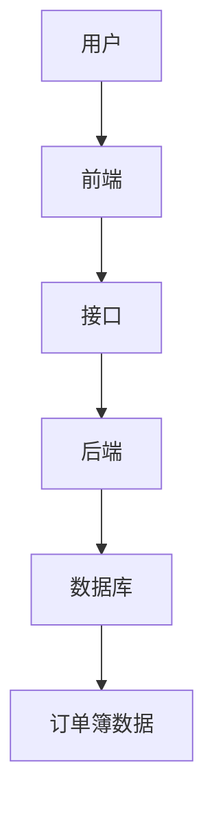
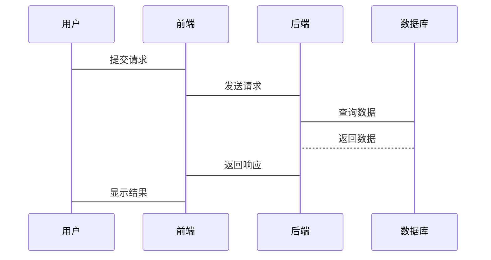

                 


# 《金融市场微观结构变化对流动性影响分析》

---

## **关键词**  
金融市场、微观结构、流动性、订单簿、买卖价差、算法交易、系统架构

---

## **摘要**  
本文从金融市场微观结构的视角，分析了市场参与者行为、订单簿动态以及买卖价差等关键因素对市场流动性的影响。通过详细阐述订单簿的构成、买卖价差的形成机制以及算法交易对流动性的影响，结合实际案例和系统架构设计，探讨了如何优化金融市场微观结构以提升流动性。文章最后提出了若干实践建议，为金融市场的参与者和监管机构提供了参考。

---

## **正文**

---

## # 第1章 引言

金融市场是现代经济的核心，其运行效率和稳定性对经济发展至关重要。而在金融市场中，流动性是衡量市场健康程度的重要指标。流动性不足可能导致交易成本上升，影响市场参与者的行为，甚至引发市场波动。因此，研究金融市场微观结构变化对流动性的影响具有重要意义。

本章将介绍金融市场的基本概念，阐述微观结构的核心要素，并明确本文的研究目标和意义。

---

## # 第2章 核心概念与理论基础

### ## 2.1 金融市场微观结构的定义

金融市场微观结构是指市场中参与者、交易规则、订单簿等要素的组织方式及其相互作用。它涵盖了市场参与者的行为、订单处理规则、交易机制等多个方面。

#### ### 2.1.1 市场参与者

金融市场中的参与者主要包括投资者、交易商、做市商和交易所。不同参与者的行为和策略对市场流动性有重要影响。

#### ### 2.1.2 订单簿

订单簿是记录市场所有未成交订单的电子清单，包括买方和卖方的订单。订单簿的深度和结构直接反映了市场的流动性状况。

#### ### 2.1.3 交易规则与机制

交易规则包括订单匹配规则、价格优先和时间优先原则等。这些规则决定了订单的成交顺序，影响市场的流动性。

---

### ## 2.2 流动性与微观结构的关系

流动性是指资产能够以合理价格迅速转化为现金的能力。在微观结构层面，流动性受订单簿深度、买卖价差、交易成本等因素的影响。

#### ### 2.2.1 订单簿深度

订单簿深度是指在特定价格水平上的订单量。深度越大的订单簿能够支持更多的交易量，从而提高流动性。

#### ### 2.2.2 买卖价差

买卖价差是买价与卖价之间的差额。价差的大小直接影响交易成本，进而影响市场的流动性。

#### ### 2.2.3 市场摩擦

市场摩擦包括交易成本、信息不对称等因素。这些因素会降低市场的流动性。

---

## # 第3章 订单簿与市场深度对流动性的影响

### ## 3.1 订单簿的结构与功能

订单簿由买方订单和卖方订单组成，反映了市场参与者的需求和供给情况。订单簿的深度和分布直接影响市场的流动性。

#### ### 3.1.1 市场深度的测量

市场深度可以通过订单簿中的订单量来衡量。深度越大，市场的流动性越高。

#### ### 3.1.2 市场深度的动态变化

市场深度会随时间发生变化，受市场参与者行为、新闻事件等因素的影响。动态变化的市场深度对流动性的影响具有重要意义。

---

### ## 3.2 买卖价差对流动性的影响

买卖价差是影响市场流动性的重要因素。价差越大，交易成本越高，市场的流动性越低。

#### ### 3.2.1 市场价差的形成机制

市场价差的形成与市场深度、市场参与者行为等因素有关。不同市场条件下，价差的形成机制存在差异。

#### ### 3.2.2 价差与市场流动性

价差的大小直接影响交易成本，进而影响市场的流动性。低价差的市场通常具有较高的流动性。

---

## # 第4章 算法交易对流动性的影响

### ## 4.1 算法交易的定义与类型

算法交易是通过计算机算法自动执行交易指令的交易方式。算法交易的类型包括高频交易、统计套利等。

#### ### 4.1.1 高频交易对流动性的影响

高频交易通过快速买卖操作影响市场的流动性。高频交易可以提高市场流动性，但也可能引发市场波动。

#### ### 4.1.2 统计套利对流动性的影响

统计套利通过寻找市场中的价格差异进行交易，可能对市场流动性产生双重影响。

---

### ## 4.2 算法交易的数学模型

算法交易的核心是数学模型。常用的模型包括VWAP（成交量加权平均价格）和TWAP（时间加权平均价格）。

#### ### 4.2.1 VWAP模型

VWAP是一种衡量交易成本的指标，计算公式为：

$$ VWAP = \frac{\sum_{i=1}^{n} p_i \times v_i}{\sum_{i=1}^{n} v_i} $$

其中，\( p_i \) 是第i笔交易的价格，\( v_i \) 是第i笔交易的成交量。

#### ### 4.2.2 TWAP模型

TWAP是一种衡量交易执行效率的指标，计算公式为：

$$ TWAP = \frac{\sum_{i=1}^{n} p_i}{n} $$

其中，\( p_i \) 是第i笔交易的价格，\( n \) 是交易笔数。

---

## # 第5章 系统架构与实现

### ## 5.1 系统功能设计

为分析金融市场微观结构对流动性的影响，我们设计了一个基于订单簿的流动性分析系统。

#### ### 5.1.1 系统功能模块

系统功能模块包括订单簿数据采集、市场深度计算、买卖价差计算、算法交易模拟等。

#### ### 5.1.2 系统功能流程

系统功能流程包括数据采集、数据处理、数据分析和结果展示。

---

### ## 5.2 系统架构设计

#### ### 5.2.1 系统架构图



#### ### 5.2.2 系统交互流程



---

## # 第6章 项目实战与案例分析

### ## 6.1 环境安装

安装Python和相关库，如Pandas、Matplotlib。

### ## 6.2 核心代码实现

以下是一个简单的订单簿分析代码：

```python
import pandas as pd
import matplotlib.pyplot as plt

# 读取订单簿数据
orders = pd.read_csv('order_book.csv')

# 计算市场深度
market_depth = orders['volume'].sum()

# 计算买卖价差
bid_price = orders['bid_price'].max()
ask_price = orders['ask_price'].min()
spread = ask_price - bid_price

# 可视化
plt.figure(figsize=(10, 6))
orders['time'].plot.hist(bins=50, alpha=0.7)
plt.title('Order Book Depth Over Time')
plt.xlabel('Time')
plt.ylabel('Volume')
plt.show()
```

### ## 6.3 案例分析

分析某段时间内的订单簿数据，计算市场深度和买卖价差，评估流动性状况。

---

## # 第7章 总结与展望

本文从微观结构的视角，分析了金融市场流动性的影响因素，提出了优化市场流动性的若干建议。未来的研究可以进一步探讨高频交易对市场流动性的影响，并提出更有效的监管措施。

---

## # 注意事项

1. 数据采集需确保准确性。
2. 算法交易需注意风险控制。
3. 系统设计需考虑可扩展性。

---

## # 小结

本文通过理论分析和实践案例，深入探讨了金融市场微观结构变化对流动性的影响，为金融市场的参与者和监管机构提供了参考。

---

## # 作者

作者：AI天才研究院 & 禅与计算机程序设计艺术

