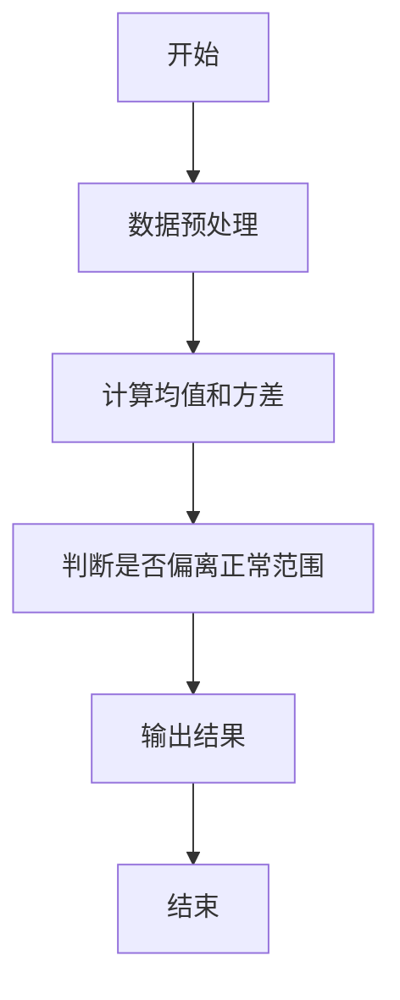
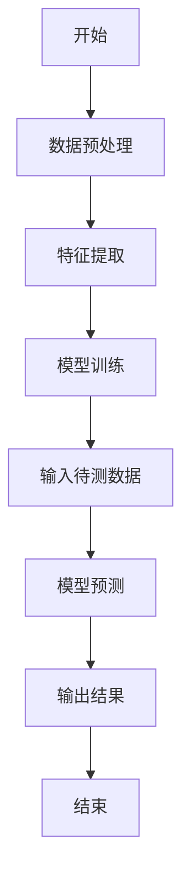
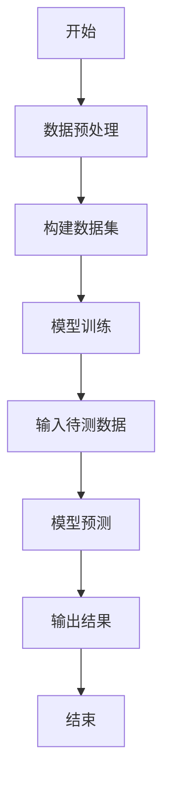
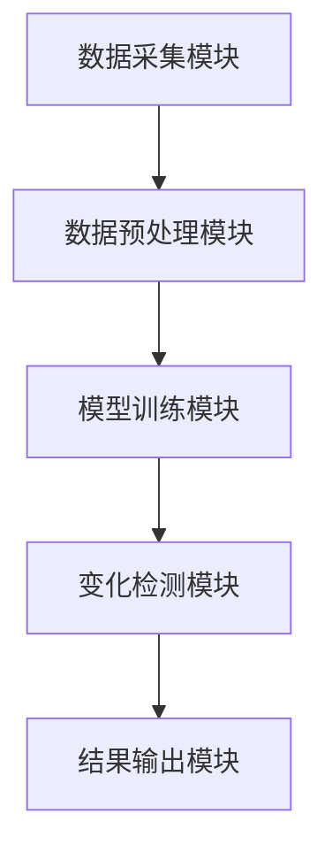
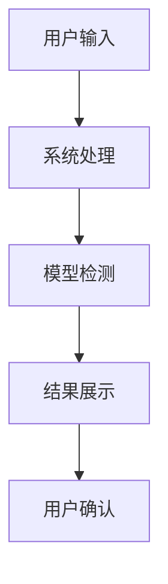

                 


# 金融市场微观结构变化检测

## 关键词：金融市场、微观结构、变化检测、统计方法、机器学习、深度学习

## 摘要：  
金融市场微观结构变化检测是金融数据分析领域的重要研究方向，旨在通过分析市场微观结构的动态变化，识别潜在的市场风险和异常行为。本文从金融市场的基本概念出发，详细探讨了微观结构变化检测的核心算法、数学模型和系统设计，并结合实际案例展示了如何通过技术手段实现对金融市场微观结构变化的实时监测和预警。文章内容涵盖统计方法、机器学习和深度学习等多种技术，结合具体的金融市场场景，为读者提供了全面的理论和实践指导。

---

# 第1章: 金融市场微观结构概述

## 1.1 金融市场微观结构的基本概念

### 1.1.1 金融市场的定义与分类  
金融市场是指以金融资产为交易对象，通过市场机制配置资金资源的场所。根据交易场所的不同，金融市场可以分为场内市场和场外市场；根据交易方式的不同，可以分为现货市场、期货市场和期权市场。微观结构则关注市场的基本组成单元，包括市场参与者、交易规则和信息流动机制。

### 1.1.2 微观结构的定义与特征  
微观结构是指金融市场中最小的、最基本的组成部分及其相互作用的方式。其核心特征包括：  
1. **市场参与者**：包括投资者、交易员、做市商和经纪商等。  
2. **交易规则**：包括订单匹配规则、价格优先规则和时间优先规则等。  
3. **信息流动**：包括市场信息的生成、传播和接收过程。  

### 1.1.3 变化检测的定义与意义  
变化检测是指通过分析市场微观结构的动态变化，识别出与正常状态不同的异常事件。其意义在于：  
1. **风险管理**：及时发现市场操纵、闪崩等异常行为，降低市场风险。  
2. **交易机会**：通过识别市场状态的变化，捕捉交易机会。  
3. **市场监控**：帮助监管机构维护市场公平性和透明性。  

---

## 1.2 金融市场微观结构的核心要素

### 1.2.1 市场参与者分析  
市场参与者的行为直接影响市场微观结构的变化。例如，高频交易者通过算法交易快速买卖资产，可能引发市场的短期波动。  

### 1.2.2 市场交易机制分析  
交易机制包括订单簿、撮合规则和市场深度等。订单簿记录了所有未成交的买入和卖出订单，市场深度反映了市场参与者对某种资产的需求强度。  

### 1.2.3 市场信息流动分析  
信息流动是市场微观结构的重要组成部分。市场参与者通过信息流做出交易决策，而异常信息流可能引发市场的剧烈波动。  

---

## 1.3 微观结构变化检测的背景与应用

### 1.3.1 金融市场风险控制的需求  
随着金融市场的复杂化，市场参与者的行为变得更加多样化，市场风险也在不断增加。通过检测微观结构的变化，可以更好地识别和控制风险。  

### 1.3.2 微观结构变化检测的现实意义  
在高频交易和算法交易日益普及的背景下，市场微观结构的变化往往预示着市场的潜在风险。例如，订单簿的异常变化可能预示着市场操纵或闪崩事件的发生。  

### 1.3.3 典型应用场景分析  
1. **高频交易监控**：实时检测市场微观结构的变化，帮助交易者做出快速决策。  
2. **市场风险预警**：通过分析市场微观结构的变化，提前预警潜在的市场风险。  
3. **监管合规**：帮助监管机构识别市场操纵、欺诈行为等违规行为。  

---

## 1.4 本章小结  
本章介绍了金融市场的基本概念和微观结构的核心要素，重点探讨了微观结构变化检测的定义、意义和应用场景。通过理解这些内容，读者可以更好地把握后续算法和技术的核心逻辑。

---

# 第2章: 金融市场微观结构变化检测的核心概念与理论基础

## 2.1 微观结构变化检测的核心概念

### 2.1.1 市场微观结构的动态特征  
市场微观结构的变化往往体现在订单簿的状态变化、交易量的突变和价格的异常波动等方面。  

### 2.1.2 变化检测的定义与分类  
变化检测是指通过分析数据序列的变化，识别出与正常状态不同的异常事件。根据检测方法的不同，可以将变化检测分为基于统计的方法、基于机器学习的方法和基于深度学习的方法。  

### 2.1.3 检测方法的优劣势对比  
| 方法类型         | 优势                     | 劣势                     |
|------------------|--------------------------|--------------------------|
| 基于统计         | 实现简单，计算高效       | 模型表达能力有限         |
| 基于机器学习     | 表达能力强，适合复杂场景 | 需要大量数据和计算资源   |
| 基于深度学习     | 能够捕捉复杂模式         | 实现复杂，计算成本高     |

---

## 2.2 微观结构变化的数学模型

### 2.2.1 时间序列模型  
时间序列模型广泛应用于金融数据分析中。以下是一些常用的时间序列模型：  
1. **ARIMA模型**：通过自回归和滑动平均的组合，预测未来的市场状态。  
2. **GARCH模型**：用于建模金融资产的 volatility（波动性），捕捉市场的短期波动。  

### 2.2.2 统计分布模型  
假设市场微观结构的变化服从某种概率分布，可以通过统计检验的方法检测异常事件。例如，假设订单簿的深度服从正态分布，当实际值偏离均值超过一定范围时，可以认为市场微观结构发生了变化。  

### 2.2.3 图论模型  
通过图论方法分析市场微观结构的变化，例如构建市场参与者之间的关系网络，识别网络结构的变化。  

---

## 2.3 微观结构变化检测的理论框架

### 2.3.1 基于统计的理论框架  
基于统计的方法通过设定显著性水平，利用统计检验的方法检测市场微观结构的变化。例如，使用卡方检验检测订单簿深度的分布是否发生显著变化。  

### 2.3.2 基于机器学习的理论框架  
基于机器学习的方法通过训练分类器，识别市场微观结构的正常状态和异常状态。例如，使用支持向量机（SVM）或随机森林（Random Forest）对订单簿状态进行分类。  

### 2.3.3 综合分析框架  
综合分析框架结合统计方法和机器学习方法，利用多种特征和模型共同分析市场微观结构的变化。例如，结合订单簿的深度和价格波动，使用集成学习方法进行综合判断。  

---

## 2.4 本章小结  
本章详细探讨了微观结构变化检测的核心概念和理论基础，包括变化检测的定义、分类以及数学模型的选择。通过这些内容，读者可以理解后续算法设计的理论依据。

---

# 第3章: 金融市场微观结构变化检测的算法原理

## 3.1 统计方法

### 3.1.1 基于均值-方差的异常检测  
均值-方差方法通过计算数据的均值和方差，判断当前数据是否偏离正常范围。例如，订单簿的深度均值为100，标准差为20，当实际深度为50时，认为发生了异常变化。  

### 3.1.2 基于马尔可夫链的状态转移检测  
马尔可夫链模型通过分析市场状态的转移概率，判断当前状态是否偏离正常状态。例如，市场状态包括“平静”、“波动”和“剧烈波动”，通过计算状态转移概率，识别异常状态。  

### 3.1.3 基于经验分布的拟合优度检验  
通过比较实际数据分布与经验分布的拟合优度，判断数据是否发生显著变化。例如，使用 Kolmogorov-Smirnov 检验判断订单簿深度是否服从某种分布。  

---

## 3.2 机器学习方法

### 3.2.1 基于聚类分析的变化检测  
聚类分析通过将市场微观结构的状态聚类，识别异常状态。例如，将订单簿深度聚类为几个类别，当当前深度偏离主要类别时，认为发生了变化。  

### 3.2.2 基于分类算法的变化检测  
分类算法通过训练市场状态的分类模型，识别当前状态是否为异常。例如，使用逻辑回归模型对订单簿深度进行分类，判断是否发生异常变化。  

### 3.2.3 基于深度学习的序列建模  
深度学习方法通过构建循环神经网络（RNN），捕捉市场微观结构的动态变化。例如，使用 LSTM 网络对订单簿深度的时间序列进行建模，预测未来的变化趋势。  

---

## 3.3 深度学习方法

### 3.3.1 基于 RNN 的序列建模  
RNN 通过处理时间序列数据，捕捉市场的短期记忆和长期依赖关系。例如，使用 RNN 模型分析订单簿深度的变化趋势，识别异常事件。  

### 3.3.2 基于 LSTM 的时序预测  
LSTM 是一种特殊的 RNN，能够有效捕捉时间序列中的长期依赖关系。例如，使用 LSTM 模型预测订单簿深度的未来值，识别潜在的变化点。  

### 3.3.3 基于 Transformer 的注意力机制  
Transformer 模型通过注意力机制捕捉时间序列中的全局依赖关系，提升模型的表达能力。例如，使用 Transformer 模型分析订单簿深度的全局变化趋势。  

---

## 3.4 算法流程图

### 3.4.1 统计方法流程图  


### 3.4.2 机器学习方法流程图  


### 3.4.3 深度学习方法流程图  


---

## 3.5 本章小结  
本章详细介绍了金融市场微观结构变化检测的主要算法，包括统计方法、机器学习方法和深度学习方法。通过这些算法的实现，可以有效识别市场微观结构的变化。

---

# 第4章: 金融市场微观结构变化检测的数学模型与公式

## 4.1 时间序列模型

### 4.1.1 ARIMA模型  
ARIMA（AutoRegressive Integrated Moving Average）模型用于分析时间序列数据。其数学表达式为：  
$$ ARIMA(p, d, q) $$  
其中，$p$ 是自回归阶数，$d$ 是差分阶数，$q$ 是滑动平均阶数。  

### 4.1.2 GARCH模型  
GARCH（Generalized Autoregressive Conditional Heteroskedasticity）模型用于建模金融资产的 volatility。其数学表达式为：  
$$ GARCH(p, q) $$  
其中，$p$ 是自回归阶数，$q$ 是滑动平均阶数。  

### 4.1.3 顺序概率模型  
顺序概率模型用于分析市场状态的转移概率。其数学表达式为：  
$$ P(s_t = i | s_{t-1} = j) $$  
其中，$s_t$ 表示第 $t$ 时刻的市场状态，$i$ 和 $j$ 表示不同的状态。  

---

## 4.2 统计分布模型

### 4.2.1 正态分布模型  
正态分布模型用于描述市场微观结构的正常状态。其概率密度函数为：  
$$ f(x) = \frac{1}{\sqrt{2\pi\sigma^2}} e^{-\frac{(x-\mu)^2}{2\sigma^2}} $$  
其中，$\mu$ 是均值，$\sigma^2$ 是方差。  

### 4.2.2 t 分布模型  
t 分布模型用于描述具有 fat-tail 的市场微观结构变化。其概率密度函数为：  
$$ f(x) = \frac{\Gamma(\frac{\nu+1}{2})}{\sqrt{\nu\pi} \Gamma(\frac{\nu}{2})} \left(1 + \frac{(x-\mu)^2}{\nu\sigma^2}\right)^{-\frac{\nu+1}{2}} $$  
其中，$\nu$ 是自由度。  

---

## 4.3 图论模型

### 4.3.1 网络结构模型  
网络结构模型用于分析市场参与者之间的关系。例如，构建市场参与者的关系网络，分析网络的度数分布和聚类系数。  

### 4.3.2 网络流模型  
网络流模型用于分析市场信息流动的方向和强度。例如，通过网络流模型识别信息流动的关键节点。  

---

## 4.4 本章小结  
本章详细介绍了金融市场微观结构变化检测的数学模型，包括时间序列模型、统计分布模型和图论模型。这些模型为后续算法设计提供了理论支持。

---

# 第5章: 金融市场微观结构变化检测的系统设计

## 5.1 系统架构设计

### 5.1.1 系统功能模块  
系统功能模块包括数据采集、数据预处理、模型训练、变化检测和结果输出。  

### 5.1.2 系统架构图  


### 5.1.3 系统实现步骤  
1. 数据采集：从交易所 API 获取订单簿数据。  
2. 数据预处理：清洗数据，提取特征。  
3. 模型训练：训练变化检测模型。  
4. 变化检测：输入实时数据，输出检测结果。  
5. 结果输出：显示检测结果，触发预警机制。  

---

## 5.2 接口设计

### 5.2.1 数据接口  
数据接口用于与交易所系统对接，获取订单簿数据。接口协议包括 REST API 和 WebSocket。  

### 5.2.2 模型接口  
模型接口用于与变化检测模型交互，接收输入数据，输出检测结果。  

---

## 5.3 交互设计

### 5.3.1 用户界面  
用户界面包括数据可视化界面和结果展示界面。  

### 5.3.2 交互流程图  


---

## 5.4 本章小结  
本章详细探讨了金融市场微观结构变化检测系统的架构设计、接口设计和交互设计，为后续的系统实现提供了指导。

---

# 第6章: 金融市场微观结构变化检测的项目实战

## 6.1 环境安装

### 6.1.1 系统要求  
- 操作系统：Linux/Windows/MacOS  
- Python 版本：3.6+  
- 依赖库：numpy、pandas、scikit-learn、tensorflow  

### 6.1.2 安装步骤  
```bash
pip install numpy pandas scikit-learn tensorflow
```

---

## 6.2 系统核心实现

### 6.2.1 数据采集模块  
```python
import requests

def get_order_book(symbol):
    endpoint = f"https://api.example.com/order_book/{symbol}"
    response = requests.get(endpoint)
    return response.json()
```

### 6.2.2 数据预处理模块  
```python
import pandas as pd

def preprocess_data(data):
    df = pd.DataFrame(data)
    df['timestamp'] = pd.to_datetime(df['timestamp'])
    return df.set_index('timestamp')
```

### 6.2.3 模型训练模块  
```python
from sklearn.ensemble import RandomForestClassifier

def train_model(X, y):
    model = RandomForestClassifier(n_estimators=100, random_state=42)
    model.fit(X, y)
    return model
```

### 6.2.4 变化检测模块  
```python
def detect_anomaly(model, X):
    prediction = model.predict(X)
    return prediction
```

---

## 6.3 代码应用解读与分析

### 6.3.1 数据采集模块解读  
数据采集模块通过 API 获取订单簿数据，数据格式为 JSON。  

### 6.3.2 数据预处理模块解读  
数据预处理模块将原始数据转换为时间序列格式，便于后续分析。  

### 6.3.3 模型训练模块解读  
模型训练模块使用随机森林分类器对市场状态进行分类，训练完成后可以对新数据进行预测。  

### 6.3.4 变化检测模块解读  
变化检测模块接收预处理后的数据，使用训练好的模型进行预测，输出检测结果。  

---

## 6.4 实际案例分析

### 6.4.1 案例背景  
假设我们希望检测某股票的订单簿深度是否发生异常变化。  

### 6.4.2 数据获取与处理  
```python
data = get_order_book("AAPL")
df = preprocess_data(data)
```

### 6.4.3 模型训练与预测  
```python
X = df[['bid_depth', 'ask_depth', 'spread']]
y = df['state']  # 0: 正常状态，1: 异常状态
model = train_model(X, y)
prediction = model.predict(X)
```

### 6.4.4 结果分析  
预测结果为 0 表示正常状态，预测结果为 1 表示异常状态。通过分析预测结果，可以识别订单簿深度的异常变化。  

---

## 6.5 项目小结  
本章通过实际案例展示了如何实现金融市场微观结构变化检测系统，从数据采集到模型训练，再到变化检测，为读者提供了完整的实现流程。

---

# 第7章: 总结与展望

## 7.1 总结  
本文从金融市场的微观结构出发，详细探讨了变化检测的核心算法、数学模型和系统设计。通过理论分析和实际案例，展示了如何利用技术手段实现对金融市场微观结构变化的实时监测和预警。

## 7.2 最佳实践 tips  
1. 在实际应用中，建议结合多种方法进行变化检测，提高检测的准确性和鲁棒性。  
2. 数据预处理是关键步骤，建议对数据进行严格的清洗和特征提取。  
3. 模型选择应根据具体场景和数据特点进行，避免盲目使用复杂的模型。  

## 7.3 注意事项  
1. 数据隐私和安全问题需要注意，尤其是在处理金融市场数据时。  
2. 模型的实时性和计算效率是实际应用中的重要考量因素。  

## 7.4 拓展阅读  
1. 《Financial Market Microstructure: Theory and Practice》  
2. 《Deep Learning for Time Series Forecasting》  
3. 《Python机器学习实战》  

---

# 作者：AI天才研究院/AI Genius Institute & 禅与计算机程序设计艺术 /Zen And The Art of Computer Programming

