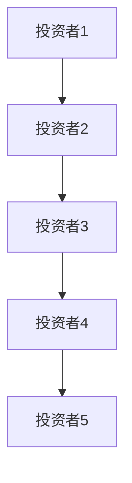
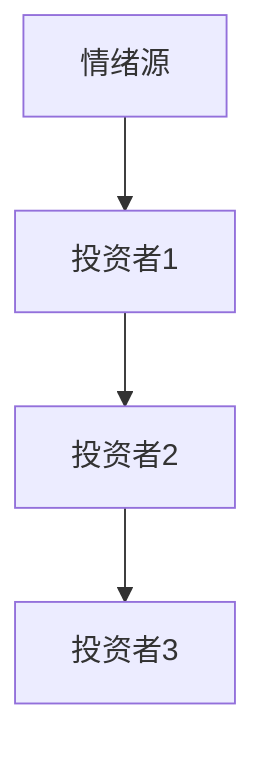
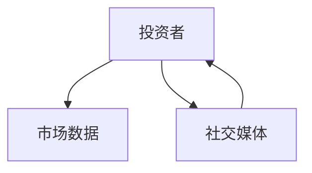

                 


# 金融市场情绪传染效应模拟与控制系统

## 关键词：金融市场、情绪传染、网络理论、系统动力学、风险管理、投资者行为

## 摘要

金融市场中的情绪传染效应是一个复杂但重要的现象，它不仅影响个体投资者的决策，还可能引发系统性风险。本文从情绪传染效应的背景出发，结合行为金融学、社会网络理论和系统动力学，系统地分析了情绪传染的机制、算法模型和系统架构。通过实际案例分析和项目实战，展示了如何利用技术手段模拟和控制情绪传染效应，从而实现有效的风险管理。

---

# 第1章: 金融市场情绪传染效应概述

## 1.1 情绪传染效应的定义与背景

### 1.1.1 金融市场中的情绪现象

金融市场中的投资者情绪波动是一个普遍现象。投资者的情绪不仅受市场走势的影响，还受到周围投资者行为的影响。例如，当市场出现恐慌性抛售时，投资者的情绪会迅速传染，导致市场崩盘。

### 1.1.2 情绪传染效应的定义

情绪传染效应是指投资者的情绪在市场中通过信息传播、社交网络等方式，影响其他投资者的行为和决策的现象。这种效应可以放大市场的波动，导致系统性风险。

### 1.1.3 情绪传染效应的研究意义

研究情绪传染效应有助于我们理解市场波动的内在机制，从而制定有效的风险管理策略。通过对情绪传染效应的模拟和控制，可以减少市场波动，维护金融系统的稳定性。

## 1.2 情绪传染效应的核心概念

### 1.2.1 情绪传染的机制

情绪传染的机制包括信息传播、社会影响和从众行为。投资者通过交流和社交媒体获取信息，从而影响自己的情绪和决策。

### 1.2.2 情绪传染的传播路径

情绪传染的传播路径可以是直接的，如面对面交流，也可以是间接的，如通过媒体传播。传播路径的不同会影响情绪传染的速度和范围。

### 1.2.3 情绪传染的边界与外延

情绪传染的边界包括时间和空间维度。在时间上，情绪传染可能在短时间内迅速扩散，也可能在长时间内逐渐消退。在空间上，情绪传染可能局限于某个市场，也可能影响全球市场。

## 1.3 情绪传染效应的理论基础

### 1.3.1 行为金融学基础

行为金融学研究投资者的心理和行为对市场的影响。研究表明，投资者的情绪波动会导致非理性决策，从而影响市场走势。

### 1.3.2 社会网络理论基础

社会网络理论认为，情绪的传播依赖于社交网络的结构。在网络中，关键节点（如意见领袖）的情绪会影响整个网络的情绪氛围。

### 1.3.3 系统动力学基础

系统动力学研究复杂系统的动态变化。情绪传染效应可以看作是一个复杂系统，其中各个节点通过相互作用影响整体系统的状态。

## 1.4 本章小结

本章从背景、定义和理论基础三个方面介绍了情绪传染效应。情绪传染效应是一个复杂的现象，涉及行为金融学、社会网络理论和系统动力学等多个领域。理解情绪传染效应的机制和传播路径，有助于我们制定有效的风险管理策略。

---

# 第2章: 情绪传染效应的核心要素分析

## 2.1 情绪传染的网络结构

### 2.1.1 情绪传染的网络模型

情绪传染的网络模型可以采用复杂网络模型，如无标度网络模型。在无标度网络中，少数节点（意见领袖）具有较高的影响力，能够迅速传播情绪。

### 2.1.2 情绪传染的网络属性

网络属性包括节点度数、中心性、网络密度等。节点度数高的节点具有更强的影响力，中心性高的节点能够快速传播信息。

### 2.1.3 情绪传染的网络特征

情绪传染的网络特征包括小世界特性（节点之间的距离较短）和无标度特性（少数节点具有高影响力）。

### 2.1.4 情绪传染的网络关系图



### 2.1.5 情绪传染的信息传播流程图



---

## 2.2 情绪传染的信息传播机制

### 2.2.1 信息传播的定义与特征

信息传播是指信息在市场中的扩散过程。信息传播的特征包括扩散速度、影响范围和传播路径。

### 2.2.2 情绪传染的信息传播模型

情绪传染的信息传播模型可以采用SIR模型（易感-感染-恢复模型）。在SIR模型中，投资者分为易感者（未受影响）、感染者（受影响）和恢复者（不再受感染）。

### 2.2.3 情绪传染的信息传播路径

信息传播路径可以是直接的（面对面交流）或间接的（通过媒体传播）。不同传播路径会影响情绪传染的速度和范围。

---

## 2.3 情绪传染的投资者行为分析

### 2.3.1 投资者情绪的形成机制

投资者情绪的形成机制包括外部信息的影响和内部情绪的积累。外部信息如新闻报道、社交媒体上的讨论会影响投资者的情绪。

### 2.3.2 投资者行为的差异性

投资者行为的差异性体现在风险偏好、信息处理能力和情绪稳定性等方面。不同投资者在情绪传染中的角色和行为表现不同。

### 2.3.3 情绪传染对投资者决策的影响

情绪传染会影响投资者的决策，导致非理性投资行为，如恐慌性抛售或盲目跟风。

---

## 2.4 情绪传染效应的实体关系图

### 2.4.1 ER实体关系图

```mermaid
erd
entity 投资者 {
    投资者ID
    情绪状态
    情绪强度
}
entity 市场数据 {
    市场ID
    市场指数
    交易量
}
```

### 2.4.2 情绪传染的网络关系图



---

## 2.5 本章小结

本章分析了情绪传染的核心要素，包括网络结构、信息传播机制和投资者行为。通过ER图和网络关系图，展示了情绪传染的实体关系和传播过程。理解这些核心要素有助于我们建立情绪传染的模型。

---

接下来的章节将深入探讨情绪传染的算法原理、系统架构设计和项目实战。通过理论分析和实际案例，我们将展示如何模拟和控制情绪传染效应，从而实现有效的风险管理。

--- 

# 作者

作者：AI天才研究院/AI Genius Institute & 禅与计算机程序设计艺术 /Zen And The Art of Computer Programming

