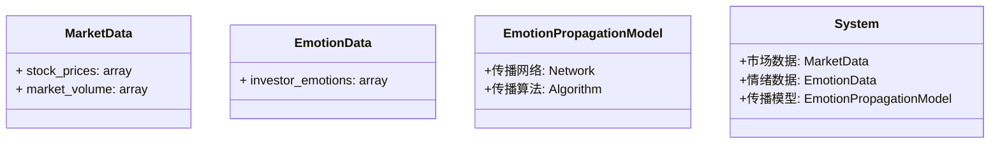
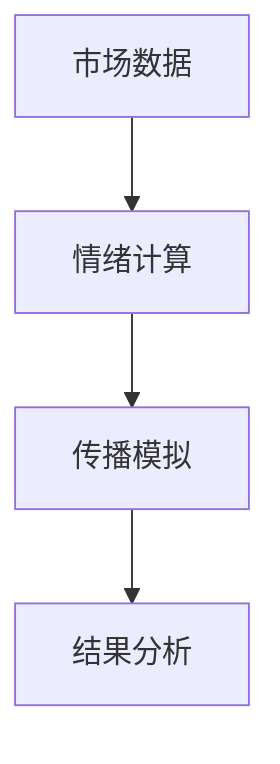
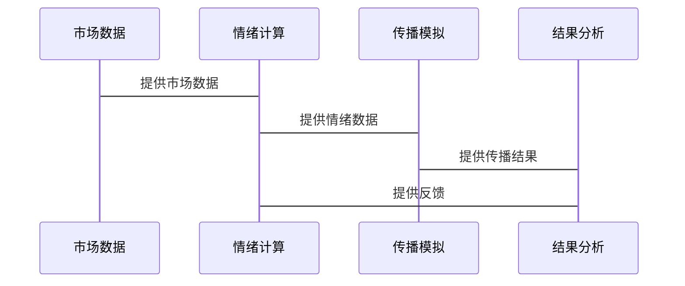

                 


# 金融市场情绪传染效应模拟系统

> 关键词：金融市场，情绪传染效应，系统模拟，算法模型，网络分析，投资决策

> 摘要：金融市场中的情绪传染效应是指投资者情绪在市场中的传播及其对市场价格波动的影响。本文旨在介绍一种金融市场情绪传染效应的模拟系统，通过分析情绪传播的机制和建模方法，结合算法和系统架构设计，构建一个能够模拟和预测市场情绪传播的系统，为投资者和研究者提供理论支持和实践工具。

---

# 第1章: 金融市场情绪传染效应的背景与概念

## 1.1 金融市场情绪的基本概念

### 1.1.1 金融市场情绪的定义
金融市场情绪指的是投资者在市场中的心理状态，包括乐观、悲观、恐慌等情绪。这些情绪会影响投资者的决策行为，从而影响市场价格和波动。

### 1.1.2 情绪在金融市场中的作用
情绪在金融市场中起着重要作用，能够引发市场的波动。例如，投资者的乐观情绪可能导致价格上涨，而悲观情绪可能导致价格下跌。

### 1.1.3 情绪传染效应的定义与特征
情绪传染效应是指情绪在投资者之间传播的现象。其特征包括传播的快速性、非线性以及复杂性。

## 1.2 情绪传染效应的背景与重要性

### 1.2.1 金融市场波动的复杂性
金融市场波动受多种因素影响，包括经济指标、政策变化和投资者情绪等。

### 1.2.2 情绪传染在金融风险中的作用
情绪传染可能导致市场恐慌，进而引发系统性金融风险。

### 1.2.3 情绪传染效应的研究意义
研究情绪传染效应有助于理解市场波动的内在机制，为风险管理和投资决策提供支持。

## 1.3 情绪传染效应的核心要素

### 1.3.1 市场参与者的角色
市场参与者包括个人投资者、机构投资者和市场交易员等，不同参与者的情绪传播方式不同。

### 1.3.2 情绪传播的路径
情绪传播可以通过社交媒体、媒体报道和市场传闻等多种路径进行。

### 1.3.3 情绪传染的边界与外延
情绪传染有一定的边界，例如市场参与者的信息获取能力和信任程度会影响情绪传播的范围。

## 1.4 本章小结
本章介绍了金融市场情绪的基本概念、情绪传染效应的背景和重要性，以及其核心要素，为后续章节的分析奠定了基础。

---

# 第2章: 金融市场情绪传染效应的核心概念与联系

## 2.1 情绪指标的定义与分类

### 2.1.1 市场情绪指数的定义
市场情绪指数是衡量市场参与者情绪的指标，常用的是恐慌指数（VIX）等。

### 2.1.2 情绪指标的分类
情绪指标可以分为个体情绪指标和整体市场情绪指标，个体指标用于衡量单个投资者的情绪，整体指标用于衡量市场整体情绪。

### 2.1.3 常用情绪指标对比分析
对比分析不同情绪指标的特点和应用场景，例如VIX指数和投资者信心指数。

## 2.2 情绪传染机制的原理

### 2.2.1 情绪传播的网络结构
情绪传播可以通过社交网络、交易网络等渠道进行，不同网络结构会影响情绪传播的效率和范围。

### 2.2.2 情绪传染的数学模型
建立情绪传播的数学模型，如基于概率的情绪传播模型。

### 2.2.3 情绪传染的动态过程
分析情绪从一个投资者传播到另一个投资者的动态过程，包括初始情绪、传播路径和最终结果。

## 2.3 情绪传染效应的ER实体关系图

```mermaid
er
actor:
    - 市场参与者
    - 投资者
    - 金融机构
    - 市场情绪
    - 情绪传播路径
```

## 2.4 本章小结
本章分析了情绪指标的定义与分类，情绪传染机制的原理，并通过ER图展示了情绪传染效应的核心概念与联系。

---

# 第3章: 情绪传染效应的算法原理

## 3.1 情绪传播模型的建立

### 3.1.1 基于网络的情绪传播模型
建立基于社交网络的情绪传播模型，考虑投资者之间的联系和影响力。

### 3.1.2 情绪传播的数学模型
建立数学模型描述情绪传播的过程，例如基于概率的传播模型。

### 3.1.3 情绪传播的算法流程
描述情绪传播的算法流程，包括初始设置、传播过程和结果分析。

## 3.2 情绪传播算法的实现

### 3.2.1 情绪传播算法的步骤
详细描述情绪传播算法的步骤，包括数据输入、初始化、传播过程和结果输出。

### 3.2.2 基于概率的情绪传播模型
使用概率论的方法，描述情绪传播的过程。

### 3.2.3 情绪传播算法的优化
优化算法的效率和准确性，例如通过并行计算或参数调整。

## 3.3 情绪传播算法的数学模型

### 3.3.1 情绪传播的基本方程
建立情绪传播的基本方程，例如：
$$ S_{i}(t+1) = S_{i}(t) + \sum_{j} w_{ij} S_{j}(t) $$

### 3.3.2 情绪传播的概率分布
描述情绪传播的概率分布，例如：
$$ P(S_{i}(t+1) = s) = \sum_{j} w_{ij} P(S_{j}(t) = s) $$

### 3.3.3 情绪传播的网络结构模型
建立网络结构模型，例如：
$$ A = \{a_{ij}\} $$

## 3.4 本章小结
本章详细介绍了情绪传播模型的建立、算法实现和数学模型，为后续系统的构建提供了理论基础。

---

# 第4章: 情绪传染效应的系统分析与架构设计

## 4.1 系统功能需求分析

### 4.1.1 系统目标与功能模块
系统的目标是模拟情绪传播过程，功能模块包括数据采集、情绪计算、传播模拟和结果分析。

### 4.1.2 系统输入与输出
系统输入包括市场数据和情绪数据，输出包括情绪传播结果和预测报告。

### 4.1.3 系统功能设计的领域模型



## 4.2 系统架构设计

### 4.2.1 系统架构的分层设计
系统架构分为数据层、计算层和应用层，每一层负责不同的功能。

### 4.2.2 系统模块的交互流程
描述系统模块之间的交互流程，例如数据采集模块向传播模型模块提供数据。

### 4.2.3 系统架构的Mermaid图



## 4.3 系统接口设计

### 4.3.1 系统接口的定义
系统接口包括数据接口、算法接口和结果接口。

### 4.3.2 接口数据格式的规范
数据接口的格式为JSON，例如：
```json
{
    "market_data": [100, 200, 300],
    "emotion_data": [0.5, 0.3, 0.2]
}
```

### 4.3.3 接口调用的流程
描述接口调用的流程，例如数据采集模块调用数据接口获取市场数据。

## 4.4 系统交互流程设计

### 4.4.1 系统交互的Mermaid序列图



## 4.5 本章小结
本章分析了系统的功能需求，设计了系统的架构和接口，为系统的实现提供了指导。

---

# 第5章: 情绪传染效应模拟系统的项目实战

## 5.1 环境安装与配置

### 5.1.1 Python环境的安装
安装Python和必要的库，例如NumPy、Pandas、Matplotlib等。

### 5.1.2 系统依赖的安装
安装系统的依赖库，例如网络分析库和数据可视化库。

### 5.1.3 开发环境的配置
配置开发环境，例如安装Jupyter Notebook和调试工具。

## 5.2 系统核心实现

### 5.2.1 数据采集模块的实现
编写代码采集市场数据和投资者情绪数据。

### 5.2.2 情绪计算模块的实现
编写代码计算市场情绪指数。

### 5.2.3 传播模拟模块的实现
编写代码实现情绪传播模型，模拟情绪传播过程。

### 5.2.4 结果分析模块的实现
编写代码分析传播结果，生成预测报告。

## 5.3 核心代码实现

### 5.3.1 数据预处理代码
```python
import pandas as pd

# 读取数据
data = pd.read_csv('market_data.csv')

# 数据清洗
data = data.dropna()
```

### 5.3.2 情绪传播算法代码
```python
def emotion_propagation(network, initial_emotions, max_steps=100):
    emotions = initial_emotions.copy()
    for step in range(max_steps):
        new_emotions = emotions.copy()
        for i in range(len(network)):
            for j in range(len(network[i])):
                if network[i][j] > 0:
                    new_emotions[i] += network[i][j] * emotions[j]
        emotions = new_emotions
    return emotions
```

### 5.3.3 结果分析代码
```python
import matplotlib.pyplot as plt

# 绘制情绪传播结果
plt.plot(emotions, label='Emotion Propagation')
plt.xlabel('Time Step')
plt.ylabel('Emotion Intensity')
plt.legend()
plt.show()
```

## 5.4 实际案例分析

### 5.4.1 案例背景
分析某次金融危机中情绪传播的影响。

### 5.4.2 案例数据
使用实际市场数据和情绪数据进行分析。

### 5.4.3 案例结果
展示情绪传播的结果和预测报告。

## 5.5 项目小结
本章通过实际案例分析，验证了系统的有效性和实用性，为后续优化提供了依据。

---

# 第6章: 情绪传染效应模拟系统的最佳实践与注意事项

## 6.1 最佳实践 tips

### 6.1.1 数据质量的重要性
确保数据的准确性和完整性，选择可靠的市场数据源。

### 6.1.2 模型调优的技巧
通过参数调整和模型优化，提高系统的预测精度。

### 6.1.3 系统的可扩展性
设计模块化的系统架构，方便后续的功能扩展和性能优化。

## 6.2 注意事项

### 6.2.1 数据隐私问题
注意保护投资者的隐私信息，遵守相关法律法规。

### 6.2.2 情绪传播的非线性
情绪传播具有非线性特征，模型需要考虑复杂性。

### 6.2.3 模型的局限性
情绪传播模型具有一定的局限性，需结合其他因素进行综合分析。

## 6.3 拓展阅读

### 6.3.1 相关学术文献
推荐几篇关于情绪传播的学术论文，例如《金融市场情绪传播的网络分析》。

### 6.3.2 推荐书籍
推荐几本关于金融市场和情绪传播的书籍，例如《金融市场中的行为经济学》。

## 6.4 本章小结
本章总结了系统的最佳实践和注意事项，为读者提供了实用的建议和拓展资源。

---

# 作者：AI天才研究院/AI Genius Institute & 禅与计算机程序设计艺术 /Zen And The Art of Computer Programming

---

通过以上目录和内容的详细规划，我将按照章节逐步撰写完整的文章，确保每个部分都涵盖必要的理论和实践内容，帮助读者全面理解金融市场情绪传染效应模拟系统的构建与应用。

