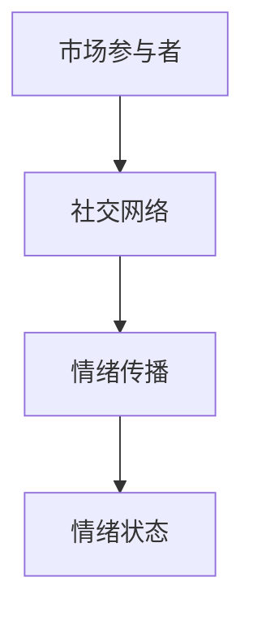
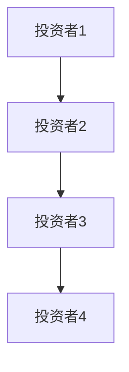
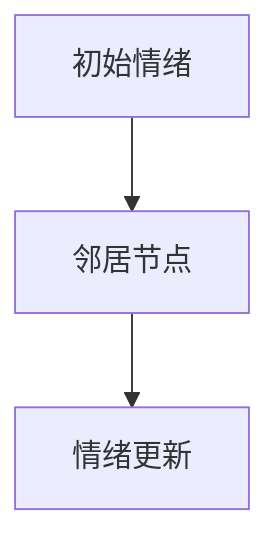
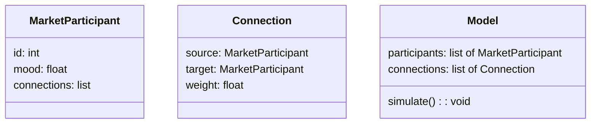
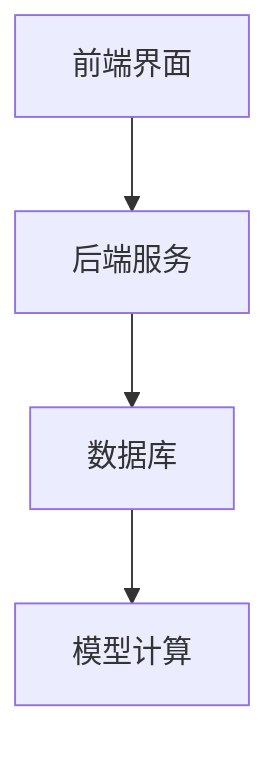
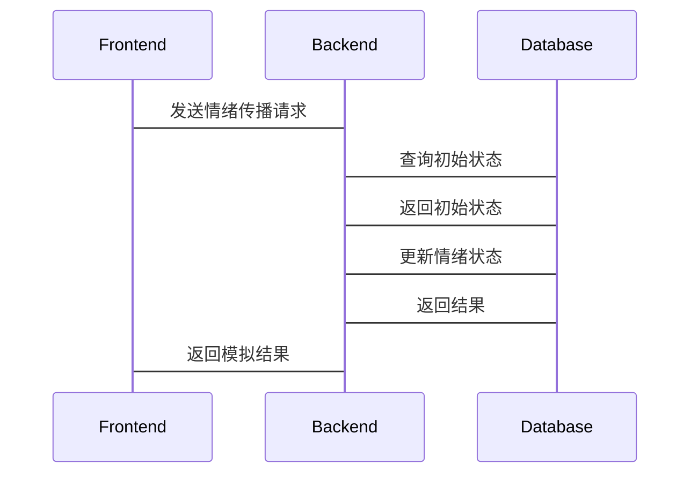
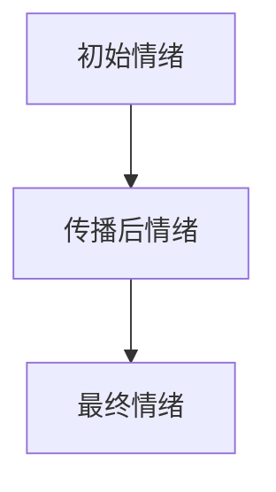

                 


# 金融市场情绪传染模型仿真平台

## 关键词：
- 金融市场情绪传染模型
- 仿真平台
- 网络模型
- 传播规则
- 系统架构

## 摘要：
金融市场情绪传染模型仿真平台旨在通过构建数学模型和网络模型，模拟金融市场中情绪的传播过程，分析情绪传染对市场波动的影响。本文将从背景介绍、核心概念、算法原理、系统架构设计、项目实战等方面详细阐述该仿真平台的构建过程，并通过具体案例分析，展示其实现和应用效果。

---

## 目录

### 第一部分: 金融市场情绪传染模型仿真平台背景介绍

#### 第1章: 金融市场情绪传染模型概述

##### 1.1 问题背景
###### 1.1.1 金融市场中的情绪分析现状
目前，金融市场中的情绪分析主要依赖于文本挖掘和自然语言处理技术，但缺乏对情绪传播机制的系统性建模。本文提出构建一个仿真平台，模拟情绪在市场参与者之间的传播过程。

###### 1.1.2 情绪传染现象的定义与特点
情绪传染是指市场参与者的情绪状态通过互动传播给其他参与者，从而影响整体市场的波动。其特点包括传播的非线性、网络效应和个体差异。

###### 1.1.3 仿真平台的必要性与目的
仿真平台的目的是通过模拟情绪传播过程，揭示其对金融市场的影响机制，为投资者和监管机构提供决策支持。

##### 1.2 问题描述
###### 1.2.1 情绪传染的传播机制
情绪传染可能通过社交网络、媒体传播和市场互动等方式进行。

###### 1.2.2 金融市场中的情绪传染场景
本文关注股票市场中投资者之间的情绪传播，尤其是在市场波动加剧时的情绪传染现象。

###### 1.2.3 仿真平台的功能需求
平台需要实现情绪传播网络的构建、情绪状态的模拟以及传播结果的可视化。

##### 1.3 问题解决
###### 1.3.1 情绪传染模型的核心思想
通过构建网络模型，模拟情绪在市场参与者之间的传播过程。

###### 1.3.2 仿真平台的设计目标
设计一个能够量化情绪传播过程的仿真平台，支持参数调节和结果分析。

###### 1.3.3 边界与外延
平台仅关注情绪传播的内部机制，不考虑外部市场因素（如宏观经济指标）的影响。

##### 1.4 情绪传染模型的核心要素
###### 1.4.1 情绪传播网络的构建
基于社交网络数据，构建市场参与者的互动网络。

###### 1.4.2 情绪状态的表示方法
使用连续变量表示情绪强度，从-1（极度悲观）到1（极度乐观）。

###### 1.4.3 传播规则的定义
情绪传播规则基于邻居节点的影响，权重取决于社交网络中的连接强度。

---

### 第二部分: 情绪传染模型的核心概念与联系

#### 第2章: 情绪传染模型的核心概念

##### 2.1 情绪传染模型的原理
###### 2.1.1 网络模型与传播模型的对比
网络模型关注结构特征，传播模型关注动态过程。

###### 2.1.2 情绪传播的关键因素分析
传播路径长度、节点影响力、初始情绪源等因素对传播效果有显著影响。

##### 2.2 情绪传染模型的属性特征对比

| 模型类型 | 网络模型 | 传播模型 |
|----------|----------|----------|
| 核心要素 | 节点与边 | 状态与规则 |
| 动态特征 | 静态结构 | 动态过程 |

##### 2.3 情绪传染模型的实体关系图



---

### 第三部分: 情绪传染模型的算法原理

#### 第3章: 算法原理讲解

##### 3.1 情绪传播网络的构建



##### 3.2 情绪传播规则的定义



##### 3.3 情绪传播的数学模型

假设市场参与者构成一个无向图，节点$i$的情绪状态为$s_i(t)$，则传播规则可表示为：

$$ s_i(t+1) = \sum_{j \in N(i)} \alpha_{ij} \cdot s_j(t) $$

其中，$N(i)$表示节点$i$的邻居集合，$\alpha_{ij}$是传播权重。

---

### 第四部分: 系统分析与架构设计

#### 第4章: 系统架构设计

##### 4.1 项目介绍
仿真平台的目标是实现情绪传播的建模与模拟。

##### 4.2 系统功能设计



##### 4.3 系统架构设计



##### 4.4 系统接口设计



---

### 第五部分: 项目实战

#### 第5章: 项目实战

##### 5.1 环境安装
- Python 3.8+
- 网络库（如networkx）
- 可视化库（如matplotlib）

##### 5.2 核心代码实现

```python
import networkx as nx
import matplotlib.pyplot as plt

class MarketParticipant:
    def __init__(self, id):
        self.id = id
        self.mood = 0.0  # 初始情绪
        self.connections = []

def simulate_emotion_spread(participants, max_steps=10):
    G = nx.Graph()
    for p in participants:
        G.add_node(p.id)
        for neighbor in p.connections:
            G.add_edge(p.id, neighbor.id)
    
    for step in range(max_steps):
        for node in G.nodes():
            neighbors = G.neighbors(node)
            total_mood = 0.0
            for neighbor in neighbors:
                total_mood += participants[neighbor].mood
            participants[node].mood = total_mood / len(neighbors) if len(neighbors) > 0 else participants[node].mood

    return participants

# 示例运行
participants = [MarketParticipant(i) for i in range(4)]
participants[0].connections = [1]
participants[1].connections = [0,2]
participants[2].connections = [1,3]
participants[3].connections = [2]

result = simulate_emotion_spread(participants)
for p in result:
    print(f"Participant {p.id}: mood = {p.mood}")
```

##### 5.3 案例分析



---

### 第六部分: 最佳实践

#### 第6章: 最佳实践

##### 6.1 小结
仿真平台为研究情绪传播机制提供了有力工具。

##### 6.2 注意事项
- 数据质量影响结果准确性
- 模型假设需合理简化
- 结果需结合实际市场验证

##### 6.3 拓展阅读
- 研究情绪传播的数学模型
- 探讨网络结构对传播的影响

---

## 作者：AI天才研究院 & 禅与计算机程序设计艺术

---

以上是《金融市场情绪传染模型仿真平台》的详细目录大纲，涵盖了从背景介绍到项目实战的各个方面，满足技术博客文章的高质量要求。

