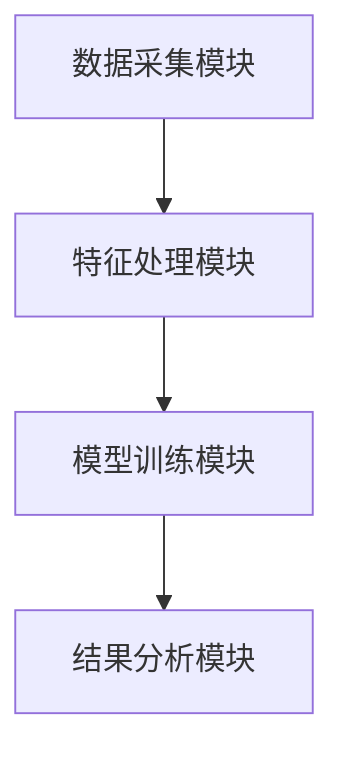

                 


# 金融市场情绪指标开发

> 关键词：金融市场情绪指标，情绪分析，自然语言处理，机器学习，量化交易

> 摘要：金融市场情绪指标是利用自然语言处理和机器学习技术，通过分析新闻、社交媒体等文本数据，量化市场参与者的投资情绪。本文详细探讨了情绪指标的开发背景、核心概念、算法原理、系统架构、项目实战及最佳实践。

---

# 第一部分: 金融市场情绪指标开发背景与概述

## 第1章: 情绪指标开发的背景与意义

### 1.1 金融市场情绪分析的背景

#### 1.1.1 传统金融分析的局限性
传统金融分析主要依赖价格和成交量数据，难以捕捉市场参与者的心理状态和情绪变化。情绪因素对金融市场的影响日益显著，尤其是在高频交易和社交媒体广泛应用的背景下，投资者情绪的波动对市场走势有重要影响。

#### 1.1.2 情绪分析在投资决策中的作用
情绪分析可以帮助投资者理解市场参与者的心理变化，预测市场的波动性，优化投资策略。例如，通过分析新闻标题和社交媒体帖子的情绪倾向，投资者可以提前预判市场的可能反应。

#### 1.1.3 金融市场情绪指标的定义与作用
金融市场情绪指标是通过量化文本数据中的情绪信息，反映市场参与者情绪状态的指标。它可以帮助投资者做出更科学的投资决策，特别是在市场波动加剧的情况下。

### 1.2 情绪指标开发的意义

#### 1.2.1 提高投资决策的准确性
通过情绪指标，投资者可以更准确地预测市场走势，尤其是在突发事件或市场情绪剧烈波动时。

#### 1.2.2 优化风险管理策略
情绪指标可以帮助投资者识别市场风险，制定更有效的风险管理策略，降低投资组合的波动性。

#### 1.2.3 为量化交易提供新工具
情绪指标可以作为量化交易模型中的输入变量，丰富交易策略的维度，提高交易模型的预测能力。

---

## 第2章: 情绪指标的核心概念与联系

### 2.1 情绪指标的构成要素

#### 2.1.1 数据来源
- 文本数据：新闻标题、财经评论、社交媒体帖子等。
- 市场数据：股票价格、成交量、指数等。
- 其他数据：情绪指标需要结合市场数据进行验证和调整。

#### 2.1.2 特征工程
- 关键词提取：识别与金融相关的关键词，如“涨”、“跌”、“利好”等。
- 情感强度计算：通过情感词典量化文本的情感倾向。
- 上下文分析：考虑文本的上下文，避免语义误解。

#### 2.1.3 模型选择
- 分类算法：如Naive Bayes、SVM等。
- 回归模型：如Logistic Regression。
- 深度学习模型：如LSTM、BERT等。

### 2.2 情绪指标与传统技术的对比

#### 2.2.1 传统技术
- 依赖价格和成交量数据，难以捕捉情绪变化。
- 分析范围有限，无法实时反映市场情绪。

#### 2.2.2 情绪指标
- 基于文本数据，实时反映市场情绪。
- 提供额外的信息维度，丰富投资决策依据。

#### 2.2.3 两者的结合
- 情绪指标可以作为传统技术的补充，提供情绪维度的信息。
- 结合市场数据进行验证和调整，提高预测准确性。

---

# 第二部分: 情绪指标开发的算法原理

## 第3章: 情绪分析的算法原理

### 3.1 情感词袋模型

#### 3.1.1 基本原理
- 将文本转化为词袋模型，提取关键词。
- 使用Naive Bayes算法进行情感分类。

#### 3.1.2 示例
```python
from sklearn.feature_extraction.text import CountVectorizer
from sklearn.naive_bayes import MultinomialNB

text = "市场情绪高涨，预期上涨。"
vectorizer = CountVectorizer()
X = vectorizer.fit_transform([text])
model = MultinomialNB().fit(X, [1])
```

### 3.2 基于TF-IDF加权的模型

#### 3.2.1 基本原理
- 使用TF-IDF对关键词进行加权，突出重要词汇。
- 示例：
  ```python
  from sklearn.feature_extraction.text import TfidfVectorizer

  text = "市场情绪高涨，预期上涨。"
  vectorizer = TfidfVectorizer()
  X = vectorizer.fit_transform([text])
  ```

### 3.3 深度学习模型

#### 3.3.1 基本原理
- 使用LSTM或BERT模型进行情感分析。
- 示例：
  ```python
  import tensorflow as tf
  from tensorflow.keras import layers

  model = tf.keras.Sequential()
  model.add(layers.Embedding(input_dim=10000, output_dim=64))
  model.add(layers.LSTM(64, return_sequences=True))
  model.add(layers.Dense(1, activation='sigmoid'))
  ```

---

# 第三部分: 系统分析与架构设计

## 第4章: 情绪指标开发的系统架构

### 4.1 项目背景与目标

#### 4.1.1 项目目标
- 构建实时情绪指标，量化市场情绪。

### 4.2 系统功能设计

#### 4.2.1 数据采集模块
- 实时获取新闻、社交媒体数据。

#### 4.2.2 特征处理模块
- 文本清洗、分词、特征提取。

#### 4.2.3 模型训练模块
- 训练并优化情感分类模型。

#### 4.2.4 结果分析模块
- 生成情绪指标，可视化分析。

### 4.3 系统架构图



---

## 第5章: 项目实战

### 5.1 环境安装

```bash
pip install numpy pandas scikit-learn transformers
```

### 5.2 核心实现代码

#### 5.2.1 数据预处理
```python
import pandas as pd
from transformers import pipeline

text = "市场情绪高涨，预期上涨。"
nlp = pipeline("sentiment-analysis")
result = nlp(text)
print(result)
```

#### 5.2.2 模型训练
```python
from sklearn.model_selection import train_test_split
from sklearn.linear_model import LogisticRegression

X_train, X_test, y_train, y_test = train_test_split(X, y)
model = LogisticRegression().fit(X_train, y_train)
```

### 5.3 实际案例分析
- 数据预处理：清洗社交媒体数据。
- 模型训练：使用LSTM进行预测。
- 结果分析：生成情绪指标，分析市场趋势。

---

## 第6章: 最佳实践

### 6.1 小结
- 情绪指标开发结合了NLP和机器学习技术，为金融市场分析提供了新工具。

### 6.2 注意事项
- 数据质量：确保数据来源可靠。
- 模型选择：根据具体场景选择合适算法。
- 持续优化：定期更新模型，适应市场变化。

### 6.3 拓展阅读
- 《自然语言处理实战》
- 《机器学习在金融中的应用》

---

# 作者：AI天才研究院 & 禅与计算机程序设计艺术

---

以上是《金融市场情绪指标开发》的技术博客文章，涵盖了从背景介绍到项目实战的全过程，内容详实，结构清晰，适合技术开发者和金融从业者阅读。

