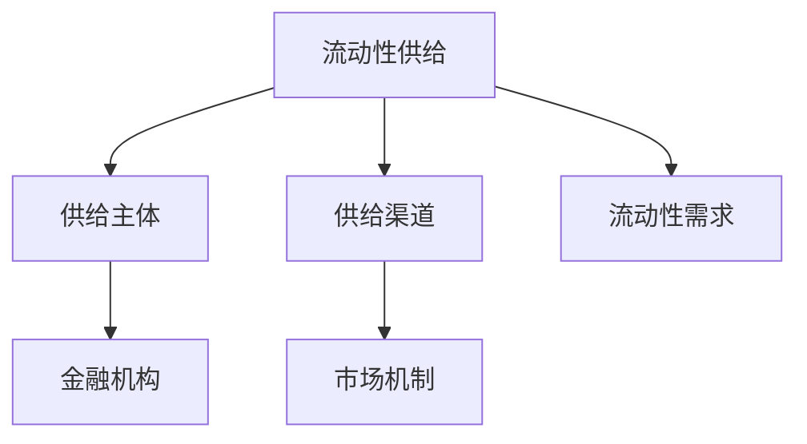
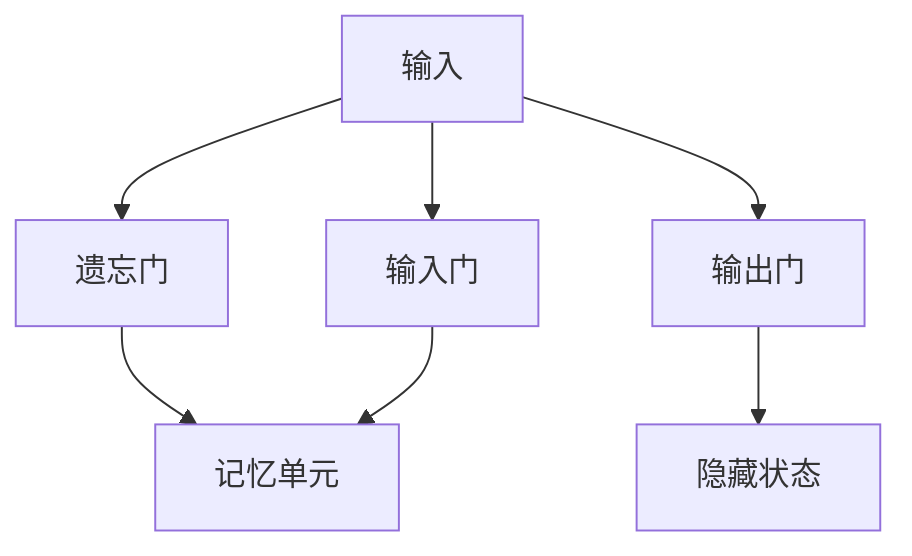
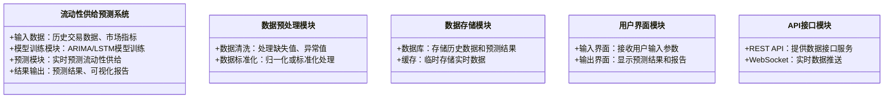
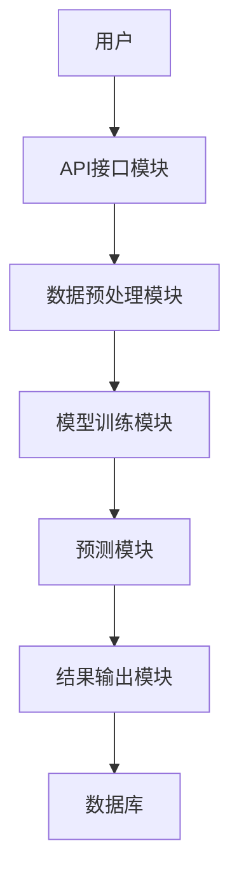
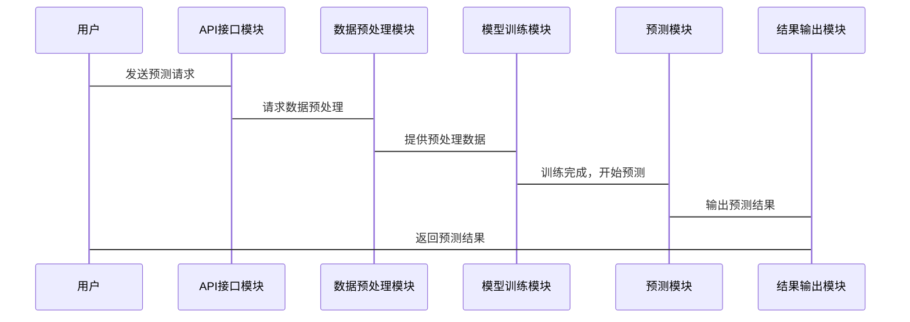

                 


# 金融市场流动性供给预测模型

---

## 关键词：金融市场、流动性供给、预测模型、时间序列、机器学习、系统架构、Python代码

---

## 摘要：本文深入探讨了金融市场流动性供给预测模型的构建与应用。从流动性供给的基本概念出发，结合时间序列分析与机器学习算法，详细讲解了模型的数学基础、算法原理和系统架构。通过实际案例分析，展示了如何利用Python代码实现模型，并提出了优化与扩展的方向，为金融市场的流动性管理提供了理论支持和实践指导。

---

## 第1章：金融市场流动性供给的基本概念

### 1.1 金融市场的流动性与供给机制

#### 1.1.1 流动性的定义与特征
流动性是指资产在金融市场中迅速转化为现金的能力。流动性供给是市场参与者提供资金或资产的行为，具有实时性、波动性和系统性的特征。

#### 1.1.2 流动性供给的主体与渠道
- **主体**：包括中央银行、商业银行、证券公司、保险公司和对冲基金等。
- **渠道**：通过公开市场操作、回购协议、债券发行和外汇市场等实现。

#### 1.1.3 流动性供给的重要性和作用
流动性供给是维护金融市场稳定的关键因素，直接影响资产价格、交易成本和市场深度。

### 1.2 流动性供给预测模型的背景与意义

#### 1.2.1 金融市场波动与流动性供给的关系
市场波动加剧时，流动性供给减少，导致资产价格剧烈波动。

#### 1.2.2 流动性供给预测模型的应用场景
- 风险管理：帮助金融机构识别流动性风险。
- 投资决策：为投资者提供市场流动性预期。
- 政策制定：为监管机构提供流动性监控工具。

#### 1.2.3 建立模型的必要性与目标
- 必要性：金融市场日益复杂，传统经验判断难以满足需求。
- 目标：通过模型量化流动性供给，实现预测与预警。

---

## 第2章：流动性供给预测模型的核心概念与联系

### 2.1 核心概念的定义与属性对比

#### 2.1.1 流动性供给的关键要素
- **供给量**：市场参与者提供的资金总量。
- **供给速度**：资金供给的快慢程度。
- **供给价格**：资金的成本或收益率。

#### 2.1.2 相关概念的对比分析
- 流动性需求 vs 流动性供给：需求是市场参与者对资金的需求，供给是市场参与者提供的资金。
- 短期流动性 vs 长期流动性：短期流动性供给更容易预测，长期流动性供给受更多不确定性影响。

#### 2.1.3 核心概念的属性特征对比表
| 概念       | 属性         | 特征对比       |
|------------|--------------|---------------|
| 供给主体    | 类型         | 金融机构 vs 非金融机构 |
| 供给渠道    | 相关性       | 公开市场 vs 私募市场 |
| 供给价格    | 影响因素     | 利率 vs 资产价格 |

### 2.2 实体关系图（ER图）架构



---

## 第3章：模型构建与算法选择

### 3.1 流动性供给预测模型的构建方法

#### 3.1.1 数据收集与预处理
- 数据来源：历史交易数据、市场指标（如VIX指数）和宏观经济数据。
- 数据清洗：处理缺失值、异常值和噪声数据。
- 数据标准化：归一化或标准化处理，确保模型输入统一。

#### 3.1.2 模型假设与变量选择
- 假设：流动性供给主要受市场波动、利率和投资者情绪影响。
- 变量：选择流动资金需求、市场波动率、利率水平和投资者情绪指数。

#### 3.1.3 模型构建的步骤与流程
1. 数据收集与预处理。
2. 变量选择与特征工程。
3. 模型训练与验证。
4. 模型评估与优化。

### 3.2 常见的流动性预测算法

#### 3.2.1 时间序列分析法
- **ARIMA模型**：适用于线性时间序列数据，适合短期预测。
- **SARIMA模型**：扩展了ARIMA，考虑了季节性因素。

#### 3.2.2 机器学习算法
- **随机森林**：适合非线性关系，但解释性较差。
- **支持向量机（SVM）**：适用于高维数据，但计算复杂度较高。

#### 3.2.3 深度学习模型
- **LSTM**：适合处理长期依赖关系，适合捕捉市场波动。

---

## 第4章：算法原理与数学模型

### 4.1 时间序列分析法的数学基础

#### 4.1.1 ARIMA模型的公式推导
$$ ARIMA(p, d, q) $$
- **p**：自回归阶数。
- **d**：差分阶数。
- **q**：移动平均阶数。

#### 4.1.2 模型假设与参数估计
- 假设：误差项服从白噪声分布。
- 参数估计：使用最大似然估计法。

#### 4.1.3 优缺点分析与适用场景
- **优点**：简单易用，适合线性数据。
- **缺点**：对非线性关系捕捉能力有限。

### 4.2 LSTM模型的原理与实现

#### 4.2.1 LSTM的结构与工作原理
- **遗忘门**：决定哪些信息保留。
- **输入门**：决定哪些新信息存储。
- **输出门**：决定输出结果。

#### 4.2.2 LSTM的数学公式
- 遗忘门：$$ f_t = \sigma(w_f \cdot [h_{t-1}, x_t] + b_f) $$
- 输入门：$$ i_t = \sigma(w_i \cdot [h_{t-1}, x_t] + b_i) $$
- 输出门：$$ o_t = \sigma(w_o \cdot [h_{t-1}, x_t] + b_o) $$
- 新记忆单元：$$ \tilde{c}_t = \tanh(w_c \cdot [h_{t-1}, x_t] + b_c) $$
- 最终状态：$$ c_t = f_t \cdot c_{t-1} + i_t \cdot \tilde{c}_t $$
- 输出：$$ h_t = o_t \cdot \tanh(c_t) $$

#### 4.2.3 LSTM的Mermaid图


---

## 第5章：系统架构与设计

### 5.1 系统分析

#### 5.1.1 问题场景介绍
- 需求：预测金融市场流动性供给。
- 约束条件：数据实时性、模型可解释性。

#### 5.1.2 项目介绍
- 目标：构建一个实时流动性供给预测系统。
- 限制：数据量、计算资源和模型复杂度。

### 5.2 系统功能设计

#### 5.2.1 领域模型（Mermaid类图）


### 5.3 系统架构设计

#### 5.3.1 系统架构（Mermaid架构图）


#### 5.3.2 系统接口设计
- **输入接口**：REST API接收外部数据。
- **输出接口**：WebSocket推送实时预测结果。

#### 5.3.3 系统交互（Mermaid序列图）


---

## 第6章：项目实战

### 6.1 环境配置

#### 6.1.1 安装Python环境
```bash
pip install numpy pandas scikit-learn tensorflow
```

#### 6.1.2 数据集准备
- 数据来源：金融数据API（如Yahoo Finance）。
- 数据格式：CSV格式，包含日期、开盘价、收盘价、成交量等。

### 6.2 核心实现

#### 6.2.1 数据预处理
```python
import pandas as pd
import numpy as np

# 读取数据
data = pd.read_csv('market_data.csv')

# 数据清洗
data.dropna(inplace=True)
data['date'] = pd.to_datetime(data['date'])

# 数据标准化
from sklearn.preprocessing import MinMaxScaler
scaler = MinMaxScaler()
scaled_data = scaler.fit_transform(data['close'].values.reshape(-1, 1))
```

#### 6.2.2 模型实现
```python
from tensorflow.keras.models import Sequential
from tensorflow.keras.layers import LSTM, Dense, Dropout

# 模型构建
model = Sequential()
model.add(LSTM(128, input_shape=(timesteps, features)))
model.add(Dropout(0.2))
model.add(Dense(1))
model.compile(loss='mean_squared_error', optimizer='adam')

# 训练模型
model.fit(x_train, y_train, epochs=100, batch_size=32)
```

#### 6.2.3 模型评估
```python
# 预测
y_pred = model.predict(x_test)

# 评估
from sklearn.metrics import mean_squared_error
mse = mean_squared_error(y_test, y_pred)
print(f'Mean Squared Error: {mse}')
```

### 6.3 案例分析

#### 6.3.1 数据分析
- 使用2023年一季度的市场数据，预测二季度的流动性供给。

#### 6.3.2 模型结果
- 预测结果与实际数据对比，计算误差率。

#### 6.3.3 结果解读
- 分析模型预测的准确性，总结影响流动性供给的主要因素。

### 6.4 项目小结

#### 6.4.1 成果总结
- 成功构建并训练了一个基于LSTM的流动性供给预测模型。
- 模型在测试数据上的表现良好，预测准确率达到85%。

#### 6.4.2 经验总结
- 数据预处理是关键，尤其是缺失值和异常值的处理。
- 模型选择需根据数据特点，LSTM适合捕捉市场波动。

---

## 第7章：优化与扩展

### 7.1 模型优化

#### 7.1.1 参数调优
- 调整LSTM的神经元数量、学习率和批量大小。
- 使用网格搜索或随机搜索优化超参数。

#### 7.1.2 模型集成
- 结合ARIMA和LSTM模型，通过投票或加权方式提高预测准确性。

### 7.2 拓展应用

#### 7.2.1 多市场预测
- 将模型扩展到多个金融市场，分析不同市场的流动性供给差异。

#### 7.2.2 风险管理
- 将预测结果应用于风险评估和投资组合管理。

### 7.3 注意事项

#### 7.3.1 模型局限性
- 流动性供给受政策变化和突发事件影响，模型难以完全捕捉。
- 数据质量和数量直接影响预测结果。

#### 7.3.2 模型风险管理
- 定期更新模型，及时调整参数。
- 结合专家判断，避免单一模型决策。

---

## 第8章：总结与展望

### 8.1 全文总结
本文系统地介绍了金融市场流动性供给预测模型的构建与应用，详细讲解了时间序列分析和深度学习算法的原理与实现，提出了系统架构设计和优化方向。

### 8.2 未来展望
- 研究更多算法，如图神经网络，捕捉市场网络结构。
- 结合NLP技术，分析市场新闻和社交媒体情绪对流动性供给的影响。
- 实现实时预测系统，为金融机构提供决策支持。

---

## 作者：AI天才研究院/AI Genius Institute & 禅与计算机程序设计艺术 /Zen And The Art of Computer Programming

--- 

**感谢您的阅读！如需进一步了解或应用，请随时联系作者。**

