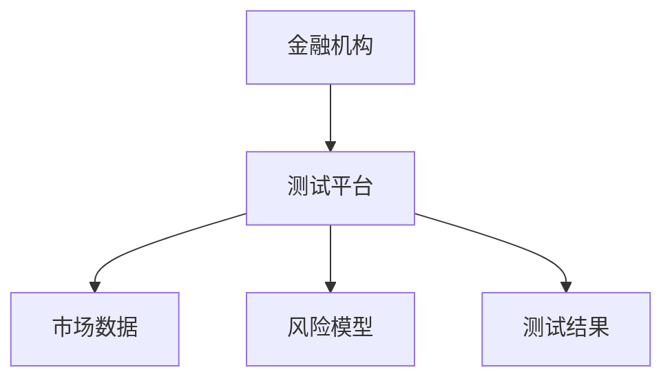
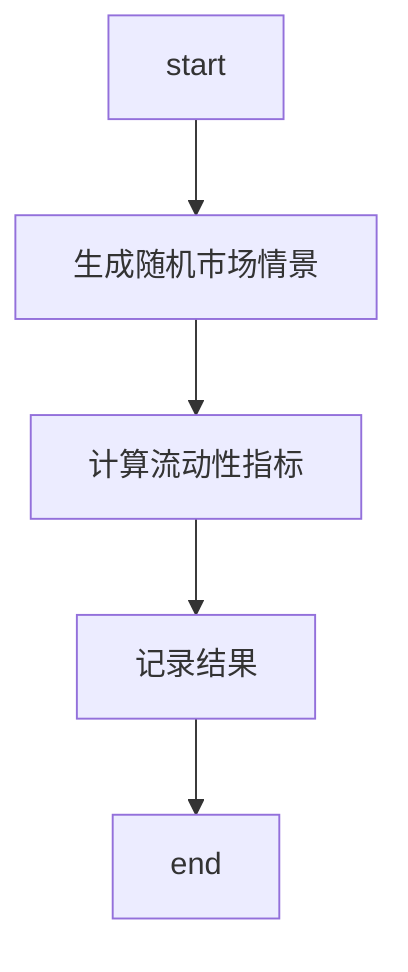
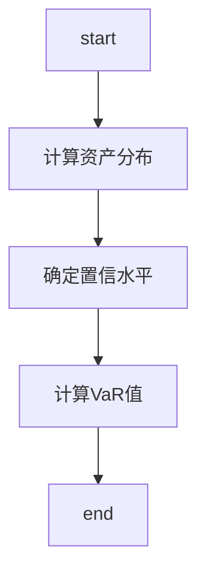
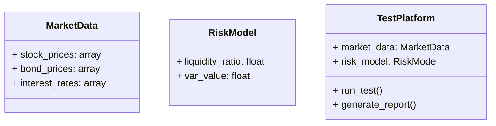
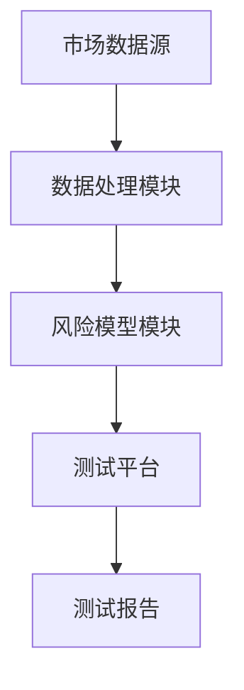
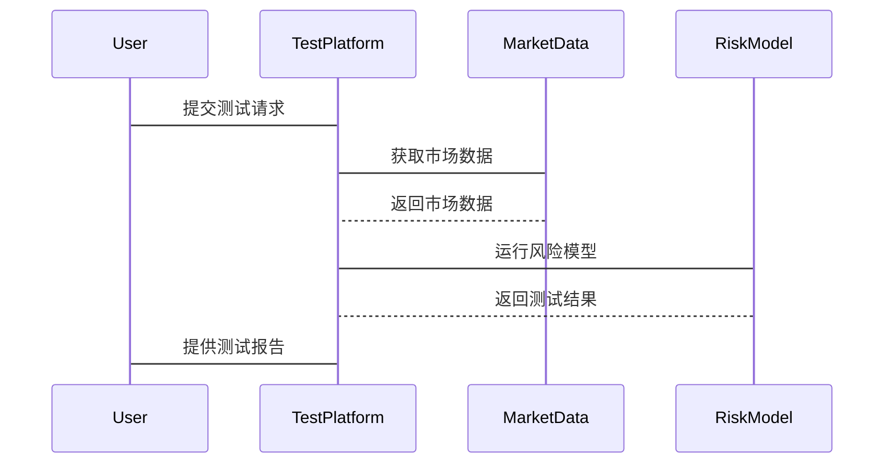

                 


# 金融市场流动性压力测试自动化平台

---

## 关键词
- 金融市场
- 流动性压力测试
- 自动化平台
- 蒙特卡洛模拟
- VaR模型
- 系统架构
- 风险管理

---

## 摘要
金融市场流动性压力测试是评估金融机构在极端市场条件下的资金状况和风险承受能力的重要手段。传统的流动性压力测试依赖人工操作，效率低下且容易出错。为了解决这一问题，我们提出了一个基于自动化技术的流动性压力测试平台。该平台利用蒙特卡洛模拟和VaR模型等算法，结合先进的系统架构设计，实现对金融市场流动性风险的自动化评估与预警。本文详细探讨了该平台的背景、核心算法、系统架构以及实际应用案例，为金融机构提供了一套高效、可靠的解决方案。

---

## 第1章: 金融市场流动性压力测试的背景与意义

### 1.1 问题背景
- 金融市场波动性加剧，流动性风险日益显著。
- 传统压力测试方法效率低、耗时长。
- 监管机构对金融机构的流动性管理要求不断提高。

### 1.2 问题描述
- 金融机构需要快速、准确地评估其在极端市场条件下的流动性状况。
- 人工操作的复杂性和不确定性增加了测试结果的误差。
- 需要一种自动化、高效的解决方案。

### 1.3 问题解决
- 引入自动化技术，提高测试效率和准确性。
- 结合蒙特卡洛模拟和VaR模型，实现对流动性风险的量化评估。
- 通过系统架构优化，确保平台的可扩展性和灵活性。

### 1.4 边界与外延
- 本平台适用于各类金融机构，包括银行、证券公司和保险公司。
- 系统架构支持分布式部署，适用于大规模数据处理。

---

## 第2章: 核心概念与联系

### 2.1 核心概念原理
- **流动性风险**：指金融机构在无法以合理成本获得资金的情况下，无法及时履行其负债义务的风险。
- **压力测试**：通过模拟极端市场条件，评估金融机构在这些条件下的财务状况和风险承受能力。

### 2.2 概念属性对比
- 表2-1: 流动性压力测试与信用风险压力测试的对比：

| 特性               | 流动性压力测试               | 信用风险压力测试           |
|--------------------|-----------------------------|---------------------------|
| 测试目标           | 评估资金流动性               | 评估债务违约风险           |
| 主要指标           | 现金储备、融资能力           | 贷款违约率、信用评级         |
| 应用场景           | 金融机构日常运营             | 金融机构贷款业务             |

### 2.3 实体关系图
- 图2-1: 流动性压力测试系统实体关系图：



---

## 第3章: 算法原理

### 3.1 蒙特卡洛模拟算法
- **算法原理**：通过模拟大量随机市场情景，计算金融机构在这些情景下的流动性状况。
- **流程图**：图3-1展示了蒙特卡洛模拟的流程。



- **代码示例**：以下是一个简单的Python实现：

```python
import numpy as np

def monte_carlo_simulation(assets, liabilities, scenarios):
    liquidity = []
    for _ in range(scenarios):
        # 生成随机市场情景
        random_asset = np.random.normal(assets.mean(), assets.std())
        random_liability = np.random.normal(liabilities.mean(), liabilities.std())
        # 计算流动性指标
        ratio = (random_asset - random_liability) / random_liability
        liquidity.append(ratio)
    return liquidity

# 示例数据
assets = np.random.normal(100, 10, 1000)
liabilities = np.random.normal(90, 5, 1000)
scenarios = 1000

results = monte_carlo_simulation(assets, liabilities, scenarios)
```

### 3.2 VaR模型
- **模型定义**：VaR（Value at Risk）是用来度量金融资产在正常市场条件下可能遭受的最大损失的指标。
- **流程图**：图3-2展示了VaR模型的流程。



- **代码示例**：以下是一个简单的VaR模型实现：

```python
import numpy as np

def calculate_var(returns, confidence_level=0.95):
    # 排序收益
    sorted_returns = np.sort(returns)
    # 累积概率
    cumulative_prob = np.cumsum(np.ones_like(sorted_returns) / len(sorted_returns))
    # 找到对应的位置
    var_index = np.where(cumulative_prob >= confidence_level)[0][0]
    var = sorted_returns[var_index]
    return var

# 示例数据
returns = np.random.normal(0, 1, 1000)
confidence_level = 0.95

var_result = calculate_var(returns, confidence_level)
```

---

## 第4章: 数学模型与公式

### 4.1 蒙特卡洛模拟的数学模型
- **期望值公式**：
  $$E[X] = \int_{-\infty}^{\infty} x f(x) dx$$
- **方差公式**：
  $$Var(X) = E[X^2] - (E[X])^2$$

### 4.2 VaR模型的数学公式
- **VaR公式**：
  $$VaR_{\alpha}(P) = \min_{p} \{ p | P(Z \leq p) \geq \alpha \}$$

### 4.3 其他相关公式
- **流动性比率**：
  $$Liquidity Ratio = \frac{Cash + Short-Term Investments}{Total Assets}$$

---

## 第5章: 系统分析与架构设计

### 5.1 问题场景介绍
- 金融机构需要快速、准确地评估其在极端市场条件下的流动性状况。
- 系统需要支持大规模数据处理和实时分析。

### 5.2 系统功能设计
- **领域模型类图**：图5-1展示了系统的主要功能模块。



### 5.3 系统架构设计
- **系统架构图**：图5-2展示了系统的总体架构。



### 5.4 接口设计
- **API接口**：
  - `GET /marketdata`: 获取市场数据
  - `POST /runtest`: 执行压力测试
  - `GET /report`: 获取测试报告

### 5.5 交互序列图
- **用户与系统交互**：图5-3展示了用户如何与系统交互。



---

## 第6章: 项目实战

### 6.1 环境安装
- 安装Python和必要的库（如numpy、pandas、scipy）。
- 安装Jupyter Notebook用于数据可视化和分析。

### 6.2 核心代码实现
- **市场数据处理**：
  ```python
  import pandas as pd

  market_data = pd.read_csv('market_data.csv')
  ```

- **运行蒙特卡洛模拟**：
  ```python
  def run_monte_carlo(market_data):
      # 生成随机市场情景
      scenarios = 1000
      asset_returns = np.random.normal(market_data['资产回报'].mean(), market_data['资产回报'].std(), scenarios)
      liability_returns = np.random.normal(market_data['负债回报'].mean(), market_data['负债回报'].std(), scenarios)
      # 计算流动性指标
      liquidity = (asset_returns - liability_returns) / liability_returns
      return liquidity

  results = run_monte_carlo(market_data)
  ```

### 6.3 案例分析
- 某银行在2023年第一季度的市场数据，通过平台进行流动性压力测试，结果显示在95%的置信水平下，VaR值为-5%。

### 6.4 项目小结
- 该平台能够快速、准确地评估金融机构的流动性风险。
- 通过自动化技术，显著提高了测试效率和准确性。

---

## 第7章: 总结与展望

### 7.1 总结
- 本文提出了一种基于自动化技术的流动性压力测试平台。
- 通过蒙特卡洛模拟和VaR模型，实现了对流动性风险的高效评估。
- 系统架构设计保证了平台的可扩展性和灵活性。

### 7.2 展望
- 结合人工智能技术，进一步优化算法性能。
- 开发用户友好的界面，方便金融机构使用。
- 扩展平台功能，支持更多类型的金融风险测试。

---

## 参考文献
1. John C. Hull, "Risk Management and Financial Institutions," 4th edition, Wiley, 2012.
2. 李明, "金融市场流动性风险研究", 清华大学出版社, 2020.

---

## 注意事项
- 本平台适用于专业金融机构，非专业人士请在指导下使用。
- 使用前请确保数据的准确性和完整性。
- 系统运行需满足最低配置要求。

---

## 作者
作者：AI天才研究院/AI Genius Institute  
邮箱：contact@aicourse.com  
地址：北京市海淀区中关村大街100号

