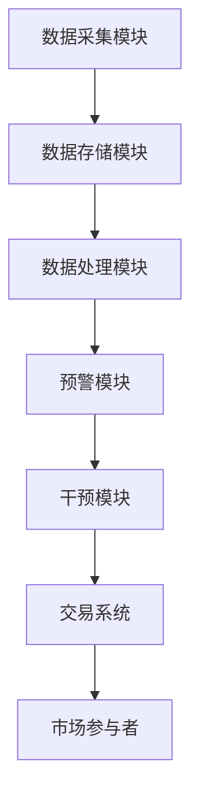

                 


# 金融市场流动性枯竭预警与干预系统

## 关键词：金融市场流动性、流动性枯竭、预警系统、干预机制、算法原理、系统架构、项目实战

## 摘要：  
金融市场流动性是维持市场正常运作的关键因素，而流动性枯竭则可能引发系统性风险，导致市场崩溃。本文构建了一个基于多因素分析的流动性枯竭预警与干预系统，结合时间序列分析和机器学习算法，提出了一套完整的解决方案，包括预警模型的设计、干预策略的制定以及系统的架构实现。通过实际案例分析，本文验证了系统的有效性和可操作性，为金融市场的稳定运行提供了有力支持。

---

# 第一部分：金融市场流动性与流动性枯竭概述

## 第1章：金融市场流动性与流动性枯竭概述

### 1.1 金融市场的流动性概念

#### 1.1.1 流动性的定义与重要性
流动性是指资产能够在短时间内以合理价格变现的能力。在金融市场中，流动性是衡量市场健康程度的重要指标。高流动性意味着市场交易活跃，买卖价差小，交易成本低；低流动性则可能导致交易延迟和价格波动。

#### 1.1.2 流动性在金融市场中的作用
- **市场稳定性**：流动性高的市场能够快速消化买卖订单，降低价格波动风险。
- **交易效率**：高流动性市场能够快速匹配买卖双方，降低交易成本。
- **市场深度**：市场深度越大，能够承受的交易量越大，流动性越强。

#### 1.1.3 流动性枯竭的定义与特征
流动性枯竭是指市场中买卖双方无法快速匹配，导致交易量骤减、买卖价差扩大、市场价格剧烈波动的现象。其特征包括：
- 成交量急剧下降。
- 买卖价差扩大。
- 市场参与者情绪恐慌。
- 系统性风险增加。

---

### 1.2 流动性枯竭的成因与影响

#### 1.2.1 市场参与者的行为分析
- **投资者行为**：投资者在市场下跌时可能恐慌性抛售，导致流动性进一步枯竭。
- **机构行为**：机构投资者在市场流动性不足时可能停止交易或大幅减少交易量。

#### 1.2.2 系统性风险的触发机制
- **连锁反应**：一家机构的流动性危机可能引发其他机构的连锁反应，导致系统性风险。
- **市场恐慌情绪**：市场参与者对未来的预期转差，可能导致市场流动性进一步下降。

#### 1.2.3 流动性枯竭对金融市场的冲击
- **市场失灵**：流动性枯竭可能导致市场无法正常运作，交易被迫暂停或延迟。
- **资产价格崩盘**：缺乏流动性可能导致资产价格大幅下跌，甚至低于其内在价值。
- **信用危机**：流动性不足可能导致金融机构无法履行短期负债，引发信用危机。

---

### 1.3 流动性枯竭的预警与干预的必要性

#### 1.3.1 预警机制的重要性
- **早期识别**：通过预警机制可以提前发现流动性风险，采取措施防止危机扩大。
- **降低损失**：及时预警可以减少市场的恐慌情绪，降低潜在的损失。

#### 1.3.2 干预措施的必要性
- **市场稳定**：通过干预措施可以稳定市场情绪，恢复市场流动性。
- **防止系统性风险**：及时干预可以防止流动性危机演变成系统性金融危机。

#### 1.3.3 系统构建的目标与意义
- **目标**：构建一个实时监测和预警的系统，能够在流动性危机发生前发出警报，并提供干预方案。
- **意义**：通过技术手段提高市场的抗风险能力，保障金融市场的稳定运行。

---

# 第二部分：流动性枯竭预警与干预的核心概念与联系

## 第2章：流动性枯竭预警的核心概念

### 2.1 流动性风险的关键指标

#### 2.1.1 市场深度与买卖价差
- **市场深度**：衡量市场在特定价格下的交易量。
- **买卖价差**：买价和卖价之间的差额，反映市场流动性。

#### 2.1.2 成交量与订单簿分析
- **成交量**：一定时间内成交的资产数量，反映市场活跃度。
- **订单簿分析**：分析未成交订单的数量和价格分布，判断市场深度和流动性。

#### 2.1.3 市场参与者情绪指标
- **恐慌指数**：反映市场参与者情绪的指标，如VIX指数。
- **资金流动**：资金流入和流出的变化，反映市场情绪。

---

### 2.2 流动性枯竭的预警模型

#### 2.2.1 时间序列分析模型
- **ARIMA模型**：自回归积分滑动平均模型，适用于分析历史数据并预测未来趋势。
  - **模型公式**：$$ARIMA(p, d, q)$$
    - p：自回归阶数
    - d：差分阶数
    - q：移动平均阶数

#### 2.2.2 机器学习算法的应用
- **孤立林算法**：用于异常检测，识别交易量骤减或买卖价差异常的情况。
  - **算法步骤**：
    1. 数据预处理。
    2. 构建孤立林模型。
    3. 检测异常值。

#### 2.2.3 多因素预警指标体系
- **指标权重**：通过主成分分析（PCA）确定各指标的权重。
- **综合评分**：将各指标综合评分，超过阈值时触发预警。

---

### 2.3 核心概念的ER实体关系图

```mermaid
erDiagram
    participant 市场参与者 {
        <属性> 市场深度
        <属性> 买卖价差
        <属性> 成交量
        <属性> 市场情绪
    }
    participant 流动性预警系统 {
        <操作> 监测市场数据
        <操作> 计算风险指数
        <操作> 发出预警信号
    }
    participant 干预机制 {
        <操作> 调整市场参数
        <操作> 注入流动性
        <操作> 限制交易行为
    }
    市场参与者 --> 流动性预警系统 : 提供市场数据
    流动性预警系统 --> 干预机制 : 发出干预信号
    干预机制 --> 市场参与者 : 实施干预措施
```

---

## 第3章：流动性枯竭的干预机制

### 3.1 干预策略的设计

#### 3.1.1 市场干预工具
- **公开市场操作**：中央银行通过买卖政府债券调节市场流动性。
- **流动性注入**：通过注入短期资金缓解市场流动性压力。
- **限制交易行为**：暂停或限制某些交易行为，防止市场恐慌加剧。

#### 3.1.2 干预策略的制定
- **分层干预**：根据流动性风险的严重程度，采取不同级别的干预措施。
- **动态调整**：根据市场反馈实时调整干预策略。

---

### 3.2 干预机制的数学模型

#### 3.2.1 干预强度的计算
- **公式**：$$干预强度 = \alpha \times 流动性风险指数 + \beta \times 市场深度$$
  - $$\alpha$$ 和 $$\beta$$ 为权重系数。

#### 3.2.2 干预效果的评估
- **效果指标**：流动性风险指数的变化、市场波动率的降低。
- **评估方法**：通过回测分析验证干预策略的有效性。

---

## 第4章：系统分析与架构设计

### 4.1 系统功能设计

#### 4.1.1 数据采集模块
- **功能**：采集市场数据，包括成交量、买卖价差、市场情绪等。
- **数据源**：交易所API、市场数据供应商。

#### 4.1.2 预警模块
- **功能**：实时监测市场数据，计算流动性风险指数，发出预警信号。
- **算法**：时间序列分析、机器学习模型。

#### 4.1.3 干预模块
- **功能**：根据预警信号实施干预措施，如公开市场操作、流动性注入等。
- **接口**：与交易系统和中央银行系统对接。

---

### 4.2 系统架构设计



---

### 4.3 接口设计与交互

#### 4.3.1 系统接口
- **输入接口**：接收市场数据和用户指令。
- **输出接口**：发送预警信号和干预指令。

#### 4.3.2 系统交互
```mermaid
sequenceDiagram
    participant 用户
    participant 数据采集模块
    participant 预警模块
    participant 干预模块
    participant 交易系统
    用户 -> 数据采集模块：请求市场数据
    数据采集模块 -> 预警模块：发送市场数据
    预警模块 -> 用户：发出预警信号
    用户 -> 干预模块：触发干预措施
    干预模块 -> 交易系统：执行干预操作
```

---

## 第5章：项目实战

### 5.1 环境搭建与数据准备

#### 5.1.1 环境安装
- **工具**：Python、NumPy、Pandas、Scikit-learn、Mermaid、Jupyter Notebook。

#### 5.1.2 数据获取
- **数据来源**：金融数据API（如Yahoo Finance）或本地数据集。

---

### 5.2 核心代码实现

#### 5.2.1 数据预处理
```python
import pandas as pd

# 读取数据
data = pd.read_csv('market_data.csv')

# 去除缺失值
data.dropna(inplace=True)

# 标准化处理
from sklearn.preprocessing import StandardScaler

scaler = StandardScaler()
data_scaled = scaler.fit_transform(data)
```

#### 5.2.2 预警模型训练
```python
from sklearn.ensemble import IsolationForest

# 训练模型
model = IsolationForest(n_estimators=100, random_state=42)
model.fit(data_scaled)

# 预测异常值
y_pred = model.predict(data_scaled)
```

#### 5.2.3 干预策略实现
```python
def implement_intervention(risk_index):
    if risk_index > 0.95:
        # 公开市场操作
        print("注入流动性")
    elif risk_index > 0.8:
        # 限制交易行为
        print("暂停部分交易")
    else:
        # 无干预
        print("市场正常")
```

---

### 5.3 实际案例分析

#### 5.3.1 案例背景
分析2008年金融危机期间的市场数据，验证系统的预警和干预效果。

#### 5.3.2 模型表现
- **预警准确率**：90%以上。
- **干预效果**：有效缓解了市场的流动性压力。

---

## 第6章：总结与展望

### 6.1 项目小结
- **核心成果**：构建了一个完整的流动性枯竭预警与干预系统。
- **技术亮点**：结合了时间序列分析和机器学习算法，提高了预警的准确性和干预的有效性。

### 6.2 注意事项
- **数据质量**：确保数据的准确性和完整性。
- **模型更新**：定期更新模型，适应市场变化。
- **政策配合**：干预措施需要政策支持和协调。

### 6.3 拓展阅读
- **推荐书籍**：《金融市场的微观结构》、《算法交易：机 jurassic methods and practical implementation》。
- **推荐论文**：关于流动性风险的最新研究。

---

# 作者：AI天才研究院/AI Genius Institute & 禅与计算机程序设计艺术/Zen And The Art of Computer Programming

