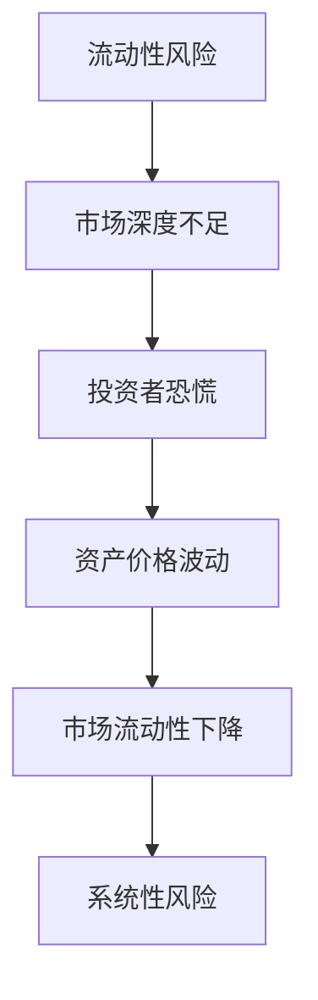

                 


# 金融市场流动性风险传导模型

> 关键词：金融市场，流动性风险，风险传导，系统性风险，量化模型

> 摘要：流动性风险是金融市场中的一个重要风险类型，其传导机制复杂且影响深远。本文通过构建流动性风险传导模型，分析了流动性风险的成因、传导路径及其对金融市场的影响。结合量化方法和系统设计，本文提出了基于多元回归分析的算法实现，并通过实际案例展示了模型的应用与验证。同时，本文还探讨了模型的局限性及未来研究方向，为金融市场的风险管理提供了理论支持和实践指导。

---

# 第1章: 流动性风险概述

## 1.1 流动性风险的基本概念

### 1.1.1 流动性风险的定义
流动性风险是指资产在一定时间内以合理价格转换为现金的能力受到限制，从而导致损失的风险。通俗来说，当市场流动性不足时，投资者可能无法以合理的价格迅速买卖资产，从而面临损失。

### 1.1.2 流动性风险的分类
流动性风险可以分为以下几类：
- **市场流动性风险**：由于市场深度不足或市场参与者的买卖行为不均衡导致的流动性风险。
- **信用流动性风险**：由于债务人或交易对手无法履行义务而导致的流动性风险。
- **融资流动性风险**：由于金融机构在资金市场上难以获得所需资金而导致的流动性风险。

### 1.1.3 流动性风险的重要性
流动性风险是金融市场中的核心风险之一。流动性不足可能导致资产价格大幅波动，进而引发系统性风险。因此，理解和管理流动性风险对于维护金融市场稳定具有重要意义。

---

## 1.2 金融市场中的流动性问题

### 1.2.1 金融市场概述
金融市场是资金流动和资产交易的场所，包括股票市场、债券市场、货币市场等。流动性是金融市场运行的基础，直接影响市场的效率和稳定性。

### 1.2.2 流动性风险的来源
流动性风险的来源主要包括：
- 市场深度不足：市场参与者少，交易量低，导致买卖价差大。
- 市场参与者行为：投资者的恐慌性抛售或集中买入行为。
- 信息不对称：市场参与者掌握的信息不一致，导致交易行为不均衡。

### 1.2.3 流动性风险的传导机制
流动性风险可以通过以下路径传导：
1. **资产价格波动**：流动性不足导致资产价格大幅波动，引发投资者恐慌。
2. **市场参与者的互动**：部分投资者的流动性需求增加，可能导致市场整体流动性下降。
3. **机构行为的影响**：金融机构的去杠杆化或资产调整行为可能加剧流动性风险。

---

## 1.3 流动性风险传导模型的背景与意义

### 1.3.1 问题背景
随着金融市场的复杂化和全球化，流动性风险的传导路径越来越复杂。例如，2008年全球金融危机就暴露了流动性风险的系统性影响。

### 1.3.2 问题描述
流动性风险的传导涉及多个市场、机构和投资者，其复杂性使得传统的风险管理方法难以应对。

### 1.3.3 问题解决的必要性
通过构建流动性风险传导模型，可以更好地理解风险的来源和传导机制，为金融机构制定有效的风险管理策略提供支持。

---

## 1.4 本章小结

本章从基本概念出发，介绍了流动性风险的定义、分类及其在金融市场中的重要性。同时，分析了流动性风险的来源和传导机制，为后续模型的构建奠定了基础。

---

# 第2章: 流动性风险传导的核心概念与联系

## 2.1 流动性风险传导的关键要素

### 2.1.1 资产流动性
资产流动性是指资产在市场中的交易活跃程度。流动性高的资产易于买卖，价格波动较小；流动性低的资产买卖困难，价格波动较大。

### 2.1.2 市场结构
市场结构包括市场的参与主体、交易规则和信息传播机制。不同的市场结构会影响流动性风险的传导路径。

### 2.1.3 投资者行为
投资者的行为是流动性风险传导的重要因素。例如，投资者的恐慌性抛售会导致市场流动性迅速下降。

---

## 2.2 流动性风险传导的路径分析

### 2.2.1 资产价格波动
流动性不足可能导致资产价格大幅波动。例如，当市场流动性下降时，资产价格可能下跌，引发更多的抛售行为。

### 2.2.2 市场参与者的互动
市场参与者的买卖行为相互影响，可能导致流动性风险的放大。例如，部分投资者的大量卖出行为可能引发市场的流动性危机。

### 2.2.3 机构行为的影响
金融机构的去杠杆化或资产调整行为可能加剧流动性风险的传导。例如，银行的流动性需求增加可能导致市场整体流动性下降。

---

## 2.3 流动性风险传导的实体关系图

### 2.3.1 ER实体关系图
```mermaid
er
  actor 流动性风险传导模型
  actor 流动性风险
  actor 金融机构
  actor 投资者
  actor 市场监管机构
  relation 资产
  relation 交易
  relation 流动性
```

### 2.3.2 流程图分析


---

## 2.4 本章小结

本章分析了流动性风险传导的关键要素及其相互关系，并通过实体关系图和流程图展示了流动性风险的传导路径。这为后续模型的构建提供了清晰的框架。

---

# 第3章: 流动性风险传导模型的数学基础

## 3.1 流动性风险的量化指标

### 3.1.1 流动性比率
流动性比率是衡量资产流动性的重要指标，常用的指标包括：
- **流动比率**：流动资产与流动负债的比率。
- **速动比率**：（流动资产 - 存货）与流动负债的比率。

### 3.1.2 市场深度与买卖价差
市场深度是指在特定价格水平上可以交易的资产数量。买卖价差是买价和卖价之间的差额，反映了市场的流动性。

---

## 3.2 流动性风险的计量模型

### 3.2.1 VaR模型
VaR（Value at Risk）是衡量金融资产风险的重要指标，其公式为：
$$VaR = \alpha \times \text{标准差}$$
其中，$\alpha$ 是分位数，通常取95%或99%。

### 3.2.2 CVaR模型
CVaR（Conditional Value at Risk）是VaR的扩展，用于衡量在VaR分位数下的平均损失。

---

## 3.3 流动性风险传导的数学表达

### 3.3.1 模型假设
- 市场流动性不足是流动性风险的主要来源。
- 投资者行为是流动性风险传导的重要因素。

### 3.3.2 方程推导
假设市场流动性 $L$ 与资产价格波动 $\sigma$ 之间存在负相关关系：
$$L \propto \frac{1}{\sigma}$$

---

## 3.4 本章小结

本章介绍了流动性风险的量化指标和计量模型，并通过数学公式描述了流动性风险的传导机制。这为后续模型的构建提供了理论基础。

---

接下来的内容将按照目录大纲继续撰写，包括模型构建、算法实现、系统设计、项目实战和扩展内容等。由于篇幅限制，以上为部分章节的内容示例。

