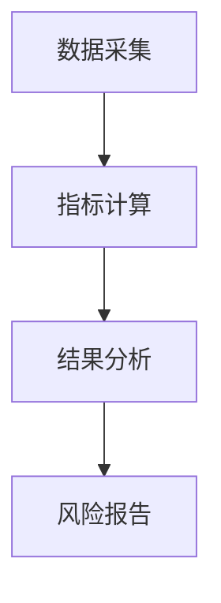
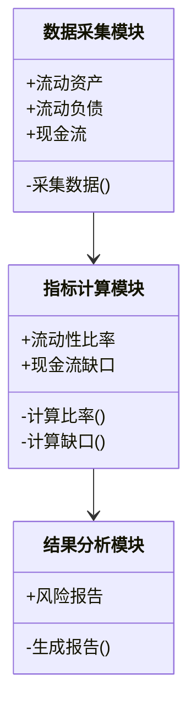

                 


# 金融市场流动性风险度量

> 关键词：金融市场，流动性风险，风险度量，流动性比率，现金流缺口，压力测试

> 摘要：本文系统地介绍了金融市场中流动性风险的度量方法，从基础概念到数学模型，再到系统设计与实战应用，全面剖析了流动性风险度量的核心原理与实际操作。通过详细的公式推导、算法流程图和实际案例分析，帮助读者深入理解并掌握流动性风险的度量技巧。

---

## 第1章: 背景介绍与核心概念

### 1.1 流动性风险的定义与背景

#### 1.1.1 什么是流动性风险
- 流动性风险的定义
- 流动性风险的来源
- 流动性风险与市场风险、信用风险的区别

#### 1.1.2 流动性风险的产生背景
- 金融市场波动的加剧
- 金融机构面临的资金压力
- 全球性金融危机的启示

#### 1.1.3 流动性风险的特征与表现形式
- 流动性风险的周期性
- 流动性风险的传染性
- 流动性风险的非对称性

### 1.2 流动性风险的度量意义

#### 1.2.1 度量流动性风险的重要性
- 保护金融机构的稳健运行
- 维护金融市场的稳定性
- 为政策制定者提供数据支持

#### 1.2.2 流动性风险的度量目标
- 识别潜在的流动性问题
- 评估金融机构的抗风险能力
- 为投资决策提供参考

#### 1.2.3 流动性风险度量的方法与框架
- 基于财务指标的度量方法
- 基于现金流分析的度量方法
- 基于压力测试的度量方法

---

## 第2章: 流动性风险的核心概念与联系

### 2.1 流动性风险的核心概念

#### 2.1.1 流动性风险的内涵
- 流动性资产与流动性负债的定义
- 流动性缺口的计算公式
- 流动性比率的计算公式

#### 2.1.2 流动性风险的关键属性
- 时间维度：短期 vs 长期
- 资产结构：高流动性 vs 低流动性
- 资金需求：日常需求 vs 特殊需求

#### 2.1.3 流动性风险与其他风险的关系
- 与信用风险的关系
- 与市场风险的关系
- 与操作风险的关系

### 2.2 流动性风险的度量模型

#### 2.2.1 流动性风险度量的基本框架
- 数据收集：流动资产、流动负债、现金流等
- 指标计算：流动性比率、现金流缺口、压力测试指标
- 结果分析：风险等级划分、应对策略制定

#### 2.2.2 流动性风险度量的关键变量
- 流动性资产：现金、短期投资、应收账款
- 流动性负债：短期贷款、应付账款、其他负债
- 现金流：流入与流出的时间序列数据

#### 2.2.3 流动性风险度量的数学模型
- 流动性比率模型
- 现金流缺口模型
- 压力测试模型

---

## 第3章: 流动性风险的度量方法

### 3.1 流动性比率分析法

#### 3.1.1 流动性比率的基本概念
- 流动性比率的定义
- 流动性比率的计算公式
- 流动性比率的适用场景

#### 3.1.2 流动性比率的计算公式
- 流动性比率 = 流动资产 / 流动负债
- 速动比率 = (流动资产 - 存货) / 流动负债
- 现金比率 = 现金及现金等价物 / 流动负债

#### 3.1.3 流动性比率的实际应用
- 金融机构的流动性管理
- 投资者的决策参考
- 企业的财务健康评估

### 3.2 现金流缺口分析法

#### 3.2.1 现金流缺口的基本定义
- 现金流缺口的定义
- 现金流缺口的计算公式
- 现金流缺口的度量意义

#### 3.2.2 现金流缺口的计算公式
- 现金流缺口 = 现金流流出 - 现金流流入
- 现金流缺口的绝对值越大，流动性风险越高

#### 3.2.3 现金流缺口的实际应用
- 企业短期资金管理
- 金融机构的流动性监控
- 投资者的现金流分析

### 3.3 压力测试模型

#### 3.3.1 压力测试的基本概念
- 压力测试的定义
- 压力测试的实施步骤
- 压力测试的度量目标

#### 3.3.2 压力测试的实施步骤
1. 确定测试情景：最佳、正常、最坏情况
2. 收集数据：历史数据、假设数据
3. 计算流动性缺口：现金流流出 - 现金流流入
4. 分析结果：风险等级划分、应对策略制定

#### 3.3.3 压力测试的实际应用
- 金融机构的风险管理
- 监管机构的监管工具
- 投资者的决策参考

---

## 第4章: 流动性风险的数学模型与公式

### 4.1 流动性比率分析的数学模型

#### 4.1.1 流动性比率的公式推导
- 流动性比率 = 流动资产 / 流动负债
- 速动比率 = (流动资产 - 存货) / 流动负债
- 现金比率 = 现金及现金等价物 / 流动负债

#### 4.1.2 流动性比率的计算实例
- 示例1：某企业的流动性比率计算
- 示例2：某金融机构的流动性比率分析

#### 4.1.3 流动性比率的优缺点分析
- 优点：简单易懂，计算方便
- 缺点：可能无法反映实际流动性状况

### 4.2 现金流缺口分析的数学模型

#### 4.2.1 现金流缺口的公式推导
- 现金流缺口 = 现金流流出 - 现金流流入
- 现金流缺口的绝对值越大，流动性风险越高

#### 4.2.2 现金流缺口的计算实例
- 示例1：某企业的现金流缺口计算
- 示例2：某金融机构的现金流缺口分析

#### 4.2.3 现金流缺口的优缺点分析
- 优点：能够反映实际的现金流状况
- 缺点：需要依赖于准确的数据预测

### 4.3 压力测试模型的数学模型

#### 4.3.1 压力测试的公式推导
- 现金流缺口 = 现金流流出 - 现金流流入
- 风险等级划分：根据现金流缺口的绝对值大小

#### 4.3.2 压力测试的计算实例
- 示例1：某企业的压力测试计算
- 示例2：某金融机构的压力测试分析

#### 4.3.3 压力测试的优缺点分析
- 优点：能够反映极端情况下的流动性风险
- 缺点：需要依赖于情景假设的准确性

---

## 第5章: 流动性风险的系统分析与架构设计

### 5.1 流动性风险度量的系统框架

#### 5.1.1 系统功能模块划分
- 数据采集模块：收集流动资产、流动负债、现金流等数据
- 指标计算模块：计算流动性比率、现金流缺口、压力测试指标
- 结果分析模块：生成风险报告、制定应对策略

#### 5.1.2 系统功能模块的交互关系
- 数据采集模块与指标计算模块的交互
- 指标计算模块与结果分析模块的交互
- 系统输出：风险报告、应对策略

#### 5.1.3 系统功能模块的流程图


### 5.2 系统架构设计

#### 5.2.1 系统架构的总体设计
- 采用分层架构：数据层、业务逻辑层、表现层
- 数据层：存储流动资产、流动负债、现金流等数据
- 业务逻辑层：实现流动性比率、现金流缺口、压力测试的计算逻辑
- 表现层：展示风险报告、应对策略

#### 5.2.2 系统架构的类图


#### 5.2.3 系统架构的流程图


---

## 第6章: 项目实战与案例分析

### 6.1 项目环境安装

#### 6.1.1 安装必要的库
- Python库：pandas、numpy、scipy
- 数据可视化工具：Matplotlib、Seaborn

#### 6.1.2 环境配置
- 安装Python 3.8及以上版本
- 安装Jupyter Notebook

### 6.2 核心代码实现

#### 6.2.1 数据采集与处理
```python
import pandas as pd

# 数据采集
data = pd.read_csv('流动性数据.csv')

# 数据处理
data['流动资产'] = data['流动资产'].fillna(0)
data['流动负债'] = data['流动负债'].fillna(0)
data['现金流'] = data['现金流'].fillna(0)
```

#### 6.2.2 流动性比率计算
```python
# 计算流动性比率
data['流动性比率'] = data['流动资产'] / data['流动负债']

# 计算速动比率
data['速动比率'] = (data['流动资产'] - data['存货']) / data['流动负债']

# 计算现金比率
data['现金比率'] = data['现金及现金等价物'] / data['流动负债']
```

#### 6.2.3 现金流缺口分析
```python
# 计算现金流缺口
data['现金流缺口'] = data['现金流流出'] - data['现金流流入']

# 绘制现金流缺口的分布图
import matplotlib.pyplot as plt

plt.hist(data['现金流缺口'], bins=10)
plt.xlabel('现金流缺口')
plt.ylabel('频数')
plt.show()
```

#### 6.2.4 压力测试模型
```python
# 压力测试情景
scenarios = ['best', 'normal', 'worst']

for scenario in scenarios:
    if scenario == 'best':
        data['现金流缺口'] = data['现金流流入'] - data['现金流流出']
    elif scenario == 'normal':
        data['现金流缺口'] = data['现金流流入'] - data['现金流流出']
    else:
        data['现金流缺口'] = data['现金流流出'] - data['现金流流入']

# 分析压力测试结果
data['风险等级'] = pd.qcut(data['现金流缺口'], 5, labels=['A', 'B', 'C', 'D', 'E'])
```

### 6.3 实际案例分析

#### 6.3.1 案例背景
- 某金融机构的流动性数据
- 数据时间范围：2020年1月1日到2022年12月31日

#### 6.3.2 数据分析
- 计算流动性比率、现金流缺口、压力测试指标
- 生成风险报告

#### 6.3.3 结果解读
- 流动性比率的变化趋势
- 现金流缺口的波动情况
- 不同情景下的风险等级

### 6.4 项目小结

#### 6.4.1 项目总结
- 成功实现了流动性风险的度量方法
- 提供了实际案例的分析与解读

#### 6.4.2 经验与教训
- 数据的准确性和完整性是关键
- 模型的选择需要结合实际情况
- 结果的解释需要结合业务背景

---

## 第7章: 最佳实践与注意事项

### 7.1 最佳实践

#### 7.1.1 数据质量管理
- 确保数据的准确性和完整性
- 处理缺失值和异常值

#### 7.1.2 模型选择
- 根据实际情况选择合适的度量方法
- 结合多种方法进行综合评估

#### 7.1.3 结果解释
- 结果需要结合业务背景进行解读
- 提供直观的可视化展示

### 7.2 注意事项

#### 7.2.1 数据依赖性
- 数据的准确性和完整性直接影响结果的准确性
- 需要定期更新数据

#### 7.2.2 模型局限性
- 模型假设可能与实际情况不符
- 需要结合实际情况进行调整

#### 7.2.3 风险管理
- 需要及时监控和应对流动性风险
- 制定有效的应对策略

### 7.3 拓展阅读

#### 7.3.1 相关书籍
- 《金融市场风险管理》
- 《流动性风险度量与管理》

#### 7.3.2 相关论文
- "流动性风险度量的新方法"
- "压力测试在流动性风险管理中的应用"

#### 7.3.3 在线资源
- 金融风险管理论坛
- 专业期刊文章

---

## 作者

作者：AI天才研究院/AI Genius Institute & 禅与计算机程序设计艺术 /Zen And The Art of Computer Programming

