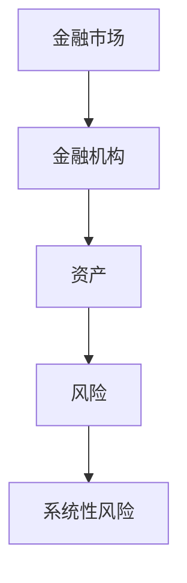
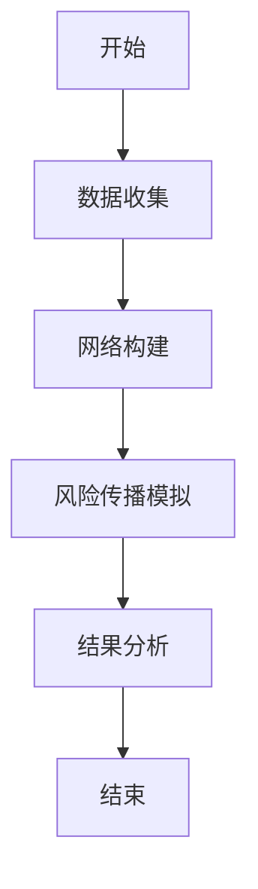
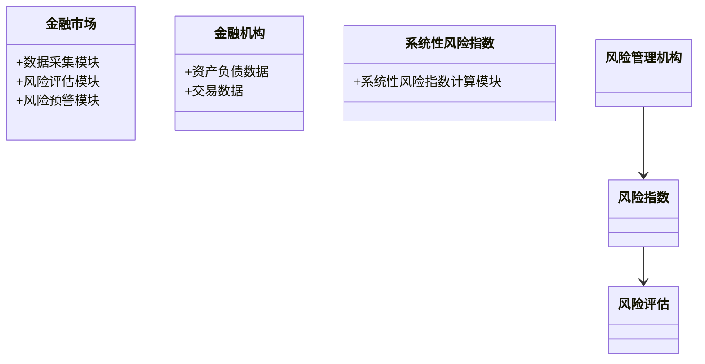

                 


# 金融市场系统性风险传导模型

> 关键词：金融市场，系统性风险，风险传导模型，金融系统稳定性，系统性风险评估，系统性风险管理

> 摘要：本文系统性地探讨了金融市场中的系统性风险及其传导机制，提出了构建系统性风险传导模型的方法和步骤。文章从系统性风险的基本概念出发，详细阐述了系统性风险的定义、特征及其在金融市场中的表现形式。接着，分析了系统性风险传导模型的核心概念与算法原理，探讨了模型的数学基础和实现方法。最后，通过实际案例分析，展示了系统性风险传导模型在金融风险管理中的应用价值，并提出了相应的最佳实践和优化建议。

---

## 第一部分：系统性风险的基本概念

### 第1章：系统性风险的定义与特征

#### 1.1 系统性风险的定义
系统性风险是指由于金融市场的整体波动或系统性事件引发的、可能影响整个金融体系的风险。与非系统性风险（特定于某个资产或个体）不同，系统性风险具有广泛性和传染性。

#### 1.2 系统性风险的特征
- **广泛性**：影响整个金融体系，而非单一资产或个体。
- **传染性**：风险从一个市场或机构向另一个市场或机构传播。
- **不可分散性**：无法通过资产多样化来完全消除。
- **复杂性**：由多个因素共同作用导致，难以预测和控制。

#### 1.3 系统性风险与非系统性风险的区别
| 特性 | 系统性风险 | 非系统性风险 |
|------|-------------|---------------|
| 影响范围 | 整个金融体系 | 单一资产或机构 |
| 传染性 | 高 | 低 |
| 多样性 | 高 | 低 |
| 控制难度 | 高 | 较低 |

### 第2章：系统性风险在金融市场中的表现

#### 2.1 金融市场的基本构成
金融市场包括股票市场、债券市场、外汇市场、衍生品市场等多个子市场，各市场之间相互关联，形成复杂的网络结构。

#### 2.2 系统性风险在金融市场中的表现形式
- **资产价格波动**：系统性风险可能导致资产价格的剧烈波动，引发市场恐慌。
- **流动性危机**：系统性风险可能引发市场流动性不足，导致金融机构面临流动性危机。
- **金融危机**：系统性风险的积累和爆发可能引发系统性金融危机，如2008年全球金融危机。

#### 2.3 系统性风险的传播机制
系统性风险的传播机制主要包括直接传染和间接传染两种形式：
- **直接传染**：通过市场参与者之间的直接关联，如银行、保险公司等金融机构之间的相互持股或融资关系。
- **间接传染**：通过市场波动、投资者情绪等因素影响，导致多个市场或机构同时受到影响。

### 第3章：系统性风险传导模型的背景与意义

#### 3.1 系统性风险传导模型的背景
随着全球化和金融创新的不断推进，金融市场之间的关联性日益增强，系统性风险的潜在威胁也在增加。传统的风险管理方法难以应对系统性风险的复杂性和传染性。

#### 3.2 系统性风险传导模型的意义
系统性风险传导模型能够帮助金融机构和监管机构更好地识别和评估系统性风险，制定有效的风险管理策略，从而降低系统性风险对金融体系的冲击。

#### 3.3 系统性风险传导模型的应用场景
- **金融监管**：帮助监管机构识别系统性风险的来源和传播路径，制定监管政策。
- **风险管理**：帮助金融机构评估和管理系统性风险，制定风险对冲策略。
- **政策制定**：为政府和监管机构制定金融稳定政策提供科学依据。

---

## 第二部分：系统性风险传导模型的核心概念

### 第4章：系统性风险传导模型的定义与原理

#### 4.1 系统性风险传导模型的定义
系统性风险传导模型是一种通过分析金融市场中各主体之间的关联性，模拟系统性风险在市场中的传播过程的数学模型。

#### 4.2 系统性风险传导模型的原理
系统性风险传导模型的核心在于通过构建金融市场中各主体之间的关系网络，分析系统性风险的传播路径和影响范围。模型通常包括以下几个步骤：
1. **数据收集**：收集金融市场中各主体的交易数据、资产负债数据等。
2. **网络构建**：构建金融市场中各主体之间的关联网络。
3. **风险传播模拟**：通过模拟风险在关联网络中的传播，评估系统性风险的影响范围和程度。
4. **结果分析**：根据模拟结果，制定风险管理策略。

### 第5章：系统性风险传导模型的核心要素与联系

#### 5.1 系统性风险传导模型的核心要素
- **金融市场网络**：包括金融市场中的各主体（如银行、保险公司、基金公司等）及其之间的关联关系。
- **风险指标**：包括系统性风险指数、波动率、相关性系数等。
- **传播路径**：包括直接传播和间接传播两种路径。

#### 5.2 系统性风险传导模型的核心概念对比
| 概念 | 定义 | 特点 |
|------|------|------|
| 系统性风险指数 | 衡量系统性风险的指标 | 整体性、综合性 |
| 波动率 | 资产价格波动程度 | 个体性、局部性 |
| 相关性系数 | 资产价格之间的相关性 | 局部性、可分解性 |

#### 5.3 系统性风险传导模型的ER实体关系图


---

## 第三部分：系统性风险传导模型的算法原理

### 第6章：系统性风险传导模型的算法概述

#### 6.1 系统性风险传导模型的算法分类
系统性风险传导模型的算法主要包括以下几种：
- **马尔可夫链模型**：通过状态转移概率分析系统性风险的传播路径。
- **贝叶斯网络模型**：通过概率推理分析系统性风险的传播和影响。
- **复杂网络模型**：通过构建金融市场网络分析系统性风险的传播和扩散。

#### 6.2 系统性风险传导模型的算法实现
以下是基于复杂网络模型的系统性风险传导算法的流程图：


#### 6.3 系统性风险传导模型的数学公式
系统性风险指数的计算公式为：
$$ S = \sum_{i=1}^{n} w_i \cdot R_i $$
其中，\( S \) 表示系统性风险指数，\( w_i \) 表示第 \( i \) 个风险因子的权重，\( R_i \) 表示第 \( i \) 个风险因子的值。

---

## 第四部分：系统性风险传导模型的系统分析与架构设计

### 第7章：系统性风险传导模型的系统分析

#### 7.1 系统性风险传导模型的系统分析
系统性风险传导模型的系统分析包括以下几个步骤：
1. **问题场景介绍**：分析金融市场中的系统性风险问题，明确模型的应用场景。
2. **系统功能设计**：设计系统的功能模块，包括数据采集、风险评估、风险预警等。
3. **系统架构设计**：设计系统的架构，包括数据层、业务逻辑层、用户界面层等。

#### 7.2 系统性风险传导模型的领域模型


---

## 第五部分：系统性风险传导模型的项目实战

### 第8章：系统性风险传导模型的项目实战

#### 8.1 项目环境安装
- 安装Python和相关库（如NumPy、Pandas、NetworkX等）。
- 安装Mermaid工具用于绘制流程图和类图。

#### 8.2 系统性风险传导模型的核心代码实现
以下是基于Python的系统性风险传导模型的代码示例：
```python
import networkx as nx
import numpy as np

# 构建金融市场网络
G = nx.DiGraph()
G.add_nodes_from(['Bank', 'Insurer', 'Fund'])
G.add_edges_from([('Bank', 'Fund'), ('Insurer', 'Fund'), ('Bank', 'Insurer')])

# 计算系统性风险指数
weights = {'Bank': 0.4, 'Insurer': 0.3, 'Fund': 0.3}
risk_factors = {'Bank': 0.8, 'Insurer': 0.6, 'Fund': 0.7}

S = sum(weights[i] * risk_factors[i] for i in G.nodes())
print(f"系统性风险指数为：{S}")
```

---

## 第六部分：系统性风险传导模型的最佳实践

### 第9章：系统性风险传导模型的最佳实践

#### 9.1 系统性风险传导模型的注意事项
- 数据质量是模型准确性的关键，需确保数据的完整性和实时性。
- 模型的复杂度需与实际需求相匹配，避免过度复杂化。
- 定期更新模型参数和假设，以适应市场变化。

#### 9.2 系统性风险传导模型的小结
系统性风险传导模型是一种有效的金融风险管理工具，能够帮助金融机构和监管机构更好地识别和应对系统性风险。在实际应用中，需结合具体市场环境和数据特点，选择合适的模型和算法，并定期更新和优化模型。

---

## 作者信息

作者：AI天才研究院/AI Genius Institute & 禅与计算机程序设计艺术/Zen And The Art of Computer Programming

---

**以上是我的思考过程和文章结构设计，接下来我会根据上述结构撰写完整的文章内容。**

