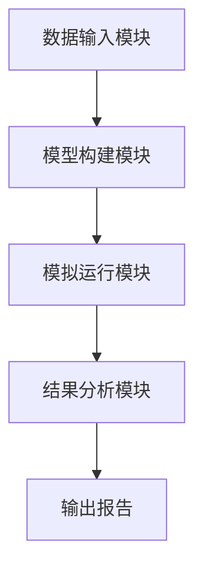
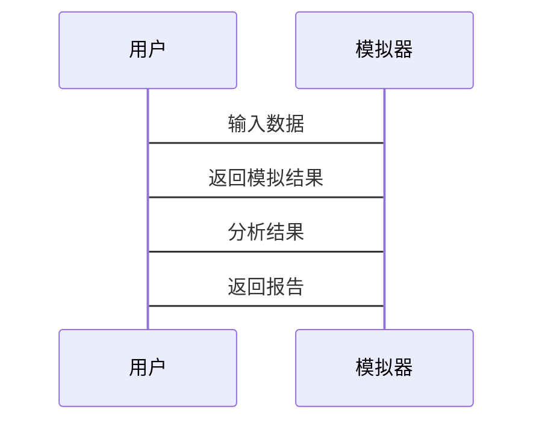

                 


# 金融市场系统性风险传导模拟器

> 关键词：系统性风险，金融网络，系统动力学模型，网络理论模型，系统性风险模拟器

> 摘要：本文详细探讨了金融市场系统性风险的定义、来源、传导机制及其模拟方法。通过系统动力学模型和网络理论模型的结合，提出了一种全新的系统性风险传导模拟器的设计与实现方法。本文从理论基础到实际应用，全面分析了系统性风险的模拟过程，包括算法原理、数学模型、系统架构以及项目实战等内容。通过本文的阐述，读者可以深入了解系统性风险的复杂性，并掌握构建系统性风险传导模拟器的核心技术与方法。

---

## # 第一部分: 金融市场系统性风险基础

### ## 第1章: 系统性风险的基本概念

#### ### 1.1 系统性风险的定义与特征

系统性风险是指由于整个金融系统的崩溃或重大事件导致的市场风险，其具有传染性、全局性、不可分散性等特征。与非系统性风险不同，系统性风险影响的是整个市场，而非单一资产或机构。

#### ### 1.2 系统性风险的来源与影响

系统性风险的来源主要包括金融机构的过度杠杆、资产泡沫、市场流动性不足、监管缺陷以及全球性金融事件等。系统性风险的爆发可能导致金融危机，进而引发经济衰退、金融机构破产、市场信心丧失等问题。

#### ### 1.3 系统性风险的传导机制

系统性风险的传导机制主要包括以下几种：
1. **直接传染**：一家金融机构的破产直接导致其他机构的损失。
2. **间接传染**：通过市场流动性、资产价格波动等间接影响其他机构。
3. **市场情绪传染**：市场恐慌情绪的蔓延导致投资者信心下降，进而引发更大的市场波动。

#### ### 1.4 系统性风险的边界与外延

系统性风险的边界通常包括金融机构、金融市场、宏观经济等多个层面。其外延则包括与系统性风险相关的金融工具、市场结构、政策干预等因素。

#### ### 1.5 系统性风险的核心要素组成

系统性风险的核心要素包括：
- **市场参与者**：包括银行、保险公司、基金公司等金融机构。
- **资金流动**：资金在市场中的流动情况。
- **价格波动**：资产价格的波动性。
- **机构关联性**：金融机构之间的关联程度。

### ## 第2章: 系统性风险的量化与度量

#### ### 2.1 系统性风险的量化方法

系统性风险的量化方法主要包括以下几种：
1. **VaR（Value at Risk）**：衡量资产在正常市场条件下的潜在损失。
2. **CVaR（Conditional Value at Risk）**：衡量资产在极端市场条件下的潜在损失。
3. **网络理论模型**：通过网络分析方法衡量系统性风险的传导路径。

#### ### 2.2 系统性风险的度量指标

系统性风险的度量指标主要包括：
- **系统性风险指数**：衡量整个金融系统的风险程度。
- **金融机构的传染性指数**：衡量金融机构在系统性风险中的传染能力。
- **市场波动性指标**：衡量市场波动对系统性风险的影响。

#### ### 2.3 系统性风险的度量模型

系统性风险的度量模型主要包括：
- **系统性风险的数学模型**：通过数学公式量化系统性风险。
- **网络模型在系统性风险中的应用**：通过网络分析方法衡量系统性风险的传导路径。
- **时间序列分析在系统性风险中的应用**：通过时间序列分析方法预测系统性风险的发生。

---

## # 第二部分: 系统性风险传导模拟器的核心概念与联系

### ## 第3章: 系统性风险传导的网络模型

#### ### 3.1 系统性风险传导的网络结构

系统性风险传导的网络结构主要包括：
- **金融机构之间的关联网络**：金融机构之间的借款、投资等关系。
- **资金流动的网络结构**：资金在市场中的流动路径。
- **市场波动的网络结构**：资产价格波动的传播路径。

#### ### 3.2 系统性风险传导的网络属性

系统性风险传导的网络属性主要包括：
- **网络的度数分布**：网络中各个节点的度数分布情况。
- **网络的聚类系数**：网络中节点的聚类程度。
- **网络的路径长度**：网络中节点之间的最短路径长度。

#### ### 3.3 系统性风险传导的网络特征

系统性风险传导的网络特征主要包括：
- **网络的脆弱性**：网络中某些关键节点的缺失可能导致整个网络的崩溃。
- **网络的鲁棒性**：网络在面对部分节点故障时的恢复能力。
- **网络的传染性**：网络中风险的传播能力。

#### ### 3.4 系统性风险传导的网络对比

系统性风险传导的网络对比主要通过以下方式进行：
- **对比不同网络结构的系统性风险传导能力**：例如，随机网络与规则网络的对比。
- **对比网络中不同节点的系统性风险传导能力**：例如，中心节点与边缘节点的对比。

---

## # 第三部分: 系统性风险传导模拟器的算法原理

### ## 第4章: 系统性风险传导的系统动力学模型

#### ### 4.1 系统动力学模型的定义与特点

系统动力学模型是一种通过模拟系统内部动态关系来预测系统行为的模型。其特点包括：
- **动态性**：模型能够模拟系统的动态变化。
- **整体性**：模型关注系统整体的行为，而非单一部分。
- **反馈性**：模型能够模拟系统中的反馈机制。

#### ### 4.2 系统动力学模型的核心算法

系统动力学模型的核心算法主要包括：
- **微分方程模型**：通过微分方程描述系统的动态变化。
- **差分方程模型**：通过差分方程描述系统的动态变化。
- **网络流模型**：通过网络流模型描述系统中的资金流动。

#### ### 4.3 系统动力学模型的实现步骤

系统动力学模型的实现步骤主要包括：
1. **定义系统变量**：确定系统中的关键变量。
2. **建立模型方程**：根据变量之间的关系建立模型方程。
3. **选择数值方法**：选择适当的数值方法求解模型方程。
4. **验证与调整**：通过实际数据验证模型的准确性，并进行必要的调整。

#### ### 4.4 系统动力学模型的Python实现

以下是系统动力学模型的Python实现示例代码：

```python
import numpy as np
import matplotlib.pyplot as plt

def system_dynamics_model(initial_state, parameters, time_steps):
    state = initial_state.copy()
    results = [state]
    for _ in range(time_steps):
        # Update state based on system dynamics
        new_state = state * (1 - parameters['decay']) + parameters['input']
        results.append(new_state)
        state = new_state
    return results

# Example usage
initial_state = [1.0]
parameters = {
    'decay': 0.1,
    'input': 0.5
}
time_steps = 100

results = system_dynamics_model(initial_state, parameters, time_steps)

# Plot the results
plt.plot(range(len(results)), results)
plt.xlabel('Time Steps')
plt.ylabel('System State')
plt.title('System Dynamics Model')
plt.show()
```

#### ### 4.5 系统动力学模型的数学公式

系统动力学模型的数学公式通常表示为：

$$
\frac{dx}{dt} = -kx + u
$$

其中，\( x \) 表示系统状态，\( k \) 表示衰减系数，\( u \) 表示输入。

---

## # 第四部分: 系统性风险传导模拟器的系统架构与实现

### ## 第5章: 系统性风险传导模拟器的系统架构设计

#### ### 5.1 系统性风险传导模拟器的功能模块划分

系统性风险传导模拟器的功能模块划分主要包括：
- **数据输入模块**：输入系统性风险相关的数据。
- **模型构建模块**：构建系统性风险传导模型。
- **模拟运行模块**：运行模拟器并输出结果。
- **结果分析模块**：分析模拟结果并生成报告。

#### ### 5.2 系统性风险传导模拟器的系统架构图

以下是系统性风险传导模拟器的系统架构图：



#### ### 5.3 系统性风险传导模拟器的接口设计

系统性风险传导模拟器的接口设计主要包括：
- **输入接口**：接收系统性风险相关的数据。
- **输出接口**：输出模拟结果和报告。

#### ### 5.4 系统性风险传导模拟器的交互流程图

以下是系统性风险传导模拟器的交互流程图：



---

## # 第五部分: 系统性风险传导模拟器的项目实战

### ## 第6章: 系统性风险传导模拟器的环境配置与核心实现

#### ### 6.1 环境配置

系统性风险传导模拟器的环境配置主要包括：
- **Python环境**：安装Python 3.x。
- **依赖库安装**：安装numpy、pandas、matplotlib等库。

#### ### 6.2 核心代码实现

以下是系统性风险传导模拟器的核心代码实现：

```python
import numpy as np
import networkx as nx
import matplotlib.pyplot as plt

def build_network(n_nodes, n_edges):
    G = nx.DiGraph()
    G.add_nodes_from(range(n_nodes))
    for _ in range(n_edges):
        u = np.random.randint(n_nodes)
        v = np.random.randint(n_nodes)
        G.add_edge(u, v)
    return G

def simulate_systemic_risk(G, initial_shock, steps):
    shock = initial_shock.copy()
    results = [shock]
    for _ in range(steps):
        new_shock = shock.copy()
        for node in G.nodes():
            if G.out_degree(node) > 0:
                for neighbor in G.neighbors(node):
                    new_shock[node] += shock[neighbor] * 0.1
        shock = new_shock
        results.append(shock)
    return results

# Example usage
n_nodes = 10
n_edges = 15
initial_shock = [0.1 if i == 0 else 0 for i in range(n_nodes)]
steps = 100

G = build_network(n_nodes, n_edges)
results = simulate_systemic_risk(G, initial_shock, steps)

# Plot the results
plt.figure(figsize=(10, 6))
for i in range(n_nodes):
    plt.plot(range(len(results)), [result[i] for result in results], label=f'Node {i}')
plt.xlabel('Time Steps')
plt.ylabel('Shock Level')
plt.title('Systemic Risk Simulation')
plt.legend()
plt.show()
```

#### ### 6.3 代码解读与分析

以上代码实现了以下功能：
1. **网络构建**：使用NetworkX库构建系统性风险传导的网络。
2. **系统性风险模拟**：通过模拟初始冲击在网络中的传播，计算系统性风险的传导路径。
3. **结果可视化**：通过Matplotlib库可视化系统性风险的传播过程。

#### ### 6.4 实际案例分析

通过以上代码，我们可以模拟以下实际案例：
1. **银行挤兑事件**：模拟银行挤兑事件对整个金融系统的冲击。
2. **资产价格崩盘**：模拟资产价格崩盘对市场的系统性影响。

---

## # 第六部分: 系统性风险传导模拟器的小结与展望

### ## 第7章: 系统性风险传导模拟器的小结

#### ### 7.1 系统性风险传导模拟器的核心优势

系统性风险传导模拟器的核心优势主要包括：
- **直观性**：通过网络图和时间序列图直观展示系统性风险的传导过程。
- **可定制性**：可以根据实际需求调整模型参数和网络结构。
- **可扩展性**：可以扩展到更大规模的金融系统。

#### ### 7.2 系统性风险传导模拟器的局限性

系统性风险传导模拟器的局限性主要包括：
- **数据依赖性**：模拟结果依赖于输入数据的准确性和完整性。
- **模型假设的简化**：模型假设可能与实际情况存在偏差。

#### ### 7.3 系统性风险传导模拟器的未来发展方向

系统性风险传导模拟器的未来发展方向主要包括：
- **模型优化**：优化模型算法，提高模拟精度。
- **数据融合**：结合更多数据源，提高模拟结果的准确性。
- **应用场景拓展**：拓展模拟器的应用场景，如风险管理、政策制定等。

---

## # 作者

作者：AI天才研究院/AI Genius Institute & 禅与计算机程序设计艺术 /Zen And The Art of Computer Programming

