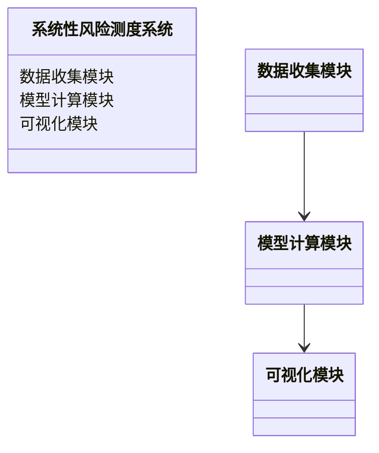
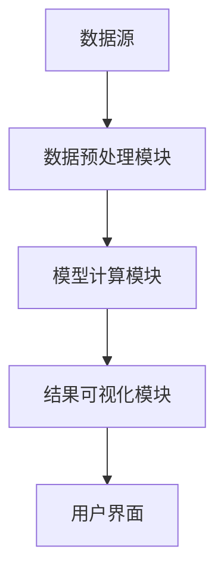

                 


# 金融市场系统性风险测度模型

---

## 关键词：
金融市场, 系统性风险, 风险测度模型, 金融稳定性, 数学模型

---

## 摘要：
金融市场系统性风险测度模型是金融学和风险管理领域的重要研究方向。系统性风险是指可能影响整个金融系统并引发系统性危机的风险，其测度与管理对金融市场的稳定性和经济的健康发展具有重要意义。本文从系统性风险的基本概念出发，详细探讨了系统性风险测度模型的构建方法、算法实现、系统架构设计以及实际案例分析。通过对比分析多种系统性风险测度模型，本文提出了一个基于网络风险传播的系统性风险测度模型，并通过Python代码实现，展示了模型在实际应用中的效果。最后，本文总结了系统性风险测度模型的研究意义和未来发展方向。

---

## 第一部分: 金融市场系统性风险测度模型引言

---

### 第1章: 系统性风险的背景与重要性

#### 1.1 系统性风险的定义与特征
系统性风险是指由于金融系统内部或外部的冲击导致整个金融系统发生系统性危机的风险。与非系统性风险不同，系统性风险不能通过分散投资来完全消除。其主要特征包括：

1. **全局性**：系统性风险影响整个金融系统，而非单一机构或资产。
2. **传染性**：系统性风险可能通过金融网络从一个机构传播到另一个机构，甚至蔓延至整个金融系统。
3. **不可分散性**：系统性风险无法通过投资组合分散化来消除。
4. **难以预测性**：系统性风险的发生往往具有突发性和不可预测性。

---

#### 1.2 金融市场系统性风险的重要性
金融市场系统性风险的测度与管理是金融监管机构和金融机构的核心任务之一。系统性风险可能导致金融市场的崩盘，进而引发经济危机。例如，2008年的全球金融危机就是系统性风险失控的典型案例。因此，准确测度系统性风险并制定有效的风险管理策略，对于维护金融市场的稳定性和经济的健康发展具有重要意义。

---

#### 1.3 系统性风险测度模型的研究意义
系统性风险测度模型的研究不仅有助于金融机构和监管机构更好地识别和管理系统性风险，还能为金融政策的制定提供科学依据。通过系统性风险测度模型，可以量化系统性风险的大小和分布，帮助金融机构制定风险对冲策略，降低系统性风险的发生概率。

---

### 第2章: 系统性风险测度模型的核心概念

#### 2.1 系统性风险测度模型的基本原理
系统性风险测度模型的基本原理是通过数学模型量化系统性风险的传播和积累过程。常见的系统性风险测度模型包括VaR（Value at Risk）、CVaR（Conditional Value at Risk）、Copula模型和网络风险传播模型等。

---

#### 2.2 系统性风险测度模型的关键指标
系统性风险测度模型的关键指标包括：

1. **VaR**：在给定置信水平下，资产组合可能遭受的最大损失。
2. **CVaR**：在VaR的基础上，考虑损失超过VaR的概率。
3. **系统性风险指数**：通过网络分析方法计算金融机构之间的相互依赖性，量化系统性风险的传播和积累。

---

#### 2.3 系统性风险测度模型的数学基础
系统性风险测度模型的数学基础主要包括概率论、统计学和网络理论。例如，网络风险传播模型可以通过图论中的节点度数和网络拓扑结构来量化风险的传播路径。

---

## 第二部分: 系统性风险测度模型的构建与分析

---

### 第3章: 系统性风险测度模型的构建方法

#### 3.1 系统性风险测度模型的构建步骤
系统性风险测度模型的构建步骤包括：

1. **数据收集**：收集金融机构的资产数据、负债数据和市场数据。
2. **模型选择**：根据实际需求选择合适的系统性风险测度模型。
3. **参数估计**：通过历史数据估计模型的参数。
4. **模型验证**：通过回测验证模型的有效性和准确性。

---

#### 3.2 常见的系统性风险测度模型

##### 3.2.1 VaR模型
VaR模型是一种常用的金融风险测度模型，其基本思想是通过统计方法估计资产组合在给定置信水平下的最大损失。例如，95%置信水平下的VaR表示在95%的概率下，资产组合的最大损失。

##### 3.2.2 CVaR模型
CVaR模型是对VaR模型的扩展，考虑了损失超过VaR的概率。CVaR模型更加注重尾部风险的测度，适用于系统性风险的测度。

##### 3.2.3 Copula模型
Copula模型通过描述资产之间相关性的分布来测度系统性风险。Copula模型可以处理资产之间的非对称相关性和尾部依赖性。

##### 3.2.4 网络风险传播模型
网络风险传播模型通过构建金融机构之间的网络关系，量化风险在金融系统中的传播路径和传播速度。例如，可以通过图论中的广度优先搜索（BFS）算法模拟风险的传播过程。

---

#### 3.3 模型选择与优化
不同系统性风险测度模型有不同的优缺点。例如，VaR模型简单易懂，但无法测度尾部风险；CVaR模型可以测度尾部风险，但计算复杂度较高。因此，在实际应用中，需要根据具体情况选择合适的模型。

---

### 第4章: 系统性风险测度模型的算法实现

#### 4.1 系统性风险测度模型的算法原理
系统性风险测度模型的算法原理包括：

1. **VaR模型**：通过历史模拟法或蒙特卡洛模拟法估计资产组合的最大损失。
2. **CVaR模型**：在VaR的基础上，计算超过VaR部分的平均损失。
3. **Copula模型**：通过参数估计和似然比检验确定资产之间的相关性分布。
4. **网络风险传播模型**：通过网络分析方法确定风险的传播路径和传播速度。

---

#### 4.2 系统性风险测度模型的代码实现

##### 4.2.1 VaR模型的Python代码实现
```python
import numpy as np
import pandas as pd

# 假设我们有资产收益数据
returns = pd.Series([0.02, -0.01, 0.03, -0.02, 0.01])

# 计算VaR（95%置信水平）
value_at_risk = np.percentile(returns, 5)
print("VaR:", value_at_risk)
```

##### 4.2.2 网络风险传播模型的Python代码实现
```python
import networkx as nx

# 假设我们有一个金融机构网络
G = nx.DiGraph()
G.add_edges_from([(1, 2), (2, 3), (3, 4)])

# 计算风险传播路径
def risk_propagation(G):
    # 初始化风险传播矩阵
    risk_matrix = np.zeros(len(G.nodes()))
    # 遍历图中的每个节点
    for node in G.nodes():
        # 遍历图中的每个邻居
        for neighbor in G.neighbors(node):
            risk_matrix[node] += 1
    return risk_matrix

risk_matrix = risk_propagation(G)
print("Risk Matrix:", risk_matrix)
```

---

### 第5章: 系统性风险测度模型的系统架构设计

#### 5.1 问题场景介绍
系统性风险测度模型的应用场景包括金融机构的风险管理、金融监管机构的系统性风险监测以及金融市场的风险预警。

---

#### 5.2 系统功能设计（领域模型）



---

#### 5.3 系统架构设计



---

### 第6章: 项目实战

#### 6.1 环境安装
需要安装的环境包括Python、Pandas、NumPy和Networkx等库。

---

#### 6.2 核心实现源代码
以下是系统性风险测度模型的核心实现代码：

```python
import numpy as np
import pandas as pd
import networkx as nx

# 数据预处理
data = pd.read_csv('financial_data.csv')
returns = data['returns'].values

# 系统性风险测度模型计算
def calculate_systemic_risk(returns):
    # 计算VaR
    var = np.percentile(returns, 5)
    # 计算CVaR
    cvar = np.mean(returns[returns <= var])
    return var, cvar

var, cvar = calculate_systemic_risk(returns)
print("VaR:", var)
print("CVaR:", cvar)

# 网络风险传播模型
G = nx.DiGraph()
G.add_edges_from([(1, 2), (2, 3), (3, 4)])
risk_matrix = np.zeros(len(G.nodes()))
for node in G.nodes():
    for neighbor in G.neighbors(node):
        risk_matrix[node] += 1
print("Risk Matrix:", risk_matrix)
```

---

#### 6.3 案例分析
以2008年全球金融危机为例，我们可以利用系统性风险测度模型分析金融机构之间的风险传播和积累过程。通过计算VaR和CVaR，我们可以量化系统性风险的大小，并通过网络风险传播模型确定风险的传播路径。

---

### 第7章: 总结与展望

#### 7.1 总结
系统性风险测度模型是金融风险管理的重要工具。本文通过对比分析多种系统性风险测度模型，提出了一个基于网络风险传播的系统性风险测度模型，并通过Python代码实现展示了模型的应用效果。

---

#### 7.2 展望
未来的研究可以进一步优化系统性风险测度模型，例如引入机器学习算法提高模型的预测精度。此外，还可以研究系统性风险测度模型在金融监管中的应用，为金融政策的制定提供科学依据。

---

## 作者：AI天才研究院/AI Genius Institute & 禅与计算机程序设计艺术 /Zen And The Art of Computer Programming

