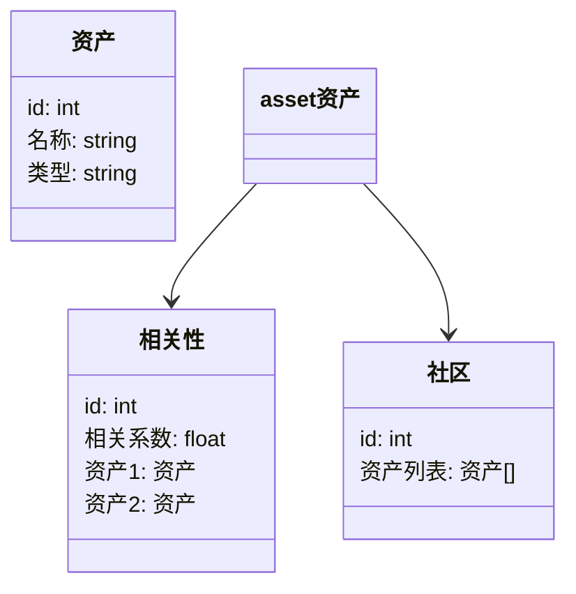
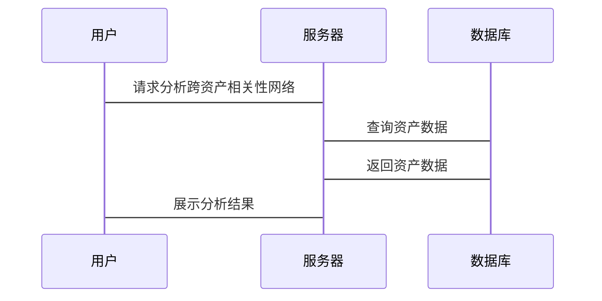

                 


# 金融市场跨资产相关性网络分析

> 关键词：金融市场，跨资产相关性，网络分析，系统架构，社区检测，算法原理

> 摘要：本文深入探讨了金融市场中跨资产相关性网络分析的理论基础、算法原理、系统架构以及实际应用。通过分析资产之间的相关性，构建网络模型，利用社区检测算法识别市场中的潜在风险和机会。文章结合实际案例，详细讲解了如何利用相关性矩阵、网络构建算法以及社区检测算法进行跨资产相关性网络分析，并通过系统架构设计和项目实战，展示了如何将理论应用于实际金融市场分析中。

---

# 第一部分: 背景介绍

## 第1章: 金融市场与跨资产相关性概述

### 1.1 金融市场基础

#### 1.1.1 金融市场的定义与分类

金融市场是资金流动和资产交易的场所，主要参与者包括个人投资者、机构投资者、金融机构等。金融市场可以分为一级市场和二级市场，一级市场涉及新资产的发行，二级市场涉及现有资产的交易。

#### 1.1.2 资产的定义与类型

资产是指具有价值的所有权或使用权的物品，常见的资产类型包括股票、债券、基金、商品（如黄金、原油）和房地产等。

#### 1.1.3 金融市场的重要性

金融市场在全球经济中起着至关重要的作用，它不仅为投资者提供了资产交易的平台，还为企业提供了融资的机会，同时为经济的资源配置提供了优化的机制。

### 1.2 跨资产相关性的概念

#### 1.2.1 相关性的定义

相关性是指两个或多个变量之间存在某种关系的程度，通常用相关系数来衡量。相关系数的范围在-1到1之间，正数表示正相关，负数表示负相关。

#### 1.2.2 跨资产相关性的特点

跨资产相关性是指不同类型的资产之间的相关性。例如，股票和债券之间的相关性，或者黄金与美元的相关性。跨资产相关性可以帮助投资者理解不同资产之间的联动性，从而优化投资组合。

#### 1.2.3 跨资产相关性的重要性

在金融市场中，跨资产相关性可以帮助投资者识别潜在的风险和机会。例如，在市场波动加剧时，某些资产可能表现出高度的相关性，从而影响投资组合的波动性。

### 1.3 网络分析的背景

#### 1.3.1 网络分析的基本概念

网络分析是通过图论的方法研究网络结构和属性的学科。网络由节点（节点）和边（边）组成，节点代表个体或实体，边代表它们之间的关系。

#### 1.3.2 网络分析在金融领域的应用

网络分析在金融领域的应用包括股票网络分析、债券网络分析、外汇网络分析等。通过网络分析，可以识别市场中的领导者和跟随者，理解市场结构的变化。

#### 1.3.3 跨资产相关性网络分析的必要性

跨资产相关性网络分析可以帮助投资者理解不同资产之间的相互作用，识别市场中的系统性风险，优化投资组合的分散化策略。

---

# 第二部分: 核心概念与联系

## 第2章: 跨资产相关性网络分析的核心概念

### 2.1 相关性计算原理

#### 2.1.1 相关系数的计算公式

相关系数通常使用皮尔逊相关系数来计算，公式为：

$$ r = \frac{\sum (x_i - \bar{x})(y_i - \bar{y})}{\sqrt{\sum (x_i - \bar{x})^2} \sqrt{\sum (y_i - \bar{y})^2}} $$

其中，$\bar{x}$ 和 $\bar{y}$ 分别是 $x$ 和 $y$ 的平均值。

#### 2.1.2 相关系数的范围与意义

相关系数的范围在-1到1之间：
- 1表示完全正相关。
- -1表示完全负相关。
- 0表示无相关性。

#### 2.1.3 相关系数的局限性

皮尔逊相关系数假设变量之间存在线性关系，且变量服从正态分布。在实际金融市场中，资产之间的关系往往是非线性的，因此皮尔逊相关系数可能无法准确反映资产之间的相关性。

### 2.2 网络构建与属性分析

#### 2.2.1 网络构建的基本步骤

1. **数据收集**：收集不同资产的价格数据。
2. **相关性计算**：计算每对资产之间的相关系数。
3. **网络构建**：基于相关系数构建网络，通常设置一个阈值，将相关系数高于阈值的资产对连接起来。

#### 2.2.2 网络的节点与边的定义

- **节点**：代表不同的资产。
- **边**：代表资产之间的相关性，边的权重通常为相关系数的绝对值。

#### 2.2.3 网络的度数、聚类系数等属性分析

- **度数**：节点的度数表示该资产与其他资产的连接数量，反映该资产在市场中的影响力。
- **聚类系数**：表示节点的邻居之间连接的密度，反映市场中的局部结构。

### 2.3 跨资产相关性网络分析的数学模型

#### 2.3.1 相关性矩阵的构建

将多个资产的相关系数计算并组织成一个矩阵，矩阵的元素表示资产对之间的相关系数。

#### 2.3.2 网络边权重的计算

边权重通常为相关系数的绝对值，权重越大表示资产之间的相关性越强。

#### 2.3.3 网络社区检测的数学模型

社区检测通常使用模块度优化算法，公式为：

$$ Q = \sum_{i} \sum_{j} (A_{ij} - p_{ij}) \delta(c_i, c_j) $$

其中，$A_{ij}$ 是邻接矩阵的元素，$p_{ij}$ 是随机网络中边存在的概率，$\delta(c_i, c_j)$ 是指示函数，表示节点 $i$ 和 $j$ 是否属于同一社区。

---

# 第三部分: 算法原理讲解

## 第3章: 跨资产相关性网络分析的算法原理

### 3.1 相关性计算的算法

#### 3.1.1 Pearson相关系数计算

使用皮尔逊相关系数计算每对资产之间的相关系数，公式如上所述。

#### 3.1.2 Spearman相关系数计算

Spearman相关系数是基于变量的秩次计算的，适用于非线性关系：

$$ r_s = \frac{\sum (x_i - \bar{x})(y_i - \bar{y})}{\sqrt{\sum (x_i - \bar{x})^2} \sqrt{\sum (y_i - \bar{y})^2}} $$

#### 3.1.3 Kendall相关系数计算

Kendall相关系数基于排名差异计算，适用于小样本数据：

$$ \tau = \frac{\sum_{i<j} (sign(x_j - x_i) - sign(y_j - y_i))}{\frac{n(n-1)}{2}} $$

### 3.2 网络构建的算法

#### 3.2.1 基于阈值的网络构建算法

根据预设的阈值，将相关系数高于阈值的资产对连接起来。

#### 3.2.2 基于密度的网络构建算法

通过计算局部密度，将密度高于阈值的资产对连接起来。

#### 3.2.3 基于聚类的网络构建算法

使用聚类算法（如K-means）将相似的资产聚类，形成网络结构。

### 3.3 网络社区检测的算法

#### 3.3.1 社区检测的定义与意义

社区检测是将网络中的节点划分为若干个社区，每个社区内的节点具有较高的相似性或连接性。

#### 3.3.2 基于模块度优化的社区检测算法

使用模块度优化算法（如Girvan-Newman算法）进行社区检测。

#### 3.3.3 基于谱聚类的社区检测算法

使用谱聚类算法，将网络的邻接矩阵转化为低维空间中的点，然后进行聚类。

---

# 第四部分: 系统分析与架构设计方案

## 第4章: 系统分析与架构设计方案

### 4.1 问题场景介绍

#### 4.1.1 金融市场数据的特点

金融市场数据具有高频性、波动性和非线性等特点，数据量大且复杂。

#### 4.1.2 跨资产相关性网络分析的场景

在实际金融市场中，跨资产相关性网络分析可以帮助投资者识别系统性风险，优化投资组合。

#### 4.1.3 系统的目标与需求

系统的目标是构建一个能够实时分析跨资产相关性网络的平台，支持用户进行风险评估和投资决策。

### 4.2 系统功能设计

#### 4.2.1 领域模型设计



#### 4.2.2 系统架构设计

```mermaid
client
    [用户请求]
client --> server
server
    [接收请求]
    [处理请求]
server --> 数据库
    [查询数据]
数据库
    [存储数据]
    [返回数据]
server <-- 数据库
server
    [生成结果]
    [返回响应]
server --> client
client
    [显示结果]
```

#### 4.2.3 系统接口设计

系统接口包括数据接口和用户接口，数据接口用于获取资产价格数据，用户接口用于展示分析结果。

#### 4.2.4 系统交互流程



---

# 第五部分: 项目实战

## 第5章: 项目实战

### 5.1 环境安装

安装必要的Python库，如NumPy、Pandas、NetworkX、Matplotlib等。

### 5.2 核心实现

#### 5.2.1 数据获取

使用Yahoo Finance API获取股票价格数据。

#### 5.2.2 相关性计算

计算每对股票之间的皮尔逊相关系数。

#### 5.2.3 网络构建

基于相关系数构建网络，设置一个阈值，将相关系数高于阈值的资产对连接起来。

#### 5.2.4 社区检测

使用NetworkX的社区检测算法，识别网络中的社区结构。

### 5.3 案例分析

以股票市场为例，分析不同行业股票之间的相关性，构建网络，识别社区结构。

### 5.4 代码实现

```python
import numpy as np
import pandas as pd
import networkx as nx
import matplotlib.pyplot as plt

# 数据获取
from pandas_datareader import data as pdr

# 获取数据
assets = ['AAPL', 'MSFT', 'GOOGL', 'AMZN', 'FB', 'TSLA', 'BRK.B', 'JPM', 'BABA']
data = pdr.get_data_yahoo(assets, start='2020-01-01', end='2023-01-01')

# 计算相关性矩阵
correlation_matrix = data.corr()

# 构建网络
threshold = 0.3
G = nx.Graph()
for i in range(len(assets)):
    for j in range(i+1, len(assets)):
        correlation = correlation_matrix.iloc[i, j]
        if abs(correlation) > threshold:
            G.add_edge(assets[i], assets[j], weight=abs(correlation))

# 社区检测
from networkx.community import greedy_modularity_communities
communities = greedy_modularity_communities(G)

# 绘制网络图
nx.draw(G, with_labels=True, node_color=[list(communities)[0]], edge_color='gray')
plt.show()
```

### 5.5 总结

通过实际案例分析，展示了跨资产相关性网络分析在金融市场中的应用，帮助投资者识别市场结构和潜在风险。

---

# 第六部分: 总结与展望

## 第6章: 总结与展望

### 6.1 总结

本文深入探讨了金融市场中跨资产相关性网络分析的理论基础、算法原理、系统架构以及实际应用。通过构建相关性网络，识别资产之间的相互作用，帮助投资者优化投资策略。

### 6.2 展望

未来的研究方向可以包括：
1. **非线性相关性分析**：开发新的相关性度量方法，捕捉资产之间的非线性关系。
2. **动态网络分析**：研究资产相关性随时间的变化，实时监控市场风险。
3. **多模态数据融合**：结合文本、社交媒体等多模态数据，提升资产相关性分析的准确性。

---

# 附录

## 附录A: 数据来源

本文中的数据来源于Yahoo Finance API。

## 附录B: 工具安装

安装Python环境和相关库：`pip install numpy pandas networkx matplotlib pandas-datareader`

## 附录C: 参考文献

1. 罗伯特·希勒. 《金融与经济周期》.
2. 约翰·格雷厄姆. 《网络科学导论》.

---

作者：AI天才研究院 & 禅与计算机程序设计艺术

