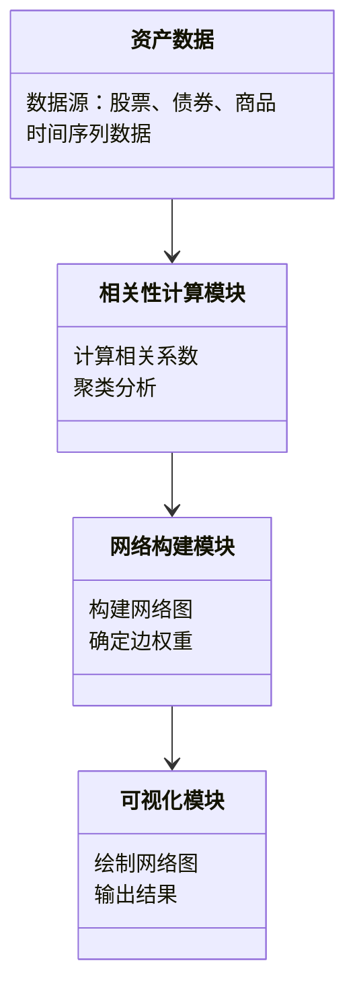

                 


# 金融市场跨资产相关性网络分析工具

---

## 关键词：
金融市场、跨资产相关性、网络分析工具、复杂网络、动态网络模型、异构网络、系统架构设计

---

## 摘要：
金融市场中的资产相关性分析是理解市场风险、优化投资组合和制定交易策略的重要工具。传统的相关性分析通常基于单一资产类别或固定的时间窗口，难以捕捉多资产类别之间的复杂关联。本文介绍了一种基于网络分析的跨资产相关性分析工具，通过构建跨资产相关性网络，揭示不同资产类别之间的动态关联关系。本文从理论基础、算法实现、系统架构设计到实际案例分析，全面探讨了跨资产相关性网络分析的方法和应用，并结合代码实现和可视化工具，展示了该工具的实际价值和应用场景。

---

# 正文

## 第一部分：金融市场跨资产相关性网络分析工具概述

### 第1章：问题背景与核心概念

#### 1.1 问题背景
金融市场中的资产相关性分析是理解市场风险、优化投资组合和制定交易策略的重要工具。然而，传统的相关性分析通常基于单一资产类别或固定的时间窗口，难以捕捉多资产类别之间的复杂关联。随着金融市场全球化和多样化的加剧，跨资产相关性网络分析的需求日益增长。

#### 1.2 跨资产相关性网络分析的定义与特点
- **定义**：跨资产相关性网络分析是通过构建一个多资产类别之间的相关性网络，研究资产之间的相互作用和关联关系。
- **特点**：
  - 跨资产相关性网络能够捕捉不同资产类别之间的动态关联。
  - 网络分析方法可以揭示资产之间非线性关系和复杂结构。
  - 跨资产相关性网络分析适用于多时间尺度和多市场环境。

#### 1.3 本章小结
本章通过定义和特点的介绍，为读者理解跨资产相关性网络分析奠定了基础，后续章节将深入探讨其理论基础、算法实现和实际应用。

---

## 第二部分：跨资产相关性网络分析的核心理论

### 第2章：跨资产相关性网络分析的统计基础

#### 2.1 相关性系数的计算方法
- **皮尔逊相关系数**：
  - 定义：衡量两个变量之间的线性相关性。
  - 计算公式：$$r = \frac{\sum (x_i - \bar{x})(y_i - \bar{y})}{\sqrt{\sum (x_i - \bar{x})^2} \sqrt{\sum (y_i - \bar{y})^2}}$$
- **斯皮尔曼相关系数**：
  - 定义：衡量两个变量之间的秩相关性。
  - 适用于非线性关系的分析。

#### 2.2 聚类分析与网络构建
- **聚类分析**：
  - 将相关性较高的资产聚类在一起，形成网络中的社区结构。
  - 常用算法：K-means、层次聚类、谱聚类。
- **网络构建**：
  - 基于相关性矩阵构建无向图，边权重表示相关性强度。

#### 2.3 网络密度与中心性分析
- **网络密度**：
  - 定义：网络中边的数量与可能边数的比率。
  - 公式：$$\text{密度} = \frac{\text{边数}}{\binom{n}{2}}$$
- **中心性分析**：
  - 定义：衡量网络中节点的重要程度。
  - 常用指标：度中心性、中间中心性、接近中心性。

### 第3章：复杂网络理论在金融中的应用

#### 3.1 复杂网络的基本概念
- **节点**：代表资产。
- **边**：代表资产之间的相关性。
- **网络属性**：度分布、聚类系数、路径长度。

#### 3.2 股票网络的构建与分析
- **股票网络构建**：
  - 数据来源：股票价格数据。
  - 网络构建：基于股票价格的相关性矩阵。
- **网络分析**：
  - 社区检测：识别相关性较高的股票集群。
  - 中心性分析：识别对市场波动影响较大的关键股票。

#### 3.3 资产价格波动的网络传播机制
- **信息传播**：
  - 市场恐慌的传播路径。
  - 网络中的信息扩散模型。
- **网络鲁棒性**：
  - 网络的抗攻击性和抗故障性。
  - 关键节点的识别与保护。

### 第4章：跨资产相关性网络的动态模型

#### 4.1 动态网络模型的构建
- **时间序列数据**：
  - 滑动窗口方法：计算不同时间窗口内的相关性。
  - 动态网络更新：实时更新网络结构。
- **动态相关性分析**：
  - 考虑资产价格的短期波动和长期趋势。

#### 4.2 时间序列数据的特征提取
- **移动平均（MA）**：
  - 公式：$$\text{MA}_n = \frac{1}{n} \sum_{i=1}^{n} p_i$$
- **指数移动平均（EMA）**：
  - 公式：$$\text{EMA}_t = \alpha p_t + (1 - \alpha) \text{EMA}_{t-1}$$

#### 4.3 网络演化过程中的关键节点识别
- **关键节点识别**：
  - 基于度中心性和中间中心性的综合评估。
  - 时间序列分析：识别资产价格波动的关键时间点。

---

## 第三部分：跨资产相关性网络分析的算法实现

### 第5章：数据预处理与特征提取

#### 5.1 数据清洗与标准化
- **数据清洗**：
  - 处理缺失值、异常值。
  - 数据标准化：$$z = \frac{x - \mu}{\sigma}$$
- **特征提取**：
  - 时间序列特征：均值、方差、自相关系数。
  - 统计特征：最大值、最小值、标准差。

### 第6章：相关性网络构建算法

#### 6.1 基于相关系数的网络构建
- **Python代码示例**：
  ```python
  import numpy as np
  import pandas as pd

  # 计算相关性矩阵
  df = pd.DataFrame(data)
  correlation_matrix = df.corr()

  # 构建网络边列表
  edges = []
  for i in range(len(correlation_matrix)):
      for j in range(i+1, len(correlation_matrix)):
          if abs(correlation_matrix.iloc[i,j]) > 0.3:
              edges.append((i, j, correlation_matrix.iloc[i,j]))
  ```

#### 6.2 基于聚类分析的网络构建
- **层次聚类**：
  ```python
  from sklearn.cluster import AgglomerativeClustering

  # 聚类分析
  n_clusters = 3
  clustering = AgglomerativeClustering(n_clusters=n_clusters).fit_predict(data)
  ```

#### 6.3 基于复杂网络算法的网络构建
- **Louvain算法**：
  ```python
  import community

  # 构建网络图
  graph = {}
  for i in range(len(edges)):
      u, v, weight = edges[i]
      if u not in graph:
          graph[u] = []
      if v not in graph:
          graph[v] = []
      graph[u].append(v)
      graph[v].append(u)
  ```

---

## 第四部分：跨资产相关性网络分析系统的架构设计

### 第7章：系统功能设计

#### 7.1 领域模型（Mermaid类图）


#### 7.2 系统架构设计（Mermaid架构图）
```mermaid
container 跨资产相关性网络分析系统 {
    资产数据源
    相关性计算模块
    网络构建模块
    可视化模块
}

资产数据源 --> 相关性计算模块
相关性计算模块 --> 网络构建模块
网络构建模块 --> 可视化模块
```

### 第8章：接口设计与交互流程

#### 8.1 接口设计
- **输入接口**：
  - 数据输入：资产价格数据。
  - 参数设置：相关性阈值、聚类算法参数。
- **输出接口**：
  - 网络图可视化结果。
  - 社区检测结果。

#### 8.2 交互流程（Mermaid序列图）
```mermaid
sequenceDiagram
    用户 --> 输入资产数据：调用API
    资产数据 --> 相关性计算模块：计算相关性矩阵
    相关性计算模块 --> 网络构建模块：构建网络图
    网络构建模块 --> 可视化模块：绘制网络图
    可视化模块 --> 用户：返回可视化结果
```

---

## 第五部分：项目实战与案例分析

### 第9章：项目实战

#### 9.1 环境安装与配置
- **Python环境**：
  - 安装必要的库：networkx、community、pandas、numpy。
  ```bash
  pip install networkx community pandas numpy
  ```

#### 9.2 核心代码实现
- **数据加载与预处理**：
  ```python
  import pandas as pd
  df = pd.read_csv('assets.csv')
  df = df.dropna().reset_index(drop=True)
  ```

- **相关性计算与网络构建**：
  ```python
  import numpy as np
  import networkx as nx

  # 计算相关性矩阵
  correlation_matrix = df.corr()

  # 构建网络图
  G = nx.Graph()
  for i in range(len(correlation_matrix)):
      for j in range(i+1, len(correlation_matrix)):
          if abs(correlation_matrix.iloc[i,j]) > 0.3:
              G.add_edge(i, j, weight=abs(correlation_matrix.iloc[i,j]))
  ```

#### 9.3 案例分析
- **案例背景**：
  - 数据来源：股票价格数据。
  - 分析目标：识别相关性较高的资产集群。
- **分析结果**：
  - 社区检测结果：识别出3个相关性较高的资产集群。
  - 网络可视化：使用Matplotlib绘制网络图。

---

## 第六部分：总结与展望

### 第10章：最佳实践与小结

#### 10.1 最佳实践
- 数据预处理：确保数据的完整性和准确性。
- 网络构建：选择合适的相关性计算方法和聚类算法。
- 可视化：使用专业的可视化工具（如Gephi）进行网络分析。

#### 10.2 注意事项
- 网络分析结果仅供参考，需结合实际情况进行调整。
- 数据更新频率：实时分析需考虑计算资源限制。

#### 10.3 未来展望
- **深度学习**：引入深度学习模型进行跨资产相关性预测。
- **实时分析**：开发实时网络分析工具，捕捉市场波动。

---

## 作者信息

作者：AI天才研究院/AI Genius Institute & 禅与计算机程序设计艺术 /Zen And The Art of Computer Programming

---

通过以上目录和内容的详细规划，我们可以看到《金融市场跨资产相关性网络分析工具》将从理论到实践，全面探讨跨资产相关性网络分析的方法和应用，帮助读者深入理解并掌握这一领域的核心知识。

