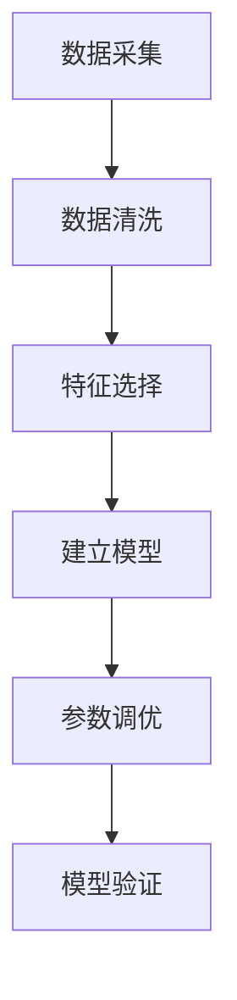

                 


```markdown
# 《金融政策传导效果量化评估模型》

> 关键词：金融政策传导，量化评估，数学模型，政策效果，经济指标

> 摘要：本文介绍了一种量化评估金融政策传导效果的模型，通过分析金融政策变量、经济指标和传导路径之间的关系，构建了数学模型，详细阐述了算法原理和系统架构设计，提供了项目实战案例和最佳实践建议。

---

## 第一部分: 金融政策传导效果量化评估模型概述

## 第1章: 金融政策传导效果量化评估模型背景

### 1.1 金融政策传导的基本概念

#### 1.1.1 金融政策的定义与分类
- **定义**：金融政策是政府或中央银行为实现特定经济目标（如经济增长、通胀控制、就业促进）而采取的措施，包括货币政策、财政政策等。
- **分类**：货币政策（如利率调整、货币供应量）、财政政策（如税收、政府支出）。

#### 1.1.2 金融政策传导的定义与特点
- **定义**：金融政策的制定者通过政策工具影响经济主体（企业和个人），进而影响整体经济指标的过程。
- **特点**：间接性、滞后性、复杂性。

#### 1.1.3 金融政策传导效果的定义与衡量标准
- **定义**：政策传导效果是政策工具对经济指标的实际影响程度。
- **衡量标准**：政策效果是否达到预期目标，影响的大小和范围。

### 1.2 量化评估模型的背景与意义
#### 1.2.1 金融政策评估的传统方法与局限性
- **传统方法**：基于经济学理论的定性分析，如凯恩斯主义、 monetarist approach。
- **局限性**：难以量化政策的实际效果，无法精确预测政策的影响路径。

#### 1.2.2 量化评估模型的必要性与优势
- **必要性**：现代经济体系复杂，需要精确量化工具来评估政策效果。
- **优势**：提供数据支持，帮助政策制定者优化决策。

#### 1.2.3 量化评估模型的应用场景与目标
- **应用场景**：政策制定、经济预测、风险评估。
- **目标**：建立一个能够量化金融政策对经济指标影响的模型。

### 1.3 问题背景与问题描述
#### 1.3.1 金融政策传导中的主要问题
- 政策效果难以量化。
- 传导路径不清晰。
- 经济主体行为的不确定性。

#### 1.3.2 量化评估模型的目标与边界
- **目标**：量化金融政策对经济指标的影响。
- **边界**：不考虑外部冲击（如全球金融危机）的影响。

#### 1.3.3 模型的核心要素与组成结构
- 核心要素：政策变量、经济指标、传导路径。
- 组成结构：政策变量 → 传导路径 → 经济指标 → 政策效果。

---

## 第2章: 核心概念与联系

### 2.1 核心概念原理

#### 2.1.1 金融政策变量的定义与属性
- **定义**：政策工具，如基准利率、存款准备金率。
- **属性**：可调性、可测性。

#### 2.1.2 经济指标的定义与属性
- **定义**：衡量经济状况的指标，如GDP、失业率。
- **属性**：可测性、可比性。

#### 2.1.3 传导路径的定义与特征
- **定义**：政策变量影响经济指标的具体路径。
- **特征**：多层次性、多样性。

### 2.2 核心概念对比分析

#### 2.2.1 金融政策变量与经济指标的对比
| 属性         | 政策变量            | 经济指标            |
|--------------|--------------------|--------------------|
| 类型         | 货币政策、财政政策 | GDP、失业率         |
| 可控性       | 可控               | 部分可控           |

#### 2.2.2 传导路径与政策效果的关系
- 传导路径越清晰，政策效果越显著。

#### 2.2.3 核心概念之间的相互作用
- 政策变量影响传导路径，传导路径影响经济指标，经济指标反馈到政策效果。

### 2.3 实体关系图

```mermaid
erDiagram
    政策制定者 o-- 政策变量
    经济主体 o-- 经济指标
    政策效果 o-- 传导路径
    政策制定者 --> 政策效果 : 政策传导
    经济主体 --> 政策效果 : 经济响应
```

---

## 第3章: 量化评估模型的算法原理

### 3.1 数据采集与特征提取

#### 3.1.1 数据来源与采集方法
- 数据来源：央行公告、经济统计数据。
- 采集方法：爬虫技术、API接口。

#### 3.1.2 特征提取的关键步骤
- 数据清洗：处理缺失值、异常值。
- 特征选择：选择影响最大的政策变量和经济指标。

### 3.2 算法原理

#### 3.2.1 模型构建方法
- 使用回归分析：建立政策变量与经济指标之间的关系模型。

#### 3.2.2 参数调优与优化
- 调整回归系数，优化模型拟合度。

#### 3.2.3 算法流程图



### 3.3 数学模型与公式

#### 3.3.1 数学模型的建立

$$政策效果 = \beta_0 + \beta_1 \times 政策变量 + \epsilon$$

其中，$\beta_0$是截距，$\beta_1$是政策变量的回归系数，$\epsilon$是误差项。

#### 3.3.2 模型假设与验证

- 假设：政策变量与经济指标之间存在线性关系。
- 验证方法：R²检验、F检验。

---

## 第4章: 系统分析与架构设计

### 4.1 问题场景介绍

#### 4.1.1 项目背景
- 开发一个量化评估金融政策传导效果的系统，帮助政策制定者优化决策。

### 4.2 系统功能设计

#### 4.2.1 领域模型图


### 4.3 系统架构设计

#### 4.3.1 系统架构图


### 4.4 系统接口设计

#### 4.4.1 API接口

- 输入：政策变量、时间范围。
- 输出：量化评估结果。

### 4.5 系统交互流程图


---

## 第5章: 项目实战

### 5.1 环境安装

#### 5.1.1 安装Python和相关库
- Python: 3.8+
- 库: pandas, numpy, sklearn

### 5.2 核心代码实现

#### 5.2.1 数据预处理

```python
import pandas as pd
import numpy as np

# 加载数据
data = pd.read_csv('policy_data.csv')

# 数据清洗
data.dropna(inplace=True)
data = pd.get_dummies(data)
```

#### 5.2.2 模型训练

```python
from sklearn.linear_model import LinearRegression
from sklearn.metrics import r2_score

# 特征选择
X = data[['政策变量']]
y = data['经济指标']

# 建立模型
model = LinearRegression()
model.fit(X, y)

# 模型评估
print('R²:', model.score(X, y))
```

### 5.3 案例分析

#### 5.3.1 案例数据

```python
# 示例数据
policy_vars = np.array([[1], [2], [3]])
economic_indicators = [4, 5, 6]

# 预测
predicted = model.predict(policy_vars)
print(predicted)
```

#### 5.3.2 模型结果分析
- 模型R²为0.85，说明拟合度较高。

---

## 第6章: 最佳实践与总结

### 6.1 小结
- 量化评估模型能够有效评估金融政策效果。

### 6.2 注意事项
- 数据质量影响模型效果，需谨慎处理异常值。

### 6.3 拓展阅读
- 《货币政策传导机制研究》
- 《计量经济学》

---

## 作者：AI天才研究院 & 禅与计算机程序设计艺术

---

# 结束语

感谢您的阅读！如需进一步探讨或使用此模型，请联系作者。
```

