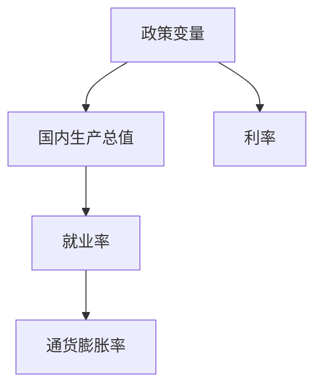
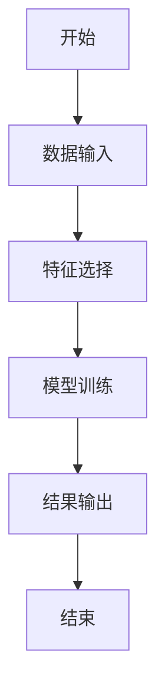
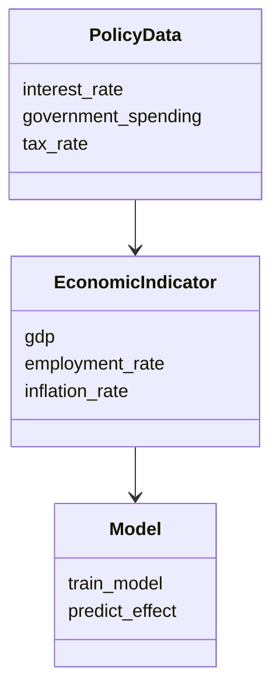
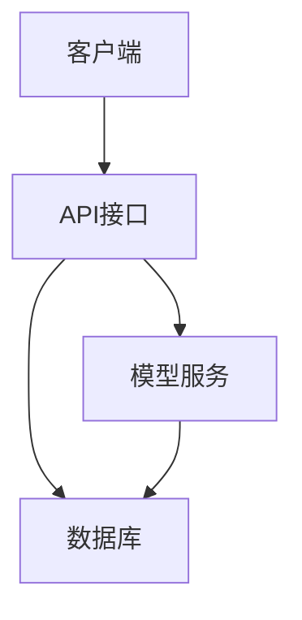
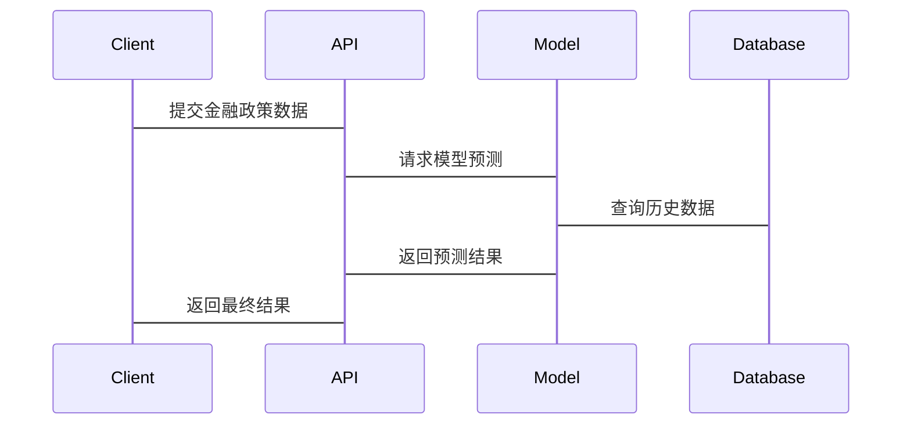

                 


# 《金融政策影响定量评估模型》

> 关键词：金融政策，定量评估，经济模型，政策影响，数据驱动

> 摘要：本文构建了一个金融政策影响的定量评估模型，通过分析金融政策对经济指标的影响，提出了一种基于数据驱动的方法来量化政策效果。该模型结合了线性回归和时间序列分析，能够帮助政策制定者更好地预测和评估政策效果。

---

# 第一部分: 金融政策影响定量评估模型的背景与意义

## 第1章: 金融政策影响定量评估模型的背景与意义

### 1.1 问题背景

#### 1.1.1 金融政策的定义与作用
金融政策是政府或央行为了实现特定经济目标而采取的措施，包括货币政策、财政政策等。这些政策通过调节货币供应量、利率、税收等手段，影响市场参与者的行为，进而影响整体经济。

#### 1.1.2 金融政策对经济的影响
金融政策对经济的影响是多方面的，包括GDP增长率、就业率、通货膨胀率等。然而，这些影响往往是复杂的，涉及多个变量之间的相互作用。

#### 1.1.3 定量评估模型的必要性
传统的定性分析难以准确量化金融政策的效果，而定量评估模型可以通过数据分析，提供更为客观和精确的评估结果。

### 1.2 问题描述

#### 1.2.1 金融政策影响的多维度性
金融政策的影响涉及多个方面，例如货币政策对通货膨胀的影响、财政政策对企业投资的影响等。

#### 1.2.2 定量评估的挑战与难点
- 数据的复杂性和不完全性
- 模型的简化与实际的复杂性之间的矛盾
- 如何处理政策的滞后效应

#### 1.2.3 建立模型的目标与意义
- 提供一个量化工具，帮助政策制定者评估政策效果
- 通过模型分析，优化政策组合，提高政策效率

### 1.3 问题解决

#### 1.3.1 模型的基本思路
- 数据收集与预处理
- 建立数学模型
- 模型训练与优化
- 结果分析与验证

#### 1.3.2 模型的核心假设
- 数据的完整性和代表性
- 模型的线性假设
- 政策效果的可量化性

#### 1.3.3 模型的适用范围与边界
- 适用于宏观经济分析
- 不适用于微观个体行为的预测
- 适用于短期至中期的政策效果评估

### 1.4 概念结构与核心要素

#### 1.4.1 模型的核心要素
- 输入变量：政策变量（如利率、税率）、经济指标（如GDP、失业率）
- 输出变量：政策效果（如GDP增长率的变化）
- 中间变量：市场反应（如企业投资、消费者行为）

#### 1.4.2 模型的输入变量与输出变量
- 输入变量：政策变量（如货币政策、财政政策）
- 输出变量：经济指标（如GDP、通货膨胀率）
- 中间变量：市场反应（如企业投资、消费者行为）

#### 1.4.3 模型的假设条件与限制
- 数据的可获得性
- 模型的简化假设
- 政策的稳定性

---

## 第2章: 核心概念与联系

### 2.1 金融政策的核心原理

#### 2.1.1 金融政策的作用机制
- 货币政策通过调节货币供应量影响利率，进而影响投资和消费
- 财政政策通过调整政府支出和税收影响企业和个人的行为

#### 2.1.2 金融政策的传导路径
1. 货币政策 → 利率变化 → 投资变化
2. 财政政策 → 税收变化 → 消费变化
3. 综合效应 → 经济指标变化（如GDP、就业率）

#### 2.1.3 金融政策的量化指标
- 利率水平
- 货币供应量
- 政府支出
- 税率

### 2.2 核心概念的属性特征对比

#### 2.2.1 线性模型与非线性模型的对比
| 特性         | 线性模型         | 非线性模型        |
|--------------|------------------|-------------------|
| 模型复杂度   | 低               | 高                |
| 解释性       | 强               | 弱                |
| 适用场景     | 线性关系明显      | 非线性关系复杂     |

#### 2.2.2 宏观模型与微观模型的对比
| 特性         | 宏观模型         | 微观模型          |
|--------------|------------------|-------------------|
| 数据粒度     | 宏观数据（如GDP） | 微观数据（如企业） |
| 应用场景     | 宏观经济分析      | 企业行为分析       |

#### 2.2.3 静态模型与动态模型的对比
| 特性         | 静态模型         | 动态模型          |
|--------------|------------------|-------------------|
| 时间维度     | 静态             | 动态              |
| 变化趋势     | 无               | 有                |
| 适用场景     | 短期预测          | 中长期预测         |

### 2.3 ER实体关系图架构



### 2.4 本章小结

---

## 第3章: 算法原理讲解

### 3.1 算法原理概述

#### 3.1.1 线性回归模型
线性回归是一种简单而有效的统计学习方法，适用于预测连续型变量。

- 单变量线性回归：$y = a + bx + \epsilon$
- 多变量线性回归：$y = a + b_1x_1 + b_2x_2 + \dots + b_nx_n + \epsilon$

#### 3.1.2 时间序列分析
时间序列分析用于研究随时间变化的数据，常用ARIMA模型。

- ARIMA模型：$y_t = \phi_1y_{t-1} + \theta_1\epsilon_{t-1} + \epsilon_t$

#### 3.1.3 非线性回归模型
非线性回归模型适用于复杂的关系，如多项式回归。

- 二次回归：$y = a + bx + cx^2 + \epsilon$

### 3.2 算法流程图



### 3.3 算法实现代码

#### 3.3.1 线性回归实现

```python
import numpy as np
from sklearn.linear_model import LinearRegression

# 数据准备
X = np.array([[1], [2], [3], [4], [5]])
y = np.array([2, 4, 5, 4, 6])

# 模型训练
model = LinearRegression()
model.fit(X, y)

# 预测结果
print(model.predict(X))
```

#### 3.3.2 时间序列分析实现

```python
from statsmodels.tsa.arima_model import ARIMA

# 数据准备
data = [1, 2, 3, 4, 5]

# 模型训练
model = ARIMA(data, order=(1, 1, 1))
model_fit = model.fit()

# 预测结果
print(model_fit.forecast())
```

---

## 第4章: 系统分析与架构设计方案

### 4.1 项目背景

#### 4.1.1 项目介绍
本项目旨在构建一个能够定量评估金融政策影响的系统，帮助政策制定者更好地理解和预测政策效果。

### 4.2 系统功能设计

#### 4.2.1 领域模型类图



#### 4.2.2 系统架构图



#### 4.2.3 系统接口设计
- 输入接口：金融政策数据
- 输出接口：政策效果预测
- 数据接口：经济指标数据

#### 4.2.4 系统交互流程



---

## 第5章: 项目实战

### 5.1 环境安装

```bash
pip install numpy pandas sklearn statsmodels
```

### 5.2 系统核心实现

#### 5.2.1 数据预处理

```python
import pandas as pd

# 数据加载
data = pd.read_csv('financial_policy.csv')

# 数据清洗
data.dropna(inplace=True)
data = pd.get_dummies(data)
```

#### 5.2.2 模型训练

```python
from sklearn.model_selection import train_test_split
from sklearn.linear_model import LinearRegression

# 数据分割
X_train, X_test, y_train, y_test = train_test_split(data.drop('gdp', axis=1), data['gdp'], test_size=0.2)

# 模型训练
model = LinearRegression()
model.fit(X_train, y_train)

# 模型评估
print(model.score(X_test, y_test))
```

#### 5.2.3 结果分析

```python
import matplotlib.pyplot as plt

# 预测结果
y_pred = model.predict(X_test)

# 可视化
plt.scatter(y_test, y_pred)
plt.xlabel('真实值')
plt.ylabel('预测值')
plt.show()
```

---

## 第6章: 最佳实践

### 6.1 小结
通过构建金融政策影响的定量评估模型，我们可以更准确地预测和评估政策效果，为政策制定提供科学依据。

### 6.2 注意事项
- 数据的准确性和完整性
- 模型的适用性和限制
- 政策的动态变化

### 6.3 拓展阅读
- 《金融时间序列分析》
- 《计量经济学》
- 《机器学习在金融中的应用》

---

作者：AI天才研究院/AI Genius Institute & 禅与计算机程序设计艺术 /Zen And The Art of Computer Programming

