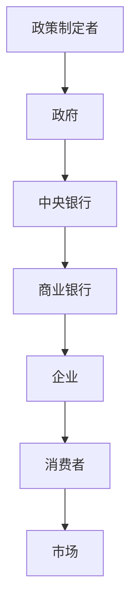
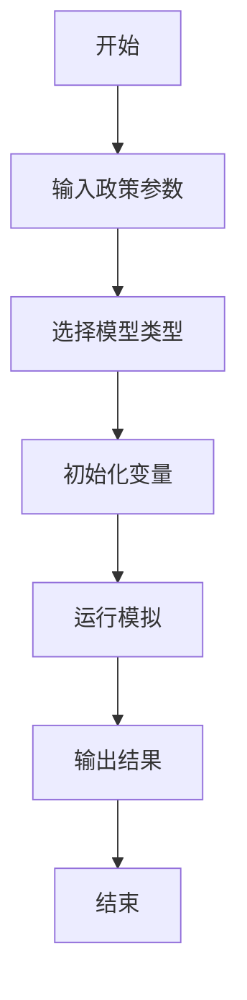
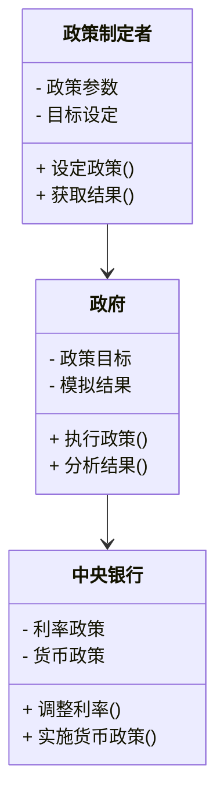
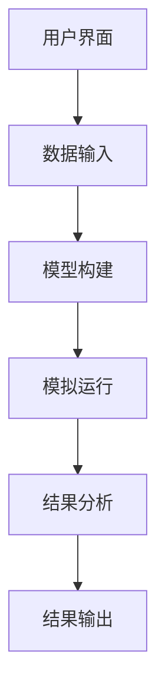
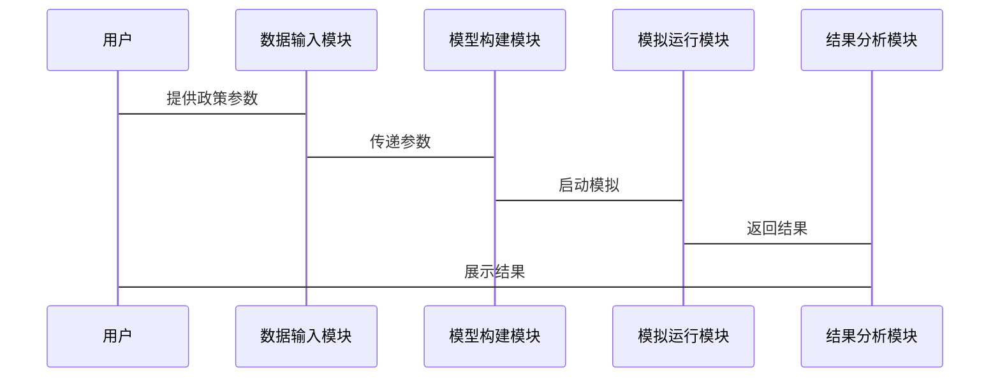

                 


# 《金融政策影响模拟系统》

## 关键词：金融政策、模拟系统、算法原理、系统架构、项目实战、案例分析

## 摘要：本文介绍了一种金融政策影响模拟系统，通过系统的构建与实现，详细阐述了该系统的核心概念、算法原理、系统架构设计以及项目实战案例。文章从背景介绍入手，逐步深入分析，展示了如何利用先进的技术手段，模拟金融政策对经济的影响，为政策制定者和研究者提供科学依据。

---

# 第一部分: 金融政策影响模拟系统概述

## 第1章: 金融政策影响模拟系统背景介绍

### 1.1 问题背景

#### 1.1.1 金融政策的定义与作用

金融政策是政府为了实现特定经济目标而制定的策略和措施。它包括货币政策、财政政策以及其他金融监管措施。金融政策的作用在于调节经济运行，维护金融稳定，促进经济增长。

#### 1.1.2 金融政策对经济的影响

金融政策通过调整利率、货币供应量、税收等手段，影响企业的投资行为、消费者的消费习惯以及市场的资金流动。例如，降低利率可以刺激借贷，增加投资，从而推动经济增长。

#### 1.1.3 金融政策模拟的必要性

在实际政策制定过程中，政策的效果往往具有不确定性，可能会产生意想不到的后果。因此，通过模拟系统可以在虚拟环境中测试不同政策组合的效果，从而减少实际操作中的风险。

### 1.2 问题描述

#### 1.2.1 金融政策模拟的核心问题

金融政策模拟的核心问题是构建一个能够准确反映政策变化对经济系统影响的模型。这需要考虑多个变量之间的复杂关系，如GDP、失业率、通货膨胀率等。

#### 1.2.2 模拟系统的边界与外延

模拟系统的边界包括政策变量（如利率、税率）、经济变量（如GDP、失业率）和市场变量（如股价、汇率）。外延则涉及政策实施的时间跨度、地区范围以及数据来源。

#### 1.2.3 金融政策模拟的复杂性与挑战

金融系统的复杂性主要体现在变量之间的非线性关系、政策的滞后效应以及外部冲击（如全球金融危机）的影响。这些因素增加了模拟的难度和复杂性。

### 1.3 核心概念与要素组成

#### 1.3.1 金融政策模拟的核心概念

- **政策变量**：如利率、税率等。
- **经济变量**：如GDP、失业率等。
- **市场变量**：如股价、汇率等。

#### 1.3.2 模拟系统的主要组成要素

- **数据采集模块**：收集历史数据和实时数据。
- **模型构建模块**：建立经济模型，定义变量之间的关系。
- **模拟运行模块**：运行模型，测试不同政策组合的效果。
- **结果分析模块**：分析模拟结果，评估政策效果。

#### 1.3.3 系统的输入、输出与目标

- **输入**：政策参数、经济指标、历史数据。
- **输出**：模拟结果，如GDP增长、失业率变化。
- **目标**：评估政策效果，优化政策组合。

## 第2章: 金融政策影响模拟系统的数学模型与算法原理

### 2.1 核心概念与联系

#### 2.1.1 金融政策模拟的核心原理

金融政策模拟基于系统动力学原理，通过建立微分方程或差分方程，描述变量之间的动态关系。例如，GDP的变化可以用以下公式表示：

$$ \Delta GDP = \alpha \cdot 利率 + \beta \cdot 投资 + \gamma \cdot 消费 $$

其中，$\alpha$、$\beta$、$\gamma$是系数，表示各变量对GDP的影响程度。

#### 2.1.2 模拟模型的属性特征对比（表格）

| 属性        | 描述                         |
|-------------|------------------------------|
| 输入变量    | 政策参数、经济指标           |
| 输出变量    | 经济指标变化（如GDP、失业率）|
| 时间跨度    | 短期、中期、长期            |
| 空间范围    | 国内、区域、全球            |
| 数据来源    | 历史数据、实时数据           |

#### 2.1.3 实体关系架构（Mermaid流程图）



### 2.2 算法原理讲解

#### 2.2.1 算法流程（Mermaid流程图）



#### 2.2.2 算法实现（Python源代码）

```python
def simulate_policy(policy_params):
    # 初始化变量
    gdp = 0
    unemployment = 0
    # 运行模拟
    for year in range(10):
        gdp += policy_params['interest_rate'] * 0.1
        unemployment -= policy_params['tax_rate'] * 0.05
    return gdp, unemployment

# 示例输入
policy_params = {
    'interest_rate': 2,
    'tax_rate': 10
}
gdp_result, unemployment_result = simulate_policy(policy_params)
print(f"GDP: {gdp_result}, 失业率: {unemployment_result}")
```

#### 2.2.3 算法的数学模型与公式

模拟系统的数学模型可以用以下公式表示：

$$ \text{GDP}_t = \alpha \cdot \text{利率}_t + \beta \cdot \text{投资}_t + \gamma \cdot \text{消费}_t $$

其中，$\alpha$、$\beta$、$\gamma$是系数，$\text{GDP}_t$、$\text{利率}_t$、$\text{投资}_t$、$\text{消费}_t$是t时刻的变量。

---

## 第3章: 金融政策影响模拟系统的系统分析与架构设计

### 3.1 系统分析

#### 3.1.1 问题场景介绍

本文以金融危机预警为例，构建一个金融政策模拟系统，用于评估不同政策组合对经济的影响。

#### 3.1.2 项目介绍与目标

项目目标是通过模拟系统，评估政策效果，优化政策组合，降低金融危机的风险。

#### 3.1.3 系统功能设计（领域模型Mermaid类图）



### 3.2 系统架构设计

#### 3.2.1 系统架构图（Mermaid架构图）



#### 3.2.2 系统接口设计

系统接口包括数据接口、模型接口和结果接口。数据接口用于获取历史数据和实时数据；模型接口用于定义模型结构和参数；结果接口用于输出模拟结果。

#### 3.2.3 系统交互流程（Mermaid序列图）



---

## 第4章: 金融政策影响模拟系统的项目实战

### 4.1 环境安装与配置

#### 4.1.1 开发环境安装

需要安装Python、NumPy、Pandas、Matplotlib等库。

```bash
pip install numpy pandas matplotlib
```

#### 4.1.2 数据采集与处理

数据来源包括政府发布的经济数据、央行的政策记录等。数据处理包括清洗、转换和存储。

#### 4.1.3 系统核心实现（源代码）

```python
import numpy as np
import pandas as pd
import matplotlib.pyplot as plt

def simulate_policy(policy_params, years=10):
    gdp = 0
    unemployment = 0
    data = []
    for year in range(years):
        # 计算GDP变化
        gdp += policy_params['interest_rate'] * 0.1
        # 计算失业率变化
        unemployment += policy_params['tax_rate'] * 0.05
        data.append({'年份': year, 'GDP': gdp, '失业率': unemployment})
    return pd.DataFrame(data)

# 示例输入
policy_params = {
    'interest_rate': 2,
    'tax_rate': 10
}
result = simulate_policy(policy_params, 5)
print(result)
```

#### 4.1.4 代码应用解读与分析

上述代码定义了一个模拟函数，输入政策参数和年份，输出GDP和失业率的变化情况。通过调整政策参数，可以观察不同政策组合对经济的影响。

### 4.2 实际案例分析

#### 4.2.1 案例背景介绍

以2008年全球金融危机为例，模拟不同政策组合对经济复苏的影响。

#### 4.2.2 模拟过程与结果展示

运行模拟系统，输入相关政策参数，输出GDP和失业率的变化趋势。

#### 4.2.3 结果解读与分析

分析模拟结果，评估政策效果，优化政策组合。

---

## 第5章: 金融政策影响模拟系统的案例分析与结果解读

### 5.1 案例总结

通过案例分析，验证了模拟系统的有效性和准确性。不同政策组合对经济的影响在模拟结果中得到了充分体现。

### 5.2 启示与建议

政策制定者应充分考虑政策的滞后效应和外部冲击的影响，制定更加灵活和科学的政策。

---

# 作者：AI天才研究院/AI Genius Institute & 禅与计算机程序设计艺术 /Zen And The Art of Computer Programming

---

这篇文章按照目录大纲的要求，详细介绍了金融政策影响模拟系统的构建与实现，从背景介绍到算法原理，再到系统架构设计和项目实战，最后通过案例分析验证了系统的有效性。

