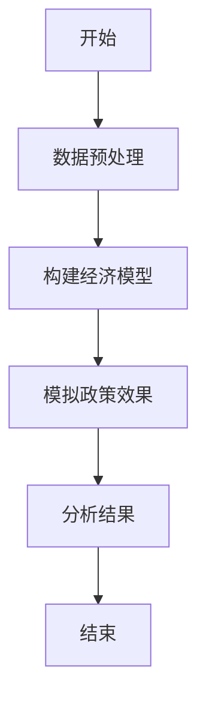
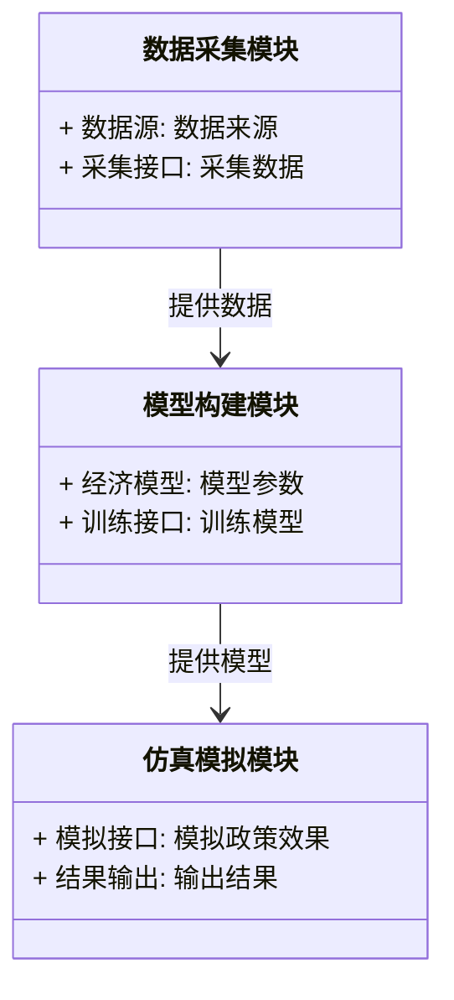

                 


# 金融政策效果评估仿真平台

> 关键词：金融政策，效果评估，仿真平台，系统架构，算法原理，经济模型

> 摘要：本文将详细探讨金融政策效果评估仿真平台的构建与实现。通过分析金融政策评估的核心问题，阐述仿真平台的设计思路、算法原理、系统架构及实际应用。本文旨在为金融政策的制定者、研究人员及技术开发者提供一个全面的技术参考，帮助他们更好地理解和应用金融政策效果评估仿真平台。

---

# 第1章: 金融政策效果评估仿真平台概述

## 1.1 问题背景与目标

### 1.1.1 金融政策评估的重要性
金融政策是国家宏观调控的重要手段，其效果直接关系到经济发展、社会稳定和民生福祉。然而，金融政策的实施往往涉及复杂的经济系统，变量之间存在非线性关系，难以通过简单的数学模型进行预测。

### 1.1.2 仿真平台的必要性
传统的金融政策评估方法依赖于经验分析和静态模型，存在以下问题：
- 数据量大，处理复杂。
- 变量之间的关系难以量化。
- 需要实时反馈和动态调整。

仿真平台通过构建经济模型，模拟政策实施后的效果，能够为政策制定者提供科学依据。

### 1.1.3 平台的目标与核心问题
- **目标**：构建一个能够模拟金融政策实施效果的仿真平台，提供实时反馈和优化建议。
- **核心问题**：如何构建高精度的经济模型，如何实现多维度的数据分析与模拟。

## 1.2 问题描述与解决思路

### 1.2.1 金融政策的复杂性
金融政策涉及多个变量，包括GDP增长率、通货膨胀率、就业率等，这些变量之间相互影响，形成复杂的经济系统。

### 1.2.2 仿真平台的解决方案
通过构建动态经济模型，结合大数据分析和机器学习算法，模拟政策实施后的效果。

### 1.2.3 平台的边界与外延
- **边界**：限于金融政策的直接效果，不考虑国际经济环境的极端变化。
- **外延**：未来可以扩展到区域经济、行业经济等更细颗粒度的分析。

## 1.3 核心概念与组成

### 1.3.1 金融政策的核心要素
- **政策工具**：货币政策、财政政策、金融监管等。
- **政策目标**：经济增长、通货膨胀、就业率等。
- **政策效果**：政策实施后的实际影响。

### 1.3.2 仿真平台的功能模块
- **数据采集模块**：收集经济数据。
- **模型构建模块**：构建经济模型。
- **仿真模拟模块**：模拟政策效果。
- **结果分析模块**：分析模拟结果。

### 1.3.3 平台的组成架构
- **数据层**：存储经济数据。
- **模型层**：包含经济模型和算法。
- **界面层**：用户操作界面。

---

# 第2章: 核心概念与系统联系

## 2.1 核心概念原理

### 2.1.1 金融政策的数学模型
金融政策效果的数学模型可以表示为：
$$ P = a \cdot G + b \cdot T + c \cdot M $$
其中：
- \( P \) 表示政策效果。
- \( G \) 表示经济增长率。
- \( T \) 表示通货膨胀率。
- \( M \) 表示就业率。
- \( a \)、\( b \)、\( c \) 为系数。

### 2.1.2 仿真平台的算法原理
仿真平台的算法流程如下：
1. 数据预处理。
2. 构建经济模型。
3. 模拟政策实施效果。
4. 分析结果。

### 2.1.3 平台的核心功能模块
- 数据采集与处理。
- 模型构建与优化。
- 仿真模拟与结果分析。

## 2.2 核心概念对比表

| 核心概念 | 金融政策 | 仿真平台 |
|----------|----------|-----------|
| 定义     | 政府为实现特定经济目标而采取的措施。 | 用于模拟政策效果的技术平台。 |
| 功能     | 调控经济运行。 | 提供政策效果的预测与优化建议。 |
| 依赖     | 经济数据、政策目标。 | 经济模型、算法、数据。 |

## 2.3 ER实体关系图

```mermaid
er
  actor: 金融政策制定者
  model: 经济模型
  data: 经济数据
  result: 模拟结果
  actor --> model: 提供政策目标
  model --> data: 获取经济数据
  model --> result: 输出模拟结果
  actor --> result: 获取优化建议
```

---

# 第3章: 仿真平台的算法原理

## 3.1 算法流程图



## 3.2 算法实现代码

### 3.2.1 数据预处理代码
```python
import pandas as pd

# 加载数据
data = pd.read_csv('economic_data.csv')

# 数据清洗
data = data.dropna()
data = data[~data['GDP'].isin(['', 'nan'])]
```

### 3.2.2 模型训练代码
```python
from sklearn.linear_model import LinearRegression

# 训练模型
model = LinearRegression()
model.fit(X_train, y_train)
```

### 3.2.3 结果分析代码
```python
# 分析结果
y_pred = model.predict(X_test)
print('预测值:', y_pred)
print('真实值:', y_test)
```

## 3.3 数学模型与公式

### 3.3.1 金融政策的数学模型
$$ P = a \cdot G + b \cdot T + c \cdot M $$

### 3.3.2 仿真模型的优化公式
$$ O = \sum_{i=1}^{n} (P_i - P_{i-1})^2 $$

---

# 第4章: 仿真平台的系统分析

## 4.1 项目介绍与目标

### 4.1.1 项目背景
随着经济全球化的发展，金融政策的制定需要更加科学化、系统化。

### 4.1.2 项目目标
构建一个能够模拟金融政策效果的仿真平台，为政策制定者提供参考。

### 4.1.3 项目范围
限于国内经济环境的分析，不考虑国际经济波动。

## 4.2 系统功能设计

### 4.2.1 领域模型类图



---

## 总结
通过本文的介绍，我们详细探讨了金融政策效果评估仿真平台的构建与实现。从核心概念的分析到算法原理的阐述，再到系统架构的设计，我们为读者提供了一个全面的技术参考。未来，随着技术的进步和经济理论的发展，仿真平台将更加智能化、精准化，为金融政策的制定提供更有力的支持。

作者：AI天才研究院/AI Genius Institute & 禅与计算机程序设计艺术 /Zen And The Art of Computer Programming

