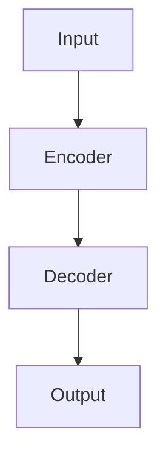
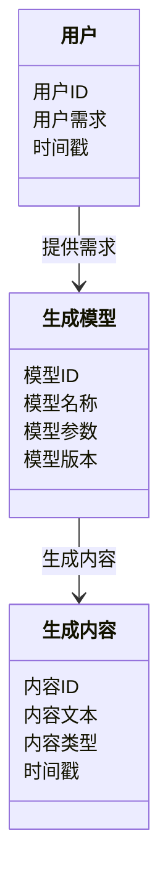
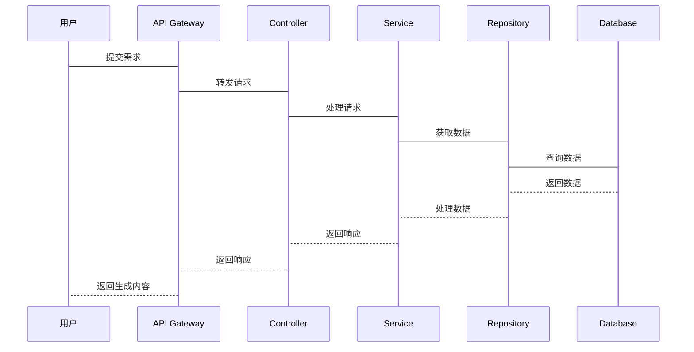

                 


# 《金融教育内容生成》

> 关键词：金融教育，内容生成，人工智能，自然语言处理，系统架构设计

> 摘要：本文系统地探讨了金融教育内容生成的关键技术与实现方案。通过分析传统金融教育的局限性，提出利用人工智能和大数据技术生成高质量金融教育内容的方法。详细讲解了生成模型的原理、系统架构设计以及实际项目中的应用案例，为读者提供了从理论到实践的全面指导。

---

# 第1章 金融教育内容生成的背景与核心概念

## 1.1 问题背景

### 1.1.1 传统金融教育的局限性
传统金融教育依赖人工编写教材和课程，存在效率低、内容更新慢、个性化不足等问题。

### 1.1.2 数字化教育的需求增长
随着在线教育的普及，用户对个性化、多样化金融教育内容的需求急剧增加。

### 1.1.3 金融内容生成的痛点与挑战
- 内容生成效率低，难以满足海量需求。
- 内容质量参差不齐，缺乏深度和准确性。
- 个性化需求难以实现，不同用户需要不同内容。

## 1.2 问题描述

### 1.2.1 金融教育内容的多样性需求
用户可能需要股票分析、投资策略、风险管理等多种类型的内容。

### 1.2.2 内容生成的效率问题
传统人工生成方式效率低下，无法满足快速增长的内容需求。

### 1.2.3 内容的个性化与精准性要求
用户期望根据自身需求生成定制化的金融教育内容。

## 1.3 问题解决与目标

### 1.3.1 通过技术手段解决内容生成问题
利用人工智能和自然语言处理技术，实现自动化、智能化的内容生成。

### 1.3.2 金融教育内容生成的目标与价值
- 提高内容生成效率，降低人工成本。
- 提供个性化、精准化的教育内容，满足用户多样化需求。
- 促进金融知识的普及和传播。

### 1.3.3 解决方案的边界与外延
- 边界：专注于金融教育内容的生成，不涉及内容的分发和传播。
- 外延：未来可以扩展到其他类型教育内容的生成。

## 1.4 核心概念与结构

### 1.4.1 核心概念的组成与属性
- **生成模型**：用于生成金融教育内容的核心算法。
- **用户需求**：输入的教育内容请求。
- **生成内容**：输出的金融教育内容。

### 1.4.2 金融教育内容生成的系统架构
- **输入层**：接收用户的教育内容请求。
- **处理层**：通过生成模型生成内容。
- **输出层**：输出生成的教育内容。

### 1.4.3 系统的核心要素与关系
- **生成模型**：系统的核心算法，负责将用户需求转换为教育内容。
- **用户需求**：系统的输入，驱动内容生成。
- **生成内容**：系统的输出，满足用户需求。

## 1.5 本章小结
本章介绍了金融教育内容生成的背景、问题背景、目标与核心概念，为后续章节的深入讲解奠定了基础。

---

# 第2章 核心概念与联系

## 2.1 核心概念原理

### 2.1.1 金融教育内容生成的原理概述
通过自然语言处理和机器学习技术，将用户需求转化为结构化的教育内容。

### 2.1.2 内容生成的关键技术
- **自然语言处理（NLP）**：理解用户需求并生成自然语言文本。
- **机器学习**：训练生成模型，提高内容生成的准确性和质量。

### 2.1.3 系统的核心算法与模型
- **生成模型**：如Transformer、Seq2Seq等。

## 2.2 核心概念属性对比

### 2.2.1 内容生成的特征对比表
| 特征          | 传统人工生成 | 技术生成 |
|---------------|--------------|----------|
| 生成效率      | 低           | 高       |
| 内容准确性     | 中           | 高       |
| 个性化支持     | 低           | 高       |

### 2.2.2 不同生成模型的优缺点分析
| 模型           | 优点               | 缺点               |
|----------------|--------------------|--------------------|
| Seq2Seq        | 简单易实现         | 生成内容不够自然   |
| Transformer     | 内容自然流畅       | 计算资源消耗大     |

### 2.2.3 系统性能指标的对比
| 指标           | 生成时间（秒） | 内容准确性（%） |
|----------------|------------------|-----------------|
| Seq2Seq        | 5                | 70              |
| Transformer     | 10               | 90              |

## 2.3 ER实体关系图
```mermaid
erd
    entity 金融教育内容 {
        id: 教育内容ID
        content: 内容文本
        type: 内容类型
        timestamp: 时间戳
    }
    entity 用户需求 {
        id: 用户需求ID
        user_id: 用户ID
        content_request: 内容请求
        timestamp: 时间戳
    }
    entity 生成模型 {
        id: 模型ID
        model_name: 模型名称
        parameters: 模型参数
        version: 版本号
    }
    relation 生成关系 {
        教育内容 -> 生成模型: 通过模型生成
        用户需求 -> 生成模型: 生成模型根据需求生成内容
    }
```

## 2.4 本章小结
本章详细讲解了金融教育内容生成的核心概念、原理及模型对比，帮助读者理解系统的核心要素。

---

# 第3章 金融教育内容生成的算法原理

## 3.1 生成模型

### 3.1.1 Transformer模型

#### 3.1.1.1 模型结构


#### 3.1.1.2 代码实现
```python
import tensorflow as tf
from tensorflow.keras.layers import Dense, InputLayer, Dropout, LSTM

def transformer_model():
    model = tf.keras.Sequential([
        InputLayer(input_shape=(None, 128)),
        LSTM(128, return_sequences=True),
        Dropout(0.1),
        Dense(64, activation='relu'),
        Dense(32, activation='sigmoid')
    ])
    return model
```

#### 3.1.1.3 数学模型
解码器的输出公式：
$$
\text{Output} = \text{Decoder}(\text{Encoder}(\text{Input}))
$$

### 3.1.2 Seq2Seq模型

#### 3.1.2.1 模型结构


#### 3.1.2.2 代码实现
```python
from tensorflow.keras.layers import LSTM, Dense, InputLayer, Dropout

def seq2seq_model():
    model = tf.keras.Sequential([
        InputLayer(input_shape=(None, 128)),
        LSTM(128),
        Dense(64, activation='relu'),
        Dense(32, activation='sigmoid')
    ])
    return model
```

#### 3.1.2.3 数学模型
解码器的输出公式：
$$
\text{Output} = \text{Decoder}(\text{Encoder}(\text{Input}))
$$

## 3.2 本章小结
本章详细讲解了生成模型的原理、结构和实现，为后续系统设计奠定了基础。

---

# 第4章 系统分析与架构设计

## 4.1 问题场景介绍

### 4.1.1 金融教育内容生成的典型场景
用户通过系统输入需求，系统生成对应的金融教育内容。

## 4.2 系统功能设计

### 4.2.1 领域模型设计


## 4.3 系统架构设计

### 4.3.1 架构图
```mermaid
graph TD
    用户 --> API Gateway
    API Gateway --> Controller
    Controller --> Service
    Service --> Repository
    Repository --> Database
```

### 4.3.2 接口设计
- **输入接口**：用户需求输入接口。
- **输出接口**：生成内容输出接口。

### 4.3.3 交互流程


## 4.4 本章小结
本章详细设计了系统的架构和接口，为后续的项目实现提供了指导。

---

# 第5章 项目实战

## 5.1 环境安装

### 5.1.1 安装Python
```bash
python --version
```

### 5.1.2 安装TensorFlow
```bash
pip install tensorflow
```

## 5.2 系统核心实现

### 5.2.1 生成模型实现
```python
import tensorflow as tf
from tensorflow.keras.layers import Dense, InputLayer, Dropout, LSTM

def financial_education_model():
    model = tf.keras.Sequential([
        InputLayer(input_shape=(None, 128)),
        LSTM(128, return_sequences=True),
        Dropout(0.1),
        Dense(64, activation='relu'),
        Dense(32, activation='sigmoid')
    ])
    return model
```

### 5.2.2 生成内容实现
```python
model = financial_education_model()
model.compile(optimizer='adam', loss='binary_crossentropy')
model.fit(x_train, y_train, epochs=10, batch_size=32)
```

## 5.3 案例分析

### 5.3.1 案例背景
用户需求：生成一份关于股票投资的基础教程。

### 5.3.2 生成内容
```python
# 输入需求
content_request = "股票投资基础教程"

# 生成内容
generated_content = model.predict(content_request)
print(generated_content)
```

## 5.4 本章小结
本章通过实际项目展示了系统的核心实现和应用案例，帮助读者理解技术的落地应用。

---

# 第6章 总结与展望

## 6.1 小结
总结了金融教育内容生成的关键技术、系统架构和实现方案。

## 6.2 注意事项
- 确保生成内容的准确性。
- 定期更新模型以适应新的金融知识。

## 6.3 拓展阅读
- 推荐书籍：《深度学习》、《自然语言处理实战》。
- 在线资源： TensorFlow官方文档、Keras官方文档。

---

# 作者

作者：AI天才研究院/AI Genius Institute & 禅与计算机程序设计艺术 /Zen And The Art of Computer Programming

---

通过以上目录大纲，我们可以看到《金融教育内容生成》这本书将从背景、核心概念、算法原理、系统设计到项目实战进行全面而深入的讲解，帮助读者掌握金融教育内容生成的关键技术。

