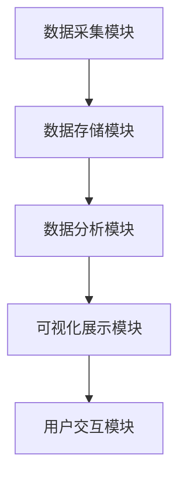

                 


```markdown
# 《金融数据可视化技术应用》

## 关键词：金融数据可视化、数据处理、可视化工具、机器学习、系统架构、项目实战

## 摘要：  
金融数据可视化是将复杂的金融数据转化为直观的图表形式，以便更好地理解和分析。本文从金融数据可视化的背景与意义出发，详细探讨了数据处理与分析、可视化技术与工具、机器学习与可视化的结合、系统架构设计以及项目实战。通过实际案例分析，结合主流工具和技术，深入讲解了金融数据可视化的实现过程和应用价值，为金融领域的数据分析师和技术人员提供了实用的指导和参考。

---

## 第1章: 金融数据可视化概述

### 1.1 金融数据可视化的背景与意义  
#### 1.1.1 金融数据的特点与挑战  
- 金融数据的多样性和复杂性  
- 数据的实时性与高频性  
- 数据的敏感性和安全性  

#### 1.1.2 数据可视化在金融领域的应用价值  
- 提高数据可读性和决策效率  
- 识别数据中的趋势和异常  
- 优化金融模型和风险管理  

#### 1.1.3 金融数据可视化的技术趋势  
- 可视化工具的多样化发展  
- 与人工智能技术的深度融合  
- 实时可视化与交互设计的创新  

### 1.2 数据可视化的核心概念  
#### 1.2.1 数据可视化的基本原理  
- 数据的采集、处理与分析  
- 数据的编码与视觉呈现  
- 视觉感知与用户交互  

#### 1.2.2 金融数据可视化的关键要素  
- 数据源与数据类型  
- 可视化目标与用户需求  
- 可视化工具与技术  

#### 1.2.3 数据可视化与金融决策的关系  
- 数据可视化在金融决策中的作用  
- 数据可视化对金融模型的辅助作用  
- 数据可视化在风险管理中的应用  

---

## 第2章: 金融数据的处理与分析

### 2.1 数据清洗与预处理  
#### 2.1.1 数据清洗的基本方法  
- 数据去重与删除重复值  
- 处理缺失值（删除、插值、标记）  
- 数据格式转换与标准化  

#### 2.1.2 数据格式转换与标准化  
- 数据类型转换（文本、数值、日期）  
- 数据标准化与归一化处理  
- 时间序列数据的处理与分析  

#### 2.1.3 数据增强与特征工程  
- 数据特征的选择与提取  
- 数据的特征组合与降维  
- 时间序列数据的特征工程  

### 2.2 数据分析与特征提取  
#### 2.2.1 数据分析的基本流程  
- 数据的描述性分析（均值、中位数、标准差等）  
- 数据的分布分析（直方图、箱线图等）  
- 数据的相关性分析（皮尔逊相关系数、 spearman相关系数等）  

#### 2.2.2 金融数据特征的提取方法  
- 时间序列特征提取（均值、波动率、自相关系数等）  
- 频率域特征提取（傅里叶变换等）  
- 统计特征与复杂特征的提取  

#### 2.2.3 数据分析工具与技术  
- Python数据分析库（Pandas、NumPy）  
- 数据可视化库（Matplotlib、Seaborn）  
- 统计分析方法（假设检验、回归分析等）  

---

## 第3章: 数据可视化技术与工具

### 3.1 数据可视化的技术基础  
#### 3.1.1 数据可视化的分类与选择  
- 基于数据类型的选择（条形图、折线图、散点图等）  
- 数据规模与交互性的考虑  
- 可视化目标与用户需求的匹配  

#### 3.1.2 可视化图表的设计原则  
- 数据的清晰呈现（避免信息过载）  
- 视觉的简洁性与美观性  
- 交互设计的合理性  

#### 3.1.3 数据可视化工具的使用  
- Python可视化库（Matplotlib、Seaborn）  
- 数据可视化工具（Tableau、Power BI）  
- 开源与商业可视化工具的对比  

### 3.2 金融数据可视化工具  
#### 3.2.1 Python可视化库  
- Matplotlib的基本使用（创建图表、设置样式等）  
- Seaborn的高级图表（箱线图、热力图等）  
- Pandas的内置可视化功能  

#### 3.2.2 Tableau与Power BI的使用  
- 数据连接与数据源设置  
- 可视化仪表板的设计与制作  
- 数据故事的讲述与分享  

#### 3.2.3 其他金融数据分析工具  
- Excel在金融数据可视化中的应用  
- R语言的可视化库（ggplot2）  
- 金融数据分析平台（如TradingView）  

---

## 第4章: 数据可视化与机器学习

### 4.1 机器学习在金融数据可视化中的应用  
#### 4.1.1 数据可视化与机器学习的关系  
- 数据可视化是机器学习的重要环节  
- 机器学习模型的可视化解释  
- 可视化在特征工程与模型评估中的作用  

#### 4.1.2 可视化在机器学习模型解释中的作用  
- 特征重要性可视化（特征贡献度分析）  
- 模型决策边界可视化  
- 数据分布与模型预测结果的对比  

#### 4.1.3 常见机器学习模型的可视化方法  
- 线性回归模型的可视化（拟合线、残差分析）  
- 支持向量机（SVM）的决策边界可视化  
- 随机森林与XGBoost模型的特征重要性可视化  

### 4.2 机器学习与数据可视化的结合  
#### 4.2.1 数据可视化在特征选择中的应用  
- 特征筛选与可视化  
- 数据分布与特征相关性的可视化  
- 数据增强与特征工程的可视化  

#### 4.2.2 可视化在模型评估中的作用  
- 模型预测结果的可视化对比  
- 模型性能指标的可视化分析  
- 模型鲁棒性与稳定性的可视化评估  

#### 4.2.3 数据可视化在金融预测中的应用  
- 时间序列预测模型的可视化（ARIMA、LSTM）  
- 金融事件预测的可视化分析  
- 金融风险预警的可视化设计  

---

## 第5章: 金融数据可视化系统架构

### 5.1 系统架构设计  
#### 5.1.1 系统功能模块划分  
- 数据采集与处理模块  
- 数据存储与管理模块  
- 数据分析与可视化模块  
- 用户交互与展示模块  

#### 5.1.2 系统架构的优缺点分析  
- 分层架构的优势与不足  
- 微服务架构的应用与挑战  
- 可扩展性与可维护性的平衡  

#### 5.1.3 系统架构的实现步骤  
- 模块划分与功能定义  
- 数据流设计与系统交互流程  
- 系统接口的设计与实现  

### 5.2 系统接口与交互设计  
#### 5.2.1 系统接口的设计原则  
- RESTful API的设计规范  
- 数据格式与接口参数的统一性  
- 接口的安全性与权限管理  

#### 5.2.2 系统交互设计  
- 用户界面（UI）设计原则  
- 用户操作流程的设计与优化  
- 交互反馈与用户体验提升  

#### 5.2.3 系统架构的可视化表示  


---

## 第6章: 项目实战

### 6.1 项目背景与目标  
- 项目需求分析  
- 可视化目标与用户需求  

### 6.2 环境搭建与工具安装  
- 安装Python与相关库（Matplotlib、Pandas、NumPy）  
- 安装Tableau或Power BI  

### 6.3 核心实现  
#### 6.3.1 数据获取与清洗  
- 数据清洗代码示例  
```python
import pandas as pd

# 示例数据加载
data = pd.read_csv('financial_data.csv')

# 处理缺失值
data.dropna(inplace=True)

# 数据类型转换
data['date'] = pd.to_datetime(data['date'])
```

#### 6.3.2 数据分析与可视化  
- 数据分析代码示例  
```python
import matplotlib.pyplot as plt

plt.figure(figsize=(10, 6))
plt.plot(data['date'], data['value'], label='Financial Value')
plt.title('Financial Data Visualization')
plt.xlabel('Date')
plt.ylabel('Value')
plt.legend()
plt.show()
```

#### 6.3.3 系统实现与优化  
- 系统功能实现代码示例  
- 系统优化与性能提升  

### 6.4 实际案例分析与结果解读  
- 通过可视化图表分析金融数据  
- 数据分析结果的解读与应用  

### 6.5 项目小结  
- 项目实现的关键点总结  
- 可视化技术在项目中的价值  

---

## 第7章: 高级主题与扩展

### 7.1 高级数据可视化技术  
- 大数据可视化与分布式计算  
- 三维可视化与虚拟现实技术  

### 7.2 金融数据可视化的伦理与合规  
- 数据隐私与用户隐私保护  
- 可视化结果的可信性与真实性  

### 7.3 未来趋势与技术挑战  
- 人工智能驱动的自动化可视化  
- 数据可视化的实时性与互动性  

---

## 作者：AI天才研究院/AI Genius Institute & 禅与计算机程序设计艺术 /Zen And The Art of Computer Programming
```

