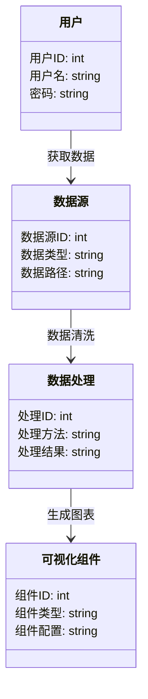
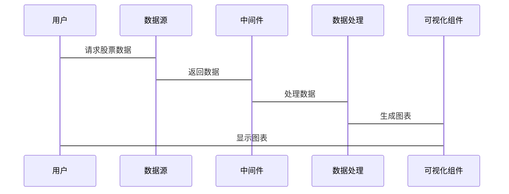

                 


# 金融数据可视化：技术与最佳实践

> 关键词：金融数据可视化，数据处理，可视化工具，交互式可视化，算法原理

> 摘要：本文系统地探讨了金融数据可视化的核心概念、技术基础、工具选择、交互设计以及算法原理。通过详细的理论分析和实际案例，本文为读者提供了从数据处理到可视化实现的完整流程，帮助读者在金融领域高效地进行数据可视化。

---

# 第一部分: 金融数据可视化概述

## 第1章: 金融数据可视化背景与核心概念

### 1.1 金融数据可视化的重要性

#### 1.1.1 金融数据分析的挑战

金融数据具有高维度、高频率和强实时性的特点，传统表格形式难以直观展示数据关系。通过可视化技术，可以将复杂的金融数据转化为易于理解的图表，帮助决策者快速识别市场趋势、风险点和投资机会。

#### 1.1.2 数据可视化在金融领域的应用价值

- **支持决策**：通过可视化工具，投资者可以直观地发现市场波动、资产配置等问题。
- **风险控制**：实时监控和预警机制能够帮助机构及时发现潜在风险。
- **提升效率**：可视化可以减少数据处理时间，提高分析效率。

#### 1.1.3 金融数据可视化的核心目标

- **清晰展示数据关系**：通过图表展示数据之间的关联性。
- **辅助决策**：为金融决策提供直观支持。
- **实时监控**：动态更新数据，支持实时分析。

### 1.2 金融数据可视化的核心概念

#### 1.2.1 数据可视化的定义与分类

数据可视化是指将数据转化为图表、图形等形式，以更直观的方式展示数据。常见的分类包括：

- **静态可视化**：如柱状图、折线图等。
- **交互式可视化**：用户可以通过交互操作进一步探索数据。
- **动态可视化**：数据随时间变化而动态更新。

#### 1.2.2 金融数据的特征与属性

- **时间序列性**：金融数据通常具有时间序列特征。
- **高维度性**：涉及多种金融指标，如股票价格、成交量等。
- **波动性**：数据波动较大，需要高精度的可视化工具。

#### 1.2.3 可视化在金融决策中的作用

- **趋势分析**：通过趋势图识别市场走向。
- **异常检测**：通过散点图识别异常点。
- **关联分析**：通过网络图展示数据之间的关联。

### 1.3 金融数据可视化的技术基础

#### 1.3.1 数据可视化的技术框架

- **数据采集**：从多种数据源获取金融数据。
- **数据处理**：清洗、转换和增强数据。
- **数据可视化**：选择合适的图表类型，并使用工具进行可视化。

#### 1.3.2 金融数据的采集与处理

- **数据源**：包括股票交易所、财经网站等。
- **数据清洗**：处理缺失值、异常值等。
- **数据转换**：将数据转换为适合可视化的格式。

#### 1.3.3 数据可视化的工具与平台

- **工具选择**：如Tableau、Power BI、Python的Matplotlib和Seaborn库。
- **平台集成**：如大数据平台的可视化组件。

---

## 第2章: 数据清洗与特征工程

### 2.1 数据清洗的重要性

#### 2.1.1 数据清洗的基本概念

数据清洗是指对原始数据进行处理，去除噪声数据，填补缺失值，识别并处理异常值。

#### 2.1.2 数据清洗的常见方法

- **删除法**：直接删除不符合条件的数据。
- **替换法**：用均值、中位数等替换缺失值。
- **插值法**：使用模型预测缺失值。

#### 2.1.3 数据清洗的工具与技术

- **工具**：Python的pandas库、SQL等。
- **技术**：数据预处理、数据增强等。

### 2.2 特征工程的核心步骤

#### 2.2.1 特征选择与特征提取

- **特征选择**：从大量特征中选择重要特征。
- **特征提取**：通过主成分分析等方法提取特征。

#### 2.2.2 数据标准化与归一化

- **标准化**：将数据标准化到同一尺度。
- **归一化**：将数据归一化到[0,1]范围。

#### 2.2.3 特征优化的策略与技巧

- **特征组合**：将多个特征组合成新特征。
- **特征降维**：使用PCA等方法降低特征维度。

### 2.3 数据增强与特征优化

#### 2.3.1 数据增强的定义与方法

- **数据增强**：通过技术增加数据多样性，如随机噪声添加、数据变换等。

#### 2.3.2 特征优化的案例分析

- **案例**：通过特征工程优化股票价格预测模型。

---

## 第3章: 数据可视化技术基础

### 3.1 数据可视化的技术分类

#### 3.1.1 基于图表的可视化技术

- **柱状图**：展示分类数据的分布。
- **折线图**：展示数据的时间序列变化。
- **散点图**：展示数据点的分布情况。

#### 3.1.2 基于地理信息的可视化技术

- **地图可视化**：展示地理位置数据，如股票分布地图。

#### 3.1.3 基于网络图的可视化技术

- **网络图**：展示数据之间的关联关系，如社交网络分析。

### 3.2 数据可视化工具的选择与使用

#### 3.2.1 常见数据可视化工具介绍

- **Tableau**：功能强大，适合商业分析。
- **Power BI**：微软的商业智能工具。
- **Matplotlib/Seaborn**：Python中的可视化库。

#### 3.2.2 数据可视化工具的优缺点对比

- **Tableau**：优点是功能强大，缺点是价格较高。
- **Matplotlib**：优点是灵活，缺点是需要手动调整样式。

#### 3.2.3 数据可视化工具的安装与配置

- **安装步骤**：以Python为例，安装Anaconda，然后安装Matplotlib和Seaborn。

### 3.3 数据可视化技术的高级应用

#### 3.3.1 可视化交互技术

- **交互式图表**：用户可以通过缩放、拖动等方式探索数据。

#### 3.3.2 动态数据可视化技术

- **实时更新**：数据随时间变化动态更新，如实时股票价格监控。

#### 3.3.3 高维数据可视化技术

- **降维技术**：如t-SNE，用于展示高维数据的分布。

---

## 第4章: 交互式可视化与动态数据

### 4.1 交互式可视化的核心概念

#### 4.1.1 交互式可视化的基本原理

- **用户交互**：用户通过鼠标、键盘等操作与可视化界面互动。
- **动态响应**：系统根据用户操作实时更新可视化内容。

#### 4.1.2 交互式可视化的主要功能

- **数据探索**：用户可以通过交互深入探索数据。
- **动态分析**：数据随用户操作动态变化。

### 4.2 交互式可视化的设计与实现

#### 4.2.1 交互式可视化的设计原则

- **简洁性**：界面简洁，操作直观。
- **响应性**：系统对用户操作快速响应。
- **可定制性**：用户可以根据需求自定义可视化界面。

#### 4.2.2 交互式可视化的主要实现技术

- **前端技术**：如D3.js、Plotly等。
- **后端技术**：与数据库交互，获取动态数据。

#### 4.2.3 交互式可视化的设计工具与流程

- **工具**：Figma、Sketch等设计工具。
- **流程**：需求分析、界面设计、开发实现、测试优化。

### 4.3 动态数据可视化技术

#### 4.3.1 动态数据可视化的基本概念

- **实时数据**：数据随时间不断更新。
- **动态展示**：可视化界面实时反映数据变化。

#### 4.3.2 动态数据可视化的实现方法

- **数据流处理**：使用Flux或RxJS等技术处理实时数据流。
- **动画效果**：通过CSS或JavaScript实现平滑过渡效果。

#### 4.3.3 动态数据可视化的案例分析

- **案例**：实时股票价格监控系统，展示动态变化的K线图。

---

## 第5章: 数据可视化算法原理

### 5.1 数据可视化算法的基本原理

#### 5.1.1 数据可视化算法的分类

- **投影算法**：如t-SNE、PCA。
- **网络算法**：如社区发现算法。
- **层次化算法**：如层次聚类。

#### 5.1.2 数据可视化算法的实现流程

- **数据预处理**：清洗、标准化。
- **算法选择**：根据数据类型选择合适的算法。
- **结果可视化**：将算法输出结果可视化。

### 5.2 经典数据可视化算法

#### 5.2.1 t-SNE算法

- **原理**：通过非线性降维技术，将高维数据映射到低维空间。
- **公式**：$$ t-SNE \text{ 的目标是最小化数据在低维和高维空间的KL散度} $$

#### 5.2.2 社区发现算法

- **原理**：通过图论方法，发现数据中的社区结构。
- **应用**：网络社交分析、金融网络风险评估。

### 5.3 数据可视化算法的数学模型

#### 5.3.1 t-SNE算法的数学模型

- **概率密度函数**：$$ p_{j|i} = \frac{exp(-\|x_i - x_j\|_2 / \sigma)}{\sum_{k} exp(-\|x_i - x_k\|_2 / \sigma)} } $$
- **KL散度**：$$ KL(D, P) = \sum_{i} D_{KL}(P_i || Q_i) $$

#### 5.3.2 网络可视化算法的数学模型

- **邻接矩阵**：$$ A_{ij} = 1 \text{ 如果节点i和j相连，否则0} $$
- **拉普拉斯矩阵**：$$ L = D - A $$

### 5.4 数据可视化算法的优化技巧

#### 5.4.1 参数调整

- **t-SNE的参数**：如学习率、度量方式。

#### 5.4.2 数据预处理

- **归一化**：确保数据在不同特征上的尺度一致。

#### 5.4.3 算法选择

- **根据数据类型选择合适的算法**：如文本数据选择t-SNE，网络数据选择社区发现算法。

---

## 第6章: 系统分析与架构设计

### 6.1 问题场景介绍

#### 6.1.1 系统需求

- **用户需求**：金融分析师需要实时监控市场数据，分析股票趋势。
- **系统需求**：开发一个实时金融数据可视化平台。

### 6.2 系统功能设计

#### 6.2.1 领域模型（Mermaid 类图）



### 6.3 系统架构设计（Mermaid 架构图）

```mermaid
archi
    股票交易系统
    前端部分: HTML/CSS/JavaScript
    中间件: API Gateway
    后端部分: 数据处理服务
    数据库: MySQL
    第三方服务: 股票数据API
```

### 6.4 系统接口设计

#### 6.4.1 接口描述

- **获取股票数据接口**：`GET /api/stock?symbol=XXX`
- **更新数据接口**：`POST /api/update`

#### 6.4.2 接口交互流程（Mermaid 序列图）



---

## 第7章: 项目实战

### 7.1 环境安装

#### 7.1.1 安装Python环境

```bash
conda create -n financial_visualization python=3.8
conda activate financial_visualization
pip install matplotlib seaborn pandas
```

### 7.2 系统核心实现源代码

#### 7.2.1 数据处理代码

```python
import pandas as pd
import numpy as np

# 数据清洗
def clean_data(data):
    data = data.dropna()
    return data

# 特征工程
def process_data(data):
    data['date'] = pd.to_datetime(data['date'])
    data.set_index('date', inplace=True)
    return data

# 数据增强
def data_augmentation(data):
    data['Moving_Average'] = data['price'].rolling(5).mean()
    return data
```

#### 7.2.2 可视化实现代码

```python
import matplotlib.pyplot as plt
import seaborn as sns

# 绘制折线图
def plot_stock_price(data):
    plt.figure(figsize=(10, 6))
    plt.plot(data.index, data['price'], label='Stock Price')
    plt.title('Stock Price Analysis')
    plt.xlabel('Date')
    plt.ylabel('Price')
    plt.legend()
    plt.show()

# 绘制散点图
def plot_scatter(data):
    plt.figure(figsize=(10, 6))
    plt.scatter(data['volume'], data['price'], c='r', marker='o')
    plt.title('Volume vs Price')
    plt.xlabel('Volume')
    plt.ylabel('Price')
    plt.show()
```

### 7.3 代码应用解读与分析

#### 7.3.1 数据处理代码解读

- **数据清洗**：删除缺失值，确保数据完整。
- **特征工程**：转换日期为索引，方便时间序列分析。
- **数据增强**：添加移动平均线，丰富数据特征。

#### 7.3.2 可视化实现代码解读

- **折线图**：展示股票价格随时间的变化趋势。
- **散点图**：展示成交量与股价的关系。

### 7.4 实际案例分析和详细讲解剖析

#### 7.4.1 案例背景

某金融公司需要分析股票价格走势，希望通过可视化工具发现潜在投资机会。

#### 7.4.2 数据来源

数据来源包括该公司的历史交易数据和市场指标数据。

#### 7.4.3 数据处理与分析

- 数据清洗：去除缺失值和异常值。
- 特征工程：提取时间序列特征和指标特征。
- 数据增强：添加技术指标，如移动平均线、MACD等。

#### 7.4.4 可视化实现

- 使用折线图展示股价趋势。
- 使用散点图分析成交量与股价的关系。
- 使用网络图展示股票之间的关联性。

### 7.5 项目小结

通过本项目，我们实现了从数据处理到可视化的完整流程，展示了如何利用可视化技术解决实际金融问题。

---

## 第8章: 最佳实践、小结、注意事项、拓展阅读

### 8.1 最佳实践 Tips

- **选择合适的工具**：根据需求选择适合的可视化工具。
- **注重交互设计**：提升用户体验。
- **结合算法优化**：通过算法优化可视化效果。

### 8.2 小结

本文从金融数据可视化的背景出发，详细探讨了数据处理、可视化技术、交互设计以及算法原理。通过实际案例，展示了如何将理论应用于实践。

### 8.3 注意事项

- **数据安全**：保护金融数据的安全性。
- **性能优化**：确保可视化系统的性能。
- **用户体验**：注重交互设计，提升用户体验。

### 8.4 拓展阅读

- **推荐书籍**：《Data Visualization Made Simple》、《Python Data VisualizationCookbook》
- **在线资源**：Tableau官方文档、Python官方文档

---

## 作者

作者：AI天才研究院/AI Genius Institute & 禅与计算机程序设计艺术 /Zen And The Art of Computer Programming

---

**本文内容来源于AI天才研究院，转载请注明出处。**

