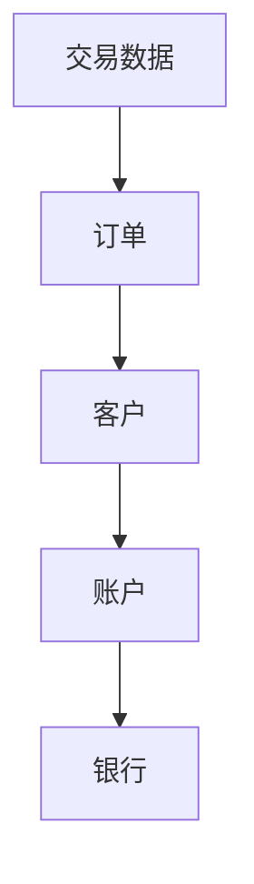
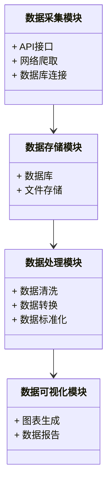

                 


# 《金融数据收集与处理》

> 关键词：金融数据，数据收集，数据处理，API接口，数据清洗，系统架构

> 摘要：本文系统地介绍了金融数据收集与处理的核心概念、技术方法和实际应用。从金融数据的重要性、核心概念与联系入手，详细讲解了数据收集的主要方法，包括API接口、网络爬取和数据库连接等技术，深入探讨了数据清洗与标准化的处理流程，并通过金融数据处理系统架构的设计与实现，展示了如何将理论应用于实际项目。最后，通过一个完整的股票数据分析案例，总结了金融数据收集与处理的最佳实践和注意事项。

---

## 第一部分: 金融数据收集与处理基础

### 第1章: 金融数据收集与处理概述

#### 1.1 金融数据的重要性

金融数据是金融行业运作的核心，包括股票价格、交易记录、客户信息、市场报告等。这些数据不仅反映了市场动态，还为企业决策、风险管理、投资分析提供了重要依据。随着金融行业的数字化转型，金融数据的收集与处理能力成为金融机构竞争力的关键。

**问题背景**：金融数据的多样性、实时性和高价值使其在收集和处理过程中面临诸多挑战。数据来源包括结构化数据（如交易记录）、半结构化数据（如JSON格式的市场报告）和非结构化数据（如文本、图像）。数据的质量、安全和隐私保护直接影响金融决策的准确性。

**问题解决**：通过有效的数据收集和处理技术，可以将分散、复杂的数据转化为可用于分析和决策的高质量数据。这不仅提高了金融业务的效率，还为金融机构的风险控制和投资收益提供了有力支持。

**边界与外延**：金融数据收集与处理不仅涉及数据的获取，还包括数据的清洗、转换和存储等全生命周期管理。其外延涵盖数据挖掘、机器学习等高级分析技术，但本文主要聚焦于数据收集与处理的基础技术。

**核心要素组成**：金融数据的收集与处理包括数据来源识别、数据获取技术选择、数据预处理和存储管理等关键步骤。这些步骤构成了金融数据处理的完整流程。

#### 1.2 金融数据收集与处理的挑战

金融数据的收集和处理面临诸多挑战，包括数据来源的多样性、数据质量的保障、数据安全与隐私保护等。以下是一些具体挑战：

1. **数据来源多样性**：金融数据可能来自API接口、网络爬取、数据库等多种渠道，每种渠道都有其特点和限制。
2. **数据质量保障**：数据可能包含缺失值、噪声和错误信息，需要通过数据清洗和标准化等技术来提高数据质量。
3. **数据安全与隐私保护**：金融数据往往包含敏感信息，如何在收集和处理过程中保护数据安全是一个重要问题。

#### 1.3 金融数据收集与处理的背景

随着人工智能和大数据技术的快速发展，金融行业正在经历数字化转型。金融数据的收集与处理技术在这一过程中扮演着重要角色。本文将从金融数据的基本概念出发，逐步展开对数据收集与处理技术的深入探讨。

---

### 第2章: 金融数据的核心概念与联系

#### 2.1 数据的分类与特征

金融数据可以分为以下几类：

1. **结构化数据**：具有固定格式，如表格数据（股票价格、交易记录）。
2. **半结构化数据**：具有部分结构，如JSON、XML格式的市场报告。
3. **非结构化数据**：无固定格式，如文本、图像、音频。

这些数据类型在金融分析中各有其应用场景。例如，结构化数据适合进行快速统计分析，而非结构化数据则需要通过自然语言处理技术进行分析。

#### 2.2 数据特征对比表格

以下是对不同数据类型的特征对比：

| 数据类型 | 描述 | 示例 |
|----------|------|------|
| 结构化数据 | 有固定格式和结构 | 股票价格、交易记录 |
| 非结构化数据 | 无固定格式 | 文本、图像、音频 |
| 半结构化数据 | 部分结构化 | JSON、XML |

#### 2.3 数据实体关系图

以下是一个简单的金融数据实体关系图：



---

## 第三部分: 金融数据收集技术

### 第3章: 金融数据的收集方法

#### 3.1 数据接口与API

API（应用程序编程接口）是金融数据收集的重要途径。以下是一个使用API接口获取股票价格的Python代码示例：

```python
import requests

url = "https://api.example.com/stock-prices"
params = {"symbol": "AAPL", "date": "2023-10-01"}

response = requests.get(url, params=params)
data = response.json()
print(data)
```

#### 3.2 数据网络爬取

网络爬取是另一种常用的金融数据收集方法。以下是一个使用Python的`requests`库和`BeautifulSoup`库进行网页爬取的示例：

```python
import requests
from bs4 import BeautifulSoup

url = "https://finance.example.com/stock-news"

response = requests.get(url)
soup = BeautifulSoup(response.text, 'html.parser')
articles = soup.find_all('article')

for article in articles:
    title = article.find('h2').text
    content = article.find('p').text
    print(f"标题: {title}\n内容: {content}\n")
```

#### 3.3 数据库连接

通过数据库连接获取金融数据是另一种常用方法。以下是一个使用Python的`pymysql`库连接MySQL数据库的示例：

```python
import pymysql

conn = pymysql.connect(host='localhost', user='root', password='password', db='finance')
cursor = conn.cursor()

cursor.execute("SELECT * FROM stock_prices")
results = cursor.fetchall()

for row in results:
    print(row)

conn.close()
```

---

## 第四部分: 金融数据处理技术

### 第4章: 数据清洗与标准化

#### 4.1 数据清洗

数据清洗是数据预处理的重要步骤，用于处理缺失值、重复值和异常值。以下是一个Python代码示例：

```python
import pandas as pd

df = pd.read_csv('data.csv')
df.dropna(inplace=True)
df.drop_duplicates(inplace=True)
df = df[abs(df['price'] - df['price'].mean()) < 3 * df['price'].std()]
```

#### 4.2 数据标准化

数据标准化是将数据转换为统一格式的过程。以下是一个使用`sklearn`库进行标准化的示例：

```python
from sklearn.preprocessing import StandardScaler

scaler = StandardScaler()
scaled_data = scaler.fit_transform(df[['price', 'volume']])
```

---

## 第五部分: 金融数据处理系统架构

### 第5章: 系统架构设计

#### 5.1 系统功能设计

系统功能包括数据采集、数据存储、数据处理和数据可视化。以下是功能模块的类图：



---

## 第六部分: 项目实战

### 第6章: 金融数据处理项目实战

#### 6.1 环境安装

需要安装以下Python库：

- `pandas`：数据处理
- `requests`：网络请求
- `BeautifulSoup`：网页解析
- `pymysql`：数据库连接
- `sklearn`：数据标准化

#### 6.2 核心实现代码

以下是一个完整的股票数据分析案例：

```python
import requests
import pandas as pd
from sklearn.preprocessing import StandardScaler

# 数据采集
url = "https://api.example.com/stock-prices"
params = {"symbol": "AAPL", "start_date": "2023-01-01", "end_date": "2023-12-31"}

response = requests.get(url, params=params)
data = response.json()

# 数据清洗
df = pd.DataFrame(data)
df = df.dropna()
df = df[df['price'] > 0]

# 数据标准化
scaler = StandardScaler()
scaled_data = scaler.fit_transform(df[['price', 'volume']])

print(scaled_data)
```

#### 6.3 案例分析与解读

通过上述代码，我们可以获取并处理AAPL股票的价格和成交量数据。数据清洗步骤去除了缺失值和异常值，数据标准化将价格和成交量转换为统一的格式，便于后续分析。

---

## 第七部分: 总结与展望

### 第7章: 最佳实践与小结

- **数据安全**：在金融数据的收集和处理过程中，必须重视数据的安全性和隐私保护。
- **技术选择**：根据具体需求选择合适的数据采集和处理技术，避免过度复杂化。
- **系统设计**：在系统架构设计中，应充分考虑可扩展性和可维护性，以应对未来数据规模的扩大。

### 7.2 注意事项

- 数据收集和处理过程中，应遵守相关法律法规，特别是在数据隐私和合规性方面。
- 数据清洗和标准化时，应结合业务需求，避免过度清洗导致数据信息丢失。

### 7.3 拓展阅读

- 推荐阅读《大数据分析与金融应用》和《Python金融数据分析实战》。

---

作者：AI天才研究院/AI Genius Institute & 禅与计算机程序设计艺术 /Zen And The Art of Computer Programming

