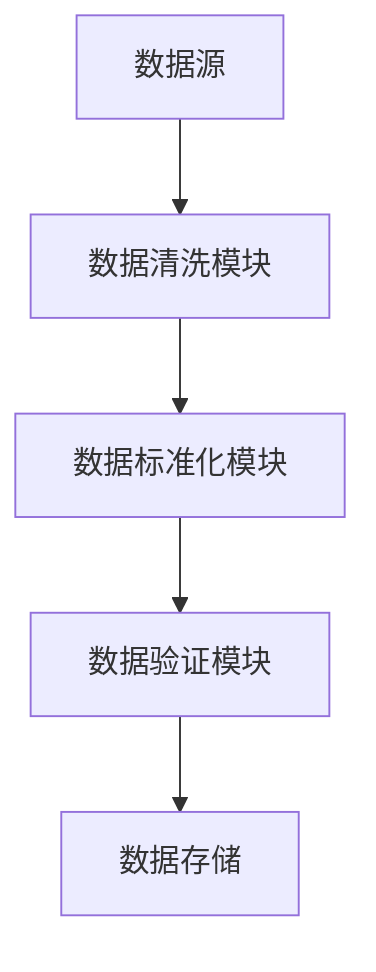
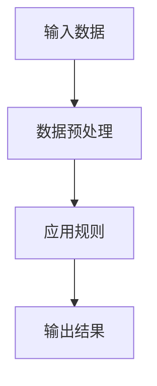
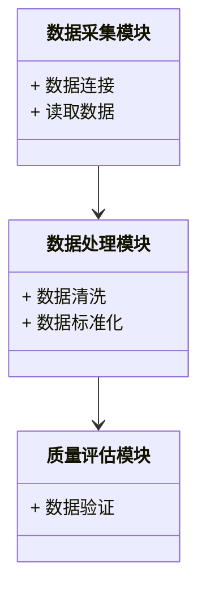
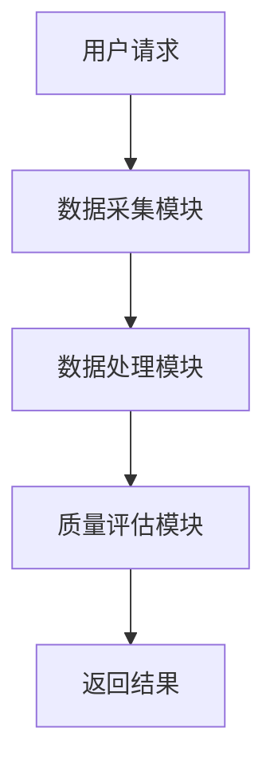

                 


# 金融数据质量自动化控制平台

## 关键词：
- 金融数据
- 数据质量
- 自动化控制
- 数据清洗
- 数据验证
- 数据标准化

## 摘要：
本文详细探讨了金融数据质量自动化控制平台的设计与实现，从问题背景、核心概念到系统架构、项目实战，全面解析了如何利用技术手段提升金融数据质量管理的效率和准确性。通过具体案例分析和代码实现，展示了平台的实际应用价值。

---

## 第1章：问题背景与核心概念

### 1.1 问题背景

金融行业高度依赖数据的准确性和完整性。然而，数据在采集、传输和处理过程中，常常面临数据缺失、格式错误、重复等多种质量问题，这些都会影响金融决策的准确性。传统的数据质量管理依赖人工操作，效率低下且容易出错。因此，构建一个自动化控制平台显得尤为重要。

### 1.2 核心概念

数据质量管理的核心在于确保数据的准确性、完整性、一致性和及时性。主要涉及以下概念：
- **数据清洗**：识别并纠正或删除错误数据。
- **数据标准化**：将数据转换为统一格式，确保一致性。
- **数据验证**：通过预定义规则检查数据的正确性。

### 1.3 问题描述与解决思路

金融数据质量问题可能引发合规风险和经济损失。自动化平台通过规则引擎、机器学习算法等技术，实现数据处理的自动化，减少人为错误，提高效率。

---

## 第2章：数据质量管理的核心概念与联系

### 2.1 核心概念的原理

#### 数据清洗
数据清洗是去除或修正数据中的错误和不一致的过程。例如，检测重复数据、处理缺失值等。

#### 数据标准化
将数据转换为统一格式，例如将日期格式统一为ISO标准。

#### 数据验证
通过预定义规则检查数据的正确性，例如验证银行卡号的长度。

### 2.2 核心概念对比表

| 概念 | 定义 | 示例 |
|------|------|------|
| 数据清洗 | 去除错误数据 | 删除重复记录 |
| 数据标准化 | 统一数据格式 | 转换日期格式 |
| 数据验证 | 检查数据正确性 | 验证邮箱格式 |

### 2.3 实体关系图（ER图）



---

## 第3章：数据质量管理的算法原理

### 3.1 数据清洗算法

#### 基于规则的清洗
- 使用正则表达式检测数据中的错误。
- 示例：检测电话号码格式。

#### 基于机器学习的清洗
- 使用分类模型识别异常值。

### 3.2 算法流程图



### 3.3 数学模型

分类模型用于检测异常值：
$$ P(y|x) = \frac{P(x|y)P(y)}{P(x)} $$
其中，$x$ 是输入数据，$y$ 是标签（正常或异常）。

### 3.4 代码实现

```python
def data_cleaning(dataframe):
    # 删除重复记录
    dataframe = dataframe.drop_duplicates()
    # 处理缺失值
    dataframe = dataframe.dropna()
    return dataframe
```

---

## 第4章：系统分析与架构设计

### 4.1 问题场景

银行交易数据处理，涉及数据清洗、标准化和验证。

### 4.2 系统功能设计

#### 功能模块
- 数据采集模块：从数据库中读取数据。
- 数据处理模块：清洗和标准化数据。
- 质量评估模块：验证数据正确性。

#### 领域模型



### 4.3 系统架构设计



### 4.4 接口设计

HTTP接口：POST请求，接收数据进行处理。

---

## 第5章：项目实战

### 5.1 环境搭建

- 安装Python和相关库（pandas, numpy）。

### 5.2 核心代码实现

```python
import pandas as pd
import numpy as np

def clean_financial_data(dataframe):
    # 删除重复记录
    dataframe = dataframe.drop_duplicates()
    # 处理缺失值
    dataframe = dataframe.dropna()
    # 数据标准化
    dataframe['amount'] = dataframe['amount'].apply(lambda x: round(x, 2))
    return dataframe

# 示例数据
data = {
    'transaction_id': [1, 2, 3],
    'amount': [100.5, 200.3, 300.78]
}
df = pd.DataFrame(data)
cleaned_df = clean_financial_data(df)
print(cleaned_df)
```

### 5.3 实际案例分析

处理银行交易数据，展示清洗和标准化过程。

### 5.4 代码解读

- `clean_financial_data`函数实现数据清洗和标准化。
- 使用`drop_duplicates`和`dropna`处理数据。

---

## 第6章：总结与展望

### 6.1 总结

本文详细介绍了金融数据质量自动化控制平台的设计与实现，从理论到实践，展示了平台的实际价值。

### 6.2 未来展望

未来，AI技术将更加深入地应用于数据质量管理，提高自动化水平。

---

## 附录

- 数据质量管理相关文献
- 开源工具推荐

---

## 作者

作者：AI天才研究院/AI Genius Institute & 禅与计算机程序设计艺术 /Zen And The Art of Computer Programming

---

