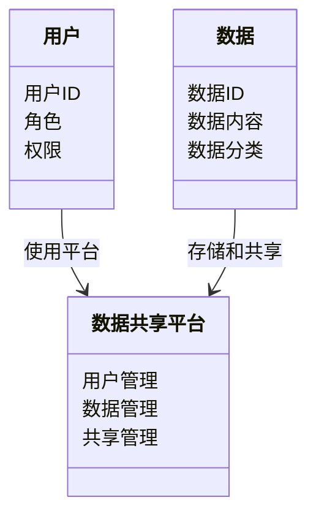
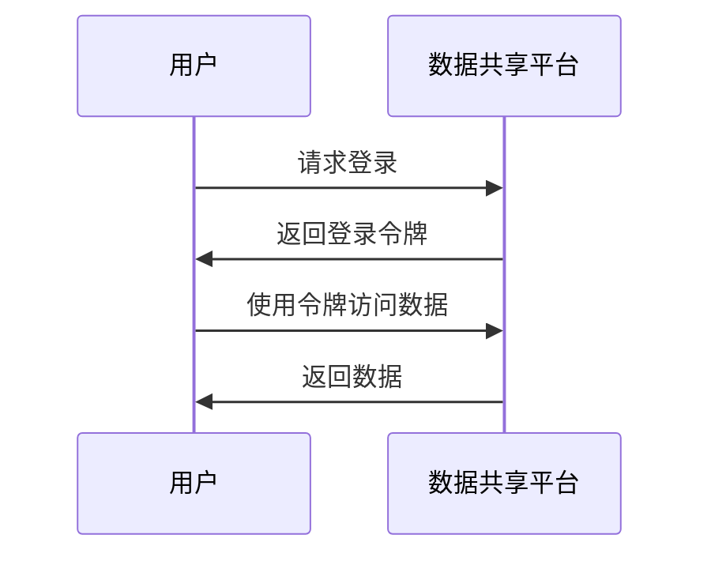
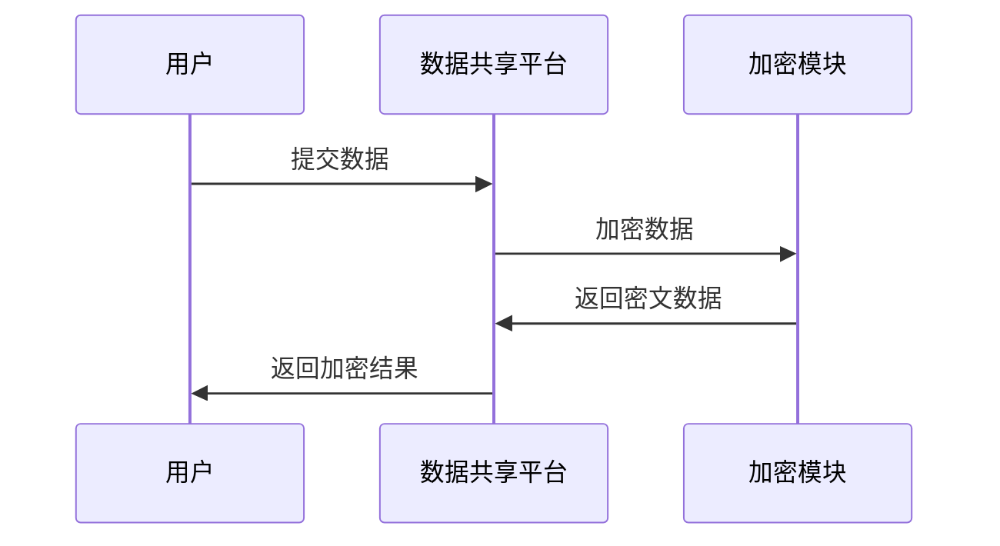

                 


# 金融数据隐私保护与共享平台设计

> 关键词：金融数据隐私保护，数据共享，隐私保护，金融数据安全，数据加密，匿名化技术，数据访问控制

> 摘要：本文详细探讨了金融数据隐私保护与共享平台的设计与实现。首先介绍了金融数据隐私保护的背景与意义，分析了数据隐私保护的核心概念与技术。然后，深入讲解了数据隐私保护的算法原理，并通过具体的系统架构设计展示了如何在金融数据共享平台中实现隐私保护。最后，结合实际案例，详细阐述了平台的实现过程，并总结了最佳实践与注意事项。

---

## 第1章: 金融数据隐私保护概述

### 1.1 金融数据隐私保护的背景与意义

#### 1.1.1 金融数据的重要性与敏感性
金融数据是金融机构的核心资产，涉及个人隐私、交易记录、财务信息等敏感内容。随着数字化转型的推进，金融机构之间的数据共享需求日益增加，但数据泄露的风险也随之上升。金融数据的隐私保护已成为金融机构面临的重大挑战。

#### 1.1.2 数据隐私保护的法律与合规要求
金融数据的隐私保护不仅关乎企业的声誉，还受到法律法规的严格约束。例如，《通用数据保护条例》（GDPR）和《加州消费者隐私法案》（CCPA）等法律法规对数据隐私保护提出了明确要求。金融机构必须确保数据在共享过程中的合法性、合规性。

#### 1.1.3 金融数据共享的必要性与挑战
金融机构之间的数据共享有助于提升服务效率、优化资源配置，但同时也带来了隐私泄露的风险。如何在满足共享需求的同时保护数据隐私，是金融数据共享平台设计的核心挑战。

### 1.2 数据隐私保护的核心问题

#### 1.2.1 数据隐私保护的基本概念
数据隐私保护是指通过技术手段确保数据在存储、传输和使用过程中不被未经授权的主体访问或泄露。隐私保护的核心目标是实现数据的最小化暴露和最大化利用。

#### 1.2.2 数据共享中的隐私泄露风险
在数据共享过程中，未经授权的访问、中间人攻击、数据滥用等行为可能导致隐私泄露。此外，数据的多重使用场景也增加了隐私保护的难度。

#### 1.2.3 数据隐私保护的目标与边界
数据隐私保护的目标是确保数据在共享过程中的合法性和安全性。其边界包括数据的分类、访问权限的管理以及数据生命周期的监控。

### 1.3 金融数据共享平台的建设目标

#### 1.3.1 平台建设的必要性
金融数据共享平台的建设旨在解决金融机构之间的数据孤岛问题，促进数据的高效共享与利用，同时保护数据隐私。

#### 1.3.2 平台的功能定位与价值
平台的功能定位是为金融机构提供一个安全、合规的数据共享环境。其价值体现在提升数据利用率、降低数据共享成本、增强金融机构之间的信任等方面。

#### 1.3.3 平台的建设原则与技术路线
平台建设原则包括安全性、合规性、可扩展性等。技术路线涵盖数据加密、匿名化、访问控制等技术手段。

### 1.4 本章小结
本章从金融数据隐私保护的背景与意义出发，分析了数据隐私保护的核心问题，并明确了金融数据共享平台的建设目标与原则。

---

## 第2章: 数据隐私保护的核心概念

### 2.1 数据隐私保护的原理与方法

#### 2.1.1 数据加密技术
数据加密是通过将数据转换为不可读的形式，确保只有授权方能够解密并访问原始数据。

#### 2.1.2 数据匿名化技术
数据匿名化是通过去除或脱敏敏感信息，使数据无法直接关联到具体个人或实体。

#### 2.1.3 数据访问控制技术
数据访问控制通过身份验证、权限管理等手段，确保只有授权用户能够访问特定数据。

### 2.2 数据隐私保护的核心要素

#### 2.2.1 数据生命周期管理
数据生命周期管理包括数据的生成、存储、使用、归档和销毁等阶段的管理，确保数据在生命周期中的隐私安全。

#### 2.2.2 数据分类与分级
数据分类与分级是根据数据的重要性和敏感程度进行分类，以便采取差异化的保护措施。

#### 2.2.3 数据访问权限管理
数据访问权限管理通过基于角色或属性的访问控制策略，确保用户只能访问其权限范围内的数据。

### 2.3 数据隐私保护与共享的关系

#### 2.3.1 数据隐私保护对共享的影响
数据隐私保护是数据共享的前提条件。通过有效的隐私保护措施，可以降低数据共享中的隐私泄露风险。

#### 2.3.2 共享平台中的隐私保护机制
共享平台需要通过技术手段实现数据的加密存储、匿名化传输和访问控制，确保数据在共享过程中的隐私安全。

#### 2.3.3 数据隐私保护的平衡点
在数据共享与隐私保护之间需要找到平衡点，既满足数据共享的需求，又保护数据隐私。

### 2.4 本章小结
本章详细介绍了数据隐私保护的核心概念与技术，分析了数据共享与隐私保护的关系，并提出了数据隐私保护的实现策略。

---

## 第3章: 数据隐私保护技术的算法原理

### 3.1 数据加密算法

#### 3.1.1 对称加密算法
对称加密算法是一种使用相同密钥进行加密和解密的算法，例如AES算法。

#### 3.1.2 非对称加密算法
非对称加密算法使用公钥和私钥进行加密和解密，例如RSA算法。

#### 3.1.3 哈希函数
哈希函数是一种将任意长度的数据映射为固定长度的摘要的函数，例如SHA-256哈希函数。

### 3.2 数据匿名化算法

#### 3.2.1 数据脱敏技术
数据脱敏技术通过去除或替换敏感信息，使数据无法被还原回原始数据。

#### 3.2.2 数据置换技术
数据置换技术通过打乱数据的顺序或位置，降低数据被关联的风险。

#### 3.2.3 数据摘要技术
数据摘要技术通过对数据进行哈希计算，生成数据的唯一标识。

### 3.3 数据访问控制算法

#### 3.3.1 基于角色的访问控制（RBAC）
RBAC通过定义用户角色和权限，确保用户只能访问其角色允许的数据。

#### 3.3.2 基于属性的访问控制（ABAC）
ABAC通过用户的属性和上下文信息，动态调整用户的访问权限。

#### 3.3.3 基于策略的访问控制（PBAC）
PBAC通过定义和执行访问控制策略，确保数据的访问符合预定义的规则。

### 3.4 算法实现与优化

#### 3.4.1 算法实现的代码示例
```python
import hashlib

def sha256_hash(data):
    return hashlib.sha256(data.encode()).hexdigest()
```

#### 3.4.2 算法优

---

## 第4章: 系统架构设计

### 4.1 问题场景介绍
金融数据共享平台需要解决金融机构之间的数据孤岛问题，同时保护数据隐私。

### 4.2 项目介绍
本项目旨在设计一个金融数据共享平台，实现数据的安全共享与利用。

### 4.3 系统功能设计

#### 4.3.1 领域模型设计


#### 4.3.2 系统架构设计


### 4.4 系统接口设计

#### 4.4.1 数据上传接口
接口名称：upload_data
接口描述：用于将数据上传到共享平台。
请求参数：文件路径、用户ID
返回值：上传结果

#### 4.4.2 数据加密接口
接口名称：encrypt_data
接口描述：对数据进行加密处理。
请求参数：明文数据
返回值：密文数据

#### 4.4.3 数据共享接口
接口名称：share_data
接口描述：将数据共享给指定用户或角色。
请求参数：数据ID、目标用户/角色
返回值：共享结果

### 4.5 系统交互设计

#### 4.5.1 用户登录流程


#### 4.5.2 数据加密流程


### 4.6 本章小结
本章详细设计了金融数据共享平台的系统架构，包括功能设计、接口设计和系统交互设计，确保数据的安全共享与利用。

---

## 第5章: 项目实战

### 5.1 环境配置

#### 5.1.1 安装Python
```bash
# 安装Python
sudo apt-get install python3 python3-dev
```

#### 5.1.2 安装数据库
```bash
# 安装MySQL
sudo apt-get install mysql-server
```

### 5.2 核心代码实现

#### 5.2.1 数据加密模块
```python
import hashlib

def sha256_hash(data):
    return hashlib.sha256(data.encode()).hexdigest()
```

#### 5.2.2 数据脱敏模块
```python
def anonymize_data(data):
    # 假设data是一个包含敏感信息的字典
    anonymized_data = {}
    for key, value in data.items():
        if key in ['姓名', '地址']:
            anonymized_data[key] = '***'
        else:
            anonymized_data[key] = value
    return anonymized_data
```

### 5.3 代码应用解读与分析
通过上述代码，我们可以实现数据的加密存储和脱敏处理，确保数据在共享过程中的隐私安全。

### 5.4 实际案例分析
以某银行的客户信息共享为例，通过平台实现客户信息的加密存储和脱敏处理，确保数据在共享过程中的隐私安全。

### 5.5 项目小结
本章通过实际案例展示了金融数据共享平台的实现过程，包括环境配置、核心代码实现和案例分析。

---

## 第6章: 最佳实践与注意事项

### 6.1 最佳实践

#### 6.1.1 数据分类与分级
根据数据的重要性和敏感程度进行分类，采取差异化的保护措施。

#### 6.1.2 数据访问控制
通过基于角色或属性的访问控制策略，确保用户只能访问其权限范围内的数据。

#### 6.1.3 数据安全审计
定期进行数据安全审计，发现并修复数据隐私保护中的漏洞。

### 6.2 注意事项

#### 6.2.1 数据共享中的隐私风险
在数据共享过程中，需注意防止数据泄露、数据滥用等风险。

#### 6.2.2 数据安全与合规性
确保数据共享平台的设计和实现符合相关法律法规要求。

#### 6.2.3 数据共享的可扩展性
在设计平台时，需考虑数据共享的可扩展性，以适应未来业务发展的需求。

### 6.3 本章小结
本章总结了金融数据隐私保护与共享平台设计中的最佳实践与注意事项，为读者提供了宝贵的参考。

---

## 作者：AI天才研究院/AI Genius Institute & 禅与计算机程序设计艺术 /Zen And The Art of Computer Programming

