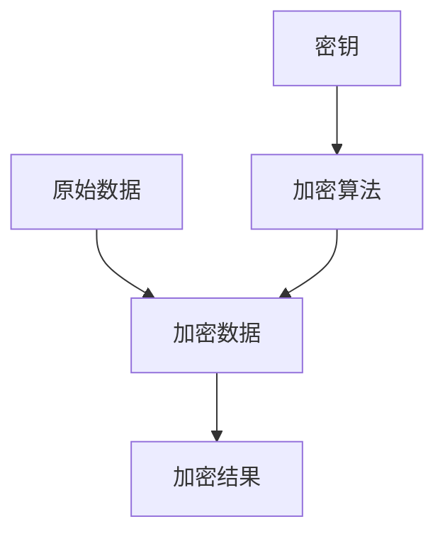
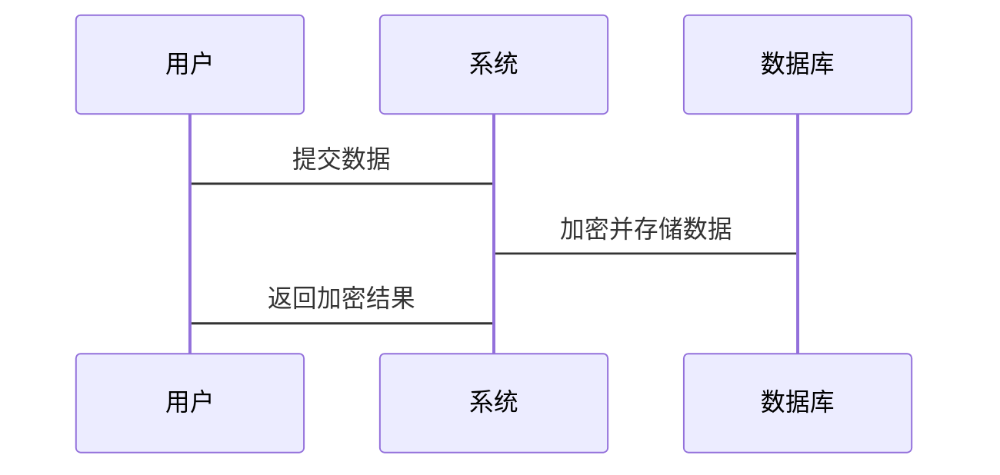

                 


# 《金融数据隐私保护增强技术》

> 关键词：金融数据隐私、数据加密、区块链、零知识证明、同态加密

> 摘要：本文深入探讨了金融数据隐私保护的关键技术与实现方案，从背景问题、核心概念、算法原理到系统架构设计、项目实战，再到最佳实践，全面解析金融数据隐私保护的增强技术，结合实际案例分析，提供详细的实现方案和代码示例，帮助读者全面理解并掌握金融数据隐私保护的核心方法。

---

## 第一部分: 金融数据隐私保护增强技术概述

### 第1章: 金融数据隐私保护的背景与问题

#### 1.1 金融数据隐私保护的重要性
金融数据作为现代经济的核心资产，涉及个人隐私、企业机密和国家安全，其隐私保护至关重要。随着数字化转型的推进，金融数据的收集、存储和处理变得越来越复杂，数据泄露的风险也随之增加。

#### 1.2 问题背景与技术目标
金融数据隐私保护的核心问题是如何在保证数据可用性的同时，防止未经授权的访问和泄露。技术目标包括数据加密、匿名化处理、访问控制和数据完整性验证。

---

## 第二部分: 金融数据隐私保护的核心概念与技术

### 第2章: 数据隐私保护的基本概念

#### 2.1 数据隐私与数据安全的定义
数据隐私是指个人对如何使用或分享其个人数据的控制权，而数据安全则是保护数据不被未经授权的访问、泄露或篡改。

#### 2.2 数据隐私保护的关键属性
- 机密性：防止未经授权的访问。
- 完整性：确保数据未被篡改。
- 可用性：确保合法用户能够访问数据。

#### 2.3 数据隐私保护的核心要素
- 数据分类与分级：根据敏感程度分类。
- 访问控制：基于角色或权限进行访问控制。
- 安全审计：记录和监控数据访问行为。

### 第3章: 数据隐私保护技术的分类与对比

#### 3.1 加密技术
- 对称加密（如AES）：速度快，适合大量数据加密。
- 非对称加密（如RSA）：安全性高，适合公钥加密。

#### 3.2 匿名化技术
- 数据匿名化：通过去标识化处理，保护隐私。
- 差分隐私：通过添加噪声，防止数据重建。

#### 3.3 访问控制技术
- 基于角色的访问控制（RBAC）：根据用户角色分配权限。
- 基于属性的访问控制（ABAC）：根据属性动态分配权限。

#### 3.4 其他相关技术
- 区块链：通过分布式账本技术，确保数据不可篡改。
- 零知识证明：证明数据的存在性或正确性，而不泄露数据本身。

---

## 第三部分: 数据隐私保护技术的算法原理与实现

### 第4章: 同态加密技术

#### 4.1 同态加密的定义与原理
同态加密允许在加密状态下对数据进行计算，结果解密后与原始计算结果一致。

#### 4.2 同态加密的数学模型
- 加密函数：$E(m) = m^k \mod n$
- 解密函数：$D(c) = c^{k^{-1}} \mod n$

#### 4.3 同态加密的应用场景
- 金融数据分析：在加密状态下进行统计计算。
- 隐私计算：支持多方数据协作。

#### 4.4 同态加密的实现流程
1. 选择加密算法（如RSA）。
2. 生成公钥和私钥。
3. 对数据进行加密。
4. 在加密数据上进行计算。
5. 解密结果。



#### 4.5 Python代码实现
```python
import numpy as np

def encrypt(message, public_key):
    return pow(message, public_key, public_key * 2)

def decrypt(ciphertext, private_key):
    return pow(ciphertext, private_key, private_key * 2)

message = 123
public_key = 5
private_key = 3

encrypted = encrypt(message, public_key)
decrypted = decrypt(encrypted, private_key)

print(f"明文: {message}")
print(f"密文: {encrypted}")
print(f"解密结果: {decrypted}")
```

---

## 第四部分: 系统架构与设计

### 第5章: 金融数据隐私保护系统的架构设计

#### 5.1 系统功能设计
- 数据采集：从多个来源收集金融数据。
- 数据加密：使用同态加密对数据进行加密。
- 数据存储：将加密数据存储在安全数据库中。
- 数据处理：在加密状态下进行数据分析。
- 数据输出：解密并输出结果。

#### 5.2 系统架构设计


#### 5.3 系统接口设计
- 数据采集接口：API用于接收数据。
- 数据加密接口：处理数据加密请求。
- 数据存储接口：存储加密数据。
- 数据处理接口：执行加密数据分析。

#### 5.4 系统交互流程


---

## 第五部分: 项目实战

### 第6章: 金融交易数据隐私保护案例

#### 6.1 项目背景
某银行需要保护客户交易数据的隐私，防止数据泄露。

#### 6.2 核心代码实现
```python
import json

class DataEncryptor:
    def __init__(self, key):
        self.key = key

    def encrypt(self, data):
        encrypted = {}
        for key, value in data.items():
            encrypted[key] = self._encrypt(value)
        return encrypted

    def _encrypt(self, value):
        return pow(value, self.key, self.key * 2)

# 示例数据
data = {
    "交易金额": 1000,
    "交易时间": "2023-10-01",
    "交易地点": "上海"
}

# 初始化加密器
encryptor = DataEncryptor(5)

# 加密数据
encrypted_data = encryptor.encrypt(data)

print("加密后的数据:", encrypted_data)
```

#### 6.3 案例分析
通过上述代码，客户交易数据在加密后传输到银行系统，确保数据隐私。

#### 6.4 项目总结
本项目通过同态加密技术实现了金融交易数据的隐私保护，确保了数据的安全性和可用性。

---

## 第六部分: 最佳实践与未来展望

### 第7章: 数据隐私保护的最佳实践

#### 7.1 核心注意事项
- 数据分类与分级：根据敏感程度制定保护策略。
- 技术选型：选择适合的加密算法和匿名化技术。
- 安全审计：定期检查数据访问记录。

#### 7.2 未来研究方向
- 新型加密算法：如后量子加密。
- 区块链技术：进一步探索其在数据隐私保护中的应用。
- 人工智能：结合AI技术，提升数据隐私保护的智能化水平。

---

## 作者

作者：AI天才研究院 & 禅与计算机程序设计艺术

