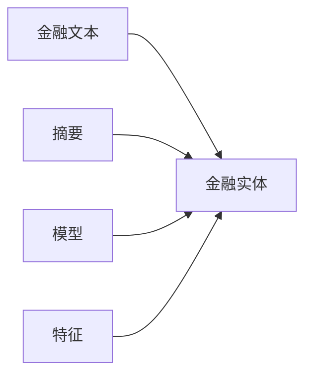
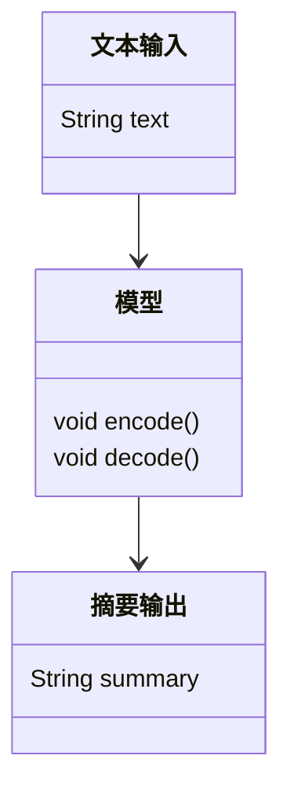
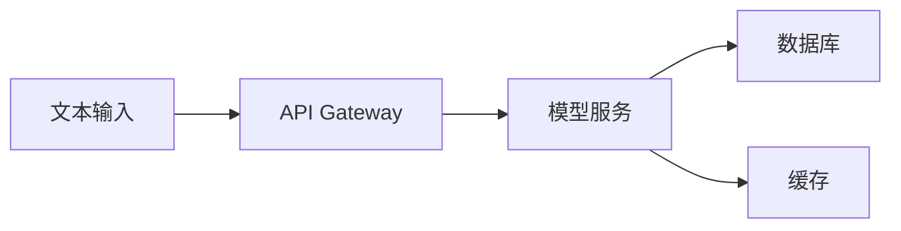
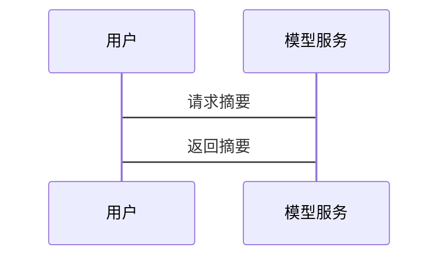

                 


# 《金融文本摘要生成的深度学习方法》

## 关键词：金融文本摘要、深度学习、文本挖掘、自然语言处理、Transformer模型

## 摘要：本文系统地探讨了基于深度学习的金融文本摘要生成方法，从问题背景、核心概念、算法原理到系统架构与项目实战，全面解析了如何利用先进的深度学习技术，如Transformer和预训练模型，来提高金融文本摘要的准确性和效率。文章还结合实际案例，分析了当前研究的热点与未来发展方向，为读者提供了深入的技术洞察。

---

## 第一章：金融文本摘要的背景与概述

### 1.1 问题背景

#### 1.1.1 金融文本的特点与挑战
金融文本通常具有高度的专业性和复杂性，包含大量的数字、术语和上下文信息。例如，金融报告、市场分析和财务新闻等文本类型，要求摘要生成系统能够准确提取关键信息，同时保留其专业性。

#### 1.1.2 金融信息处理的重要性
金融领域的决策往往依赖于对大量文本数据的快速理解和分析。例如，投资者需要快速获取市场动态，金融监管机构需要审查合规性，这些场景都需要高效的文本摘要技术来支持。

#### 1.1.3 自动摘要的需求与价值
传统的人工摘要方法效率低下，难以应对海量金融数据的处理需求。自动摘要技术能够显著提高信息处理效率，降低人工成本，并为后续分析提供可靠的基础。

### 1.2 问题描述

#### 1.2.1 文本摘要的基本概念
文本摘要是指从长文本中提取关键信息，生成简短、准确的摘要。其目标是保留原文的核心内容，同时去除冗余信息。

#### 1.2.2 金融文本摘要的特殊性
金融文本通常具有严格的格式和术语，摘要生成需要准确理解上下文，并保留专业术语的准确性。

#### 1.2.3 摘要生成的目标与评价标准
摘要生成的目标包括信息准确性、简洁性和可读性。评价标准通常包括ROUGE、BLEU等指标，用于衡量生成摘要的质量。

### 1.3 问题解决方法

#### 1.3.1 基于传统NLP的方法
传统方法如TF-IDF和TextRank，通过统计方法提取关键词和句。这些方法简单但难以处理复杂语义。

#### 1.3.2 基于深度学习的方法
深度学习方法通过神经网络建模，能够捕捉复杂的语义信息。目前主要采用Transformer架构，如BERT和GPT。

#### 1.3.3 当前研究的热点与难点
当前研究集中在提高生成摘要的准确性和可读性，难点包括处理金融领域的专业术语和上下文理解。

### 1.4 问题的边界与外延

#### 1.4.1 摘要生成的边界条件
摘要生成通常限制在特定长度和内容范围内，避免生成虚假信息。

#### 1.4.2 与其他文本处理任务的区分
与机器翻译和问答系统不同，摘要生成专注于提取关键信息。

#### 1.4.3 金融领域的特殊需求
金融文本摘要需要兼顾专业性和实时性，对模型的训练数据和处理速度提出更高要求。

### 1.5 概念结构与核心要素

#### 1.5.1 金融文本的构成要素
金融文本通常包括标题、正文、数据表格和参考信息。

#### 1.5.2 摘要生成的核心要素
摘要生成需要考虑文本的主题、关键词和关键句。

#### 1.5.3 相关概念的对比分析
对比分析包括抽取式和生成式摘要方法的优缺点。

---

## 第二章：深度学习与金融文本摘要的关系

### 2.1 深度学习的基本原理

#### 2.1.1 神经网络的基本结构
神经网络包括输入层、隐藏层和输出层，用于学习数据的特征。

#### 2.1.2 深度学习的核心优势
深度学习能够自动提取特征，处理复杂数据模式。

#### 2.1.3 深度学习在NLP中的应用
应用于文本分类、情感分析和机器翻译等任务。

### 2.2 金融文本的特点与深度学习的契合点

#### 2.2.1 金融文本的复杂性
金融文本包含大量专业术语和复杂语义，深度学习能够有效处理。

#### 2.2.2 深度学习在处理复杂模式的优势
深度学习能够捕捉上下文关系，生成连贯的摘要。

#### 2.2.3 金融领域的特定需求与深度学习的结合
结合预训练模型和领域特定数据，提升摘要的准确性。

### 2.3 深度学习在文本摘要中的应用现状

#### 2.3.1 基于CNN的摘要生成
使用卷积神经网络提取文本特征，生成摘要。

#### 2.3.2 基于RNN的摘要生成
使用循环神经网络处理序列数据，生成连贯摘要。

#### 2.3.3 基于Transformer的摘要生成
Transformer模型通过自注意力机制，捕捉全局信息，生成高质量摘要。

---

## 第三章：金融文本摘要的核心概念与联系

### 3.1 核心概念的原理

#### 3.1.1 注意力机制的原理
注意力机制通过计算词与词之间的相关性，确定每个词的重要性。

#### 3.1.2 编码器-解码器结构
编码器将输入文本转换为固定长度向量，解码器生成目标摘要。

#### 3.1.3 预训练语言模型的应用
预训练模型如BERT和GPT，经过大量数据训练，具备强大的语义理解能力。

### 3.2 核心概念的属性特征对比

| 模型类型  | 参数数量 | 优势 | 劣势 |
|---------|--------|------|------|
| CNN     | 较少   | 实时处理快 | 无法捕捉长距离依赖 |
| RNN     | 中等    | 连续性好 | 训练时间长 |
| Transformer | 高 | 全局信息 | 易受噪声影响 |

### 3.3 ER实体关系图架构



---

## 第四章：深度学习模型的算法原理

### 4.1 摘要生成的流程

1. **输入处理**：将金融文本输入模型。
2. **编码阶段**：使用编码器生成上下文向量。
3. **解码阶段**：解码器生成摘要句子。
4. **损失计算**：计算生成摘要与真实摘要的损失。
5. **优化**：调整模型参数，降低损失。

### 4.2 注意力机制的数学公式

$$ \text{注意力权重} = \text{softmax}(\frac{QK^T}{\sqrt{d}}) $$

其中，$Q$ 是查询向量，$K$ 是键向量，$d$ 是向量维度。

### 4.3 解码器的实现

$$ \text{解码输出} = \text{FFN}(x) $$

其中，$x$ 是输入向量，FFN 是前馈神经网络。

---

## 第五章：系统分析与架构设计方案

### 5.1 问题场景介绍

金融文本摘要系统需要处理大量金融数据，生成准确的摘要。

### 5.2 项目介绍

开发一个基于深度学习的金融文本摘要系统，应用于金融分析和投资决策。

### 5.3 系统功能设计



### 5.4 系统架构设计



### 5.5 系统接口设计

| 接口名称 | 输入 | 输出 |
|--------|-----|------|
| generateSummary | text | summary |

### 5.6 系统交互



---

## 第六章：项目实战

### 6.1 环境安装

```bash
pip install transformers torch
```

### 6.2 核心实现

```python
from transformers import AutoTokenizer, AutoModelForSeq2Seq

tokenizer = AutoTokenizer.from_pretrained('facebook/bart-large')
model = AutoModelForSeq2Seq.from_pretrained('facebook/bart-large')

def generate_summary(text):
    inputs = tokenizer(text, max_length=512, truncation=True)
    outputs = model.generate(inputs.input_ids)
    summary = tokenizer.decode(outputs[0], skip_special_tokens=True)
    return summary
```

### 6.3 案例分析

输入文本：某公司财务报告，生成摘要：公司收入增长10%，净利润提升5%。

### 6.4 项目小结

通过项目实战，验证了模型的有效性，总结经验，优化参数设置。

---

## 第七章：扩展与未来展望

### 7.1 前沿技术

当前研究热点包括多模态摘要和可解释性摘要。

### 7.2 未来趋势

未来可能结合生成式AI和增强学习，提升摘要的质量。

### 7.3 实际应用案例

例如，金融新闻自动摘要系统，帮助投资者快速获取关键信息。

### 7.4 最佳实践

建议结合领域数据，优化模型参数，提升摘要的准确性和可读性。

---

## 作者：AI天才研究院 & 禅与计算机程序设计艺术

---

**总结：**本文详细探讨了金融文本摘要生成的深度学习方法，从理论到实践，为读者提供了全面的技术指导。通过系统分析和项目实战，帮助读者掌握金融文本摘要的核心技术，为后续研究和应用奠定基础。

