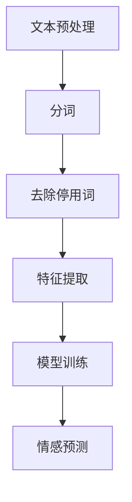
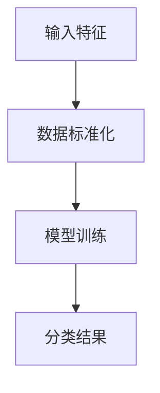
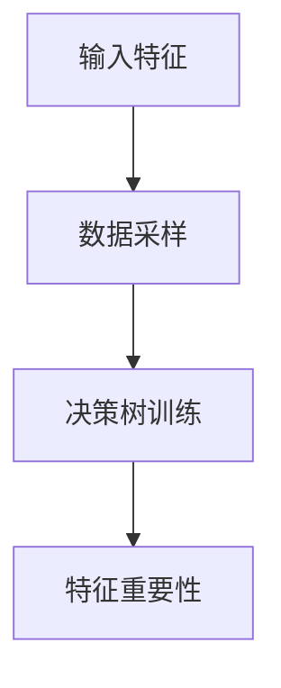
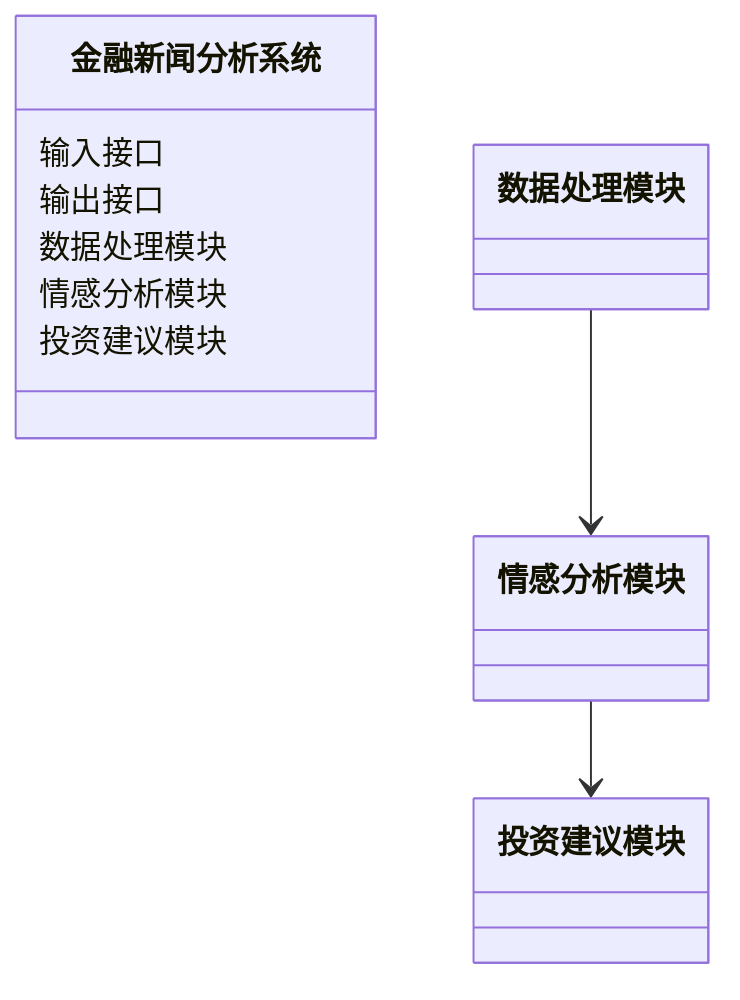
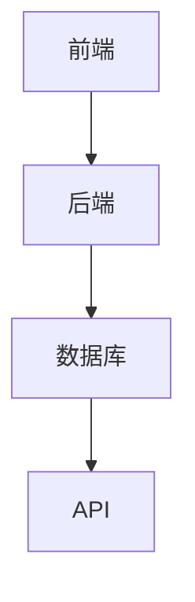

                 


# 金融新闻分析与投资影响评估

> 关键词：金融新闻分析，投资影响评估，文本挖掘，机器学习，市场情绪，情感分析，深度学习

> 摘要：本文详细探讨了金融新闻分析与投资影响评估的背景、核心概念、算法原理、数学模型、系统架构设计以及实际应用。通过分析金融新闻对市场情绪的影响，结合文本挖掘和机器学习技术，本文提出了构建投资影响评估系统的具体方法，并通过实际案例展示了系统的实现过程。

---

# 第一部分：金融新闻分析与投资影响评估的背景与核心概念

## 第1章：金融新闻分析的背景与重要性

### 1.1 金融市场的复杂性与不确定性

金融市场是一个高度复杂且充满不确定性的环境。投资者需要面对不断变化的市场信息、宏观经济因素以及各种突发事件的影响。在这种情况下，金融新闻作为市场信息的重要来源，对投资者的决策具有重要意义。

### 1.2 金融新闻分析的定义与范围

金融新闻分析是指通过文本挖掘、自然语言处理（NLP）和机器学习等技术，对金融市场相关的新闻、公告和评论进行分析，以提取有价值的信息并评估其对市场的影响。

### 1.3 金融新闻分析的现实意义

金融新闻分析可以帮助投资者快速理解市场动态，捕捉市场情绪变化，从而做出更明智的投资决策。通过自动化分析大量金融新闻，投资者可以节省时间和成本，同时提高决策的准确性。

---

## 第2章：投资影响评估的核心问题

### 2.1 投资决策的关键因素

投资决策的关键因素包括市场趋势、公司财务状况、宏观经济指标以及市场情绪等。其中，市场情绪是影响短期投资行为的重要因素。

### 2.2 金融新闻对市场情绪的影响

金融新闻可以通过影响市场参与者的心理预期，进而改变市场情绪。例如，一篇正面的公司新闻可能会提升投资者信心，从而推高股价。

### 2.3 投资影响评估的目标与方法

投资影响评估的目标是通过分析金融新闻，量化其对市场的影响，并为投资者提供基于新闻分析的投资建议。常用的方法包括文本挖掘、情感分析和回归分析等。

---

# 第二部分：金融新闻分析的核心概念与联系

## 第3章：金融新闻分析的核心概念

### 3.1 核心概念原理

- **市场情绪**：市场情绪是指市场参与者整体的心理状态，通常可以通过新闻和社交媒体数据进行分析。
- **文本挖掘**：文本挖掘是从大量文本数据中提取有用信息的技术，常用于金融新闻分析。

### 3.2 核心概念对比分析

通过对比分析不同类型金融新闻的特征，可以更好地理解其对市场情绪的影响。例如，公司公告和行业新闻的影响范围和深度可能不同。

### 3.3 实体关系图（ER图）架构

以下是金融新闻分析的ER图架构：

```mermaid
erd
    entity 金融新闻 {
        id: int
        标题: string
        内容: string
        发布时间: datetime
        来源: string
    }
    entity 市场情绪 {
        id: int
        情绪得分: float
        时间范围: datetime
    }
    entity 投资影响 {
        id: int
        影响得分: float
        投资建议: string
    }
    金融新闻 --> 市场情绪: 影响
    金融新闻 --> 投资影响: 评估
```

---

# 第三部分：金融新闻分析的算法原理

## 第4章：文本挖掘与情感分析

### 4.1 文本挖掘的基本原理

文本挖掘通过对文本数据的处理和分析，提取出有意义的信息。常见的文本挖掘任务包括分词、实体识别和情感分析。

### 4.2 情感分析的实现步骤

以下是情感分析的实现步骤：



### 4.3 深度学习模型

深度学习模型（如LSTM）在情感分析中表现出色，以下是其原理：

```mermaid
graph TD
    A[输入文本] --> B[嵌入层]
    B --> C[循环层(LSTM)]
    C --> D[全连接层]
    D --> E[输出层]
```

---

## 第5章：机器学习模型在金融新闻分析中的应用

### 5.1 常见的机器学习算法

常用的机器学习算法包括支持向量机（SVM）、随机森林（Random Forest）和神经网络等。

### 5.2 支持向量机（SVM）的应用

SVM可以用于金融新闻分类，以下是其实现流程：



### 5.3 随机森林的应用

随机森林可以用于特征提取，以下是其实现流程：



---

# 第四部分：数学模型与公式

## 第6章：情感分析的数学模型

### 6.1 情感分析的概率模型

概率模型通过计算文本属于正面或负面的概率进行分类：

$$ P(y=1|x) = \frac{P(x|y=1)P(y=1)}{P(x)} $$

### 6.2 基于词袋模型的数学公式

词袋模型将文本表示为词频向量：

$$ x = (x_1, x_2, ..., x_n) $$

其中，\( x_i \) 表示第 \( i \) 个词的词频。

---

## 第7章：投资影响评估的数学模型

### 7.1 市场情绪指数的计算公式

市场情绪指数可以通过以下公式计算：

$$ \text{情绪指数} = \sum_{i=1}^{n} w_i \cdot s_i $$

其中，\( w_i \) 是第 \( i \) 个新闻的权重，\( s_i \) 是其情感得分。

### 7.2 基于回归分析的投资影响评估模型

回归分析可以用于预测市场趋势：

$$ y = \beta_0 + \beta_1 x_1 + \beta_2 x_2 + \epsilon $$

其中，\( y \) 是预测目标，\( x_i \) 是输入特征，\( \beta_i \) 是回归系数。

---

# 第五部分：系统分析与架构设计

## 第8章：系统架构设计

### 8.1 问题场景介绍

金融新闻分析系统需要处理大量文本数据，提取情感信息，并生成投资建议。

### 8.2 系统功能设计

以下是系统功能设计的类图：



### 8.3 系统架构设计

以下是系统架构设计图：



---

# 第六部分：项目实战

## 第9章：环境安装与核心实现

### 9.1 环境安装

安装必要的Python库：

```bash
pip install numpy pandas scikit-learn tensorflow
```

### 9.2 核心实现

以下是情感分析的核心代码：

```python
from sklearn.feature_extraction.text import TfidfVectorizer
from sklearn.svm import SVC

# 文本预处理
vectorizer = TfidfVectorizer()
X = vectorizer.fit_transform(texts)

# 模型训练
model = SVC()
model.fit(X, labels)

# 预测
predictions = model.predict(vectorizer.transform(new_text))
```

### 9.3 案例分析

通过实际案例分析，验证系统的有效性。

---

## 第10章：项目小结

### 10.1 项目总结

金融新闻分析系统能够有效地提取市场情绪，并为投资者提供科学的投资建议。

### 10.2 注意事项

在实际应用中，需要注意数据的实时性和模型的可解释性。

### 10.3 拓展阅读

推荐阅读相关领域的书籍和论文，深入学习金融新闻分析的技术细节。

---

# 第七部分：最佳实践与总结

## 第11章：最佳实践与总结

### 11.1 最佳实践

- 定期更新模型，保持其准确性。
- 结合多种技术，提高系统的鲁棒性。

### 11.2 总结

金融新闻分析与投资影响评估是一个复杂但具有重要意义的领域。通过结合文本挖掘、机器学习和深度学习技术，我们可以更好地理解市场动态，为投资者提供有力支持。

---

# 作者：AI天才研究院（AI Genius Institute） & 禅与计算机程序设计艺术（Zen And The Art of Computer Programming）

---

以上是《金融新闻分析与投资影响评估》的技术博客文章的大纲和部分内容。希望这篇文章能够为读者提供有价值的信息，并帮助他们在金融新闻分析领域有所启发。

