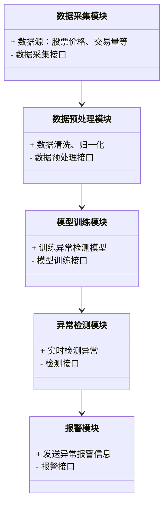

                 


# 金融时序数据异常检测模型

> 关键词：金融时序数据、异常检测、机器学习、深度学习、LSTM、时间序列分析

> 摘要：本文系统地探讨了金融时序数据异常检测模型的设计与实现，从基础概念到高级算法，结合实际案例，深入分析了各种算法的原理与应用场景。文章首先介绍了金融时序数据的基本特征和异常检测的重要性，然后详细讲解了基于统计、机器学习和深度学习的异常检测方法，接着通过系统设计和项目实战，展示了如何构建一个完整的金融异常检测系统。最后，文章总结了当前研究的不足，并提出了未来的研究方向。

---

# 第一部分: 金融时序数据异常检测概述

## 第1章: 金融时序数据与异常检测概述

### 1.1 金融时序数据的定义与特征
#### 1.1.1 金融时序数据的定义
金融时序数据是指在金融市场上随着时间推移而生成的连续性数据，包括股票价格、汇率、债券收益率、交易量等。这类数据通常具有连续性、周期性和波动性等特点。

#### 1.1.2 金融时序数据的特征分析
| 特征 | 描述 |
|------|------|
| 连续性 | 数据随着时间的推移而连续变化 |
| 周期性 | 数据呈现一定的周期性，如日、周、月周期 |
| 波动性 | 数据波动幅度较大，受市场情绪影响显著 |
| 非线性 | 数据关系复杂，难以用线性模型描述 |

#### 1.1.3 异常检测的定义与分类
异常检测是指识别数据中与预期模式或行为显著不同的点或时间段。在金融领域，异常检测可以分为以下几类：
- **点异常**：单个时间点的异常，如某只股票的价格突然大幅波动。
- **集体异常**：多个时间点组成的异常时间段，如市场崩盘期间的价格波动。
- **上下文异常**：与当前上下文环境不一致的异常，如某只股票在正常市场条件下突然停牌。

### 1.2 金融时序数据异常检测的重要性
#### 1.2.1 金融风险控制的需求
异常检测可以帮助识别潜在的金融风险，如市场操纵、欺诈交易等，从而提前采取应对措施。

#### 1.2.2 异常检测在金融监管中的作用
金融监管机构可以通过异常检测发现市场中的异常行为，如 insider trading（内幕交易）或 market manipulation（市场操纵），从而维护市场公平性。

#### 1.2.3 异常检测在投资决策中的应用
投资者可以通过异常检测发现潜在的投资机会或风险，从而做出更明智的投资决策。

### 1.3 传统方法与机器学习方法的对比
#### 1.3.1 传统统计方法的局限性
传统的统计方法，如均值-标准差法，虽然简单易用，但难以捕捉复杂的时间序列模式，尤其是在数据量较大且具有非线性特征的情况下。

#### 1.3.2 机器学习方法的优势
机器学习方法（如支持向量机、随机森林等）能够处理复杂的非线性关系，并且可以通过特征工程提取有用的特征，从而提高检测准确率。

#### 1.3.3 深度学习方法的最新进展
深度学习方法（如LSTM、Transformer等）在处理时间序列数据方面具有显著优势，能够捕捉数据中的长距离依赖关系，从而在复杂场景下表现更优。

---

# 第二部分: 金融时序数据异常检测的核心概念

## 第2章: 金融时序数据的特征工程

### 2.1 异常检测的分类与应用场景
#### 2.1.1 不同异常类型在金融领域的具体表现
- 点异常：某只股票的价格突然大幅波动。
- 集体异常：整个市场的价格波动异常。
- 上下文异常：某只股票在正常市场条件下突然停牌。

#### 2.1.2 异常检测在金融交易、市场分析等场景中的应用
- 金融交易：检测异常交易行为，防止欺诈。
- 市场分析：识别市场趋势中的异常波动，帮助投资者做出决策。

### 2.2 金融时序数据的特征工程
#### 2.2.1 数据预处理与特征提取
- 数据清洗：处理缺失值、异常值等。
- 标准化/归一化：将数据转换为统一的尺度，便于模型训练。
- 滞后特征：引入滞后特征（如前一个小时的价格）来捕捉时间依赖性。

#### 2.2.2 时间序列特征的构建与选择
| 特征类型 | 特征描述 |
|----------|----------|
| 基本统计特征 | 均值、标准差、最大值、最小值等 |
| 时间依赖特征 | 滞后特征、滑动窗口特征等 |
| 频率特征 | 周期性特征（如傅里叶变换） |

#### 2.2.3 异常特征的识别与建模
通过特征工程提取出的异常特征，可以用于后续的异常检测模型训练。例如，使用孤立林（Isolation Forest）算法对异常特征进行建模。

---

# 第三部分: 金融时序数据异常检测的算法原理

## 第3章: 基于统计的异常检测方法

### 3.1 基于均值和标准差的异常检测
#### 3.1.1 方法原理
该方法通过计算数据的均值和标准差，设定一个阈值（如均值 ± 3σ），将数据点与阈值进行比较，判断是否为异常值。

#### 3.1.2 实现步骤
1. 计算数据的均值和标准差。
2. 设定阈值：均值 ± k × 标准差。
3. 判断数据点是否超出阈值，如果是，则标记为异常。

#### 3.1.3 优缺点分析
- 优点：简单易用，计算效率高。
- 缺点：难以捕捉复杂的时间序列模式，容易受到数据分布偏移的影响。

---

## 第4章: 基于机器学习的异常检测方法

### 4.1 支持向量机（SVM）在异常检测中的应用
#### 4.1.1 方法原理
SVM通过构建一个超平面，将数据点分为正常和异常两类。对于异常检测，通常采用无监督学习方法，如One-Class SVM。

#### 4.1.2 实现步骤
1. 数据预处理：归一化、降维等。
2. 训练One-Class SVM模型。
3. 使用模型对新数据进行异常检测。

#### 4.1.3 优缺点分析
- 优点：能够处理非线性关系，模型解释性较好。
- 缺点：需要调整参数，计算复杂度较高。

---

## 第5章: 基于深度学习的异常检测方法

### 5.1 基于LSTM的时序异常检测
#### 5.1.1 方法原理
LSTM（长短期记忆网络）是一种特殊的RNN（循环神经网络），能够有效捕捉时间序列数据中的长距离依赖关系。

#### 5.1.2 实现步骤
1. 数据预处理：归一化、构建滞后特征等。
2. 构建LSTM网络：输入层、隐藏层、输出层。
3. 训练模型：使用交叉熵损失函数和Adam优化器。
4. 使用模型进行异常检测。

#### 5.1.3 优缺点分析
- 优点：能够捕捉复杂的时间序列模式，适用于金融数据的非线性特征。
- 缺点：需要大量的训练数据，模型解释性较差。

---

# 第四部分: 金融时序数据异常检测的系统设计

## 第6章: 系统分析与架构设计

### 6.1 问题场景介绍
构建一个实时金融时序数据异常检测系统，用于监控股票价格、交易量等指标，及时发现异常行为。

### 6.2 系统功能设计
#### 6.2.1 功能模块划分
- 数据采集模块：实时采集金融数据。
- 数据预处理模块：清洗、归一化数据。
- 模型训练模块：训练异常检测模型。
- 异常检测模块：实时检测异常。
- 报警模块：发送异常报警信息。

#### 6.2.2 领域模型设计


---

## 第7章: 项目实战

### 7.1 环境安装与配置
#### 7.1.1 安装Python环境
- 安装Python 3.8及以上版本。
- 安装必要的库：numpy、pandas、keras、tensorflow等。

#### 7.1.2 数据集准备
使用股票价格数据集，例如Yahoo Finance的股票数据。

### 7.2 系统核心实现
#### 7.2.1 数据采集模块
```python
import pandas_datareader as pdr
import datetime

start = datetime.datetime(2020, 1, 1)
end = datetime.datetime(2023, 12, 31)
data = pdr.get_data_yahoo('AAPL', start=start, end=end)
```

#### 7.2.2 数据预处理模块
```python
from sklearn.preprocessing import MinMaxScaler

scaler = MinMaxScaler()
scaled_data = scaler.fit_transform(data['Close'].values.reshape(-1, 1))
```

#### 7.2.3 模型训练模块
```python
from keras.models import Sequential
from keras.layers import LSTM, Dense

model = Sequential()
model.add(LSTM(64, input_shape=(None, 1)))
model.add(Dense(1))
model.compile(loss='mean_squared_error', optimizer='adam')
model.fit(scaled_data, epochs=10, batch_size=32)
```

#### 7.2.4 异常检测模块
```python
# 预测正常值
predicted_values = model.predict(scaled_data)

# 计算异常分数
residuals = abs(predicted_values - scaled_data)
threshold = 0.2  # 根据实际数据调整阈值
anomalies = residuals > threshold
```

#### 7.2.5 报警模块
```python
import pandas as pd
from sqlalchemy import create_engine

engine = create_engine('sqlite:///anomalies.db')
anomalies_df = pd.DataFrame(anomalies, columns=['is_anomaly'])
anomalies_df.to_sql('stock_anomalies', engine)
```

### 7.3 实际案例分析
通过上述代码实现的系统，可以实时监控股票价格，当价格波动超过设定的阈值时，触发报警。例如，当某只股票的价格突然大幅波动时，系统会标记为异常，并通知相关人员进行进一步调查。

---

## 第8章: 总结与展望

### 8.1 全文总结
本文系统地探讨了金融时序数据异常检测模型的设计与实现，从基础概念到高级算法，结合实际案例，深入分析了各种算法的原理与应用场景。文章首先介绍了金融时序数据的基本特征和异常检测的重要性，然后详细讲解了基于统计、机器学习和深度学习的异常检测方法，接着通过系统设计和项目实战，展示了如何构建一个完整的金融异常检测系统。

### 8.2 研究的不足
- 数据稀疏性问题：金融时序数据通常具有较高的噪声，且异常样本较少，导致模型训练效果不佳。
- 模型解释性问题：深度学习模型的黑箱特性使得解释异常检测结果较为困难。

### 8.3 未来研究方向
- 开发更高效的特征工程方法，以提高模型的检测准确率。
- 结合图神经网络（Graph Neural Network）等新兴技术，探索新的异常检测方法。
- 研究如何提高模型的解释性，以便更好地应用于金融监管和投资决策。

---

# 作者

作者：AI天才研究院/AI Genius Institute & 禅与计算机程序设计艺术 /Zen And The Art of Computer Programming

