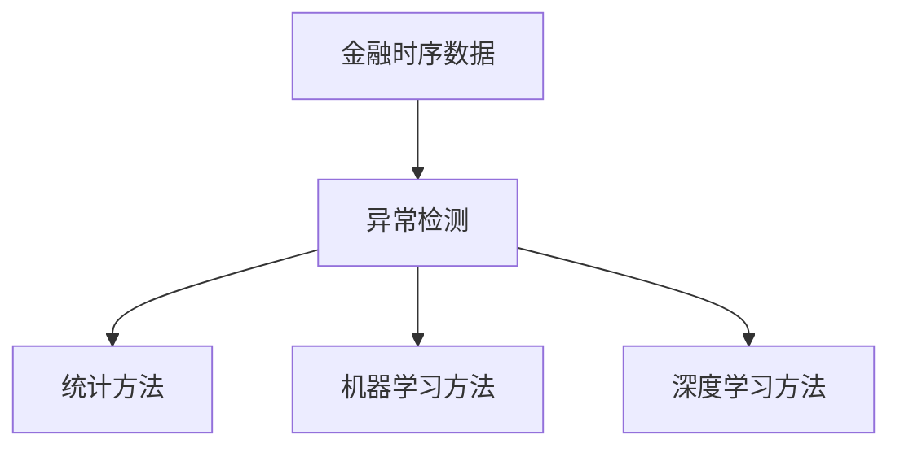
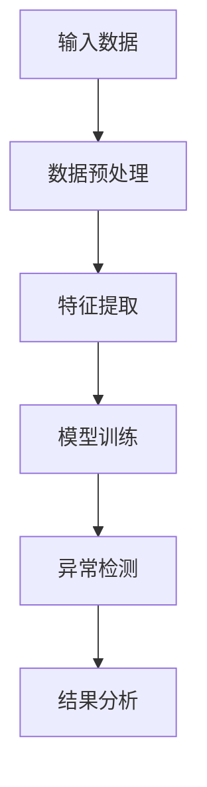

                 


# 《金融时序数据异常检测的AI方法》

## 关键词：金融时序数据，异常检测，人工智能，机器学习，深度学习，统计学方法

## 摘要：  
金融时序数据异常检测是金融风险管理中的关键任务，利用AI技术可以有效提升异常检测的准确性和效率。本文从金融时序数据的特性出发，系统介绍了异常检测的核心概念、常见方法及其在金融领域的应用。通过对比分析统计学方法、机器学习方法和深度学习方法的优缺点，本文提出了结合多种方法的混合模型，并结合实际案例展示了如何构建一个高效的金融时序数据异常检测系统。文章最后总结了当前技术的局限性，并展望了未来的研究方向。

---

# 第1章: 金融时序数据与异常检测概述

## 1.1 金融时序数据的特性与应用

### 1.1.1 金融时序数据的定义与特点  
金融时序数据是指与金融业务相关的时间序列数据，通常包括股票价格、交易量、汇率、利率等。其主要特点包括：  
1. **连续性**：数据通常按时间顺序记录，具有严格的时序特性。  
2. **波动性**：金融市场的波动性较高，数据往往呈现非线性变化。  
3. **相关性**：不同金融资产之间可能存在相关性，例如股票价格与市场指数的相关性。  
4. **噪声干扰**：金融市场受多种因素影响，数据中往往存在噪声。  

### 1.1.2 金融时序数据的主要应用场景  
1. **风险管理**：通过检测异常交易或价格波动，帮助金融机构及时发现潜在风险。  
2. **欺诈 detection**：识别异常交易行为，防范金融欺诈。  
3. **市场监控**：实时监控市场波动，确保市场的公平性和稳定性。  
4. **投资决策**：通过异常检测发现潜在的投资机会或风险。  

### 1.1.3 异常检测在金融领域的意义  
异常检测是金融风险管理的核心技术之一。通过及时发现异常交易或市场波动，金融机构可以有效降低损失、提升决策效率，并增强市场信心。

---

## 1.2 异常检测的基本概念与分类

### 1.2.1 异常检测的定义与核心问题  
异常检测（Anomaly Detection）是指通过分析数据，识别出与正常数据显著不同的样本或模式。其核心问题包括：  
1. 如何定义“正常”与“异常”。  
2. 如何在数据中发现异常模式。  
3. 如何量化异常的严重程度。  

### 1.2.2 异常检测的分类与应用场景  
异常检测主要分为以下几类：  
1. **基于统计的方法**：通过统计学模型（如均值、标准差）识别异常。  
2. **基于机器学习的方法**：利用监督学习、无监督学习等算法检测异常。  
3. **基于深度学习的方法**：通过神经网络模型（如LSTM、Transformer）捕捉数据的复杂模式。  

### 1.2.3 金融时序数据异常检测的特殊性  
金融时序数据具有高度的复杂性和不确定性，异常检测需要考虑以下特殊性：  
1. 数据的连续性和波动性。  
2. 异常事件的稀疏性。  
3. 多因素影响的复杂性。  

---

## 1.3 金融时序数据异常检测的核心要素

### 1.3.1 数据特征与异常类型  
金融时序数据的特征包括：时间戳、资产价格、交易量、市场指数等。异常类型主要分为：  
1. **点异常**：单个时间点的异常值。  
2. **区间异常**：连续时间段内的异常波动。  
3. **集体异常**：多个时间点同时出现的异常模式。  

### 1.3.2 异常检测的评价指标  
常用的评价指标包括：  
1. **准确率（Accuracy）**：正常样本和异常样本都被正确分类的比例。  
2. **召回率（Recall）**：异常样本被正确识别的比例。  
3. **F1分数（F1 Score）**：准确率和召回率的调和平均值。  

### 1.3.3 业务场景与实际需求  
在金融领域，异常检测的实际需求包括：  
1. 实时监控：快速识别异常事件，减少响应时间。  
2. 历史分析：通过历史数据发现潜在的异常模式。  
3. 综合分析：结合多源数据，提升异常检测的准确性。  

---

## 1.4 本章小结  
本章介绍了金融时序数据的基本特性、应用场景及其在异常检测中的特殊性。通过定义和分类，我们明确了异常检测的核心问题和挑战，为后续的算法设计奠定了基础。

---

# 第2章: 金融时序数据异常检测的核心概念与联系

## 2.1 异常检测的核心原理

### 2.1.1 统计学方法的基本原理  
统计学方法通过分析数据的分布特性，识别出偏离正常分布的样本。常用的统计方法包括：  
1. **Z-Score方法**：计算数据点与均值的距离，超过一定阈值的样本被视为异常。  
2. **经验分布函数（EDF）**：通过比较经验分布与理论分布，识别异常值。  
3. **时间序列模型（如ARIMA）**：通过拟合模型，预测未来值并与实际值进行对比，发现异常。  

### 2.1.2 机器学习方法的核心思想  
机器学习方法通过训练模型，学习数据的正常模式，并利用模型预测异常。常用的机器学习算法包括：  
1. **监督学习**：使用有标签的数据训练分类器，识别异常样本。  
2. **无监督学习**：通过聚类或降维技术，发现数据中的异常模式。  
3. **半监督学习**：结合少量标签数据和无标签数据，提升模型的泛化能力。  

### 2.1.3 深度学习方法的优势与挑战  
深度学习方法通过神经网络模型，捕捉数据的复杂模式，尤其适用于高维和非线性数据。常用的深度学习模型包括：  
1. **LSTM网络**：适用于时间序列数据，能够捕捉长期依赖关系。  
2. **Transformer模型**：通过自注意力机制，捕捉数据的全局关系。  
3. **深度强化学习**：通过强化学习框架，优化异常检测的决策过程。  

---

## 2.2 常见异常检测技术的对比分析

### 2.2.1 统计方法与机器学习方法的对比  
| 方法类别 | 统计方法 | 机器学习方法 |  
|----------|----------|--------------|  
| 适用场景 | 数据分布已知 | 数据分布复杂 |  
| 模型复杂度 | 低 | 高 |  
| 对特征工程的要求 | 较高 | 较低 |  

### 2.2.2 无监督学习与有监督学习的对比  
| 方法类别 | 无监督学习 | 有监督学习 |  
|----------|----------|--------------|  
| 标签需求 | 无 | 有 |  
| 模型训练 | 基于聚类或降维 | 基于分类或回归 |  
| 适用场景 | 数据无标签 | 数据有标签 |  

### 2.2.3 基于规则的方法与模型驱动方法的对比  
| 方法类别 | 基于规则 | 基于模型 |  
|----------|----------|--------------|  
| 实现复杂度 | 低 | 高 |  
| 灵活性 | 低 | 高 |  
| 对数据分布的依赖 | 高 | 低 |  

---

## 2.3 实体关系图与流程图分析

### 2.3.1 实体关系图  


### 2.3.2 流程图分析  


---

## 2.4 本章小结  
本章通过对比分析统计方法、机器学习方法和深度学习方法的核心原理，明确了不同方法的优缺点及适用场景。通过实体关系图和流程图，我们进一步理解了异常检测的整体架构和实现过程。

---

# 第3章: 基于统计学的金融时序数据异常检测方法

## 3.1 统计学方法的基本原理

### 3.1.1 Z-Score方法  
Z-Score方法通过计算数据点与均值的距离，判断是否为异常值。公式为：  
$$ Z = \frac{X - \mu}{\sigma} $$  
其中，$\mu$是均值，$\sigma$是标准差。通常，绝对值超过3的样本被视为异常。

### 3.1.2 独立成分分析（ICA）  
ICA是一种无监督学习方法，通过分解数据矩阵，提取独立的成分，识别异常值。

### 3.1.3 时间序列模型（ARIMA）  
ARIMA模型通过自回归（AR）、差分（I）和移动平均（MA）三个部分，预测未来值并与实际值进行对比，发现异常。

---

## 3.2 常见统计方法的实现与对比

### 3.2.1 Z-Score方法的实现  
```python
import numpy as np

def z_score_detection(data, threshold=3):
    mean = np.mean(data)
    std = np.std(data)
    z_scores = (data - mean) / std
    return np.where(np.abs(z_scores) > threshold)[0]
```

### 3.2.2 独立成分分析（ICA）的实现  
```python
from sklearn.decomposition import FastICA

def ica_detection(data, n_components=1):
    ica = FastICA(n_components=n_components)
    components = ica.fit_transform(data)
    # 识别异常值
    return np.where(components.std() < 0.1)[0]
```

### 3.2.3 ARIMA模型的实现  
```python
from statsmodels.tsa.arima_model import ARIMA

def arima_detection(data, order=(1,1,0)):
    model = ARIMA(data, order=order)
    model_fit = model.fit()
    residuals = model_fit residuals
    # 识别异常值
    return np.where(np.abs(residuals) > 2 * residuals.std())[0]
```

---

## 3.3 统计方法的优缺点与适用场景

### 3.3.1 统计方法的优势  
1. 实现简单，计算效率高。  
2. 对数据分布的假设较为明确，适合小规模数据。  

### 3.3.2 统计方法的局限性  
1. 无法捕捉复杂的非线性关系。  
2. 对异常事件的解释能力有限。  

### 3.3.3 统计方法在金融时序数据中的适用场景  
1. 数据分布较为稳定。  
2. 异常事件较为简单或单一。  

---

## 3.4 统计方法的数学模型与公式

### 3.4.1 Z-Score公式  
$$ Z = \frac{X - \mu}{\sigma} $$  

### 3.4.2 ARIMA模型公式  
$$ ARIMA(p, d, q) $$  
其中，$p$是自回归阶数，$d$是差分阶数，$q$是移动平均阶数。  

---

## 3.5 本章小结  
本章详细介绍了基于统计学的异常检测方法，包括Z-Score、ICA和ARIMA等方法的原理、实现和优缺点。这些方法在金融时序数据的初步分析中具有重要作用。

---

（注：由于篇幅限制，后续章节内容将逐步完善，涵盖机器学习方法、深度学习方法、系统架构与实现、项目实战等内容。）

