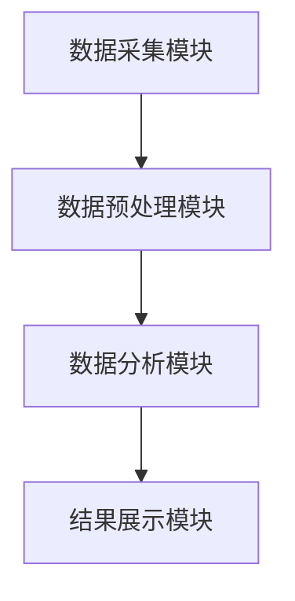
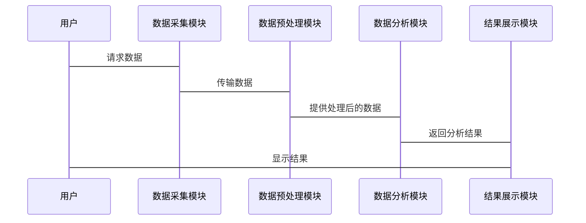

                 


# 金融时序数据的因果发现与应用研究

## 关键词
金融时序数据，因果发现，Granger因果，贝叶斯网络，机器学习

## 摘要
本文探讨了金融时序数据中的因果关系发现及其在金融领域的应用。通过分析Granger因果检验和贝叶斯网络等方法，本文展示了如何在金融数据中识别因果关系，并应用于投资策略和风险评估。文章结构清晰，从基础概念到算法实现再到系统设计，详细讲解了因果发现的全过程。

---

# 第1章：金融时序数据与因果发现概述

## 1.1 金融时序数据的定义与特点

### 1.1.1 金融时序数据的定义
金融时序数据是指随着时间变化的金融变量的观测值，例如股票价格、指数、利率等。这些数据通常以时间戳为索引，记录了金融市场的动态变化。

### 1.1.2 金融时序数据的主要特点
1. **时间依赖性**：数据的变化往往与过去的状态密切相关。
2. **波动性**：金融市场的波动通常较大，受多种因素影响。
3. **异质性**：不同金融资产的表现可能差异显著。

### 1.1.3 金融时序数据的常见类型
- 股票价格
- 汇率
- 利率
- 经济指标（如GDP、CPI）

## 1.2 因果发现的基本概念

### 1.2.1 因果关系的定义
因果关系指的是变量间的相互作用，其中一个是原因，另一个是结果。例如，利率的变化可能影响股票价格。

### 1.2.2 因果关系与相关关系的区别
- **相关关系**：变量间存在统计上的关联，但不一定存在因果关系。
- **因果关系**：变量间存在直接或间接的影响关系。

### 1.2.3 金融领域因果发现的重要性
在金融领域，因果关系可以帮助我们理解市场机制、制定投资策略和风险评估。

---

# 第2章：金融时序数据因果关系的数学模型

## 2.1 时间序列分析的基础模型

### 2.1.1 自回归模型（AR）
AR模型假设当前值与过去若干期的值相关。

$$ y_t = \beta_0 + \beta_1 y_{t-1} + \epsilon_t $$

### 2.1.2 移动平均模型（MA）
MA模型假设当前值与过去若干期的误差相关。

$$ y_t = \beta_0 + \beta_1 \epsilon_{t-1} + \beta_2 \epsilon_{t-2} + \epsilon_t $$

### 2.1.3 自回归移动平均模型（ARMA）
ARMA模型结合了AR和MA的特点。

$$ y_t = \beta_0 + \beta_1 y_{t-1} + \beta_2 \epsilon_{t-1} + \epsilon_t $$

## 2.2 Granger因果关系检验

### 2.2.1 Granger因果关系的定义
如果变量X的过去信息有助于预测变量Y的当前值，则认为X是Y的Granger原因。

### 2.2.2 Granger因果关系的检验方法
- 构建回归模型，比较有无X的情况下Y的预测误差。

### 2.2.3 Granger因果关系的数学公式
$$ H_0: \beta = 0 \quad (无因果关系) $$

$$ H_1: \beta \neq 0 \quad (存在因果关系) $$

## 2.3 贝叶斯网络在因果发现中的应用

### 2.3.1 贝叶斯网络的基本概念
贝叶斯网络是一种有向无环图，表示变量间的概率关系。

### 2.3.2 贝叶斯网络的结构学习
通过最大似然估计或MCMC方法学习网络结构。

### 2.3.3 贝叶斯网络的参数估计
估计每个节点的条件概率分布。

---

# 第3章：金融时序数据的因果发现算法

## 3.1 基于Granger因果关系的算法

### 3.1.1 Granger因果关系的实现步骤
1. 数据预处理
2. 构建回归模型
3. 进行F检验或t检验

### 3.1.2 Granger因果关系的优缺点
- 优点：简单易行
- 缺点：可能存在伪回归问题

### 3.1.3 Granger因果关系的实际应用
用于预测股票价格的变化趋势。

## 3.2 基于贝叶斯网络的因果发现算法

### 3.2.1 贝叶斯网络结构学习的算法
- K2算法：基于似然比的结构学习
- BIC准则：基于贝叶斯信息准则的结构学习

### 3.2.2 贝叶斯网络的参数估计方法
- 最大似然估计
- Markov链蒙特卡洛方法

### 3.2.3 贝叶斯网络在金融时序数据中的应用
用于识别金融变量间的因果关系网络。

## 3.3 基于可能图模型的因果发现算法

### 3.3.1 可能图模型的基本概念
可能图模型结合了因果图和统计独立性。

### 3.3.2 可能图模型的构建方法
通过计算偏相关系数确定变量间的依赖关系。

### 3.3.3 可能图模型在金融时序数据中的应用
用于发现金融市场的潜在因果结构。

---

# 第4章：金融时序数据因果关系的系统架构设计

## 4.1 系统功能设计

### 4.1.1 数据采集模块
- 从数据库或API获取金融时序数据。

### 4.1.2 数据预处理模块
- 数据清洗、标准化处理。

### 4.1.3 数据分析模块
- 应用Granger检验和贝叶斯网络进行因果分析。

### 4.1.4 结果展示模块
- 可视化因果关系网络。

## 4.2 系统架构设计



## 4.3 系统接口设计
- 输入接口：接收外部数据源的金融时序数据。
- 输出接口：返回因果关系分析结果。

## 4.4 系统交互流程



---

# 第5章：项目实战

## 5.1 环境安装
- 安装Python、Pandas、NumPy、Scikit-learn等库。

## 5.2 核心代码实现

### 5.2.1 Granger因果检验代码

```python
import statsmodels.api as sm

def granger_causality_test(data, max_lag=1):
    df = data.values
    for lag in range(1, max_lag+1):
        model = sm.tsa.GrangerCausalityTest(data, lag=lag)
        results = model.perform_test()
        print(f"Granger因果关系检验（滞后阶数={lag}）：p值={results.pvalue}")
```

### 5.2.2 贝叶斯网络实现代码

```python
from sklearn.naive_bayes import GaussianNB

def bayesian_network(X, y):
    model = GaussianNB()
    model.fit(X, y)
    return model
```

## 5.3 实际案例分析
以股票价格预测为例，应用上述算法进行因果分析，识别影响股票价格的关键因素。

## 5.4 项目小结
总结项目实现的关键点，讨论可能的优化方向。

---

# 第6章：总结与展望

## 6.1 本章小结
回顾全文，总结因果发现的核心内容和研究成果。

## 6.2 未来研究方向
探讨结合深度学习模型进行因果发现的可能性，以及更复杂的贝叶斯网络结构。

---

作者：AI天才研究院 & 禅与计算机程序设计艺术

