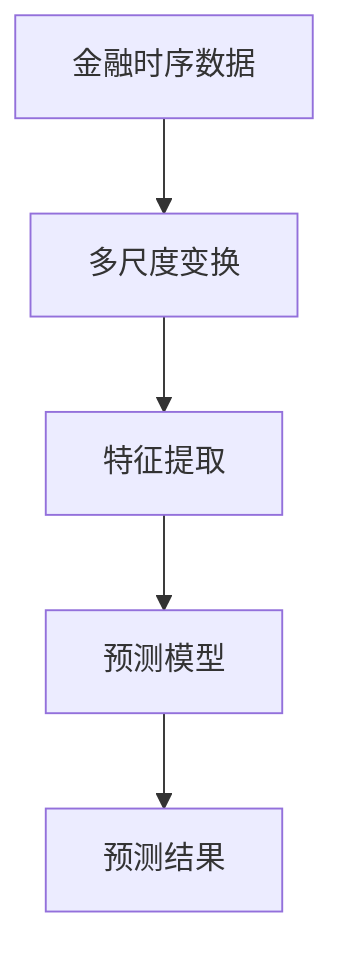
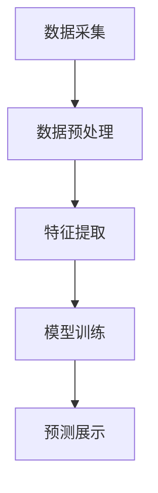

                 


# 金融时序数据的多尺度分析与预测研究

> 关键词：金融时序数据，多尺度分析，预测模型，小波变换，经验模态分解，系统架构

> 摘要：本文系统地探讨了金融时序数据的多尺度分析与预测研究，从背景介绍到核心概念，从算法原理到系统架构设计，再到项目实战，层层深入地分析了多尺度分析在金融预测中的应用。本文通过详细的数学模型、算法实现和案例分析，展示了如何利用多尺度分析方法提升金融时序数据的预测准确性。

---

## 第1章 金融时序数据的背景与概述

### 1.1 金融时序数据的基本概念

金融时序数据是指在金融市场上按照时间顺序记录的各类金融资产的价格、成交量等数据。这些数据具有以下特点：

- **时序性**：数据按时间顺序排列，反映了金融市场的动态变化。
- **波动性**：金融市场价格受多种因素影响，呈现出高频波动的特点。
- **非线性**：金融市场的价格变化往往表现出非线性特征，难以用简单的线性模型描述。
- **噪声干扰**：金融数据中常混杂着噪声，如市场微观结构噪声等。

金融时序数据的应用场景广泛，包括股票价格预测、外汇汇率预测、 commodity pricing、风险管理等。

### 1.2 多尺度分析的必要性

金融市场的复杂性要求我们从多个时间尺度上分析数据，以捕捉不同频率的市场信息。多尺度分析可以帮助我们更好地理解市场的多层级特征，从而提高预测的准确性。

- **多尺度分析的定义**：多尺度分析是指在不同时间尺度上对数据进行分解和分析的方法。通过不同尺度的特征提取，可以捕捉到不同频率的市场信息。
- **多尺度分析的优势**：
  - **高频数据的细节捕捉**：高频数据可以提供市场的短期波动信息。
  - **低频数据的长期趋势捕捉**：低频数据可以反映市场的长期趋势。
  - **多尺度特征的融合**：通过不同尺度特征的融合，可以提高预测的鲁棒性和准确性。

### 1.3 本章小结

本章介绍了金融时序数据的基本概念及其特点，并阐述了多尺度分析在金融预测中的必要性。多尺度分析可以帮助我们更好地理解金融市场的复杂性，捕捉不同频率的市场信息，从而提高预测的准确性。

---

## 第2章 多尺度分析的核心概念与联系

### 2.1 多尺度分析的基本原理

多尺度分析的核心思想是将数据分解到不同的时间尺度上，分别提取特征，然后将这些特征融合起来进行预测。以下是多尺度分析的基本原理：

- **数据变换**：通过多尺度变换（如小波变换、经验模态分解等）将数据分解到不同尺度上。
- **特征提取**：在每个尺度上提取特征，如均值、方差、趋势等。
- **特征融合**：将不同尺度的特征融合起来，形成最终的输入特征。

### 2.2 多尺度分析的数学模型

#### 2.2.1 小波变换

小波变换是一种常用的多尺度变换方法。其基本思想是将信号分解成不同频率的子信号。小波变换的数学表达式如下：

$$
x(t) = \sum_{j} \int_{-\infty}^{\infty} \psi_{j,k}(t) \, dk
$$

其中，$\psi_{j,k}(t)$ 是小波基函数，$j$ 是尺度参数，$k$ 是平移参数。

#### 2.2.2 经验模态分解

经验模态分解（EMD）是一种基于信号本身特性的分解方法。其基本步骤如下：

1. 将信号分解成多个本征模态函数（IMF）。
2. 每个IMF是一个具有单一频率的分量。
3. 将IMF叠加起来，得到原信号。

### 2.3 多尺度分析的架构图

以下是一个多尺度分析的架构图：



---

## 第3章 多尺度分析的算法原理

### 3.1 多尺度变换方法

#### 3.1.1 小波变换

小波变换是一种常用的多尺度变换方法，其优点是可以同时捕捉信号的局部特征和整体趋势。以下是小波变换的具体步骤：

1. **选择小波基函数**：选择合适的小波基函数，如haar小波、meyer小波等。
2. **进行小波变换**：对原始信号进行小波变换，得到不同尺度的系数。
3. **重构信号**：根据小波系数重构信号。

#### 3.1.2 经验模态分解

经验模态分解（EMD）是一种基于信号本身特性的分解方法。其优点是可以自适应地分解信号，提取不同频率的成分。

---

### 3.2 多尺度特征提取

#### 3.2.1 基于小波变换的特征提取

基于小波变换的特征提取步骤如下：

1. 对原始信号进行小波变换，得到小波系数。
2. 在每个尺度上提取特征，如均值、方差、最大值等。
3. 将所有尺度的特征组合起来，形成最终的特征向量。

---

## 第4章 预测模型

### 4.1 常用预测模型

#### 4.1.1 ARIMA模型

ARIMA模型是一种常用的时序预测模型，其基本思想是将时序数据分解为趋势、周期和噪声三部分。

$$
ARIMA(p, d, q) = \phi(B)^p (1 - B)^d X_t = \theta(B)^q Z_t
$$

其中，$p$ 是自回归阶数，$d$ 是差分阶数，$q$ 是移动平均阶数。

#### 4.1.2 LSTM模型

LSTM模型是一种基于递归神经网络的预测模型，其优点是可以捕捉长距离依赖关系。

$$
f_t = \sigma(w_{f} \cdot [h_{t-1}, x_t] + b_f)
$$

其中，$f_t$ 是遗忘门，$h_{t-1}$ 是前一时刻的隐藏状态，$x_t$ 是当前输入，$w_{f}$ 和 $b_f$ 是权重和偏置。

#### 4.1.3 集成学习模型

集成学习模型是一种通过组合多个基模型来提高预测准确性的方法。常用的集成学习方法包括随机森林、梯度提升树等。

---

## 第5章 系统架构设计

### 5.1 问题场景介绍

系统需要处理大量的金融时序数据，包括股票价格、外汇汇率等。数据源包括实时数据和历史数据。

### 5.2 系统功能设计

系统功能包括数据采集、预处理、特征提取、模型训练和预测展示。

#### 5.2.1 数据采集

数据采集模块负责从数据源获取金融时序数据。

#### 5.2.2 数据预处理

数据预处理模块负责对原始数据进行清洗和标准化处理。

#### 5.2.3 特征提取

特征提取模块负责在不同尺度上提取特征。

#### 5.2.4 模型训练

模型训练模块负责训练预测模型，并保存模型参数。

#### 5.2.5 预测展示

预测展示模块负责展示预测结果，并提供可视化界面。

### 5.3 系统架构设计

以下是系统的架构图：



---

## 第6章 项目实战

### 6.1 环境安装

需要安装以下环境：

- Python 3.8+
- NumPy
- Pandas
- Matplotlib
- Scikit-learn
- Keras

### 6.2 核心实现

#### 6.2.1 数据预处理

```python
import pandas as pd
import numpy as np

# 数据加载
data = pd.read_csv('financial_data.csv')

# 数据清洗
data.dropna(inplace=True)

# 数据标准化
from sklearn.preprocessing import StandardScaler
scaler = StandardScaler()
data_scaled = scaler.fit_transform(data)
```

#### 6.2.2 特征提取

```python
import pywt

# 小波变换
def wavelet_transform(data, wavelet='db4'):
    coeffs = pywt.wavedec(data, wavelet)
    return coeffs
```

#### 6.2.3 模型训练

```python
from keras.models import Sequential
from keras.layers import LSTM, Dense

# LSTM模型
model = Sequential()
model.add(LSTM(50, input_shape=(timesteps, features)))
model.add(Dense(1))
model.compile(optimizer='adam', loss='mean_squared_error')
model.fit(X_train, y_train, epochs=100, batch_size=32)
```

---

## 第7章 总结与展望

### 7.1 本章小结

本文系统地探讨了金融时序数据的多尺度分析与预测研究，从背景介绍到核心概念，从算法原理到系统架构设计，再到项目实战，层层深入地分析了多尺度分析在金融预测中的应用。

### 7.2 未来展望

未来的研究方向包括：

- 更高效的多尺度变换方法。
- 更准确的特征提取方法。
- 更强大的预测模型。

---

## 作者

作者：AI天才研究院/AI Genius Institute & 禅与计算机程序设计艺术 /Zen And The Art of Computer Programming

