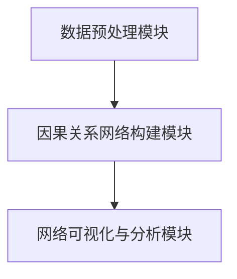

                 


# 《金融时序数据的多尺度因果关系网络构建研究》

> 关键词：金融时序数据，多尺度分析，因果关系网络，Granger因果检验，动态条件相关性，小波分析

> 摘要：本文探讨了金融时序数据的多尺度因果关系网络构建方法，从理论基础到实际应用，详细分析了如何利用多尺度分析和因果关系网络来理解金融市场中的复杂关系。通过Granger因果检验、动态条件相关性分析和小波分析等方法，构建了多层次的因果网络，并通过实际案例展示了其在金融风险预警和投资决策中的应用价值。

---

## 第1章：背景介绍

### 1.1 金融时序数据的基本概念

金融时序数据是指金融市场中随着时间变化的数值型数据，包括股票价格、汇率、债券收益率等。这类数据具有波动性大、非线性特征明显、受多种因素影响等特点，使得分析和预测变得复杂。

#### 1.1.1 金融时序数据的定义与特点
- **定义**：金融时序数据是指在一定时间间隔上记录的金融市场变量的数值序列。
- **特点**：包括波动性、趋势性、周期性、非线性等。

#### 1.1.2 金融时序数据分析的挑战
- 数据的复杂性：金融数据往往受到多种因素的影响，包括宏观经济指标、市场情绪、政策变化等。
- 数据的非平稳性：许多金融时间序列是非平稳的，难以直接使用传统的统计方法进行分析。
- 数据的高维性：随着金融市场的发展，涉及的变量越来越多，如何处理高维数据成为挑战。

#### 1.1.3 金融时序数据的应用场景
- 金融风险管理：通过分析金融时序数据，识别潜在的风险因素，制定风险控制策略。
- 投资决策：利用金融时序数据，发现市场中的规律，辅助投资决策。
- 市场预测：基于历史数据，预测未来的市场走势。

### 1.2 多尺度分析的必要性

多尺度分析是指在不同的时间尺度上对数据进行分析，以捕捉数据在不同粒度上的特征。在金融时序数据中，不同时间尺度的分析有助于发现不同层次的市场规律。

#### 1.2.1 多尺度分析的定义
- 多尺度分析：对数据在不同时间粒度上进行分析，以发现不同层次的特征。

#### 1.2.2 金融时序数据的多尺度特性
- 短期波动：如分钟级或小时级的市场波动。
- 长期趋势：如季度级或年级的市场趋势。
- 不同时间尺度上的特征差异：同一市场现象在不同时间尺度上可能表现出不同的特征。

#### 1.2.3 多尺度分析在金融研究中的意义
- 揭示市场中的多层次规律：通过多尺度分析，可以发现短期波动和长期趋势之间的关系。
- 提高预测准确性：结合多尺度特征，可以提高金融预测的准确性。
- 优化投资策略：基于多尺度分析，制定更合理的投资策略。

### 1.3 因果关系网络的理论基础

因果关系网络是一种通过网络结构描述变量之间因果关系的工具。在金融领域，因果关系网络可以帮助我们理解不同金融变量之间的因果关系。

#### 1.3.1 因果关系与相关关系的区别
- 相关关系：描述变量之间的统计关联性，不考虑因果方向。
- 因果关系：描述变量之间的因果关系，强调因果方向和强度。

#### 1.3.2 Granger因果检验的基本原理
- Granger因果检验：通过统计方法检验一个变量是否是另一个变量的“原因”。
- 基本假设：如果变量X对变量Y有Granger因果关系，则Y的预测可以通过X的历史信息来改进。

#### 1.3.3 复杂网络在因果关系分析中的应用
- 复杂网络：将金融变量视为网络节点，变量之间的因果关系视为网络边。
- 网络分析：通过网络拓扑结构分析，识别重要的金融变量及其影响关系。

---

## 第2章：多尺度因果关系网络的核心概念与方法

### 2.1 多尺度分析的核心原理

#### 2.1.1 小波分析在多尺度数据处理中的应用
- 小波分析：一种有效的多尺度信号处理方法，能够同时捕捉信号的局部特征和整体特征。
- 应用：用于金融时序数据的降噪、特征提取和多尺度分析。

#### 2.1.2 多尺度数据融合的技术挑战
- 数据融合：将不同时间尺度的数据进行整合，以提取多层次特征。
- 技术挑战：如何保持不同时间尺度特征的独立性和完整性。

### 2.2 因果关系网络的构建原理

#### 2.2.1 网络节点与边的定义
- 网络节点：代表金融变量，如股票价格、汇率等。
- 网络边：代表变量之间的因果关系，边的权重表示因果关系的强度。

#### 2.2.2 因果关系网络的构建步骤
1. 数据预处理：对金融时序数据进行清洗和标准化。
2. 计算因果关系：使用Granger因果检验等方法计算变量之间的因果关系。
3. 构建网络：基于因果关系计算结果，构建因果关系网络。
4. 网络优化：对网络进行优化，去除虚假因果关系，增强网络的可解释性。

### 2.3 多尺度与因果关系的结合

#### 2.3.1 多尺度分析如何增强因果关系的准确性
- 通过多尺度分析，可以捕捉到不同时间尺度上的因果关系，提高因果关系的准确性。

#### 2.3.2 不同时间尺度下因果关系的动态变化
- 短期因果关系：短期市场波动中的因果关系。
- 长期因果关系：长期趋势中的因果关系。
- 动态变化：因果关系在不同时间尺度上的动态变化。

#### 2.3.3 多尺度网络的复杂性与可解释性
- 复杂性：多尺度网络的结构复杂，节点之间的关系多样。
- 可解释性：通过网络分析工具，可以直观地观察变量之间的因果关系。

---

## 第3章：多尺度因果关系网络的算法原理与数学模型

### 3.1 Granger因果检验的改进方法

#### 3.1.1 Granger因果检验的基本流程
1. 建立回归模型：将一个变量作为因变量，另一个变量作为自变量，回归模型中包含自变量的滞后值。
2. 计算F统计量：通过比较回归模型的F统计量，判断自变量是否是因变量的Granger原因。
3. 计算p值：根据F统计量计算p值，判断因果关系的显著性。

#### 3.1.2 考虑多尺度特性的Granger检验改进
- 在Granger检验中引入小波分析，考虑不同时间尺度上的Granger因果关系。

#### 3.1.3 基于小波变换的Granger因果检验
- 小波变换：对金融时序数据进行小波分解，得到不同时间尺度上的系数。
- Granger检验：在每个时间尺度上进行Granger检验，判断因果关系。

### 3.2 动态条件相关性的网络构建

#### 3.2.1 动态条件相关性的定义
- 动态条件相关性：在给定其他变量的条件下，两个变量之间的相关性随时间变化而变化。

#### 3.2.2 动态条件相关性的计算公式
$$动态条件相关性 = \frac{\text{Cov}(X_t, Y_t | Z_{t-k})}{\sqrt{\text{Var}(X_t | Z_{t-k})} \cdot \sqrt{\text{Var}(Y_t | Z_{t-k})}}$$

#### 3.2.3 基于动态条件相关性的网络构建算法
1. 计算动态条件相关性：在不同时间点计算变量之间的动态条件相关性。
2. 构建网络：将动态条件相关性转化为网络边的权重，构建动态条件相关性网络。

### 3.3 多尺度网络的优化算法

#### 3.3.1 基于层次聚类的网络优化方法
- 层次聚类：将网络节点按照层次结构进行聚类，优化网络的结构。

#### 3.3.2 基于谱聚类的网络优化方法
- 谱聚类：通过计算网络的谱特征，对网络进行聚类优化。

#### 3.3.3 基于深度学习的网络优化方法
- 深度学习：使用神经网络模型对多尺度因果关系网络进行优化，提高网络的预测能力。

---

## 第4章：系统分析与架构设计

### 4.1 系统功能设计

#### 4.1.1 数据预处理模块
- 功能：对金融时序数据进行清洗、标准化和小波分解。
- 实现步骤：
  1. 数据清洗：处理缺失值、异常值。
  2. 数据标准化：对数据进行标准化处理。
  3. 小波分解：对数据进行小波分解，得到不同时间尺度上的系数。

#### 4.1.2 因果关系网络构建模块
- 功能：基于多尺度分析和因果关系网络构建算法，构建多尺度因果关系网络。
- 实现步骤：
  1. Granger因果检验：在不同时间尺度上进行Granger因果检验。
  2. 动态条件相关性计算：计算变量之间的动态条件相关性。
  3. 网络构建：将Granger因果检验和动态条件相关性结果转化为网络边的权重。

#### 4.1.3 网络可视化与分析模块
- 功能：对构建的多尺度因果关系网络进行可视化和分析。
- 实现步骤：
  1. 网络可视化：使用网络可视化工具对网络进行可视化。
  2. 网络分析：分析网络的拓扑结构，识别重要的节点和边。

### 4.2 系统架构设计

#### 4.2.1 系统模块划分
- 数据预处理模块
- 因果关系网络构建模块
- 网络可视化与分析模块

#### 4.2.2 模块交互流程
1. 数据预处理模块接收原始金融时序数据，进行清洗、标准化和小波分解。
2. 因果关系网络构建模块基于小波分解后的数据，进行Granger因果检验和动态条件相关性计算，构建多尺度因果关系网络。
3. 网络可视化与分析模块接收构建的网络，进行可视化和分析。

#### 4.2.3 系统架构图


---

## 第5章：项目实战

### 5.1 环境安装与配置

#### 5.1.1 Python环境安装
- 使用Anaconda安装Python 3.8及以上版本。

#### 5.1.2 相关库的安装
- `numpy`：用于数据处理。
- `pandas`：用于数据读取和处理。
- `pywt`：用于小波分析。
- `networkx`：用于网络构建和分析。
- `matplotlib`：用于网络可视化。

### 5.2 核心代码实现

#### 5.2.1 数据预处理代码
```python
import numpy as np
import pandas as pd
import pywt

def preprocess_data(data):
    # 删除缺失值
    data = data.dropna()
    # 标准化处理
    data = (data - data.mean()) / data.std()
    # 小波分解
    scales = pywt.dwt_max_level(len(data), 'db5')
    coeffs = pywt.wavedec(data.values, 'db5', level=scales)
    return coeffs
```

#### 5.2.2 Granger因果检验代码
```python
from statsmodels.tsa.stattools import grangercausalitytests

def granger_test(x, y, max_lag=5):
    # 进行Granger因果检验
    results = grangercausalitytests(x, y, max_lag)
    return results['f-test'][1]  # 返回p值
```

#### 5.2.3 动态条件相关性计算代码
```python
def dynamic_correlation(x, y, lag=5):
    # 计算动态条件相关性
    x_shift = x.shift(lag)
    y_shift = y.shift(lag)
    cov = np.cov(x_shift, y_shift)
    return cov[0, 1] / (np.std(x_shift) * np.std(y_shift))
```

#### 5.2.4 网络构建代码
```python
import networkx as nx

def build_network(data, threshold=0.05):
    G = nx.Graph()
    nodes = data.columns.tolist()
    G.add_nodes_from(nodes)
    # 计算因果关系
    for i in range(len(nodes)):
        for j in range(i+1, len(nodes)):
            p_val = granger_test(data[nodes[i]], data[nodes[j]])
            if p_val < threshold:
                G.add_edge(nodes[i], nodes[j], weight=1 - p_val)
    return G
```

#### 5.2.5 网络可视化代码
```python
import matplotlib.pyplot as plt

def visualize_network(G):
    pos = nx.spring_layout(G)
    plt.figure(figsize=(10, 10))
    nx.draw(G, pos, edge_color='blue', edge_alpha=0.6, node_color='red', node_size=500, linewidth=2)
    plt.title('Multi-scale Causal Relationship Network')
    plt.show()
```

### 5.3 实际案例分析

#### 5.3.1 数据来源与选取
- 数据来源：选取某金融市场的股票价格数据，包括开盘价、收盘价、最高价、最低价等。

#### 5.3.2 数据预处理
- 使用上述预处理代码对数据进行清洗和标准化。

#### 5.3.3 网络构建与可视化
- 使用网络构建代码构建因果关系网络。
- 使用可视化代码对网络进行可视化，观察变量之间的因果关系。

#### 5.3.4 结果分析
- 通过网络可视化，可以观察到不同金融变量之间的因果关系，发现重要的市场驱动因素。

### 5.4 项目小结

通过实际案例分析，验证了多尺度因果关系网络构建方法的有效性。网络构建过程中，Granger因果检验和动态条件相关性分析结合了多尺度特征，提高了因果关系的准确性。网络可视化结果直观地展示了变量之间的因果关系，为金融分析提供了有力工具。

---

## 第6章：总结与展望

### 6.1 总结

本文详细探讨了金融时序数据的多尺度因果关系网络构建方法，从理论到实践，系统地介绍了多尺度分析、因果关系网络构建的核心概念与算法，展示了其在金融分析中的应用价值。通过实际案例分析，验证了方法的有效性。

### 6.2 展望

未来的研究方向包括：
1. **深度学习的结合**：探索深度学习在多尺度因果关系网络构建中的应用。
2. **动态网络的优化**：研究动态网络的实时更新方法，提高网络的实时性。
3. **多模态数据的融合**：将文本数据、社交媒体数据等多模态数据与金融时序数据结合，构建更全面的因果关系网络。

---

## 作者信息

作者：AI天才研究院/AI Genius Institute & 禅与计算机程序设计艺术/Zen And The Art of Computer Programming

---

**全文完**

