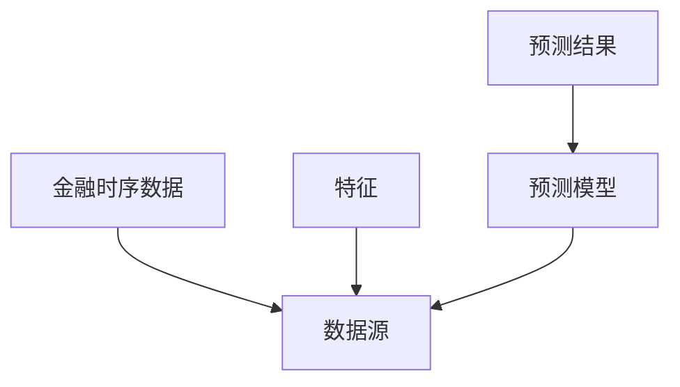
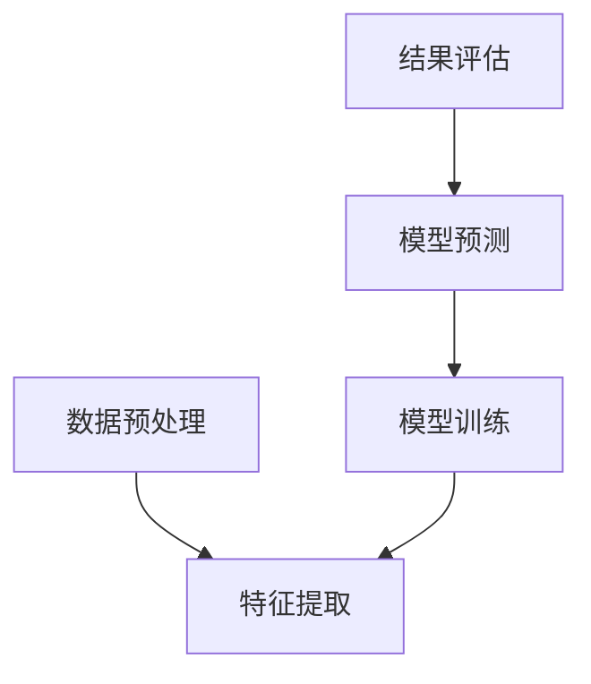
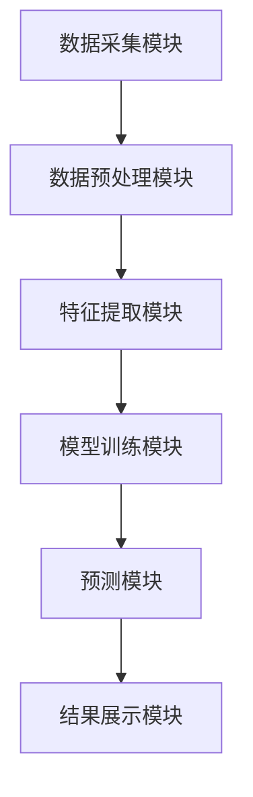

                 


# 金融时序数据的多源信息融合预测研究

> 关键词：金融时序数据，多源信息融合，预测模型，机器学习，时间序列分析

> 摘要：本文探讨了金融时序数据的多源信息融合预测方法，结合时间序列分析和机器学习模型，提出了一种有效的预测框架。通过多源数据的融合，提高了预测的准确性和鲁棒性，为金融市场的分析提供了新的视角。

---

## 第1章: 金融时序数据与多源信息融合预测概述

### 1.1 金融时序数据的定义与特点

#### 1.1.1 金融时序数据的定义
金融时序数据是指随着时间变化的金融市场数据，如股票价格、指数、汇率等。这些数据通常具有连续性和周期性，反映了市场的动态变化。

#### 1.1.2 金融时序数据的核心特点
- **连续性**：数据按时间顺序排列，反映市场动态。
- **波动性**：金融市场波动频繁，数据变化幅度大。
- **相关性**：不同金融资产之间可能存在相关性，影响预测结果。
- **非线性**：价格走势可能呈现非线性特征，难以用简单的线性模型捕捉。

#### 1.1.3 金融时序数据的分类
- **股票价格**：如标普500指数、个股价格等。
- **汇率**：如美元对人民币汇率、欧元对美元汇率等。
- **经济指标**：如GDP增长率、失业率、通胀率等。

### 1.2 多源信息融合预测的背景与意义

#### 1.2.1 问题背景
金融市场受多种因素影响，如宏观经济数据、公司财报、政策变化、突发事件等。仅依赖单一数据源进行预测往往不够准确。

#### 1.2.2 问题描述
如何有效地融合来自不同来源的信息，提高金融时序数据的预测准确性。

#### 1.2.3 问题解决方法
通过多源信息融合技术，整合来自文本、数值、图像等多种数据源的信息，构建更全面的预测模型。

#### 1.2.4 边界与外延
- **边界**：专注于金融市场的时序数据预测，不涉及其他领域的预测。
- **外延**：可应用于股票、外汇、期货等多种金融产品。

### 1.3 多源信息融合预测的核心概念

#### 1.3.1 核心概念结构
多源信息融合预测包括数据预处理、特征提取、信息融合、模型训练和预测结果输出五个阶段。

#### 1.3.2 核心要素组成
- 数据源：股票价格、经济指标、社交媒体情绪等。
- 融合方法：加权平均、集成学习、注意力机制等。
- 预测模型：ARIMA、LSTM、GRU等。

---

## 第2章: 多源信息融合预测的核心概念与联系

### 2.1 多源信息融合的原理

#### 2.1.1 数据预处理方法
- 数据清洗：处理缺失值、异常值。
- 数据标准化：将不同量纲的数据统一处理，便于模型训练。

#### 2.1.2 特征提取技术
- 移动平均（MA）：计算一定时间窗口内的平均值。
- 波动率：衡量数据的波动程度。
- 增量变化：计算相邻时间点的差值。

#### 2.1.3 信息融合方法
- 加权融合：根据数据源的重要性赋予不同权重，$$ y = \sum_{i=1}^{n} w_i x_i $$，其中$w_i$是权重，$x_i$是各个数据源的信息。
- 集成学习：将多个模型的预测结果进行集成，如投票法、堆叠模型。

### 2.2 核心概念的属性特征对比

| 比较维度 | 数据预处理 | 特征提取 | 信息融合 |
|----------|------------|----------|----------|
| 输入类型 | 数值型数据 | 时间序列 | 多源数据 |
| 输出类型 | 处理后数据 | 特征向量 | 融合后特征 |
| 方法复杂度 | 中等 | 高 | 高 |

### 2.3 ER实体关系图架构



---

## 第3章: 多源信息融合预测的算法原理

### 3.1 算法原理概述

#### 3.1.1 时间序列分析
- **ARIMA模型**：自回归积分滑动平均模型，适用于线性时序数据。
- **SARIMA模型**：季节性ARIMA模型，适用于有季节性特征的数据。

#### 3.1.2 机器学习模型
- **LSTM**：长短期记忆网络，适合捕捉长期依赖关系。
- **GRU**：门控循环单元，简化了LSTM的结构，训练更快。

#### 3.1.3 集成学习方法
- **投票法**：将多个模型的预测结果进行投票，选择多数结果。
- **堆叠模型**：使用元模型（如线性回归）对多个基模型的结果进行二次预测。

### 3.2 算法流程图



---

## 第4章: 数学模型与公式

### 4.1 时间序列模型的数学表达

#### 4.1.1 ARIMA模型
ARIMA(p, d, q)模型的数学公式为：
$$ y_t = \phi_1 y_{t-1} + \phi_2 y_{t-2} + \dots + \phi_p y_{t-p} + \theta_1 \epsilon_{t-1} + \theta_2 \epsilon_{t-2} + \dots + \theta_q \epsilon_{t-q} + \epsilon_t $$

#### 4.1.2 LSTM模型
LSTM的结构包括输入门、遗忘门和输出门：
$$
i_t = \sigma(W_i x_t + U_i h_{t-1} + b_i) \\
f_t = \sigma(W_f x_t + U_f h_{t-1} + b_f) \\
o_t = \sigma(W_o x_t + U_o h_{t-1} + b_o) \\
h_t = f_t h_{t-1} + i_t \tanh(W_c x_t + U_c h_{t-1} + b_c)
$$

### 4.2 注意力机制

注意力机制的权重计算公式为：
$$
\alpha_t^j = \frac{\exp(s_{t}^j)}{\sum_{k=1}^{n} \exp(s_{t}^k)}
$$
其中，$s_{t}^j$是第j个数据源的注意力得分。

---

## 第5章: 系统分析与架构设计

### 5.1 系统架构设计

系统架构图如下：



### 5.2 系统功能设计

- **数据采集模块**：从多种数据源获取金融数据。
- **数据预处理模块**：清洗和标准化数据。
- **特征提取模块**：提取有用特征。
- **模型训练模块**：训练预测模型。
- **预测模块**：生成预测结果。
- **结果展示模块**：可视化预测结果。

---

## 第6章: 项目实战

### 6.1 环境安装

安装所需的Python库：
```bash
pip install numpy pandas matplotlib scikit-learn tensorflow
```

### 6.2 核心实现源代码

以下是使用LSTM进行预测的代码示例：

```python
import numpy as np
import pandas as pd
from tensorflow.keras.models import Sequential
from tensorflow.keras.layers import LSTM, Dense, Dropout

# 数据预处理
data = pd.read_csv('stock_data.csv')
train_data = data.iloc[:1000]
test_data = data.iloc[1000:]

# 特征提取
train_features = train_data['price'].values.reshape(-1, 1)
test_features = test_data['price'].values.reshape(-1, 1)

# 模型训练
model = Sequential()
model.add(LSTM(64, input_shape=(None, 1)))
model.add(Dropout(0.5))
model.add(Dense(1))
model.compile(loss='mean_squared_error', optimizer='adam')

model.fit(train_features, epochs=10, batch_size=32)

# 模型预测
predicted_price = model.predict(test_features)
```

### 6.3 实际案例分析

通过上述代码，我们可以预测未来一段时间的股票价格。测试数据的预测结果与实际值进行对比，评估模型的准确性。

---

## 第7章: 总结与展望

### 7.1 最佳实践 tips

- 数据预处理是关键，确保数据质量。
- 选择合适的模型，根据数据特点调整超参数。
- 结合多源信息，提高预测的准确性。

### 7.2 小结

本文详细探讨了金融时序数据的多源信息融合预测方法，通过理论分析和实践案例，展示了如何利用多种数据源和先进的机器学习模型，提高预测的准确性。

### 7.3 注意事项

- 避免过拟合，使用交叉验证。
- 定期更新模型，适应市场变化。

### 7.4 拓展阅读

推荐书籍：
- 《时间序列分析及其应用》
- 《机器学习实战》

---

## 作者：AI天才研究院/AI Genius Institute & 禅与计算机程序设计艺术 /Zen And The Art of Computer Programming

---

这篇博客详细介绍了金融时序数据的多源信息融合预测研究，从基础概念到算法实现，再到系统设计和项目实战，为读者提供了一个全面的学习框架。通过本文，读者可以掌握如何利用多源信息进行金融预测，并在实际项目中应用这些方法。

