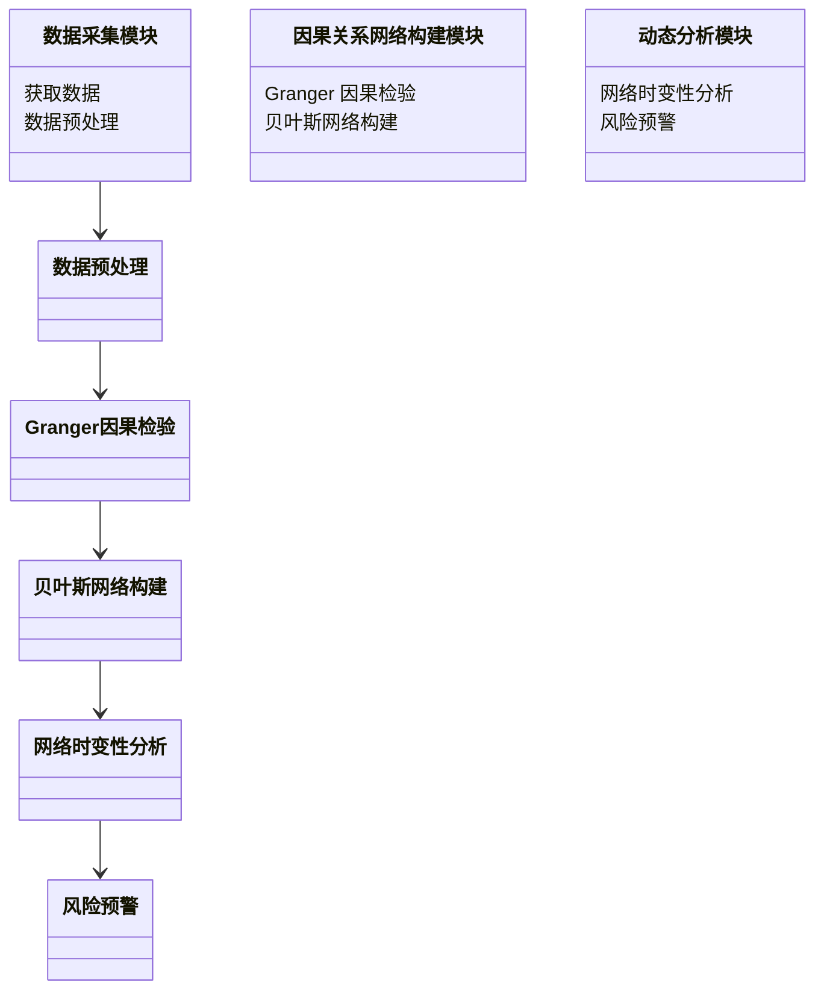
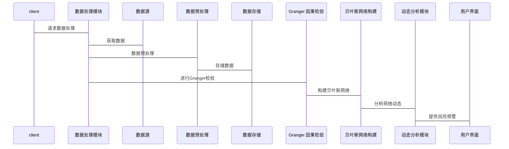

                 


# 金融时间序列因果关系网络动态分析

> **关键词**：金融时间序列、因果关系网络、动态分析、Granger因果检验、贝叶斯网络、系统架构设计

> **摘要**：本文系统地介绍了金融时间序列因果关系网络动态分析的核心概念、算法原理、系统架构设计及实际应用。通过详细分析时间序列模型、因果关系网络构建方法及其动态特性，结合实际案例和代码实现，为金融风险管理和投资决策提供理论支持和实践指导。

---

# 第一部分: 金融时间序列因果关系网络动态分析基础

## 第1章: 金融时间序列分析概述

### 1.1 金融时间序列的基本概念

#### 1.1.1 时间序列的定义与特征

时间序列是指按照时间顺序排列的数据点，通常用于分析随时间变化的变量。金融时间序列是金融市场上价格、成交量等数据的时序记录，具有以下特征：

1. **连续性**：数据点按时间顺序排列，无间断。
2. **趋势性**：长期向上或向下移动的趋势。
3. **周期性**：存在固定周期的波动，如月度或季度周期。
4. **随机性**：不可预测的噪声成分。

#### 1.1.2 金融时间序列的特殊性

金融时间序列具有以下几个特殊性：

1. **波动性**：价格波动剧烈，容易受到市场情绪影响。
2. **相关性**：不同金融资产之间存在复杂的相互影响。
3. **非线性**：市场行为往往表现出非线性特征，如“肥尾”现象。

#### 1.1.3 金融时间序列的应用领域

金融时间序列分析广泛应用于以下几个领域：

1. **价格预测**：基于历史价格数据预测未来价格走势。
2. **风险管理**：识别市场风险，评估投资组合的波动性。
3. **资产配置**：优化资产配置策略，提高投资收益。

---

### 1.2 因果关系网络的定义与特点

#### 1.2.1 因果关系网络的基本概念

因果关系网络是一种用于描述变量之间因果关系的图模型，节点代表变量，边代表因果关系。在金融领域，因果关系网络可以用来分析资产之间的相互影响关系。

#### 1.2.2 金融因果关系网络的构建方法

金融因果关系网络的构建方法主要包括以下几种：

1. **Granger因果检验**：通过回归分析检验变量之间是否存在因果关系。
2. **贝叶斯网络**：基于概率论构建变量之间的因果关系模型。
3. **马尔可夫链与状态转移网络**：分析状态之间的转移概率，构建动态网络模型。

#### 1.2.3 金融因果关系网络的动态特性

金融因果关系网络具有以下动态特性：

1. **时变性**：网络结构随时间变化，因果关系强度随时间波动。
2. **权重变化**：边的权重反映因果关系的强度，权重随时间变化。
3. **拓扑结构动态**：网络的节点连接方式随时间变化，节点入度和出度动态调整。

---

### 1.3 金融时间序列因果关系网络动态分析的背景与意义

#### 1.3.1 传统金融分析的局限性

传统金融分析方法主要依赖统计分析和回归模型，难以捕捉复杂的非线性关系和动态变化。例如，传统的时间序列预测模型（如ARIMA）假设数据的平稳性，但在实际金融市场中，数据往往具有非平稳性和非线性特征。

#### 1.3.2 因果关系网络在金融分析中的优势

因果关系网络能够捕捉变量之间的复杂关系，尤其是在动态环境下，因果关系网络能够反映变量之间的因果关系强度和方向的变化。

#### 1.3.3 动态分析在金融风险管理中的重要性

动态分析能够实时捕捉市场变化，及时发现潜在风险，为金融风险管理提供有力支持。例如，在金融危机发生前，因果关系网络的变化可能提前预警市场风险。

---

## 第2章: 金融时间序列因果关系网络的核心概念

### 2.1 时间序列分析的基本方法

#### 2.1.1 线性回归与时间序列预测

线性回归是一种简单的时间序列预测方法，假设变量之间的关系是线性的。例如，使用简单线性回归模型预测股票价格：

$$ y_t = a + bt + \epsilon_t $$

其中，$y_t$ 是预测的价格，$a$ 和 $b$ 是回归系数，$\epsilon_t$ 是误差项。

#### 2.1.2 自回归模型（AR）

自回归模型假设当前值与过去值存在线性关系。AR模型的数学表达式为：

$$ y_t = c + \phi_1 y_{t-1} + \phi_2 y_{t-2} + \dots + \phi_p y_{t-p} + \epsilon_t $$

其中，$p$ 是阶数，$\phi_i$ 是自回归系数。

#### 2.1.3 移动平均模型（MA）

移动平均模型假设当前值与过去误差项的线性组合有关。MA模型的数学表达式为：

$$ y_t = \mu + \theta_1 \epsilon_{t-1} + \theta_2 \epsilon_{t-2} + \dots + \theta_q \epsilon_{t-q} + \epsilon_t $$

其中，$q$ 是阶数，$\theta_i$ 是移动平均系数。

#### 2.1.4 ARIMA模型

ARIMA模型是自回归积分移动平均模型，综合了AR和MA的特点，适用于非平稳时间序列数据。ARIMA模型的数学表达式为：

$$ \Phi(B)(1-B)^d X_t = \theta(B) \epsilon_t $$

其中，$\Phi(B)$ 和 $\theta(B)$ 分别是自回归和移动平均多项式，$d$ 是差分阶数。

---

### 2.2 因果关系网络的构建原理

#### 2.2.1 Granger因果检验

Granger因果检验是一种统计方法，用于检验一个时间序列是否是另一个时间序列的“原因”。Granger因果检验的步骤如下：

1. **建立回归模型**：将被解释变量对自身滞后值和解释变量的滞后值进行回归。
2. **F检验**：计算F统计量，检验解释变量是否显著影响被解释变量。

Granger因果检验的数学公式为：

$$ y_t = \beta_0 + \beta_1 y_{t-1} + \beta_2 x_{t-1} + \beta_3 y_{t-2} + \beta_4 x_{t-2} + \epsilon_t $$

通过F检验判断$x_t$是否是$y_t$的Granger原因。

#### 2.2.2 贝叶斯网络

贝叶斯网络是一种基于概率论的图模型，用于描述变量之间的因果关系。在金融领域，贝叶斯网络可以用来分析资产之间的相互影响关系。

贝叶斯网络的构建步骤如下：

1. **确定变量**：选择相关的金融变量，如股票价格、成交量等。
2. **定义条件概率**：根据先验知识或数据，定义变量之间的条件概率分布。
3. **构建网络结构**：通过结构学习算法，构建变量之间的因果关系网络。

#### 2.2.3 马尔可夫链与状态转移网络

马尔可夫链是一种用于描述状态转移的数学模型，常用于分析金融市场的状态变化。例如，可以将金融市场划分为牛市、熊市等状态，通过马尔可夫链模型分析状态之间的转移概率。

---

### 2.3 金融时间序列因果关系网络的动态特性

#### 2.3.1 网络的时变性

金融因果关系网络的结构随时间变化，因果关系强度随时间波动。例如，金融危机期间，某些资产之间的因果关系可能显著增强。

#### 2.3.2 网络的权重变化

因果关系网络的边权重反映因果关系的强度，权重随时间变化。例如，当市场波动加剧时，某些资产之间的因果关系可能增强。

#### 2.3.3 网络的拓扑结构动态

金融因果关系网络的拓扑结构随时间变化，节点入度和出度动态调整。例如，某些资产可能在某个时期成为网络的核心节点，而在另一个时期则不再是核心节点。

---

## 第3章: 金融时间序列因果关系网络的数学模型

### 3.1 时间序列模型的数学表达

#### 3.1.1 ARIMA模型的数学公式

ARIMA模型的数学表达式为：

$$ \Phi(B)(1-B)^d X_t = \theta(B) \epsilon_t $$

其中，$\Phi(B)$ 和 $\theta(B)$ 分别是自回归和移动平均多项式，$d$ 是差分阶数。

#### 3.1.2 状态空间模型

状态空间模型是一种用于描述时间序列的隐马尔可夫模型。状态空间模型的数学表达式为：

$$ Y_t = Z_t + \epsilon_t $$

$$ Z_t = A Z_{t-1} + B U_t + \delta_t $$

其中，$Y_t$ 是观测向量，$Z_t$ 是状态向量，$A$ 是状态转移矩阵，$B$ 是控制输入矩阵，$U_t$ 是控制输入向量，$\epsilon_t$ 和 $\delta_t$ 是误差项。

---

### 3.2 因果关系网络的构建算法

#### 3.2.1 Granger因果检验的数学公式

Granger因果检验的数学公式为：

$$ y_t = \beta_0 + \beta_1 y_{t-1} + \beta_2 x_{t-1} + \beta_3 y_{t-2} + \beta_4 x_{t-2} + \epsilon_t $$

通过F检验判断$x_t$是否是$y_t$的Granger原因。

#### 3.2.2 贝叶斯网络的构建公式

贝叶斯网络的构建公式为：

$$ P(A|B) = \frac{P(B|A)P(A)}{P(B)} $$

其中，$P(A|B)$ 是在$B$发生的条件下$A$发生的概率，$P(B|A)$ 是在$A$发生的条件下$B$发生的概率，$P(A)$ 是$A$的先验概率，$P(B)$ 是$B$的边际概率。

---

# 第二部分: 金融时间序列因果关系网络动态分析的系统架构设计

## 第4章: 系统分析与架构设计

### 4.1 问题场景介绍

金融时间序列因果关系网络动态分析系统主要用于分析金融市场中资产之间的因果关系，帮助投资者和风险管理机构做出决策。

---

### 4.2 项目介绍

本项目旨在构建一个金融时间序列因果关系网络动态分析系统，提供以下功能：

1. **数据采集**：从金融市场数据源获取时间序列数据。
2. **因果关系网络构建**：基于Granger因果检验和贝叶斯网络构建因果关系网络。
3. **动态分析**：分析因果关系网络的动态变化，提供实时监控和风险预警。

---

### 4.3 系统功能设计

#### 4.3.1 领域模型（Mermaid 类图）



---

### 4.4 系统架构设计（Mermaid 架构图）


---

### 4.5 系统接口设计

1. **数据接口**：提供数据采集和数据预处理功能。
2. **因果关系网络接口**：提供Granger因果检验和贝叶斯网络构建功能。
3. **动态分析接口**：提供网络时变性分析和风险预警功能。

---

### 4.6 系统交互设计（Mermaid 序列图）



---

# 第三部分: 项目实战

## 第5章: 项目实战

### 5.1 环境安装

1. **安装Python**：下载并安装Python 3.x。
2. **安装依赖库**：使用以下命令安装必要的Python库：

   ```bash
   pip install numpy pandas scikit-learn networkx pymermaid
   ```

---

### 5.2 核心代码实现

#### 5.2.1 数据预处理代码

```python
import pandas as pd
import numpy as np

# 读取数据
data = pd.read_csv('financial_data.csv')

# 数据清洗
data = data.dropna()
data = data.iloc[:, 1:]  # 去除时间列

# 标准化处理
from sklearn.preprocessing import StandardScaler
scaler = StandardScaler()
data_scaled = scaler.fit_transform(data)
```

---

#### 5.2.2 Granger因果检验代码

```python
from statsmodels.tsa.stattools import grangercausalitytests

# 进行Granger因果检验
def granger_causality_test(data, max_lag=5):
    results = []
    for i in range(data.shape[1]):
        for j in range(data.shape[1]):
            if i != j:
                # 计算Granger因果关系
                granger_result = grangercausalitytests(data[:, i], data[:, j], max_lag)
                p_values = [granger_result[lag]['f-test'][1] for lag in range(1, max_lag+1)]
                min_p = min(p_values)
                results.append((i, j, min_p))
    return results

# 执行Granger因果检验
results = granger_causality_test(data_scaled)
```

---

#### 5.2.3 贝叶斯网络构建代码

```python
import networkx as nx
from pgmpy.models import BayesianModel
from pgmpy.estimators import BayesianEstimator

# 构建贝叶斯网络
model = BayesianModel()
model.add_nodes_from(range(data.shape[1]))

# 学习网络结构
estimator = BayesianEstimator(model, data)
estimator.learn_parameters()
```

---

### 5.3 案例分析

假设我们有两只股票A和B，我们希望通过Granger因果检验分析A是否是B的Granger原因。

1. **数据准备**：获取股票A和B的历史价格数据。
2. **数据预处理**：对数据进行标准化处理。
3. **Granger因果检验**：计算股票A和B之间的Granger因果关系。

通过Granger因果检验，我们发现股票A是股票B的Granger原因，说明股票A的价格变化对股票B的价格变化有显著影响。

---

### 5.4 项目小结

通过本项目，我们掌握了金融时间序列因果关系网络动态分析的核心算法和系统架构设计方法。实际案例分析表明，Granger因果检验和贝叶斯网络是有效的金融分析工具，能够帮助投资者和风险管理机构做出科学决策。

---

# 第四部分: 总结与展望

## 第6章: 总结与展望

### 6.1 总结

本文系统地介绍了金融时间序列因果关系网络动态分析的核心概念、算法原理、系统架构设计及实际应用。通过详细分析时间序列模型、因果关系网络构建方法及其动态特性，结合实际案例和代码实现，为金融风险管理和投资决策提供理论支持和实践指导。

---

### 6.2 展望

未来的研究方向包括：

1. **深度学习在因果关系分析中的应用**：探索深度学习模型在因果关系网络构建中的应用。
2. **实时动态分析技术的优化**：研究如何提高因果关系网络动态分析的实时性和准确性。
3. **多模态数据的融合**：结合文本、社交媒体等多模态数据，构建更加完善的金融因果关系网络。

---

**作者**：AI天才研究院/AI Genius Institute & 禅与计算机程序设计艺术/Zen And The Art of Computer Programming

