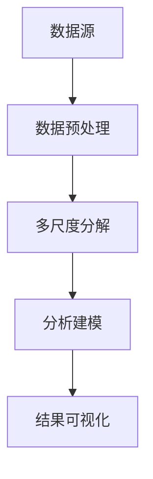
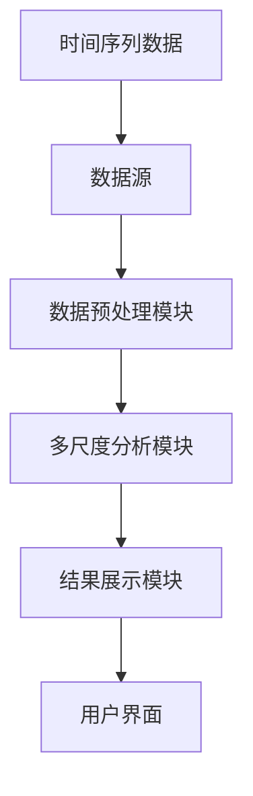
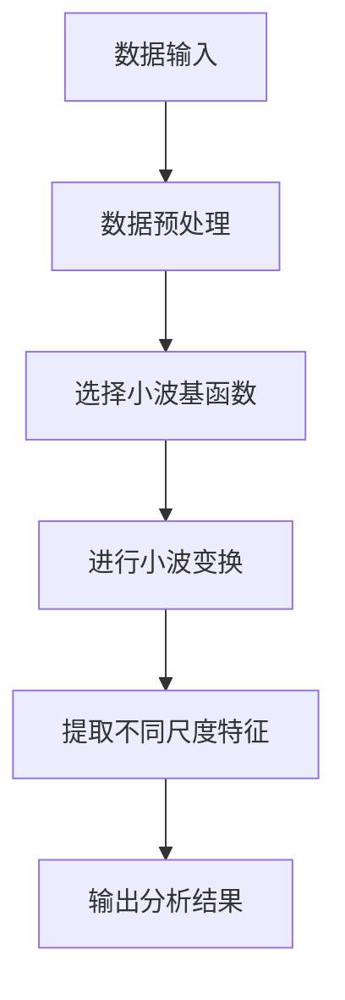
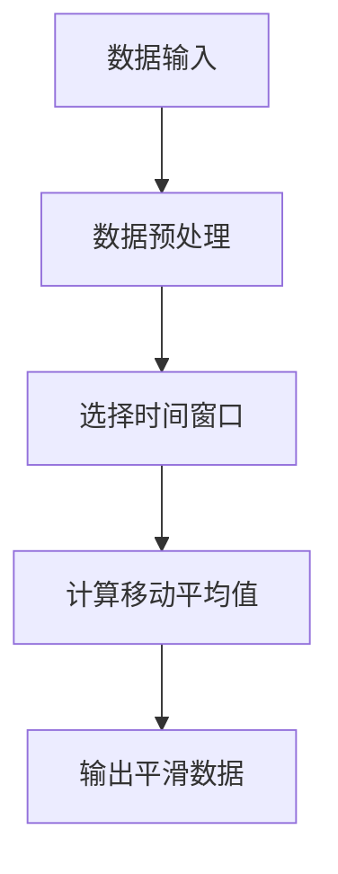
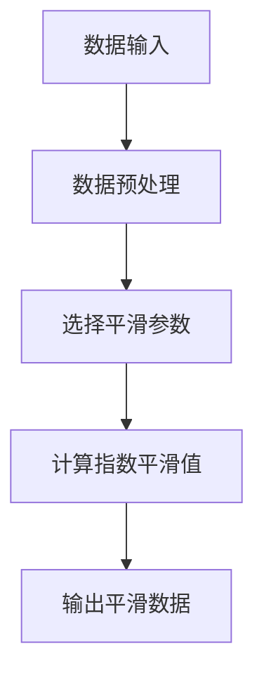
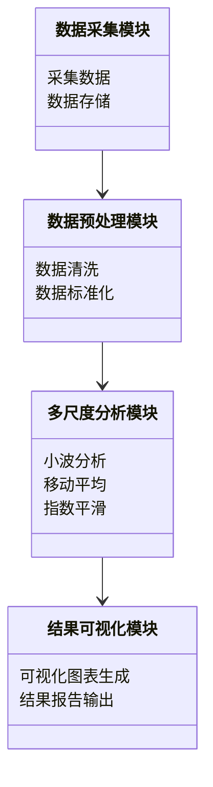
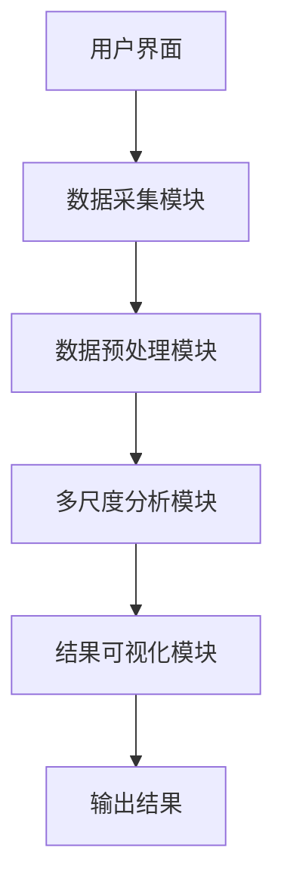
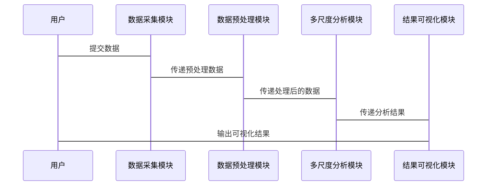

                 


# 金融时间序列多尺度分析平台

> 关键词：金融时间序列，多尺度分析，数据分析，算法实现，系统架构，平台设计

> 摘要：本文将详细探讨金融时间序列多尺度分析平台的设计与实现。首先从问题背景出发，分析传统时间序列分析方法的局限性，引出多尺度分析的必要性。然后从核心概念、算法原理、系统架构、项目实战等多个维度展开，深入阐述多尺度分析的理论基础与实际应用。通过本文的讲解，读者将能够理解并掌握如何构建一个高效、可靠的金融时间序列多尺度分析平台。

---

## 第一部分: 金融时间序列多尺度分析平台概述

### 第1章: 问题背景与需求分析

#### 1.1 问题背景
##### 1.1.1 金融时间序列分析的挑战
金融市场的数据具有高度的复杂性和不确定性，时间序列分析是理解市场走势、预测价格变化的重要手段。然而，传统的时间序列分析方法往往局限于单一时间尺度，无法捕捉多时间框架下的市场特征。

##### 1.1.2 多尺度分析的必要性
金融市场中的价格波动往往在不同时间尺度上表现出不同的特征。例如，短期交易可能受到市场情绪的影响，而长期趋势则受到宏观经济政策的影响。因此，单一时间尺度的分析难以全面捕捉市场的复杂性。

##### 1.1.3 传统方法的局限性
传统的时间序列分析方法（如ARIMA、GARCH等）通常基于单一时间尺度，无法有效处理多时间框架下的数据。此外，这些方法在面对高频数据时计算效率较低，且难以应对市场的非线性特征。

#### 1.2 问题描述
##### 1.2.1 时间序列数据的特点
金融时间序列数据具有以下特点：
- **连续性**：数据按时间顺序排列。
- **波动性**：价格波动频繁且幅度不一。
- **非线性**：价格变化可能受到多种因素的影响，呈现非线性特征。
- **噪声干扰**：数据中往往包含大量噪声，影响分析结果。

##### 1.2.2 多尺度分析的目标
多尺度分析的目标是通过在多个时间尺度上对数据进行分解和分析，捕捉不同层次的市场特征，从而提高分析的准确性和鲁棒性。

##### 1.2.3 平台建设的需求
为了实现多尺度分析，需要一个高效、灵活的平台，能够支持多种时间尺度的数据处理、多种分析算法的集成以及结果的可视化展示。

#### 1.3 问题解决
##### 1.3.1 多尺度分析的核心思想
多尺度分析的核心思想是将数据分解到不同的时间尺度上，分别进行分析，并将结果进行综合，以获得更全面的市场洞察。

##### 1.3.2 平台的功能定位
金融时间序列多尺度分析平台的功能定位是提供一个多维度、多层次的数据分析工具，支持用户在不同时间尺度上进行数据处理、建模和预测。

##### 1.3.3 技术实现路径
- 数据采集与预处理
- 多尺度分解与分析
- 模型构建与预测
- 结果可视化与解读

#### 1.4 平台的边界与外延
##### 1.4.1 数据范围界定
- 数据范围：金融市场的价格数据、交易数据、宏观经济数据等。
- 数据粒度：从分钟级别到月度级别。

##### 1.4.2 分析范围界定
- 分析目标：价格预测、市场波动检测、异常交易识别等。
- 分析方法：统计分析、机器学习、深度学习等。

##### 1.4.3 功能范围界定
- 数据采集与存储
- 数据预处理与清洗
- 多尺度分析算法实现
- 结果可视化与报告生成

#### 1.5 核心要素与概念结构
##### 1.5.1 核心要素分析
- 数据源：金融时间序列数据。
- 分析算法：多尺度分解算法、时间序列建模算法。
- 可视化工具：数据可视化组件。

##### 1.5.2 概念结构图


---

## 第二部分: 多尺度分析的核心概念与联系

### 第2章: 多尺度分析的核心概念与联系

#### 2.1 多尺度分析的原理
##### 2.1.1 多尺度分析的定义
多尺度分析是一种通过将数据分解到不同的时间尺度上，分别进行分析，并将结果综合的方法。其核心思想是不同时间尺度上数据的特征不同，通过多尺度分析可以捕捉到更多有用的信息。

##### 2.1.2 多尺度分析的数学基础
多尺度分析的数学基础主要包括小波变换、移动平均、指数平滑等方法。这些方法可以帮助我们将数据分解到不同的尺度上，并提取出不同层次的特征。

##### 2.1.3 多尺度分析的实现方法
- 小波变换：将数据分解到不同的频率（或时间尺度）上。
- 移动平均：在不同时间窗口上对数据进行平滑处理。
- 指数平滑：根据历史数据的权重进行平滑处理。

#### 2.2 核心概念对比
##### 2.2.1 时间序列分析方法对比
| 方法 | 单一尺度分析 | 多尺度分析 |
|------|--------------|------------|
| 数据 | 单一时间尺度 | 多个时间尺度 |
| 特性 | 仅捕捉单一尺度特征 | 捕捉多尺度特征 |
| 优势 | 简单易实现 | 更全面的分析 |
| 局限性 | 可能忽略其他尺度信息 | 计算复杂度较高 |

##### 2.2.2 多尺度分析与单尺度分析的对比
| 对比维度 | 单一尺度分析 | 多尺度分析 |
|----------|--------------|------------|
| 数据处理 | 单一时间窗口 | 多个时间窗口 |
| 特征提取 | 仅提取单一尺度特征 | 提取多尺度特征 |
| 分析结果 | 可能遗漏重要信息 | 更全面的分析结果 |

##### 2.2.3 平台功能模块对比
| 功能模块 | 数据采集 | 数据预处理 | 多尺度分析 | 结果可视化 |
|----------|----------|------------|------------|------------|
| 输入数据 | 原始数据 | 预处理数据 | 分解数据 | 可视化结果 |
| 输出数据 | 预处理数据 | 分解数据 | 分析结果 | 可视化图表 |

#### 2.3 ER实体关系图


---

## 第三部分: 多尺度分析算法原理

### 第3章: 多尺度分析算法原理

#### 3.1 算法原理概述
##### 3.1.1 小波分析原理
小波分析是一种通过小波变换将数据分解到不同尺度上的方法。其基本思想是将数据分解到不同的频率（或尺度）上，提取出不同层次的特征。

##### 3.1.2 移动平均法原理
移动平均法是一种通过在不同时间窗口上对数据进行平均处理的方法。其核心思想是通过平滑数据，消除短期波动，提取长期趋势。

##### 3.1.3 指数平滑法原理
指数平滑法是一种通过赋予历史数据不同权重进行平滑处理的方法。其核心思想是通过递减权重的方式，捕捉数据的近期趋势。

#### 3.2 算法实现流程
##### 3.2.1 小波分析流程


##### 3.2.2 移动平均法流程


##### 3.2.3 指数平滑法流程


#### 3.3 算法实现代码
##### 3.3.1 小波分析代码
```python
import pywt

def wavelet_analysis(data, wavelet='db4'):
    # 小波分解
    coeffs = pywt.wavedec(data, wavelet)
    # 提取不同尺度特征
    scales = len(coeffs) - 1
    features = []
    for i in range(scales):
        feature = pywt.waverec([coeffs[i], coeffs[i+1:]], wavelet)
        features.append(feature)
    return features
```

##### 3.3.2 移动平均法代码
```python
def moving_average(data, window_size=10):
    # 移动平均处理
    ma_data = []
    for i in range(len(data)):
        if i < window_size:
            ma = data[:i+1].mean()
        else:
            ma = data[i-window_size:i+1].mean()
        ma_data.append(ma)
    return ma_data
```

##### 3.3.3 指数平滑法代码
```python
def exponential_smoothing(data, alpha=0.3):
    # 指数平滑处理
    es_data = []
    for i in range(len(data)):
        if i == 0:
            es = data[i]
        else:
            es = alpha * data[i] + (1 - alpha) * es_data[i-1]
        es_data.append(es)
    return es_data
```

#### 3.4 数学公式
##### 3.4.1 小波变换公式
$$ W_{j,k} = \int_{-\infty}^{\infty} x(t) \psi_{j,k}(t) dt $$
其中，$W_{j,k}$ 是第 $j$ 层第 $k$ 个小波系数，$\psi_{j,k}(t)$ 是小波基函数。

##### 3.4.2 移动平均公式
$$ \text{MA}_t = \frac{1}{n} \sum_{i=t-n+1}^{t} x_i $$
其中，$\text{MA}_t$ 是第 $t$ 时刻的移动平均值，$n$ 是时间窗口大小。

##### 3.4.3 指数平滑公式
$$ S_t = \alpha x_t + (1 - \alpha) S_{t-1} $$
其中，$S_t$ 是第 $t$ 时刻的指数平滑值，$\alpha$ 是平滑参数，$x_t$ 是第 $t$ 时刻的观测值。

---

## 第四部分: 系统分析与架构设计

### 第4章: 系统分析与架构设计

#### 4.1 问题场景介绍
##### 4.1.1 问题背景
金融时间序列数据具有高频、多维、非线性等特点，传统的单一尺度分析方法难以满足实际需求。

##### 4.1.2 问题场景
- 高频交易监控
- 价格预测
- 市场波动检测

#### 4.2 项目介绍
##### 4.2.1 项目目标
构建一个支持多尺度分析的金融时间序列分析平台，提供高效、灵活的分析工具。

##### 4.2.2 项目范围
- 数据范围：股票价格、外汇汇率、宏观经济指标等。
- 功能范围：数据采集、数据预处理、多尺度分析、结果可视化。

#### 4.3 系统功能设计
##### 4.3.1 功能模块划分
- 数据采集模块
- 数据预处理模块
- 多尺度分析模块
- 结果可视化模块

##### 4.3.2 领域模型类图


#### 4.4 系统架构设计
##### 4.4.1 系统架构图


##### 4.4.2 接口和交互
- 用户通过界面输入数据
- 数据采集模块接收数据并存储
- 数据预处理模块对数据进行清洗和标准化
- 多尺度分析模块对数据进行分析
- 结果可视化模块生成可视化图表并输出结果

#### 4.5 系统交互流程


---

## 第五部分: 项目实战

### 第5章: 项目实战

#### 5.1 环境安装
##### 5.1.1 系统要求
- Python 3.8 或更高版本
- 安装必要的库：numpy、pandas、pywt、matplotlib

##### 5.1.2 安装步骤
```bash
pip install numpy pandas pywt matplotlib
```

#### 5.2 系统核心实现
##### 5.2.1 数据采集模块实现
```python
import pandas as pd
import requests

def fetch_data(symbol, start_date, end_date):
    # 从API获取数据
    url = f"https://api.example.com/stock/{symbol}"
    params = {
        'start_date': start_date,
        'end_date': end_date
    }
    response = requests.get(url, params=params)
    data = response.json()
    return pd.DataFrame(data)
```

##### 5.2.2 数据预处理模块实现
```python
import pandas as pd

def preprocess_data(data):
    # 数据清洗
    data = data.dropna()
    # 数据标准化
    data = (data - data.mean()) / data.std()
    return data
```

##### 5.2.3 多尺度分析模块实现
```python
import pywt

def multiscale_analysis(data, scales):
    results = []
    for scale in scales:
        coeffs = pywt.wavedec(data, 'db4')
        # 提取特征
        features = coeffs[0]
        results.append(features)
    return results
```

##### 5.2.4 结果可视化模块实现
```python
import matplotlib.pyplot as plt

def visualize_results(results):
    plt.figure(figsize=(10, 6))
    for i, result in enumerate(results):
        plt.subplot(len(results), 1, i+1)
        plt.plot(result)
        plt.title(f'Scale {i+1}')
    plt.show()
```

#### 5.3 代码应用解读与分析
##### 5.3.1 数据采集模块解读
- 数据采集模块负责从外部数据源获取金融时间序列数据，例如从API获取股票价格数据。

##### 5.3.2 数据预处理模块解读
- 数据预处理模块对获取的数据进行清洗和标准化，确保数据质量，方便后续分析。

##### 5.3.3 多尺度分析模块解读
- 多尺度分析模块使用小波变换对数据进行分解，提取不同尺度上的特征，为后续分析提供基础。

##### 5.3.4 结果可视化模块解读
- 结果可视化模块将分析结果以图表形式展示，方便用户理解和分析。

#### 5.4 案例分析与详细讲解
##### 5.4.1 案例背景
假设我们需要分析某股票的价格波动情况，选择多个时间尺度（分钟、小时、天、周）进行分析。

##### 5.4.2 数据采集与预处理
从API获取股票价格数据，并进行清洗和标准化。

##### 5.4.3 多尺度分析
使用小波变换对数据进行分解，分别在分钟、小时、天、周等尺度上进行分析。

##### 5.4.4 结果可视化
将不同尺度上的分析结果以图表形式展示，对比不同尺度下的价格波动特征。

##### 5.4.5 分析结果解读
通过对比不同尺度下的分析结果，可以发现价格波动在不同时间尺度下的特征，从而为投资决策提供更全面的依据。

#### 5.5 项目小结
通过本项目，我们实现了金融时间序列多尺度分析平台的核心功能，验证了多尺度分析的有效性，并展示了其在实际应用中的优势。

---

## 第六部分: 最佳实践

### 第6章: 最佳实践

#### 6.1 小结
金融时间序列多尺度分析平台的建设为金融数据分析提供了新的思路和工具，通过多尺度分析，可以更全面地捕捉市场特征，提高分析的准确性和鲁棒性。

#### 6.2 注意事项
- 数据采集时要注意数据的完整性和准确性。
- 数据预处理时要根据具体需求选择合适的标准化方法。
- 多尺度分析时要根据实际问题选择合适的分解方法和时间尺度。
- 结果可视化时要注意图表的可读性和直观性。

#### 6.3 拓展阅读
- 《金融时间序列分析》（书籍推荐）
- 小波分析在金融中的应用（论文推荐）
- 多尺度分析的最新研究进展（研究方向建议）

---

## 作者：AI天才研究院/AI Genius Institute & 禅与计算机程序设计艺术 /Zen And The Art of Computer Programming

---

**注意：以上内容为完整文章的大纲和部分章节内容，实际撰写时需要根据具体需求进一步补充和完善每个章节的详细内容。**

