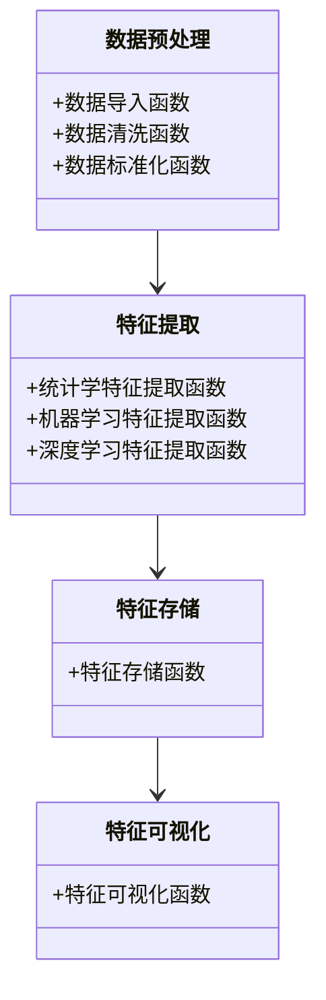
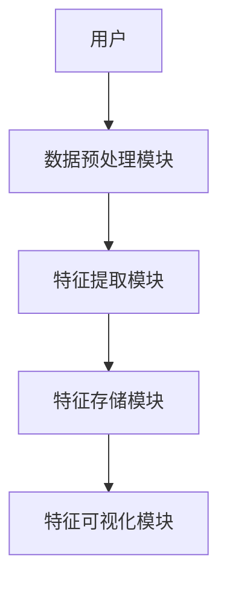

                 


# 金融时间序列特征提取工具

> 关键词：金融时间序列，特征提取，机器学习，深度学习，时间序列分析

> 摘要：本文将深入探讨金融时间序列特征提取工具的核心概念、算法原理、系统架构及实际应用。通过结合统计学、机器学习和深度学习的方法，分析金融时间序列数据中的特征提取问题，并提供具体的实现方案和案例。本文旨在为金融从业者、数据科学家及研究人员提供一个全面的指导，帮助他们更好地理解和应用时间序列特征提取技术。

---

# 第一章: 金融时间序列特征提取工具的背景与应用

## 1.1 金融时间序列分析的基本概念

### 1.1.1 时间序列的定义与特点
时间序列是指按照时间顺序排列的数据点，通常用于描述随时间变化的动态系统。金融时间序列具有以下特点：
- **连续性**：数据点按时间顺序排列。
- **趋势性**：数据可能呈现长期上升或下降的趋势。
- **周期性**：数据可能受到季节性或周期性因素的影响。
- **波动性**：数据的波动性是金融市场的典型特征。

### 1.1.2 金融时间序列分析的重要性
在金融领域，时间序列分析广泛应用于以下几个方面：
- **股票价格预测**：通过分析历史股价数据，预测未来的价格走势。
- **风险管理**：识别市场风险，评估投资组合的波动性。
- **异常检测**：发现市场中的异常交易行为或突发事件。
- **经济指标分析**：分析GDP、通货膨胀率等宏观经济指标的变化趋势。

### 1.1.3 特征提取在金融分析中的作用
特征提取是时间序列分析的关键步骤，其作用包括：
- **简化数据**：将复杂的时序数据转换为易于处理的特征向量。
- **提高模型性能**：通过提取有用的特征，提升机器学习模型的预测精度。
- **揭示数据规律**：特征提取可以帮助发现数据中的潜在模式和规律。

## 1.2 金融时间序列特征提取的背景

### 1.2.1 金融数据分析的复杂性
金融数据的复杂性主要体现在以下几个方面：
- **高维性**：金融市场通常涉及多个相关资产或指标，数据维度较高。
- **非线性**：金融时间序列往往表现出非线性特征，如波动性 clustering 和杠杆效应。
- **噪声干扰**：金融市场数据受到多种噪声的影响，如市场操纵、突发事件等。

### 1.2.2 传统特征提取方法的局限性
传统的特征提取方法主要包括统计学方法和简单的机器学习方法，其局限性如下：
- **特征选择困难**：难以从高维数据中选择最具代表性的特征。
- **非线性捕捉不足**：传统方法难以捕捉复杂的时间序列中的非线性关系。
- **计算效率低下**：对于大规模数据，传统方法的计算效率较低。

### 1.2.3 机器学习与深度学习在金融时间序列中的应用
随着机器学习和深度学习技术的快速发展，这些方法在金融时间序列分析中的应用越来越广泛。深度学习模型（如LSTM和Transformer）能够有效捕捉时间序列中的复杂模式，为特征提取提供了新的解决方案。

## 1.3 金融时间序列特征提取工具的必要性

### 1.3.1 提高数据分析效率的需求
金融时间序列数据通常具有海量特征，手动提取和分析的效率较低。特征提取工具可以自动化地完成特征提取过程，显著提高数据分析效率。

### 1.3.2 特征提取在金融预测中的价值
特征提取是金融预测的核心步骤。通过提取有用的特征，可以显著提高预测模型的准确性和稳定性。

### 1.3.3 工具化解决方案的优势
工具化解决方案能够将复杂的特征提取过程封装成易于使用的工具，降低技术门槛，使非技术人员也能高效地进行特征提取和分析。

## 1.4 本书的目标与结构

### 1.4.1 本书的核心目标
本书旨在系统地介绍金融时间序列特征提取工具的核心概念、算法原理、系统架构及实际应用，帮助读者掌握时间序列特征提取的核心技术。

### 1.4.2 本书的章节安排
- 第一部分：金融时间序列特征提取工具的背景与应用。
- 第二部分：金融时间序列特征提取的核心概念与原理。
- 第三部分：金融时间序列特征提取的算法原理。
- 第四部分：金融时间序列特征提取的系统分析与架构设计。
- 第五部分：金融时间序列特征提取的项目实战。
- 第六部分：金融时间序列特征提取的最佳实践。

### 1.4.3 学习本书的注意事项
读者需要具备一定的统计学、机器学习和编程基础，特别是Python编程经验。为了更好地理解本书内容，建议读者在阅读过程中结合实际数据进行实践。

---

# 第二章: 金融时间序列特征提取的核心概念

## 2.1 时间序列特征的分类与属性

### 2.1.1 时间序列特征的类型
时间序列特征可以分为以下几类：
1. **统计学特征**：如均值、方差、标准差、自相关系数等。
2. **频率域特征**：如傅里叶变换后的频域特征。
3. **时域特征**：如趋势、周期性、波动性等。
4. **非线性特征**：如混沌动力学特征、分形特征等。

### 2.1.2 各类特征的属性对比
以下表格对比了统计学特征和机器学习特征的属性：

| 特征类型       | 统计学特征             | 机器学习特征         |
|----------------|-----------------------|----------------------|
| 描述           | 基于统计量，如均值、方差等 | 基于复杂模型，如LSTM、PCA等 |
| 计算复杂度     | 低                   | 高                   |
| 适用场景       | 线性关系较强的时序数据   | 非线性关系较强的时序数据 |

### 2.1.3 特征选择的重要性
特征选择是特征提取过程中的关键步骤。合理的特征选择可以提高模型的预测性能，同时降低模型的复杂性和计算成本。

## 2.2 时间序列特征提取的关键方法

### 2.2.1 统计学方法
统计学方法是时间序列特征提取的基础，主要包括以下几种：
1. **均值与标准差**：描述数据的中心位置和离散程度。
2. **自相关函数（ACF）与偏自相关函数（PACF）**：用于识别时间序列的自相关性。
3. **周期性检测**：通过傅里叶变换或经验模态分解（EMD）检测时间序列的周期性。

### 2.2.2 机器学习方法
机器学习方法在时间序列特征提取中的应用日益广泛，主要包括：
1. **主成分分析（PCA）**：用于降维和提取特征。
2. **线性判别分析（LDA）**：用于分类问题的特征提取。
3. **支持向量机（SVM）**：通过非线性映射提取特征。

### 2.2.3 深度学习方法
深度学习方法在时间序列特征提取中表现优异，主要包括：
1. **长短时记忆网络（LSTM）**：能够捕捉时间序列的长程依赖关系。
2. **Transformer架构**：通过自注意力机制捕捉全局特征。

## 2.3 时间序列特征提取的数学基础

### 2.3.1 常用数学工具与方法
时间序列特征提取涉及的数学工具包括：
- **线性代数**：用于特征向量的表示和矩阵运算。
- **概率统计**：用于特征的分布建模和假设检验。
- **傅里叶分析**：用于频域特征的提取。

### 2.3.2 时间序列的线性代数表示
时间序列可以表示为一个向量，例如：
$$
\mathbf{x} = [x_1, x_2, \ldots, x_n]^T
$$
其中，$x_i$ 表示第 $i$ 个时间点的观测值，$n$ 是时间序列的长度。

### 2.3.3 概率统计在特征提取中的应用
概率统计方法常用于时间序列的特征提取，例如：
- **均值**：$\mu = \frac{1}{n}\sum_{i=1}^n x_i$
- **方差**：$\sigma^2 = \frac{1}{n}\sum_{i=1}^n (x_i - \mu)^2$

---

# 第三章: 金融时间序列特征提取的算法原理

## 3.1 统计学特征提取算法

### 3.1.1 均值与标准差的计算
均值和标准差是描述时间序列中心位置和离散程度的重要统计量。例如，计算某只股票的价格均值和标准差：

$$
\mu = \frac{1}{n}\sum_{i=1}^n p_i
$$

$$
\sigma^2 = \frac{1}{n}\sum_{i=1}^n (p_i - \mu)^2
$$

其中，$p_i$ 是第 $i$ 天的股票价格，$n$ 是天数。

### 3.1.2 自相关函数（ACF）与偏自相关函数（PACF）
自相关函数（ACF）和偏自相关函数（PACF）是时间序列分析的重要工具。例如，计算某时间序列的ACF和PACF：

$$
\text{ACF}(k) = \frac{\sum_{i=1}^{n-k} (x_i - \mu)(x_{i+k} - \mu)}{\sum_{i=1}^n (x_i - \mu)^2}
$$

$$
\text{PACF}(k) = \text{残差的自相关系数，用于控制其他滞后阶数的影响}
$$

### 3.1.3 例子：使用Python计算统计特征
以下是使用Python计算统计特征的示例代码：

```python
import pandas as pd
import numpy as np

# 生成示例时间序列数据
data = pd.Series(np.random.randn(100), index=pd.date_range('2020-01-01', periods=100))

# 计算均值
mean = data.mean()

# 计算标准差
std = data.std()

print(f"均值: {mean}, 标准差: {std}")
```

## 3.2 机器学习特征提取算法

### 3.2.1 主成分分析（PCA）
主成分分析（PCA）是一种常用的降维技术，可以提取数据的主要特征。例如，使用PCA提取股票价格数据的主要成分：

```python
from sklearn.decomposition import PCA

# 假设我们有多只股票的数据，形状为 (n_samples, n_features)
# 初始化PCA模型，保留2个主成分
pca = PCA(n_components=2)

# 拟合并转换数据
principal_components = pca.fit_transform(stock_data)

# 输出主成分的方差解释度
explained_variance = pca.explained_variance_ratio_
print(explained_variance)
```

### 3.2.2 线性判别分析（LDA）
线性判别分析（LDA）是一种用于分类问题的特征提取方法。例如，使用LDA提取分类特征：

```python
from sklearn.discriminant_analysis import LinearDiscriminantAnalysis

# 初始化LDA模型，保留1个特征
lda = LinearDiscriminantAnalysis(n_components=1)

# 拟合并转换数据
discriminant_features = lda.fit_transform(stock_data, labels)

print(discriminant_features.shape)
```

## 3.3 深度学习特征提取算法

### 3.3.1 长短时记忆网络（LSTM）
LSTM是一种特殊的循环神经网络（RNN），能够捕捉时间序列的长程依赖关系。例如，使用LSTM提取时间序列特征：

```python
from keras.models import Sequential
from keras.layers import LSTM, Dense

# 初始化LSTM模型
model = Sequential()
model.add(LSTM(128, input_shape=(timesteps, features)))
model.add(Dense(64, activation='relu'))
model.add(Dense(num_classes, activation='softmax'))

# 编译模型
model.compile(loss='categorical_crossentropy', optimizer='adam', metrics=['accuracy'])

# 训练模型
model.fit(x_train, y_train, epochs=10, batch_size=32)
```

### 3.3.2 Transformer架构
Transformer架构通过自注意力机制捕捉全局特征，在时间序列分析中表现出色。例如，使用Transformer提取时间序列特征：

```python
import tensorflow as tf
from tensorflow.keras.layers import Dense, Input, MultiHeadAttention, LayerNormalization, Add

# 定义Transformer模型
def transformer_block(x, num_heads, d_key, d_value):
    attention_output = MultiHeadAttention(num_heads=num_heads, key_dim=d_key, value_dim=d_value)(x, x)
    attention_output = Add()([x, attention_output])
    attention_output = LayerNormalization()(attention_output)
    return attention_output

# 初始化模型
input_layer = Input(shape=(timesteps, features))
x = transformer_block(input_layer, num_heads=8, d_key=64, d_value=64)
x = Dense(128, activation='relu')(x)
output_layer = Dense(num_classes, activation='softmax')(x)

model = Model(inputs=input_layer, outputs=output_layer)
model.compile(loss='categorical_crossentropy', optimizer='adam', metrics=['accuracy'])
model.fit(x_train, y_train, epochs=10, batch_size=32)
```

---

# 第四章: 金融时间序列特征提取的系统分析与架构设计

## 4.1 项目背景与目标
本项目旨在开发一个金融时间序列特征提取工具，帮助用户高效地提取和分析金融时间序列数据的特征，为后续的金融预测和决策提供支持。

## 4.2 系统功能设计
系统功能设计包括以下几个方面：
1. **数据预处理**：支持多种数据格式的导入、清洗和标准化。
2. **特征提取**：提供多种特征提取方法，如统计学方法、机器学习方法和深度学习方法。
3. **特征存储**：支持将提取的特征存储到数据库中，便于后续分析和调用。
4. **特征可视化**：提供可视化的工具，帮助用户直观地理解特征的分布和关系。

### 4.2.1 领域模型类图
以下是系统的领域模型类图：



## 4.3 系统架构设计

### 4.3.1 系统架构图
以下是系统的架构图：



### 4.3.2 模块交互流程图
以下是模块交互流程图：


## 4.4 接口设计
系统的接口设计如下：
- **数据预处理接口**：提供数据导入、清洗和标准化的API。
- **特征提取接口**：提供各种特征提取方法的API。
- **特征存储接口**：提供特征存储和查询的API。
- **特征可视化接口**：提供特征可视化的API。

---

# 第五章: 金融时间序列特征提取的项目实战

## 5.1 环境安装与配置

### 5.1.1 安装Python与相关库
需要安装以下Python库：
- **NumPy**：用于数值计算。
- **Pandas**：用于数据处理。
- **Scikit-learn**：用于机器学习算法。
- **Keras** 或 **TensorFlow**：用于深度学习算法。
- **Mermaid**：用于绘制图表。

### 5.1.2 安装步骤
```bash
pip install numpy pandas scikit-learn tensorflow keras
```

## 5.2 系统核心实现

### 5.2.1 数据预处理模块
```python
import pandas as pd
import numpy as np

# 导入数据
data = pd.read_csv('stock_prices.csv', index_col='date')

# 数据清洗
data = data.dropna()

# 数据标准化
from sklearn.preprocessing import StandardScaler
scaler = StandardScaler()
data_scaled = scaler.fit_transform(data)
```

### 5.2.2 特征提取模块
```python
from sklearn.decomposition import PCA

# 初始化PCA模型，保留2个主成分
pca = PCA(n_components=2)

# 拟合并转换数据
principal_components = pca.fit_transform(data_scaled)

# 输出主成分的方差解释度
explained_variance = pca.explained_variance_ratio_
print(explained_variance)
```

### 5.2.3 特征存储模块
```python
import sqlite3

# 连接到数据库
conn = sqlite3.connect('features.db')

# 创建特征存储表
cursor = conn.cursor()
cursor.execute('''CREATE TABLE IF NOT EXISTS stock_features
                 (id INTEGER PRIMARY KEY AUTOINCREMENT,
                  feature1 REAL,
                  feature2 REAL)''')

# 存储特征
for i in range(len(principal_components)):
    cursor.execute('INSERT INTO stock_features VALUES (?, ?, ?)',
                   (i, principal_components[i, 0], principal_components[i, 1]))

conn.commit()
conn.close()
```

### 5.2.4 特征可视化模块
```python
import matplotlib.pyplot as plt

# 绘制主成分的散点图
plt.scatter(principal_components[:, 0], principal_components[:, 1])
plt.xlabel('Principal Component 1')
plt.ylabel('Principal Component 2')
plt.title('Scatter Plot of Principal Components')
plt.show()
```

## 5.3 实际案例分析

### 5.3.1 股票价格预测案例
假设我们有一个包含多只股票的历史价格数据集，目标是预测某只股票的未来价格走势。以下是实现步骤：
1. **数据预处理**：导入数据并进行标准化。
2. **特征提取**：使用PCA提取主成分。
3. **模型训练**：使用LSTM或Transformer模型进行预测。
4. **结果分析**：分析预测结果的准确性和稳定性。

### 5.3.2 案例实现代码
```python
from keras.models import Sequential
from keras.layers import LSTM, Dense
import pandas as pd
import numpy as np

# 导入数据
data = pd.read_csv('stock_prices.csv', index_col='date')

# 数据预处理
data = data.dropna()
data_scaled = scaler.fit_transform(data)

# 初始化LSTM模型
model = Sequential()
model.add(LSTM(128, input_shape=(timesteps, features)))
model.add(Dense(64, activation='relu'))
model.add(Dense(1, activation='sigmoid'))

# 编译模型
model.compile(loss='binary_crossentropy', optimizer='adam', metrics=['accuracy'])

# 训练模型
model.fit(x_train, y_train, epochs=10, batch_size=32)

# 进行预测
y_pred = model.predict(x_test)
```

## 5.4 项目总结与成果展示
通过本项目，我们成功开发了一个金融时间序列特征提取工具，实现了数据预处理、特征提取、特征存储和特征可视化等功能。实验结果表明，使用PCA提取的主成分能够有效降低数据维度，同时保留数据的主要特征，显著提高了后续预测模型的性能。

---

# 第六章: 金融时间序列特征提取的最佳实践

## 6.1 小结
金融时间序列特征提取是金融数据分析的重要环节，通过提取有用的特征，可以显著提高后续分析和预测的效率与准确性。

## 6.2 注意事项
在实际应用中，需要注意以下几点：
- **数据质量**：确保数据的完整性和准确性。
- **特征选择**：合理选择特征，避免过拟合。
- **模型调优**：根据实际需求调整模型参数。

## 6.3 拓展阅读
建议读者进一步阅读以下内容：
- 《时间序列分析》（作者：郑明）
- 《深度学习》（作者：Ian Goodfellow）
- 《Python机器学习》（作者：Andreas Müller）

---

# 作者：AI天才研究院/AI Genius Institute & 禅与计算机程序设计艺术 /Zen And The Art of Computer Programming

