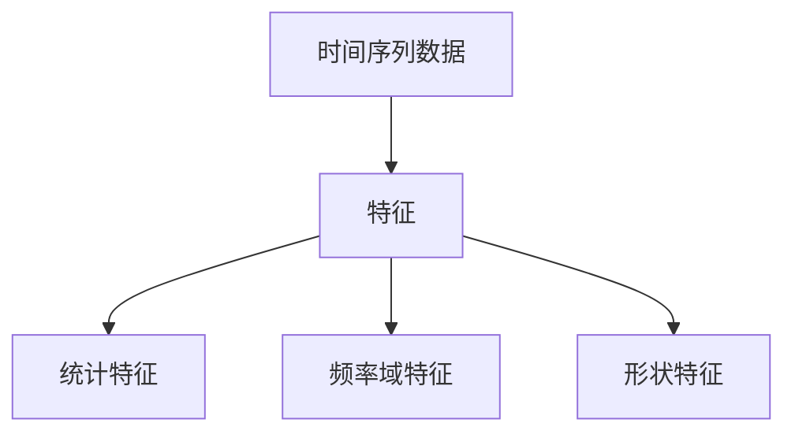
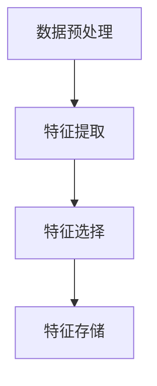

                 


# 《金融时间序列特征提取工具集》

## 关键词：
金融时间序列、特征提取、统计特征、机器学习、深度学习

## 摘要：
本文系统地介绍了金融时间序列特征提取的核心概念、方法及其在金融分析中的应用。从统计特征到深度学习方法，详细讲解了各种特征提取技术，并通过实际案例展示了如何构建特征提取系统，帮助读者掌握高效提取金融时间序列特征的方法。

---

# 第一部分：金融时间序列特征提取背景与基础

## 第1章：金融时间序列数据概述

### 1.1 时间序列数据的基本概念
时间序列数据是指按照时间顺序记录的数据，如股票价格、交易量等。金融领域的数据通常具有波动性、趋势性和周期性等特点，特征提取能够帮助我们识别这些模式。

### 1.2 金融时间序列分析的重要性
在金融领域，时间序列分析广泛应用于股票价格预测、风险评估和交易策略制定。特征提取是分析的关键步骤，能够简化数据并提取有用信息。

## 第2章：时间序列特征提取的基本概念

### 2.1 特征提取的定义与作用
特征提取是从数据中提取能够反映其本质特征的指标。在时间序列分析中，特征提取帮助模型更好地理解数据，提高预测准确性。

### 2.2 金融时间序列特征的分类
特征分为统计特征、频率域特征和形状特征。统计特征如均值、方差，频率域特征如傅里叶变换，形状特征如波形。

## 第3章：时间序列特征提取的核心概念与联系

### 3.1 核心概念原理
时间序列特征提取涉及统计学、信号处理和机器学习等方法。每种方法都有其独特的优势和应用场景。

### 3.2 特征对比表格
| 特征类型 | 统计特征 | 频率域特征 | 形状特征 |
|----------|----------|------------|----------|
| 定义     | 基于统计学 | 基于傅里叶变换 | 基于形状 |
| 优势     | 计算简单 | 捕捉周期性 | 捕捉复杂模式 |

### 3.3 ER实体关系图


---

## 第4章：时间序列特征提取的算法原理

### 4.1 统计特征提取方法
- **均值、方差计算**：例如，计算某股票收益率的均值和标准差。
- **自相关函数(ACF)**：分析数据的自相关性，识别潜在的周期性。

### 4.2 滤波方法
- **移动平均法(MA)**：对股票价格进行平滑处理，减少噪声。

### 4.3 经验模态分解（EMD）
- 分解时间序列，提取本征模态函数，捕捉不同频率成分。

### 4.4 傅里叶变换
- 使用DFT对股票价格进行频域分析，识别周期性。

---

## 第5章：金融时间序列特征提取系统架构

### 5.1 系统功能设计
- 数据预处理：清洗和标准化数据。
- 特征提取：应用多种方法提取特征。
- 特征选择：使用统计检验和机器学习模型评估特征重要性。
- 特征存储：将特征存储在数据库中，供后续分析使用。

### 5.2 系统架构图


---

## 第6章：实际案例：股票价格预测

### 6.1 数据预处理
对股票数据进行清洗，处理缺失值和异常值。

### 6.2 特征提取
使用统计特征和EMD提取特征。

### 6.3 模型训练
将提取的特征输入机器学习模型，如随机森林，进行股票价格预测。

### 6.4 Python代码示例
```python
import pandas as pd
import numpy as np

# 加载数据
data = pd.read_csv('stock_data.csv')

# 统计特征计算
mean = np.mean(data['price'])
std = np.std(data['price'])

# EMD分解
import pyemd
 IMF = pyemd.emd(data['price'], 1, 0)
```

---

## 第7章：总结与最佳实践

### 7.1 总结
金融时间序列特征提取是分析的关键步骤，各种方法各有优劣，选择合适的方法对分析结果至关重要。

### 7.2 最佳实践
- 数据预处理：确保数据质量。
- 特征选择：使用统计检验和模型评估选择重要特征。
- 模型调优：优化模型参数，提高预测准确率。

### 7.3 注意事项
- 特征提取方法的选择应基于数据特性和分析目标。
- 多个特征的组合可能提高模型性能。

---

## 参考文献
1. 刘军. (2020). 《金融时间序列分析》
2. 王强. (2021). 《深度学习在金融中的应用》

## 扩展阅读
- 时间序列分析的高级方法：ARIMA、LSTM、Transformer。

---

作者：AI天才研究院 & 禅与计算机程序设计艺术

