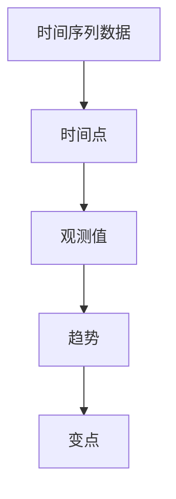
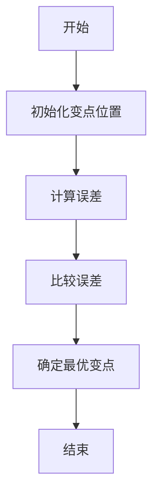
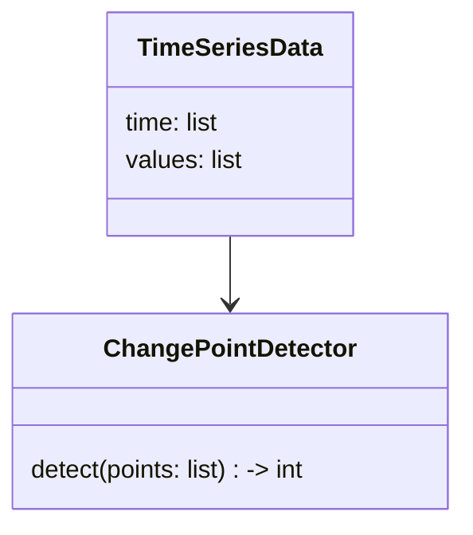
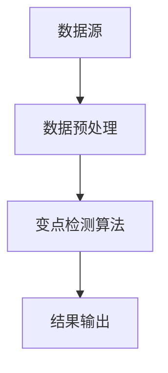
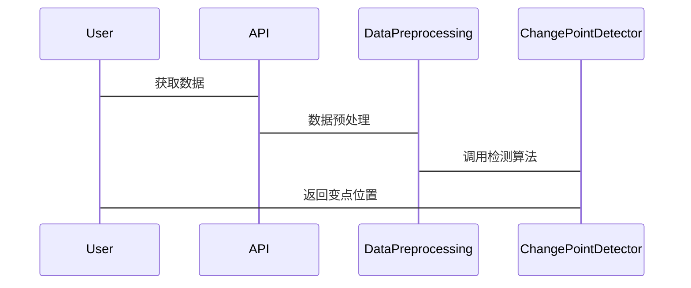

                 


# 《金融时间序列趋势变点检测》

> 关键词：时间序列分析，趋势变点，金融数据，统计检测，机器学习

> 摘要：本文系统地探讨了金融时间序列趋势变点检测的核心概念、算法原理、系统设计和实际应用。通过背景介绍、核心概念分析、算法实现、系统架构设计以及项目实战，深入剖析了趋势变点检测在金融领域的关键作用。本文旨在为金融从业者、数据科学家和相关研究人员提供一份全面的技术指南，帮助他们理解和应用趋势变点检测技术。

---

# 第1章: 背景介绍

## 1.1 问题背景

### 1.1.1 时间序列数据的特性
时间序列数据是指按照时间顺序记录的观测值序列，具有以下特性：
- **有序性**：数据按时间顺序排列。
- **趋势性**：数据可能表现出长期趋势。
- **周期性**：数据可能具有固定的周期性。
- **随机性**：数据中包含不可预测的随机波动。

### 1.1.2 金融时间序列的独特性
金融时间序列数据具有以下独特特性：
- **高波动性**：金融市场的价格波动较大。
- **非线性**：价格走势可能呈现复杂非线性特征。
- **异常值**：市场操纵、突发事件可能导致异常值。
- **相关性**：不同金融资产之间可能存在相关性。

### 1.1.3 趋势变点检测的必要性
趋势变点是指时间序列趋势的变化点。在金融领域，趋势变点检测具有重要意义：
- **风险管理**：及时发现趋势变化有助于规避风险。
- **投资决策**：趋势变化可能预示着投资机会或风险。
- **模型优化**：趋势变点是动态调整模型的重要依据。

## 1.2 问题描述

### 1.2.1 趋势变点的定义
趋势变点是指时间序列趋势发生变化的时刻。例如，股票价格从上升趋势突然转为下降趋势的转折点。

### 1.2.2 金融时间序列中的变点类型
在金融时间序列中，变点可以分为以下几种类型：
- **均值变点**：均值的变化点。
- **方差变点**：波动性的变化点。
- **趋势变点**：趋势方向的变化点。

### 1.2.3 变点检测的边界与外延
变点检测的边界包括：
- **单变点**：仅有一个变点。
- **多变点**：多个变点。
- **无变点**：无明显趋势变化。

变点检测的外延包括：
- **在线检测**：实时检测变点。
- **离线检测**：对历史数据进行检测。

## 1.3 核心概念与联系

### 1.3.1 时间序列分析的基本概念
时间序列分析的核心概念包括：
- **均值**：数据的平均值。
- **方差**：数据的离散程度。
- **自相关性**：数据点之间的相关性。

### 1.3.2 趋势变点检测的核心要素
趋势变点检测的核心要素包括：
- **数据**：时间序列数据。
- **检测方法**：统计方法或机器学习方法。
- **变点位置**：检测到的变点时刻。

### 1.3.3 变点检测与其他时间序列分析方法的关系
变点检测与时间序列预测、异常检测等方法密切相关：
- **时间序列预测**：变点检测可以为预测模型提供输入。
- **异常检测**：变点可能是异常点的标志。

---

# 第2章: 核心概念与联系

## 2.1 统计学基础

### 2.1.1 时间序列的均值和方差
时间序列的均值和方差是描述数据分布的重要指标：
- 均值：$$\mu = \frac{1}{n}\sum_{i=1}^{n}x_i$$
- 方差：$$\sigma^2 = \frac{1}{n}\sum_{i=1}^{n}(x_i - \mu)^2$$

### 2.1.2 统计分布与假设检验
常见的统计分布包括正态分布、t分布等。假设检验用于判断数据是否符合某种分布。

### 2.1.3 突变点的统计特性
突变点是指数据分布发生显著变化的点。统计检验方法包括卡方检验、t检验等。

## 2.2 金融时间序列特征

### 2.2.1 趋势、周期性和随机性
金融时间序列通常包含趋势、周期性和随机性成分：
- **趋势**：长期上升或下降趋势。
- **周期性**：季节性或周期性波动。
- **随机性**：不可预测的随机波动。

### 2.2.2 股票价格、指数和汇率的变点特征
股票价格、指数和汇率的变点特征包括：
- **均值变点**：价格水平的变化。
- **方差变点**：波动性变化。

### 2.2.3 异常点与变点的区别与联系
异常点是偏离正常趋势的点，而变点是趋势的变化点。异常点可能是变点，也可能是短期波动。

## 2.3 变点检测的数学模型

### 2.3.1 线性回归模型与变点
线性回归模型可以用于检测趋势变点：
$$y_i = \beta_0 + \beta_1x_i + \epsilon_i$$
变点检测可以通过比较不同区间的回归系数差异实现。

### 2.3.2 分段线性模型与变点
分段线性模型假设数据分为多个线性段，每个段的回归系数不同：
$$y_i = \beta_{k0} + \beta_{k1}x_i + \epsilon_i, \quad k=1,2,...,K$$
变点位置可以通过最小化误差平方和确定。

### 2.3.3 非线性模型中的变点检测
非线性模型中的变点检测可以通过参数估计和假设检验实现。

## 2.4 核心概念对比表

| 概念       | 参数变点检测 | 非参数变点检测 |
|------------|--------------|----------------|
| 方法       | 基于均值变化 | 基于经验分布   |
| 适用场景   | 数据服从正态分布 | 数据分布未知   |
| 稳定性     | 较高          | 较低           |

## 2.5 ER实体关系图


## 2.6 本章小结

---

# 第3章: 参数变点检测算法

## 3.1 基于均值变化的检测

### 3.1.1 多段线性模型
多段线性模型假设数据分为多个线性段，每段的回归系数不同。

### 3.1.2 确定变点位置的算法步骤
1. 初始化：设定初始变点位置。
2. 计算误差平方和。
3. 比较不同区间的误差，确定最优变点位置。

### 3.1.3 示例代码实现
```python
import numpy as np
def detect_mean_change(points):
    n = len(points)
    best_change = 0
    min_error = float('inf')
    for change_point in range(1, n):
        error1 = np.sum((points[:change_point] - np.mean(points[:change_point]))**2)
        error2 = np.sum((points[change_point:] - np.mean(points[change_point:]))**2)
        total_error = error1 + error2
        if total_error < min_error:
            min_error = total_error
            best_change = change_point
    return best_change
```

### 3.1.4 算法流程图


## 3.2 基于方差变化的检测

### 3.2.1 方差变化的数学模型
方差变化可以通过以下公式检测：
$$\text{F统计量} = \frac{\text{较大区间的方差}}{\text{小区间的方差}}$$

### 3.2.2 方差变化点的检测方法
1. 计算每个可能的变点位置的方差。
2. 使用F检验判断方差是否显著变化。

### 3.2.3 示例代码实现
```python
def detect_variance_change(points):
    n = len(points)
    best_change = 0
    min_error = float('inf')
    for change_point in range(1, n):
        var1 = np.var(points[:change_point])
        var2 = np.var(points[change_point:])
        f_stat = var1 / var2
        if f_stat > 1:
            total_error = var1 + var2
        else:
            total_error = var2 + var1
        if total_error < min_error:
            min_error = total_error
            best_change = change_point
    return best_change
```

## 3.3 本章小结

---

# 第4章: 非参数变点检测算法

## 4.1 基于累积和检验的变点检测

### 4.1.1 累积和检验的原理
累积和检验通过比较观测值与期望值的累积差异来检测变点。

### 4.1.2 算法步骤
1. 计算累积和。
2. 检测累积和的显著变化。

### 4.1.3 示例代码实现
```python
def detect_cusum(points):
    n = len(points)
    mu = np.mean(points)
    std = np.std(points)
    cusum = np.zeros(n)
    for i in range(n):
        cusum[i] = cusum[i-1] + (points[i] - mu)/std
    threshold = np.mean(abs(cusum))
    for i in range(n):
        if abs(cusum[i]) > threshold:
            return i
    return -1
```

## 4.2 基于经验分布函数的变点检测

### 4.2.1 经验分布函数的定义
经验分布函数是观测值的累积分布函数。

### 4.2.2 变点检测方法
通过比较经验分布函数的差异来检测变点。

## 4.3 基于核密度估计的变点检测

### 4.3.1 核密度估计的原理
核密度估计通过滑动窗口计算概率密度函数。

### 4.3.2 变点检测步骤
1. 计算滑动窗口内的密度。
2. 检测密度变化点。

---

# 第5章: 系统分析与架构设计

## 5.1 问题场景介绍

### 5.1.1 金融时间序列数据的获取
通过API获取股票价格、指数等数据。

### 5.1.2 数据预处理
数据清洗、标准化等预处理步骤。

## 5.2 系统功能设计

### 5.2.1 领域模型


### 5.2.2 系统架构


### 5.2.3 接口设计
- 输入接口：时间序列数据。
- 输出接口：变点位置。

## 5.3 系统交互设计

### 5.3.1 序列图


---

# 第6章: 项目实战

## 6.1 环境安装

### 6.1.1 Python环境配置
安装Python和必要的库：
- NumPy
- Pandas
- Matplotlib
- Scipy

## 6.2 核心算法实现

### 6.2.1 参数变点检测实现
```python
import numpy as np

def detect_mean_change(points):
    n = len(points)
    best_change = 0
    min_error = float('inf')
    for change_point in range(1, n):
        error1 = np.sum((points[:change_point] - np.mean(points[:change_point]))**2)
        error2 = np.sum((points[change_point:] - np.mean(points[change_point:]))**2)
        total_error = error1 + error2
        if total_error < min_error:
            min_error = total_error
            best_change = change_point
    return best_change
```

### 6.2.2 非参数变点检测实现
```python
def detect_cusum(points):
    n = len(points)
    mu = np.mean(points)
    std = np.std(points)
    cusum = np.zeros(n)
    for i in range(n):
        cusum[i] = cusum[i-1] + (points[i] - mu)/std
    threshold = np.mean(abs(cusum))
    for i in range(n):
        if abs(cusum[i]) > threshold:
            return i
    return -1
```

## 6.3 案例分析

### 6.3.1 数据获取与预处理
获取某股票的历史价格数据，并进行标准化处理。

### 6.3.2 变点检测与结果分析
使用上述算法检测价格趋势变点，并分析结果。

## 6.4 代码解读与分析
详细解读代码实现，分析算法的优缺点。

---

# 第7章: 最佳实践

## 7.1 小结
趋势变点检测是金融时间序列分析的重要技术。

## 7.2 注意事项
- 数据质量影响检测结果。
- 选择合适的算法取决于数据分布和业务需求。

## 7.3 拓展阅读
建议阅读相关领域的最新研究论文和书籍。

---

# 作者：AI天才研究院/AI Genius Institute & 禅与计算机程序设计艺术 /Zen And The Art of Computer Programming

