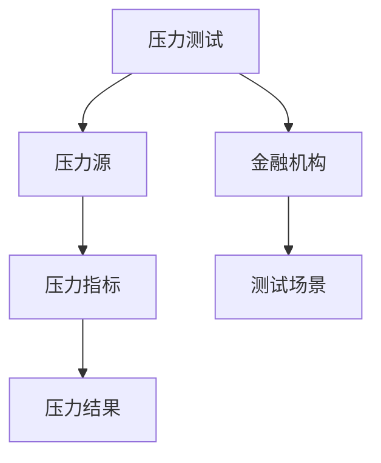
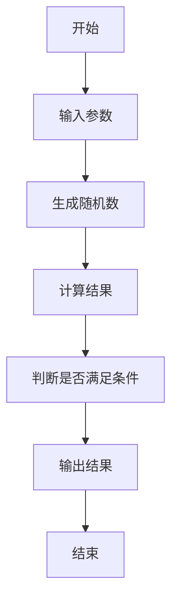
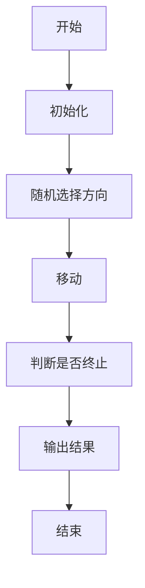
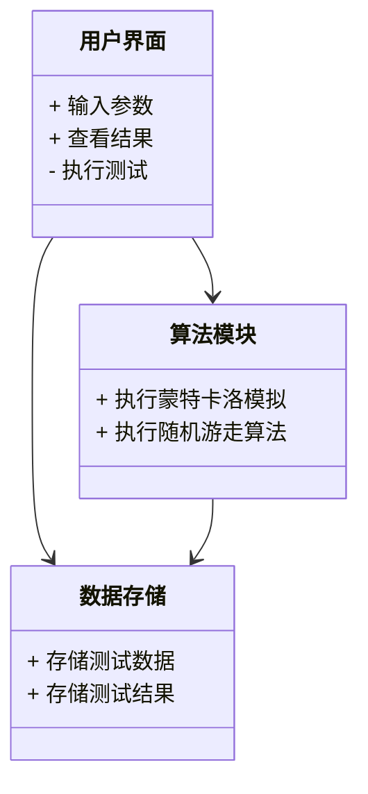
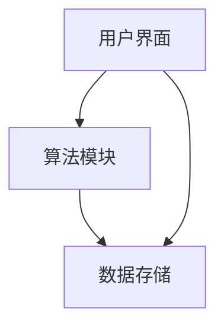
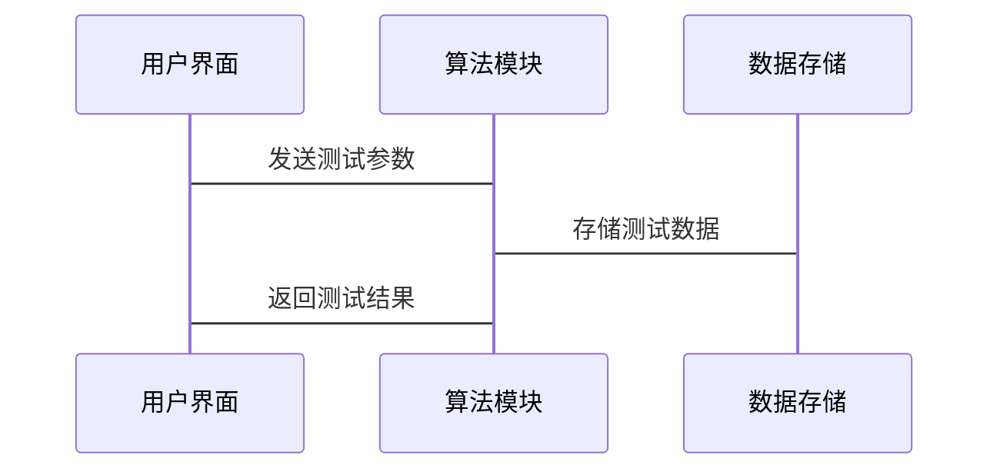

                 


# 金融机构压力测试自动化工具

> 关键词：压力测试，金融机构，自动化工具，蒙特卡洛模拟，系统架构，风险管理

> 摘要：本文系统介绍了金融机构压力测试自动化工具的设计与实现，涵盖压力测试的定义、核心概念、算法原理、系统架构、项目实战以及最佳实践等内容。通过详细讲解压力测试的数学模型、算法实现、系统设计和实际案例，本文为金融机构提供了一套高效、准确的压力测试解决方案，助力金融机构在复杂多变的市场环境中稳健运行。

---

# 第1章: 金融机构压力测试概述

## 1.1 压力测试的定义与重要性

### 1.1.1 什么是压力测试
压力测试是一种评估系统或模型在极端条件下的表现和稳定性的方法。在金融机构中，压力测试主要用于评估金融资产、负债或业务在极端市场条件、突发事件或系统故障情况下的表现。

### 1.1.2 压力测试在金融机构中的作用
- **风险评估**：识别潜在风险点，评估系统在极端情况下的表现。
- **制定应对策略**：通过压力测试结果，制定相应的风险管理策略和应急预案。
- **合规要求**：许多国家和地区的金融监管机构要求金融机构定期进行压力测试，以确保金融系统的稳定性。

### 1.1.3 压力测试的分类与应用场景
压力测试可以分为以下几类：
1. **市场风险测试**：评估资产在市场波动情况下的表现。
2. **信用风险测试**：评估贷款组合在借款人违约情况下的表现。
3. **流动性风险测试**：评估金融机构在资金短缺情况下的应对能力。
4. **操作风险测试**：评估系统故障或人为错误对业务的影响。

---

## 1.2 传统压力测试方法的局限性

### 1.2.1 手动压力测试的低效性
传统压力测试方法通常依赖人工操作，测试场景有限，且测试效率低下，难以覆盖所有可能的极端情况。

### 1.2.2 传统工具的局限性
现有的压力测试工具功能单一，难以满足金融机构对复杂场景测试的需求，且缺乏灵活性和可扩展性。

### 1.2.3 金融机构对自动化工具的需求
随着金融市场复杂性增加，金融机构需要一种高效、灵活、可扩展的压力测试工具，以应对日益复杂的市场环境。

---

## 1.3 自动化压力测试工具的优势

### 1.3.1 提高测试效率
自动化工具可以快速生成大量测试场景，显著提高测试效率。

### 1.3.2 增强测试准确性
通过自动化工具，可以减少人为操作误差，提高测试结果的准确性。

### 1.3.3 支持复杂场景模拟
自动化工具可以模拟多种极端场景，帮助金融机构全面评估潜在风险。

---

## 1.4 本章小结
本章介绍了压力测试的定义、重要性及其在金融机构中的应用，分析了传统压力测试方法的局限性，并提出了自动化压力测试工具的需求和优势。

---

# 第2章: 金融机构压力测试的核心概念与联系

## 2.1 压力测试的核心原理

### 2.1.1 压力测试的基本原理
压力测试通过模拟极端市场条件，评估金融机构在这些条件下的表现。测试结果可以帮助金融机构制定风险管理策略和应急预案。

### 2.1.2 压力测试的关键要素
- **压力源**：测试中的外部刺激因素，如市场波动、系统故障等。
- **压力指标**：测试中的关键衡量指标，如响应时间、错误率等。
- **压力结果**：测试后的分析结果，如系统崩溃点、性能瓶颈等。

### 2.1.3 压力测试的数学模型
压力测试的数学模型通常基于概率论和统计学原理，用于模拟极端情况下的资产表现。

---

## 2.2 核心概念对比与ER实体关系图

### 2.2.1 核心概念对比表格
| 概念 | 描述 | 示例 |
|------|------|------|
| 压力源 | 测试中的外部刺激因素 | 市场波动、系统故障 |
| 压力指标 | 测试中的关键衡量指标 | 响应时间、错误率 |
| 压力结果 | 测试后的分析结果 | 系统崩溃点、性能瓶颈 |

### 2.2.2 ER实体关系图


---

## 2.3 本章小结
本章详细讲解了压力测试的核心原理和关键要素，并通过对比表格和实体关系图，展示了压力测试各核心概念之间的联系。

---

# 第3章: 自动化压力测试工具的算法原理

## 3.1 压力测试算法概述

### 3.1.1 常见的压力测试算法
- **蒙特卡洛模拟**：基于随机数生成的算法，用于模拟极端市场条件下的资产表现。
- **随机游走算法**：模拟资产价格的随机波动。
- **时间序列分析**：基于历史数据预测未来资产价格走势。

### 3.1.2 算法选择的依据
算法选择主要依据测试场景的复杂性、数据的可用性和测试效率。

---

## 3.2 蒙特卡洛模拟算法

### 3.2.1 算法原理
蒙特卡洛模拟通过生成大量随机数，模拟资产价格的随机波动，评估资产在极端情况下的表现。

### 3.2.2 算法流程


### 3.2.3 示例代码
```python
import random

def monte_carlo_simulation(iterations):
    results = []
    for _ in range(iterations):
        random_number = random.uniform(0, 1)
        result = random_number * 100
        results.append(result)
    return results

# 示例调用
iterations = 1000
results = monte_carlo_simulation(iterations)
print(results)
```

---

## 3.3 随机游走算法

### 3.3.1 算法原理
随机游走算法模拟资产价格的随机波动，假设资产价格的变化是随机的，且没有趋势。

### 3.3.2 算法流程


### 3.3.3 示例代码
```python
import random

def random_walk(steps):
    position = 0
    positions = [position]
    for _ in range(steps):
        direction = random.choice([1, -1])
        position += direction
        positions.append(position)
    return positions

# 示例调用
steps = 10
positions = random_walk(steps)
print(positions)
```

---

## 3.4 时间序列分析

### 3.4.1 算法原理
时间序列分析基于历史数据，预测未来资产价格走势，常用于模拟资产在极端情况下的表现。

### 3.4.2 示例代码
```python
import pandas as pd
import numpy as np

# 示例时间序列数据
data = pd.DataFrame({'time': range(10), 'price': [100, 105, 98, 110, 108, 105, 102, 107, 103, 104]})

# 简单移动平均模型
model = data['price'].rolling(window=3).mean()
print(model)
```

---

## 3.5 本章小结
本章详细讲解了压力测试中常用的几种算法，包括蒙特卡洛模拟、随机游走算法和时间序列分析，并通过示例代码展示了这些算法的实现。

---

# 第4章: 自动化压力测试工具的系统架构设计

## 4.1 问题场景介绍

### 4.1.1 系统功能设计
- **用户界面**：提供友好的操作界面，方便用户输入测试参数和查看测试结果。
- **算法模块**：实现压力测试的核心算法，如蒙特卡洛模拟和随机游走算法。
- **数据存储**：存储测试数据和结果，支持后续分析和报告生成。

### 4.1.2 领域模型类图


---

## 4.2 系统架构设计

### 4.2.1 系统架构图


---

## 4.3 系统接口设计

### 4.3.1 接口交互序列图


---

## 4.4 本章小结
本章详细讲解了压力测试工具的系统架构设计，包括功能设计、类图、架构图和接口交互图。

---

# 第5章: 金融机构压力测试工具的项目实战

## 5.1 环境安装

### 5.1.1 安装Python
```bash
python --version
pip install --upgrade pip
```

### 5.1.2 安装依赖库
```bash
pip install numpy pandas matplotlib
```

---

## 5.2 核心实现

### 5.2.1 压力测试算法实现
```python
import numpy as np
import pandas as pd
import matplotlib.pyplot as plt

def monte_carlo_simulation(iterations):
    results = np.random.randn(iterations)
    return results

iterations = 1000
results = monte_carlo_simulation(iterations)
plt.hist(results, bins=20)
plt.show()
```

### 5.2.2 数据可视化
```python
import matplotlib.pyplot as plt

data = np.random.randn(100)
plt.plot(data)
plt.show()
```

---

## 5.3 案例分析

### 5.3.1 实际案例
假设我们有一个金融资产的历史价格数据，我们可以使用蒙特卡洛模拟来预测其在极端情况下的表现。

### 5.3.2 测试结果分析
通过模拟结果，我们可以识别资产在极端情况下的潜在风险，并制定相应的风险管理策略。

---

## 5.4 项目小结
本章通过实际案例展示了压力测试工具的实现过程，包括环境安装、核心算法实现和数据可视化。

---

# 第6章: 自动化压力测试工具的最佳实践

## 6.1 小结
- **工具优势**：提高测试效率，增强测试准确性，支持复杂场景模拟。
- **工具局限性**：需要依赖高质量的数据和算法，且模型可能存在假设偏差。

## 6.2 注意事项
- **数据质量**：确保输入数据的准确性和完整性。
- **模型选择**：根据具体需求选择合适的算法和模型。
- **结果解读**：合理解读测试结果，避免误判风险。

## 6.3 拓展阅读
- 推荐阅读相关领域的书籍和论文，深入理解压力测试的理论和应用。

---

# 第7章: 结语

## 7.1 本章总结
金融机构压力测试自动化工具通过高效、灵活的算法和系统架构设计，帮助金融机构全面评估潜在风险，制定有效的风险管理策略。

## 7.2 展望未来
随着人工智能和大数据技术的发展，压力测试工具将更加智能化和精准化，为金融机构的风险管理提供更有力的支持。

---

# 作者：AI天才研究院/AI Genius Institute & 禅与计算机程序设计艺术 /Zen And The Art of Computer Programming

