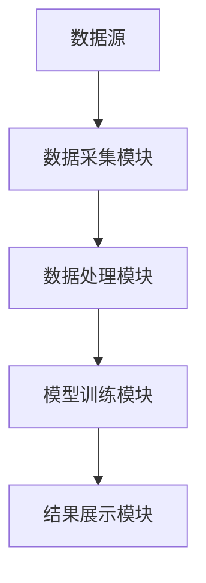
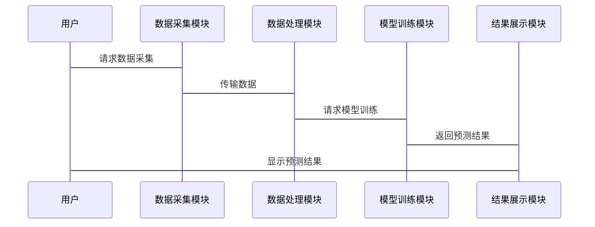

                 


# 金融机构流动性覆盖率预测

> 关键词：流动性覆盖率，流动性风险管理，金融机构，预测模型，机器学习，时间序列分析

> 摘要：本文详细探讨了金融机构流动性覆盖率预测的方法与实践。首先介绍了流动性覆盖率的定义、计算方法及其在金融监管中的重要性。接着，分析了影响流动性覆盖率的主要因素，并对比了统计模型和机器学习模型在预测中的应用。随后，通过一个具体案例展示了系统的架构设计、接口设计和实现过程，最后总结了预测模型的优缺点及未来的研究方向。

---

## 第一部分：流动性覆盖率预测的背景与意义

### 第1章：流动性覆盖率预测的背景与意义

#### 1.1 金融机构流动性管理的重要性

流动性管理是金融机构稳健运营的核心要素，直接关系到机构的偿付能力和市场信誉。流动性覆盖率（LCR）作为衡量流动性的重要指标，被广泛应用于金融监管和内部风险管理中。本文将探讨如何通过预测模型优化流动性覆盖率的管理，帮助金融机构在复杂多变的市场环境中保持稳健运营。

---

## 第二部分：流动性覆盖率预测的核心概念与方法

### 第2章：流动性覆盖率预测的核心概念

#### 2.1 流动性资产与负债的定义与分类

流动性资产是指能够在较短时间内以合理价格变现的资产，主要包括现金、国债、高等级债券等。流动性负债则包括活期存款、短期贷款等。流动性覆盖率的计算公式为：

$$
\text{LCR} = \frac{\text{合格流动性资产}}{\text{净现金流出}}
$$

其中，合格流动性资产是指在压力情况下仍能迅速变现的资产，而净现金流出则是未来30天内的预期现金流出减去预期现金流入。

#### 2.2 流动性覆盖率预测的关键影响因素

影响流动性覆盖率的主要因素包括市场波动、客户行为、宏观经济环境等。例如，市场波动会导致资产变现难度增加，从而降低流动性资产的价值。客户行为的变化，如大量提前支取存款，也会对流动性负债产生直接影响。

---

### 第3章：流动性覆盖率预测的数学模型

#### 3.1 统计模型在流动性预测中的应用

统计模型在流动性预测中应用广泛，主要包括线性回归模型和时间序列分析模型。

##### 3.1.1 线性回归模型

线性回归模型通过建立自变量和因变量之间的线性关系来进行预测。例如，可以将历史流动性数据作为自变量，预测未来流动性覆盖率作为因变量。线性回归模型的公式为：

$$
y = \beta_0 + \beta_1x_1 + \beta_2x_2 + \epsilon
$$

其中，$y$ 是目标变量，$\beta_0$ 是截距，$\beta_1$ 和 $\beta_2$ 是自变量的回归系数，$\epsilon$ 是误差项。

##### 3.1.2 时间序列分析模型

时间序列分析模型适用于分析具有时间依赖性的流动性数据。ARIMA模型（自回归积分滑动平均模型）是常用的时间序列预测模型，其公式为：

$$
\phi(\theta(B))\left(1 - B\right)^d X_t = \theta(B)Z_t
$$

其中，$\phi(\theta(B))$ 是自回归多项式，$\theta(B)$ 是滑动平均多项式，$d$ 是差分阶数，$X_t$ 是观测值，$Z_t$ 是白噪声。

#### 3.2 机器学习算法在流动性预测中的应用

机器学习算法在处理复杂非线性关系时表现出色，常用的算法包括支持向量回归（SVR）、随机森林回归和神经网络模型。

##### 3.2.1 支持向量回归（SVR）

SVR通过构建支持向量来实现回归预测，适用于高维数据的非线性关系建模。SVR的数学形式为：

$$
y = \text{sign}(w \cdot x + b) > 0
$$

其中，$w$ 是权重向量，$x$ 是输入向量，$b$ 是偏置项。

##### 3.2.2 随机森林回归

随机森林回归通过构建多个决策树并进行投票或平均来提高模型的泛化能力。决策树的构建过程包括特征选择、分裂准则和剪枝策略。

##### 3.2.3 神经网络模型

神经网络模型通过多层感知机（MLP）模拟复杂的非线性关系，适用于处理大量特征的流动性预测问题。神经网络的训练过程包括正向传播和反向传播，优化目标函数：

$$
\text{Loss} = \sum_{i=1}^{n} (y_i - \hat{y}_i)^2
$$

---

## 第三部分：流动性覆盖率预测的系统设计与实现

### 第4章：流动性覆盖率预测系统的架构设计

#### 4.1 系统功能模块划分

流动性覆盖率预测系统主要包括以下功能模块：

1. **数据采集模块**：负责采集历史交易数据、市场数据和宏观经济指标。
2. **数据处理模块**：对数据进行清洗、转换和特征工程，确保数据的可用性。
3. **模型选择与训练模块**：根据数据特点选择合适的预测模型并进行训练。
4. **结果展示与预警模块**：将预测结果可视化并设置预警机制，提醒相关人员采取措施。

#### 4.2 系统架构设计

系统架构采用分层设计，主要包括数据层、业务逻辑层和表现层。系统架构图如下：



---

### 第5章：系统接口设计与交互流程

#### 5.1 系统接口设计

系统接口设计包括数据接口、模型调用接口和结果展示接口。

- **数据接口**：用于数据源与数据采集模块之间的数据传输，支持CSV、Excel和数据库等多种格式。
- **模型调用接口**：用于前端或外部系统调用预测模型，返回预测结果。
- **结果展示接口**：用于将预测结果展示在用户界面上，支持图表和预警信息的显示。

#### 5.2 系统交互流程图

系统交互流程图描述了用户与系统的交互过程：



---

## 第四部分：项目实战与总结

### 第6章：项目实战

#### 6.1 项目背景与目标

本项目旨在开发一个能够实时预测金融机构流动性覆盖率的系统，帮助机构提前识别和应对流动性风险。

#### 6.2 数据准备与特征工程

数据准备阶段包括数据清洗和特征提取。例如，使用Python的pandas库进行数据清洗：

```python
import pandas as pd

# 读取数据
data = pd.read_csv('liquidity.csv')

# 删除缺失值
data.dropna(inplace=True)

# 标准化处理
from sklearn.preprocessing import StandardScaler
scaler = StandardScaler()
data_scaled = scaler.fit_transform(data)
```

#### 6.3 模型实现与训练

选择随机森林回归模型进行训练：

```python
from sklearn.ensemble import RandomForestRegressor

# 初始化模型
model = RandomForestRegressor(n_estimators=100, random_state=42)

# 训练模型
model.fit(X_train, y_train)

# 预测结果
y_pred = model.predict(X_test)
```

#### 6.4 结果分析与优化

通过混淆矩阵和回归指标（如均方误差、R²系数）评估模型性能。例如，计算均方误差：

$$
\text{MSE} = \frac{1}{n}\sum_{i=1}^{n}(y_i - \hat{y}_i)^2
$$

---

### 第7章：总结与展望

#### 7.1 研究总结

本文详细探讨了流动性覆盖率预测的方法与实践，通过对比统计模型和机器学习模型，提出了优化预测的策略。同时，通过一个具体案例展示了系统的架构设计和实现过程。

#### 7.2 未来展望

未来的研究可以进一步探索深度学习模型在流动性预测中的应用，如使用LSTM网络处理时间序列数据。此外，还可以结合实时数据流处理技术，提高预测的实时性和准确性。

---

## 作者

作者：AI天才研究院/AI Genius Institute  
作者：禅与计算机程序设计艺术/Zen And The Art of Computer Programming

