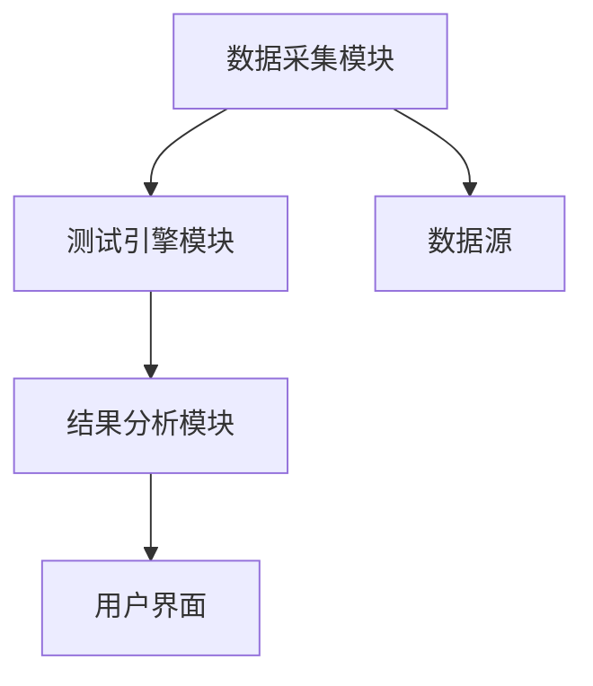

                 


# 金融机构流动性风险压力测试与管理平台

> 关键词：流动性风险，压力测试，金融机构，风险管理，系统架构，Python源代码，蒙特卡洛模拟

> 摘要：本文深入探讨了金融机构流动性风险压力测试与管理平台的设计与实现，从概念、方法论、系统架构到技术实现，详细介绍了压力测试的重要性及其在现代金融机构中的应用。文章结合实际案例，通过系统化的分析和设计，展示了如何构建一个高效、可靠的流动性风险压力测试与管理平台，帮助金融机构更好地应对市场波动和风险挑战。

---

## 第一部分：金融机构流动性风险与压力测试概述

### 第1章：流动性风险的基本概念

#### 1.1 流动性风险的定义与特点
流动性风险是指金融机构在一定时间内，以合理成本获得足够资金来满足其资产增长或负债偿还需求的能力受到限制的风险。其特点包括：
- **短期性**：通常涉及较短的时间范围，如几天或几周。
- **不确定性**：市场波动和突发事件可能导致流动性需求激增。
- **传染性**：一家机构的流动性问题可能迅速蔓延至整个金融系统。

#### 1.2 流动性风险的来源与影响
流动性风险的来源主要包括：
- **资产错配**：资产与负债在期限、结构上的不匹配。
- **市场波动**：金融市场剧烈波动导致资产变现困难。
- **挤兑效应**：客户大量提现或赎回，导致资金链断裂。

流动性风险的影响：
- 影响金融机构的财务健康，可能导致资金链断裂。
- 影响市场信心，引发系统性风险。

#### 1.3 压力测试在流动性风险管理中的作用
压力测试是一种评估金融机构在极端市场条件下的流动性状况的方法。其作用包括：
- **风险识别**：发现潜在的流动性问题。
- **制定应对策略**：通过模拟极端情况，制定有效的流动性管理措施。
- **监管合规**：满足监管机构对金融机构流动性风险管理的要求。

---

### 第2章：压力测试的基本原理

#### 2.1 压力测试的定义与目标
压力测试是一种通过模拟极端市场条件，评估金融机构在这些条件下的流动性状况的方法。其目标是确保金融机构能够在不利情况下维持足够的流动性。

#### 2.2 压力测试的分类与方法
压力测试的主要方法包括：
1. **情景分析法**：基于假设的市场情景，评估金融机构的流动性状况。
2. **蒙特卡洛模拟法**：通过模拟大量随机市场情景，计算流动性风险的概率分布。
3. **敏感性分析法**：分析关键变量（如利率、资产价格）的变化对流动性的影响。

#### 2.3 压力测试的实施流程
1. **情景设计**：根据市场风险因素，设计极端市场情景。
2. **数据准备**：收集金融机构的相关数据，包括资产、负债、现金流等。
3. **测试执行**：基于选定的方法，执行压力测试。
4. **结果分析**：解读测试结果，评估流动性风险，并制定应对措施。

---

## 第二部分：流动性风险压力测试与管理平台的系统架构

### 第3章：系统架构设计

#### 3.1 系统模块划分
- **数据采集模块**：负责采集金融机构的资产、负债、现金流等数据。
- **测试引擎模块**：执行压力测试，计算流动性风险指标。
- **结果分析模块**：分析测试结果，生成报告。

#### 3.2 系统功能设计
- 数据采集：支持多种数据源的接入，包括实时数据和历史数据。
- 测试执行：支持多种压力测试方法，如情景分析和蒙特卡洛模拟。
- 结果分析：提供可视化报告，帮助用户理解测试结果。

#### 3.3 系统架构图（使用 mermaid）


---

### 第4章：技术实现

#### 4.1 数据处理
- 数据清洗：处理缺失值、异常值等。
- 数据转换：将数据转换为适合压力测试的形式。

#### 4.2 测试引擎开发
- 使用蒙特卡洛模拟算法进行压力测试，代码示例如下：
```python
import numpy as np
import random

def monte_carlo_simulation(asset_values, num_simulations=10000):
    results = []
    for _ in range(num_simulations):
        # 模拟资产价值变化
        asset_values *= (1 + random.gauss(0, 0.1))
        # 计算流动性缺口
        liquidity_gap = asset_values - liabilities
        results.append(liquidity_gap)
    return results

# 示例数据
asset_values = np.array([100, 200, 300])
liabilities = np.array([150, 250, 350])

results = monte_carlo_simulation(asset_values)
print(results)
```

#### 4.3 结果分析
- 使用Python的matplotlib库进行结果可视化，代码示例如下：
```python
import matplotlib.pyplot as plt

results = [10, -5, 20, -15, 30]  # 示例结果
plt.hist(results, bins=10, alpha=0.7)
plt.xlabel('流动性缺口')
plt.ylabel('频率')
plt.title('流动性风险分布图')
plt.show()
```

---

## 第三部分：案例分析与实际应用

### 第5章：案例分析

#### 5.1 案例背景
假设某商业银行面临市场波动加剧的情况，需要进行流动性压力测试。

#### 5.2 测试实施
- 设计极端市场情景，如资产价值下跌20%。
- 使用蒙特卡洛模拟法进行测试。

#### 5.3 结果解读
测试结果显示，该银行在极端情景下的流动性缺口为-50亿元，需采取措施弥补缺口。

---

## 第四部分：总结与展望

### 第6章：总结与展望

#### 6.1 总结
本文详细介绍了金融机构流动性风险压力测试与管理平台的设计与实现，通过系统化的分析和设计，展示了如何构建一个高效、可靠的流动性风险压力测试与管理平台。

#### 6.2 展望
未来，随着人工智能和大数据技术的发展，流动性风险压力测试与管理平台将更加智能化和自动化。同时，平台的监管合规性和用户体验也将进一步优化。

---

## 作者信息

作者：AI天才研究院/AI Genius Institute & 禅与计算机程序设计艺术 /Zen And The Art of Computer Programming

